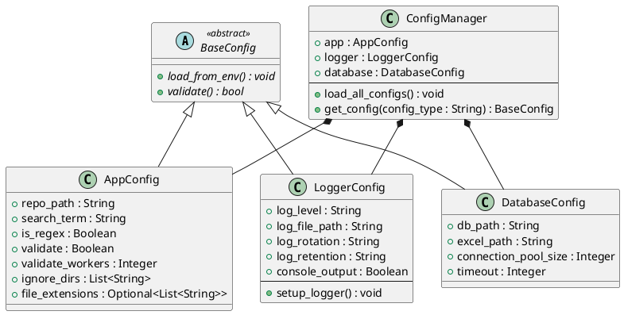
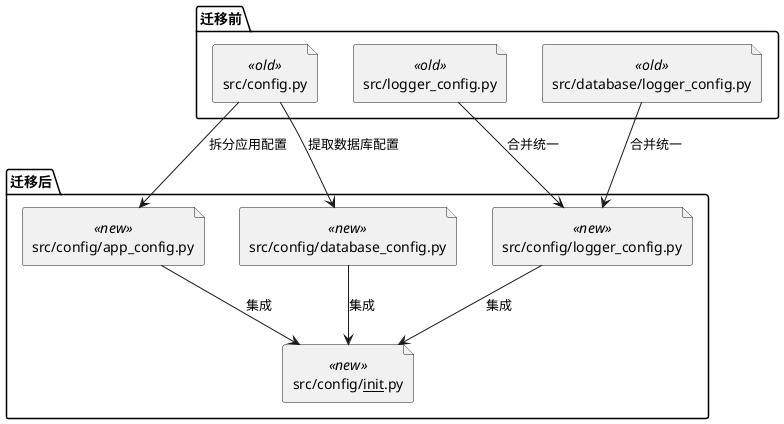
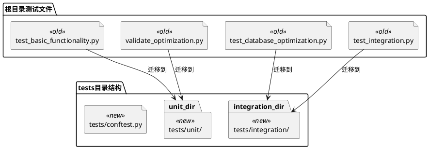
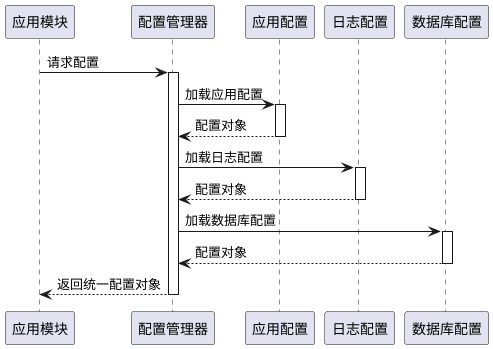
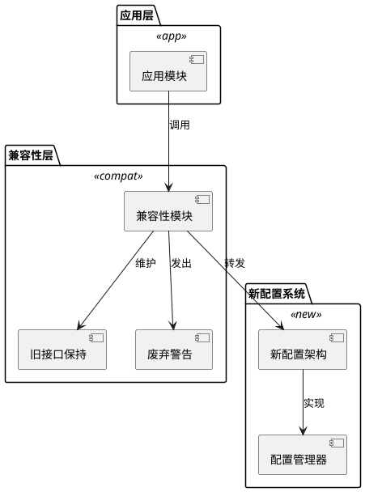
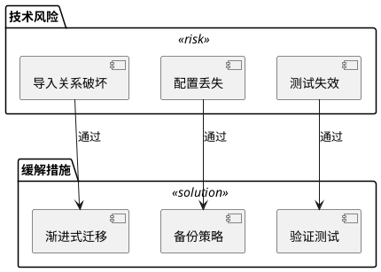

# 代码结构优化设计

## 概述

本设计文档旨在对 Hello-Scan-Code 项目的代码结构进行优化重构，主要目标是统一配置管理、规范目录结构、消除重复代码，并建立标准化的测试文件组织结构。

### 优化目标

1. **配置统一管理**：将所有配置相关文件集中到 `src/config` 目录
2. **消除重复定义**：合并重复的 `logger_config.py` 文件
3. **测试文件规范化**：将测试文件统一迁移到根目录 `tests` 目录
4. **目录结构标准化**：建立清晰的模块边界和职责划分

## 当前架构分析

### 现有目录结构

```plantuml
@startuml
!define FOLDER_COLOR #E8F4FD
!define FILE_COLOR #FFF2CC
!define PROBLEM_COLOR #FADBD8

package "根目录" as root <<folder>> {
    file "main.py" as main <<file>>
    file "test_basic_functionality.py" as test1 <<file>>
    file "test_database_optimization.py" as test2 <<file>>
    file "test_integration.py" as test3 <<file>>
    file "validate_optimization.py" as validate <<file>>
}

package "src目录" as src <<folder>> {
    file "config.py" as config <<file>>
    file "logger_config.py" as logger1 <<file>>
    file "main.py" as main_src <<file>>
    file "searcher.py" as searcher <<file>>
    file "database.py" as database_file <<file>>
}

package "database模块" as db_module <<folder>> {
    file "logger_config.py - 重复" as logger2 <<problem>>
    package "config/" as db_config <<folder>>
    package "models/" as models <<folder>>
    package "repositories/" as repos <<folder>>
}

root ||--|| src : 包含
src ||--|| db_module : 包含
@enduml
```

### 问题识别

| 问题类型 | 具体问题 | 影响范围 |
|---------|---------|---------|
| **配置分散** | config.py 独立存在，缺乏统一配置目录 | 配置管理混乱 |
| **重复定义** | logger_config.py 在 src/ 和 src/database/ 两处定义 | 维护困难，配置不一致 |
| **测试分散** | 测试文件分布在根目录，缺乏统一管理 | 测试组织混乱 |
| **目录结构不规范** | 缺乏清晰的模块职责边界 | 可维护性差 |

## 目标架构设计

### 优化后目录结构

```plantuml
@startuml
!define FOLDER_COLOR #E8F4FD
!define FILE_COLOR #FFF2CC
!define NEW_COLOR #D5DBDB

package "根目录" as root <<folder>> {
    file "main.py" as main <<file>>
    package "tests/" as tests_dir <<new>>
}

package "src目录" as src <<folder>> {
    package "config/" as config_dir <<new>>
    file "searcher.py" as searcher <<file>>
    file "database.py" as database_file <<file>>
    file "main.py" as main_src <<file>>
}

package "config模块" as config_module <<new>> {
    file "app_config.py" as app_config <<new>>
    file "logger_config.py" as logger_config <<new>>
    file "database_config.py" as database_config <<new>>
    file "__init__.py" as init_config <<new>>
}

package "database模块" as db_module <<folder>> {
    package "config/" as db_config_dir <<folder>>
    package "models/" as models <<folder>>
    package "repositories/" as repos <<folder>>
    package "migrations/" as migrations <<folder>>
}

package "tests模块" as tests_module <<new>> {
    package "unit/" as unit_tests <<new>>
    package "integration/" as integration_tests <<new>>
    file "conftest.py" as conftest <<new>>
}

root ||--|| src : 包含
root ||--|| tests_dir : 包含
src ||--|| config_dir : 包含
src ||--|| db_module : 包含
config_dir ||--|| config_module : 实现
tests_dir ||--|| tests_module : 实现
@enduml
```

## 配置管理架构

### 配置层次结构



### 配置文件职责划分

| 配置文件 | 职责范围 | 主要配置项 |
|---------|---------|-----------|
| **app_config.py** | 应用核心配置 | 搜索参数、路径配置、性能参数 |
| **logger_config.py** | 日志系统配置 | 日志级别、输出格式、文件轮转 |
| **database_config.py** | 数据库相关配置 | 数据库路径、连接池、导出配置 |
| **__init__.py** | 配置模块初始化 | 配置加载器、统一接口 |

## 文件迁移策略

### 配置文件迁移



### 测试文件迁移



## 导入关系重构

### 配置导入统一化



### 新的导入模式

| 模块 | 旧导入方式 | 新导入方式 |
|------|-----------|-----------|
| **应用配置** | `from config import SearchConfig` | `from config import AppConfig` |
| **日志配置** | `from logger_config import get_logger` | `from config import LoggerConfig` |
| **数据库配置** | 分散在多个文件 | `from config import DatabaseConfig` |
| **统一配置** | 无 | `from config import ConfigManager` |

## 兼容性保障

### 向后兼容策略



### 渐进式迁移

| 阶段 | 操作内容 | 兼容性措施 |
|------|---------|-----------|
| **第一阶段** | 创建新配置目录结构 | 保留原有配置文件 |
| **第二阶段** | 实现新配置系统 | 提供兼容性适配器 |
| **第三阶段** | 迁移核心模块 | 添加废弃警告 |
| **第四阶段** | 清理旧配置文件 | 移除兼容性代码 |

## 测试架构优化

### 测试目录结构

```plantuml
@startuml
!define ROOT_COLOR #E8F4FD
!define UNIT_COLOR #D5F3D0
!define INTEGRATION_COLOR #FCF3CF

package "tests根目录" as tests_root <<root>> {
    file "conftest.py" as conftest
    file "test_config.py" as test_config
}

package "单元测试" as unit_tests <<unit>> {
    file "test_app_config.py" as test_app_config
    file "test_logger_config.py" as test_logger_config
    file "test_searcher.py" as test_searcher
    file "test_validators.py" as test_validators
}

package "集成测试" as integration_tests <<integration>> {
    file "test_search_flow.py" as test_search_flow
    file "test_database_ops.py" as test_database_ops
    file "test_export_flow.py" as test_export_flow
}

tests_root ||--|| unit_tests : 包含
tests_root ||--|| integration_tests : 包含
@enduml
```

### 测试配置管理

| 测试类型 | 配置策略 | 隔离机制 |
|---------|---------|---------|
| **单元测试** | Mock 配置对象 | 内存配置 |
| **集成测试** | 测试专用配置文件 | 临时数据库 |
| **性能测试** | 生产模拟配置 | 独立环境 |

## 风险评估与缓解

### 主要风险



### 风险缓解矩阵

| 风险类型 | 风险等级 | 缓解措施 | 监控指标 |
|---------|---------|---------|---------|
| **导入破坏** | 高 | 兼容性层 + 渐进迁移 | 模块加载成功率 |
| **配置丢失** | 中 | 配置备份 + 验证机制 | 配置完整性检查 |
| **测试失效** | 中 | 测试重构 + 回归验证 | 测试覆盖率维持 |
| **性能影响** | 低 | 配置缓存 + 懒加载 | 启动时间监控 |

## 实施计划

### 迁移时间线

```plantuml
@startuml
!define DONE_COLOR #D5F3D0
!define ACTIVE_COLOR #FCF3CF
!define PLANNED_COLOR #E8F4FD

@startgantt
title 代码结构优化实施计划

-- 准备阶段 --
[环境备份] lasts 1 day and is colored in DONE_COLOR
[依赖分析] lasts 1 day and is colored in DONE_COLOR
[依赖分析] starts at [环境备份]'s end

-- 配置重构 --
[创建配置目录] lasts 1 day and is colored in ACTIVE_COLOR
[创建配置目录] starts at [依赖分析]'s end
[实现新配置系统] lasts 2 days and is colored in PLANNED_COLOR
[实现新配置系统] starts at [创建配置目录]'s end
[迁移配置文件] lasts 1 day and is colored in PLANNED_COLOR
[迁移配置文件] starts at [实现新配置系统]'s end

-- 测试重构 --
[创建测试目录] lasts 1 day and is colored in PLANNED_COLOR
[创建测试目录] starts at [创建配置目录]'s end
[迁移测试文件] lasts 1 day and is colored in PLANNED_COLOR
[迁移测试文件] starts at [创建测试目录]'s end
[更新测试配置] lasts 1 day and is colored in PLANNED_COLOR
[更新测试配置] starts at [迁移配置文件]'s end

-- 验证阶段 --
[功能验证测试] lasts 1 day and is colored in PLANNED_COLOR
[功能验证测试] starts at [迁移配置文件]'s end
[性能回归测试] lasts 1 day and is colored in PLANNED_COLOR
[性能回归测试] starts at [更新测试配置]'s end
[清理旧文件] lasts 1 day and is colored in PLANNED_COLOR
[清理旧文件] starts at [性能回归测试]'s end
@endgantt
@enduml
```



### 关键里程碑

| 里程碑 | 完成标准 | 验收标准 |
|-------|---------|---------|
| **配置系统就绪** | 新配置目录创建完成 | 所有配置可正常加载 |
| **功能兼容** | 原有功能正常运行 | 回归测试全部通过 |
| **测试迁移完成** | 测试文件规范化 | 测试覆盖率不降低 |
| **清理完成** | 旧文件清理干净 | 代码质量检查通过 |