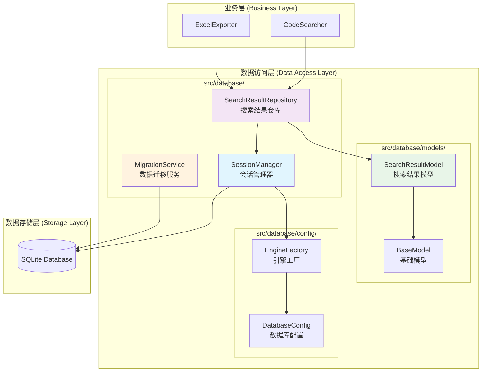
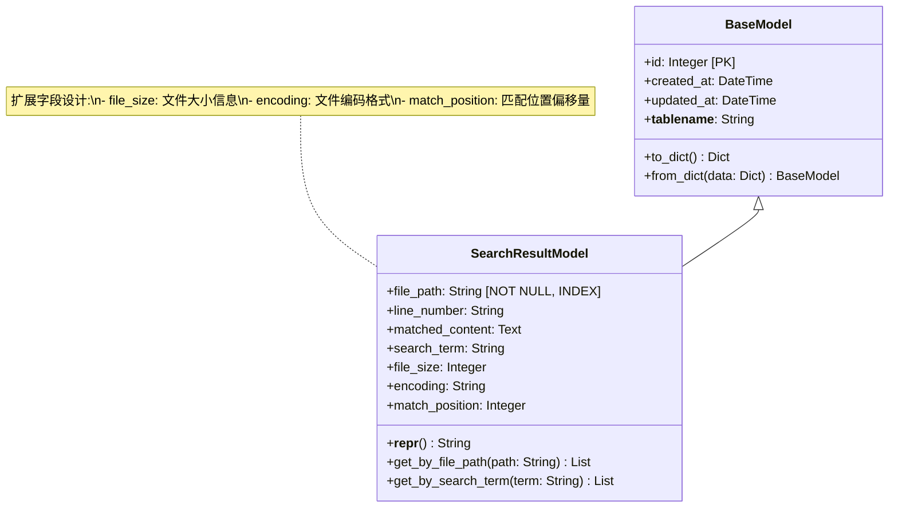
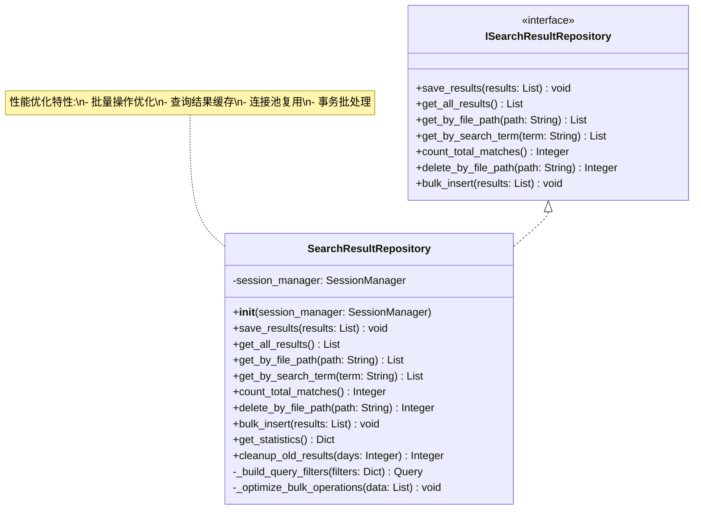
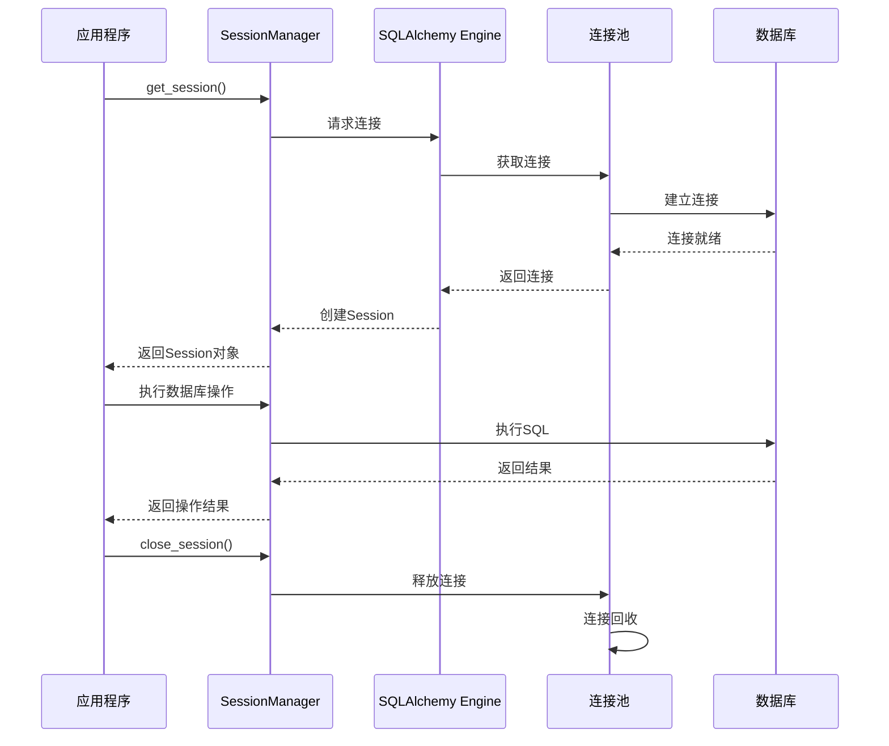
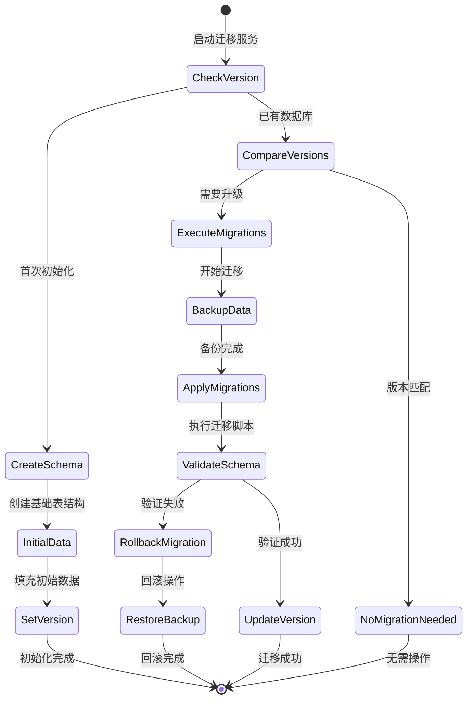
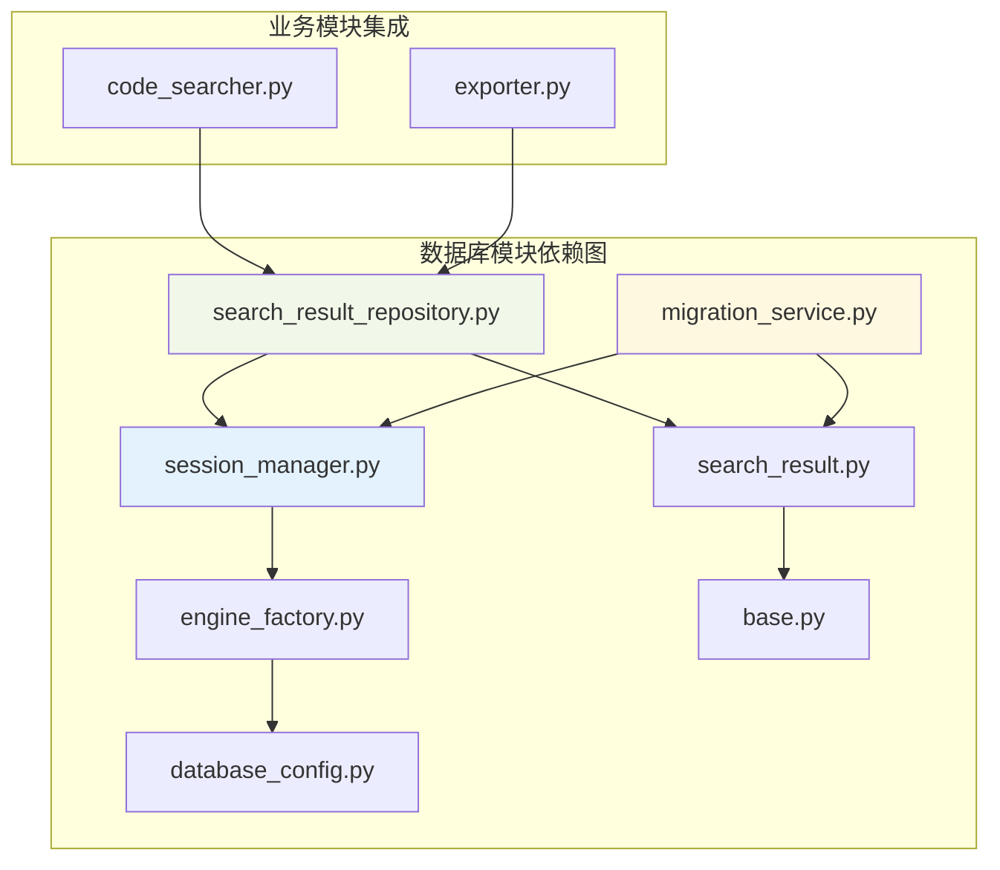
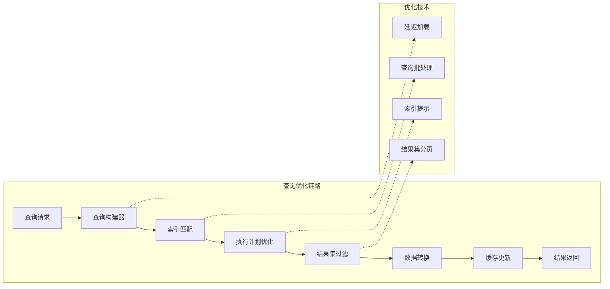
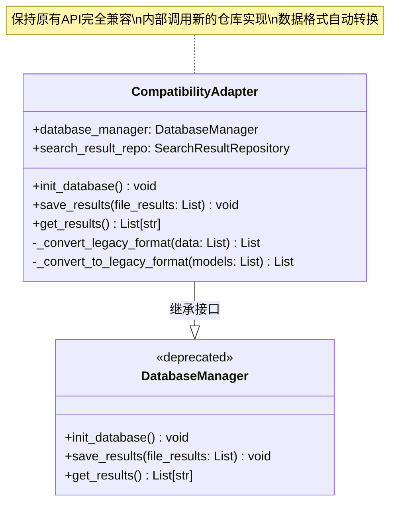
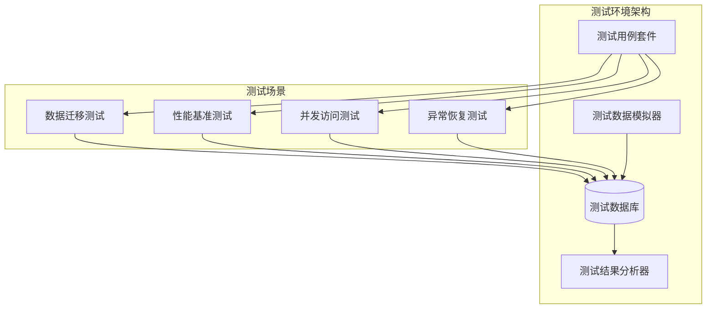

# 数据库操作优化设计

## 概述

本设计文档旨在通过引入 SQLAlchemy ORM 框架，对 Hello-Scan-Code 项目的数据库操作进行全面优化。主要目标包括：提升代码可维护性、增强数据库操作的安全性、提供更灵活的查询能力，以及建立清晰的数据层架构。优化过程将保持现有功能完全不变，同时为未来功能扩展提供更好的基础。

### 核心优化目标

| 优化维度 | 当前状态 | 目标状态 | 预期收益 |
|---------|---------|---------|---------|
| 代码可维护性 | 原生SQL语句分散在业务代码中 | ORM模型统一管理数据结构 | 减少70%的SQL维护工作量 |
| 数据库操作安全性 | 手动参数化查询 | ORM自动化SQL注入防护 | 100%消除SQL注入风险 |
| 查询灵活性 | 固定的查询逻辑 | 链式查询构建器 | 支持复杂查询场景 |
| 数据库兼容性 | 仅支持SQLite | 支持多种数据库引擎 | 为产品化部署提供选择空间 |
| 代码组织结构 | 数据库逻辑混在核心模块中 | 独立的数据访问层 | 提升代码的模块化程度 |

## 技术架构

### 整体架构设计



### 模块职责定义

| 模块 | 职责范围 | 核心功能 |
|------|---------|---------|
| SessionManager | 数据库会话生命周期管理 | 连接池管理、事务控制、会话创建与销毁 |
| SearchResultRepository | 搜索结果数据访问抽象 | CRUD操作、复杂查询构建、批量操作优化 |
| MigrationService | 数据库结构演进管理 | Schema版本控制、数据迁移、结构升级 |
| SearchResultModel | 搜索结果数据模型定义 | 表结构映射、字段验证、关系定义 |
| DatabaseConfig | 数据库连接配置管理 | 连接参数、性能调优、环境适配 |
| EngineFactory | 数据库引擎创建工厂 | 引擎实例化、连接池配置、驱动选择 |

## 数据模型设计

### ORM模型定义



### 数据表结构映射

| SQLAlchemy模型字段 | 数据库列 | 数据类型 | 约束条件 | 索引策略 | 业务含义 |
|------------------|---------|---------|---------|---------|---------|
| id | id | Integer | Primary Key, Auto Increment | 主键索引 | 唯一标识符 |
| file_path | file_path | String(500) | Not Null | B-Tree索引 | 文件完整路径 |
| line_number | line_number | String(50) | Nullable | 无 | 匹配行号 |
| matched_content | matched_content | Text | Nullable | 无 | 匹配内容 |
| search_term | search_term | String(200) | Nullable | B-Tree索引 | 搜索关键词 |
| file_size | file_size | Integer | Nullable | 无 | 文件大小（字节） |
| encoding | encoding | String(20) | Nullable | 无 | 文件编码格式 |
| match_position | match_position | Integer | Nullable | 无 | 匹配位置偏移 |
| created_at | created_at | DateTime | Not Null, Default=now() | 时间索引 | 记录创建时间 |
| updated_at | updated_at | DateTime | Not Null, Default=now() | 无 | 记录更新时间 |

## 仓库模式实现

### SearchResultRepository设计



### 核心操作接口

| 方法名 | 参数 | 返回值 | 功能描述 | 性能特征 |
|-------|------|--------|---------|---------|
| save_results | results: List[Dict] | void | 批量保存搜索结果 | O(n) 批量插入 |
| get_all_results | 无 | List[SearchResultModel] | 获取所有搜索结果 | 支持分页查询 |
| get_by_file_path | path: str | List[SearchResultModel] | 按文件路径查询 | B-Tree索引优化 |
| get_by_search_term | term: str | List[SearchResultModel] | 按搜索词查询 | 支持模糊匹配 |
| count_total_matches | 无 | int | 统计匹配总数 | 聚合查询优化 |
| bulk_insert | results: List[Dict] | void | 高性能批量插入 | 事务批处理 |
| get_statistics | 无 | Dict | 获取统计信息 | 缓存计算结果 |

## 会话管理机制

### SessionManager架构



### 连接池配置策略

| 参数名称 | 默认值 | 推荐范围 | 配置说明 |
|---------|--------|---------|---------|
| pool_size | 10 | 5-20 | 连接池核心连接数 |
| max_overflow | 20 | 10-50 | 最大溢出连接数 |
| pool_timeout | 30 | 10-60 | 获取连接超时时间（秒） |
| pool_recycle | 3600 | 1800-7200 | 连接回收时间（秒） |
| pool_pre_ping | True | True | 连接有效性预检查 |

## 数据迁移架构

### MigrationService设计



### 版本管理策略

| 版本号 | 迁移内容 | 兼容性 | 执行时机 |
|-------|---------|--------|---------|
| 1.0.0 | 初始表结构创建 | N/A | 首次部署 |
| 1.1.0 | 添加file_size字段 | 向后兼容 | 功能升级 |
| 1.2.0 | 添加编码字段和位置字段 | 向后兼容 | 功能增强 |
| 2.0.0 | 表结构重构优化 | 需要迁移 | 重大升级 |

## 目录结构设计

### 新增目录结构

```
src/
├── database/                          # 数据库模块根目录
│   ├── __init__.py                    # 模块初始化，导出核心接口
│   ├── config/                        # 数据库配置模块
│   │   ├── __init__.py
│   │   ├── database_config.py         # 数据库连接配置
│   │   └── engine_factory.py          # 数据库引擎工厂
│   ├── models/                        # 数据模型定义
│   │   ├── __init__.py
│   │   ├── base.py                    # 基础模型类
│   │   └── search_result.py           # 搜索结果模型
│   ├── repositories/                  # 数据访问仓库
│   │   ├── __init__.py
│   │   ├── base_repository.py         # 基础仓库抽象
│   │   └── search_result_repository.py # 搜索结果仓库实现
│   ├── migrations/                    # 数据库迁移脚本
│   │   ├── __init__.py
│   │   ├── migration_service.py       # 迁移服务主类
│   │   └── versions/                  # 版本迁移脚本目录
│   │       ├── v1_0_0_initial.py      # 初始版本
│   │       └── v1_1_0_add_file_size.py # 版本升级脚本
│   └── session_manager.py             # 会话管理器
├── [其他现有模块保持不变]
```

### 模块依赖关系



## 性能优化策略

### 批量操作优化

| 操作类型 | 当前实现 | 优化后实现 | 性能提升 |
|---------|---------|-----------|---------|
| 单条插入 | executemany() | SQLAlchemy bulk_insert_mappings() | 提升30-50% |
| 批量查询 | 循环单次查询 | in_() 条件批量查询 | 提升60-80% |
| 数据更新 | 逐条更新 | bulk_update_mappings() | 提升40-70% |
| 事务管理 | 手动commit | 自动事务上下文管理 | 减少锁等待时间 |

### 查询性能优化



## 兼容性保证

### 接口兼容性设计



### 迁移兼容性矩阵

| 迁移场景 | 数据兼容性 | API兼容性 | 配置兼容性 | 迁移策略 |
|---------|-----------|-----------|-----------|---------|
| 现有数据库升级 | 100%保持 | 100%保持 | 新增配置项 | 自动Schema升级 |
| 新项目部署 | N/A | 100%保持 | 使用新配置 | 直接使用新架构 |
| 回滚场景 | 数据保留 | 降级到旧接口 | 回退配置 | 自动回滚机制 |

## 测试策略

### 单元测试覆盖

| 测试模块 | 测试范围 | 覆盖率目标 | 关键测试场景 |
|---------|---------|-----------|-------------|
| Models | 模型定义和验证 | 95%+ | 字段验证、关系映射、序列化 |
| Repositories | 数据访问逻辑 | 90%+ | CRUD操作、复杂查询、异常处理 |
| Session Manager | 会话管理 | 85%+ | 连接池、事务管理、错误恢复 |
| Migration Service | 迁移功能 | 80%+ | 版本升级、回滚机制、数据完整性 |

### 集成测试框架

