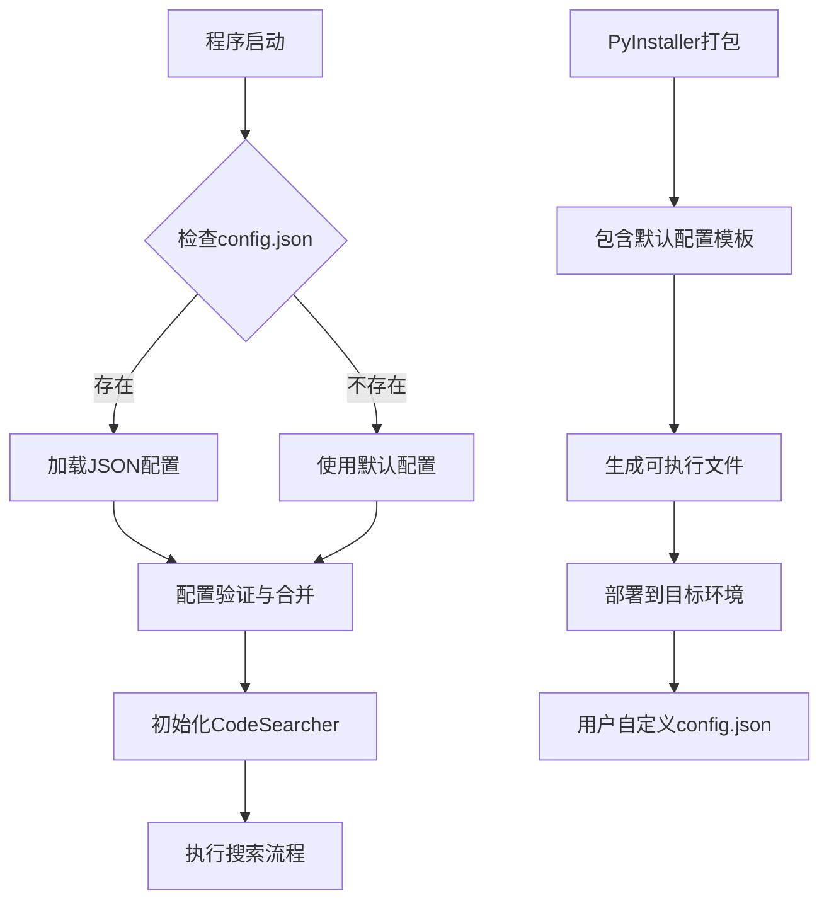
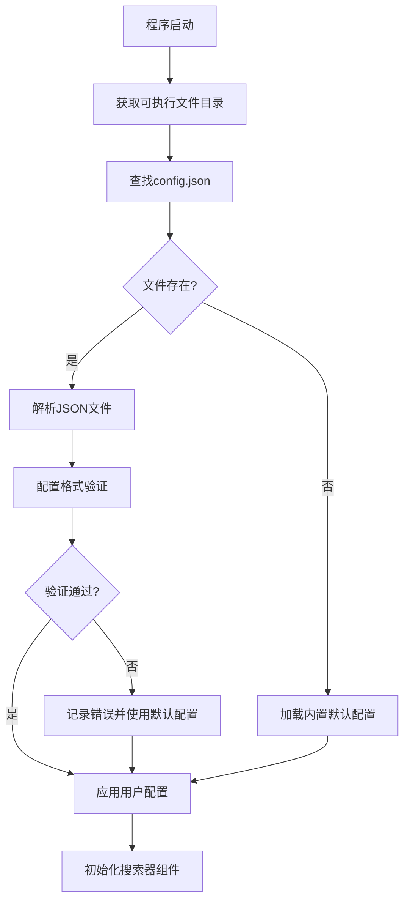
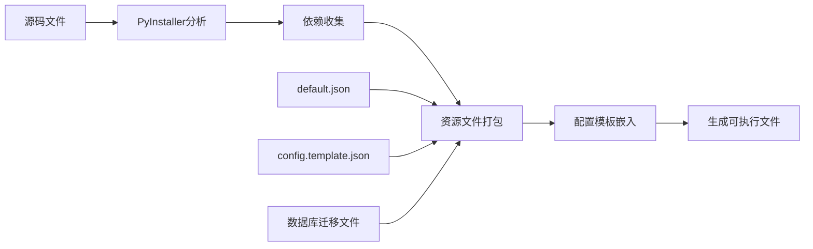
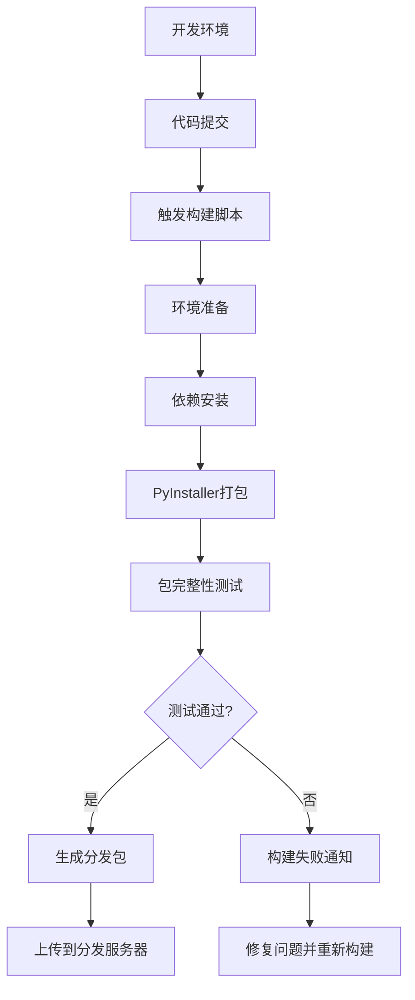
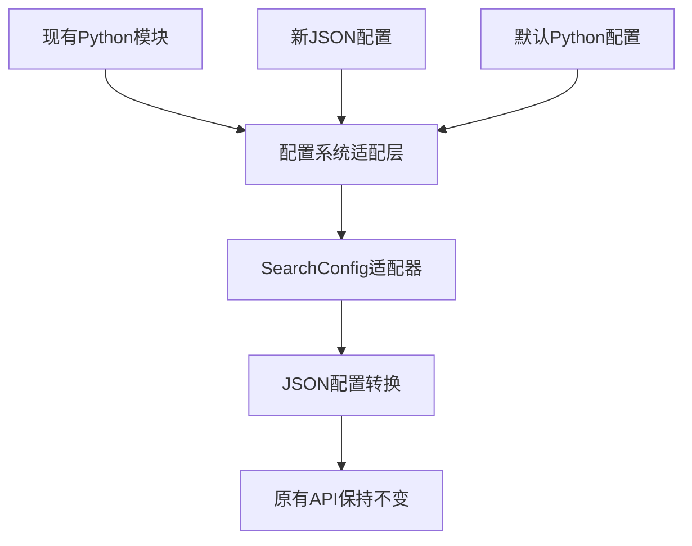
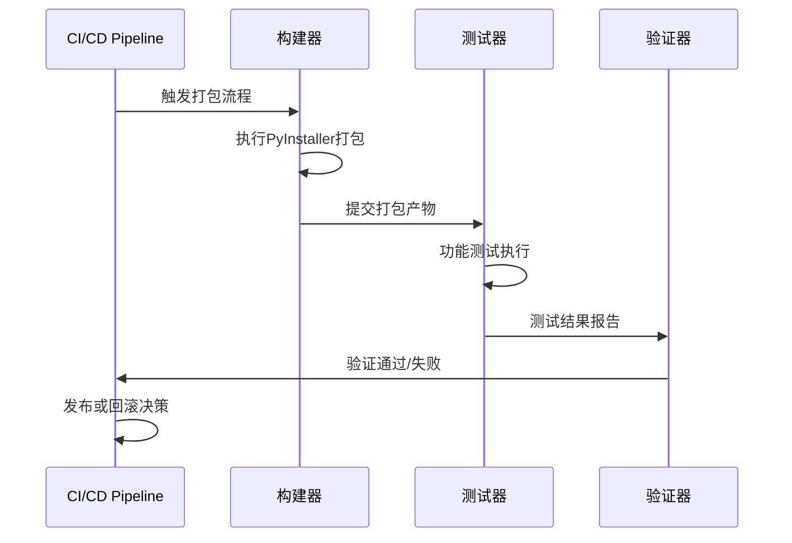

# PyInstaller 打包支持功能设计

## 概述

本设计旨在为Hello-Scan-Code代码搜索工具引入PyInstaller打包支持，实现跨平台二进制分发，并重构配置系统为JSON格式，支持外置配置文件管理。

### 核心价值
- **独立部署**：生成无需Python环境的可执行文件，便于在生产环境直接运行
- **跨平台分发**：支持Windows和Linux平台的二进制文件生成
- **配置外置化**：将配置文件从代码中分离，提升用户体验和配置灵活性
- **零依赖运行**：打包后的程序包含所有必要依赖，可在目标系统直接执行

## 技术架构

### 配置系统重构架构



### 目录结构规划

```bash
项目根目录/
├── src/
│   ├── config/
│   │   ├── __init__.py
│   │   ├── config_loader.py      # JSON配置加载器
│   │   ├── config_validator.py   # 配置验证器
│   │   └── default_config.py     # 默认配置定义
│   ├── packaging/
│   │   ├── __init__.py
│   │   ├── pyinstaller_hooks.py  # PyInstaller钩子
│   │   └── resource_bundler.py   # 资源打包器
│   └── ... (现有模块)
├── config/
│   ├── config.template.json      # 配置模板
│   └── default.json             # 默认配置文件
├── build/
│   ├── windows/
│   │   └── hello-scan-code.spec  # Windows打包配置
│   └── linux/
│       └── hello-scan-code.spec  # Linux打包配置
├── dist/                        # 打包输出目录
└── scripts/
    ├── build_windows.py         # Windows打包脚本
    └── build_linux.py          # Linux打包脚本
```

## 配置系统设计

### JSON配置文件架构

| 配置项 | 数据类型 | 默认值 | 说明 |
|--------|----------|--------|------|
| `repo_path` | string | `"."` | 搜索目标代码仓库路径 |
| `search_term` | string | `"test,def,void"` | 搜索关键词，逗号分隔 |
| `is_regex` | boolean | `false` | 是否启用正则表达式搜索 |
| `validate` | boolean | `false` | 是否启用结果二次验证 |
| `validate_workers` | integer | `4` | 验证工作线程数量 |
| `output` | object | - | 输出配置对象 |
| `output.db_path` | string | `"results.db"` | SQLite数据库输出路径 |
| `output.excel_path` | string | `"results.xlsx"` | Excel报告输出路径 |
| `logging` | object | - | 日志配置对象 |
| `logging.level` | string | `"INFO"` | 日志级别 |
| `filters` | object | - | 过滤器配置对象 |
| `filters.ignore_dirs` | array | `[".git", "__pycache__"]` | 忽略目录列表 |
| `filters.file_extensions` | array | `null` | 文件扩展名过滤器 |

### 配置加载策略



### 配置验证机制

- **JSON Schema验证**：确保配置文件结构符合预期格式
- **类型检查**：验证各配置项的数据类型正确性
- **路径有效性检查**：验证repo_path等路径配置的可访问性
- **数值范围校验**：确保validate_workers等数值参数在合理范围内
- **回退机制**：当配置文件无效时，自动回退到默认配置并记录警告

## PyInstaller集成设计

### 打包配置策略

#### Windows平台配置
- **单文件模式**：生成hello-scan-code.exe单一可执行文件
- **图标资源**：嵌入应用程序图标
- **隐藏导入**：自动检测SQLAlchemy、pandas等动态导入的模块
- **路径处理**：处理相对路径和临时目录问题

#### Linux平台配置
- **目录模式**：生成包含依赖的目录结构
- **权限设置**：确保可执行文件具有正确的执行权限
- **共享库处理**：正确打包系统依赖的共享库

### 资源文件管理



### 钩子机制设计

- **SQLAlchemy钩子**：确保数据库驱动和迁移文件正确打包
- **pandas钩子**：处理Excel导出功能的依赖项
- **loguru钩子**：保证日志系统的完整性
- **自定义钩子**：处理项目特有的动态导入和资源文件

## 部署与分发策略

### 构建流程设计



### 分发包结构

```
hello-scan-code-v1.0.0-windows/
├── hello-scan-code.exe          # 主程序
├── config.template.json         # 配置模板
├── README.md                    # 使用说明
└── LICENSE                      # 许可证文件

hello-scan-code-v1.0.0-linux/
├── hello-scan-code/            # 程序目录
│   ├── hello-scan-code         # 主程序
│   └── _internal/              # 依赖库
├── config.template.json        # 配置模板
├── README.md                   # 使用说明
└── LICENSE                     # 许可证文件
```

### 用户使用流程

1. **下载分发包**：从发布页面下载对应平台的压缩包
2. **解压部署**：将压缩包解压到目标目录
3. **配置定制**：复制config.template.json为config.json并修改配置
4. **执行搜索**：直接运行可执行文件开始搜索任务
5. **查看结果**：在指定路径查看生成的数据库和Excel报告

## 兼容性设计

### 向后兼容策略



### 配置迁移机制

- **自动检测**：识别现有的Python配置文件
- **配置转换**：提供工具将Python配置转换为JSON格式
- **双模式支持**：在过渡期内同时支持Python和JSON配置
- **迁移提示**：在使用旧配置时提供迁移建议

## 测试策略

### 打包测试覆盖

| 测试类型 | 测试内容 | 验证标准 |
|----------|----------|----------|
| 功能测试 | 所有搜索功能正常工作 | 搜索结果与开发环境一致 |
| 配置测试 | JSON配置加载和验证 | 各种配置场景正确处理 |
| 路径测试 | 相对路径和绝对路径处理 | 路径解析准确无误 |
| 资源测试 | 数据库和Excel导出功能 | 输出文件格式正确 |
| 性能测试 | 打包后性能对比 | 性能损失在可接受范围内 |
| 兼容性测试 | 不同操作系统版本 | 目标平台正常运行 |

### 自动化测试流程

