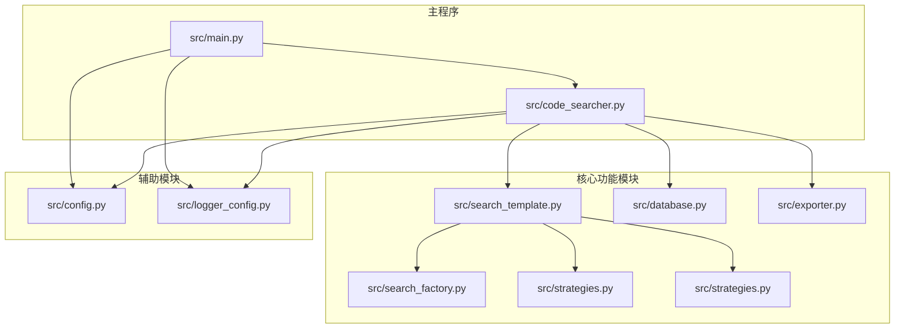
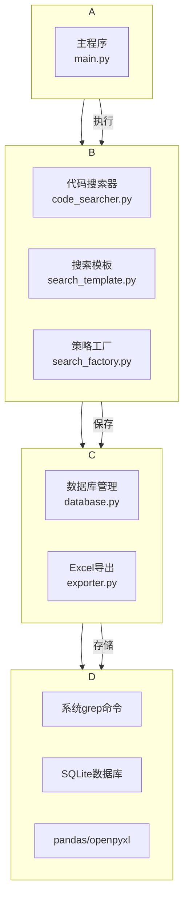
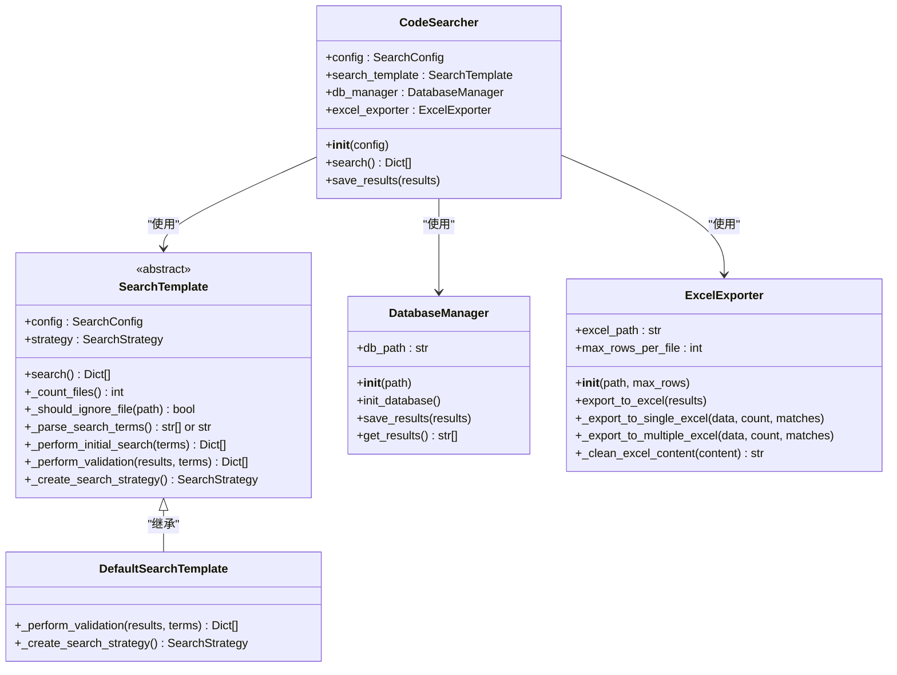
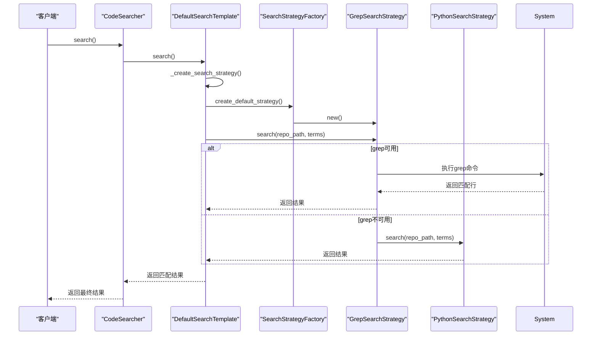
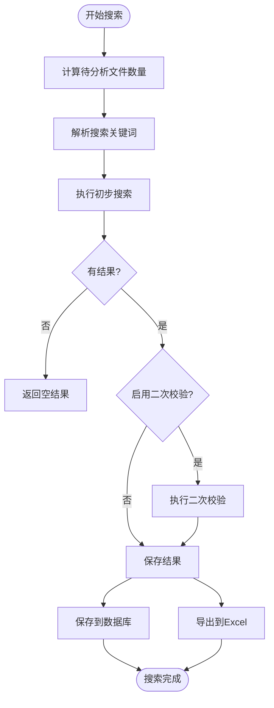
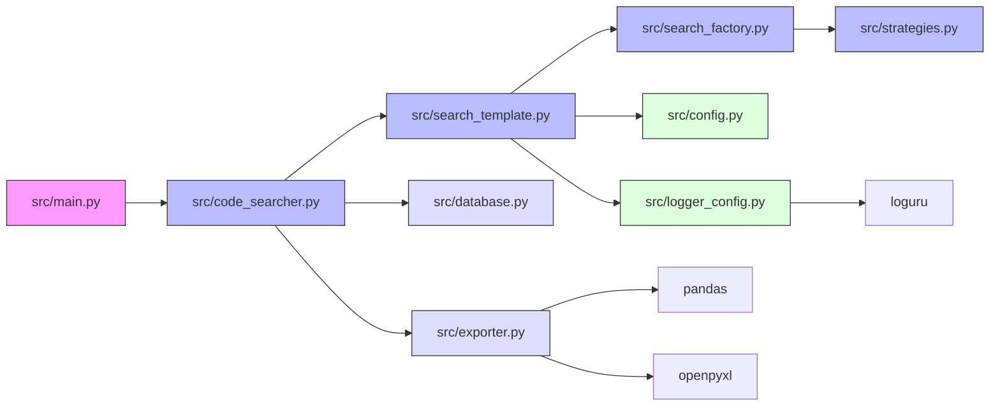

# 工具概述与核心价值

<cite>
**本文档引用的文件**
- [README.md](file://README.md)
- [src/main.py](file://src/main.py)
- [src/code_searcher.py](file://src/code_searcher.py)
- [src/search_template.py](file://src/search_template.py)
- [src/strategies.py](file://src/strategies.py)
- [src/search_factory.py](file://src/search_factory.py)
- [src/database.py](file://src/database.py)
- [src/exporter.py](file://src/exporter.py)
- [src/config.py](file://src/config.py)
- [src/logger_config.py](file://src/logger_config.py)
</cite>

## 目录
1. [简介](#简介)
2. [项目结构](#项目结构)
3. [核心组件](#核心组件)
4. [架构概览](#架构概览)
5. [详细组件分析](#详细组件分析)
6. [依赖关系分析](#依赖关系分析)
7. [性能考量](#性能考量)
8. [故障排除指南](#故障排除指南)
9. [结论](#结论)

## 简介
Hello-Scan-Code 是一款专为大型代码仓库设计的高效搜索工具，结合了 `grep` 的速度优势和 Python 的灵活性。该工具能够快速定位包含特定字符串或正则表达式的文件，并支持多关键字搜索、目录过滤、结果持久化到 SQLite 数据库以及导出为 Excel 文件等高级功能。通过采用模板方法模式、策略模式和工厂模式等面向对象设计原则，系统具备良好的扩展性和可维护性，适用于开发者日常开发、代码审计和知识挖掘等多种场景。

## 项目结构
本项目采用模块化设计，各组件职责清晰，便于维护和扩展。主要模块包括配置解析、日志管理、搜索策略实现、数据库操作和结果导出等功能。

**图示来源**
- [src/main.py](file://src/main.py#L1-L52)
- [src/code_searcher.py](file://src/code_searcher.py#L1-L61)
- [src/search_template.py](file://src/search_template.py#L1-L189)
- [src/strategies.py](file://src/strategies.py#L1-L232)
- [src/search_factory.py](file://src/search_factory.py#L1-L51)

**本节来源**
- [README.md](file://README.md#L1-L99)
- [src/main.py](file://src/main.py#L1-L52)

## 核心组件
Hello-Scan-Code 的核心由多个协同工作的组件构成，主要包括代码搜索器（CodeSearcher）、搜索模板（SearchTemplate）、搜索策略（SearchStrategy）和结果导出器（ExcelExporter）。这些组件共同实现了高效的代码搜索流程。

**本节来源**
- [src/code_searcher.py](file://src/code_searcher.py#L1-L61)
- [src/search_template.py](file://src/search_template.py#L1-L189)
- [src/strategies.py](file://src/strategies.py#L1-L232)
- [src/exporter.py](file://src/exporter.py#L1-L149)

## 架构概览
Hello-Scan-Code 采用分层架构设计，从上至下分别为应用层、业务逻辑层、数据访问层和外部依赖层。这种分层结构确保了系统的高内聚低耦合特性。

**图示来源**
- [src/main.py](file://src/main.py#L1-L52)
- [src/code_searcher.py](file://src/code_searcher.py#L1-L61)
- [src/search_template.py](file://src/search_template.py#L1-L189)
- [src/database.py](file://src/database.py#L1-L98)
- [src/exporter.py](file://src/exporter.py#L1-L149)

## 详细组件分析
### 代码搜索器分析
`CodeSearcher` 类是整个工具的核心入口，负责协调各个组件完成搜索任务。它通过组合模式整合了搜索模板、数据库管理和 Excel 导出功能，实现了统一的搜索接口。

#### 对象导向组件：

**图示来源**
- [src/code_searcher.py](file://src/code_searcher.py#L18-L61)
- [src/search_template.py](file://src/search_template.py#L169-L189)
- [src/database.py](file://src/database.py#L7-L98)
- [src/exporter.py](file://src/exporter.py#L15-L149)

### 搜索策略分析
搜索功能通过策略模式实现，提供了两种不同的搜索算法：基于系统 `grep` 命令的高性能搜索和基于纯 Python 实现的兼容性搜索。

#### API/服务组件：

**图示来源**
- [src/code_searcher.py](file://src/code_searcher.py#L18-L61)
- [src/search_template.py](file://src/search_template.py#L169-L189)
- [src/strategies.py](file://src/strategies.py#L73-L232)
- [src/search_factory.py](file://src/search_factory.py#L14-L51)

### 复杂逻辑组件分析
搜索流程中的关键逻辑通过模板方法模式进行组织，确保了搜索步骤的一致性和可扩展性。

#### 复杂逻辑组件：

**图示来源**
- [src/search_template.py](file://src/search_template.py#L1-L189)
- [src/database.py](file://src/database.py#L7-L98)
- [src/exporter.py](file://src/exporter.py#L15-L149)

**本节来源**
- [src/code_searcher.py](file://src/code_searcher.py#L1-L61)
- [src/search_template.py](file://src/search_template.py#L1-L189)
- [src/strategies.py](file://src/strategies.py#L1-L232)
- [src/search_factory.py](file://src/search_factory.py#L1-L51)
- [src/database.py](file://src/database.py#L1-L98)
- [src/exporter.py](file://src/exporter.py#L1-L149)

## 依赖关系分析
项目内部组件之间存在明确的依赖关系，外部依赖主要包括 `loguru` 日志库、`pandas` 和 `openpyxl` 用于 Excel 导出。

**图示来源**
- [pyproject.toml](file://pyproject.toml)
- [src/main.py](file://src/main.py#L1-L52)
- [src/code_searcher.py](file://src/code_searcher.py#L1-L61)

**本节来源**
- [pyproject.toml](file://pyproject.toml)
- [src/main.py](file://src/main.py#L1-L52)
- [src/code_searcher.py](file://src/code_searcher.py#L1-L61)

## 性能考量
Hello-Scan-Code 在性能方面进行了多项优化：
- 优先使用系统 `grep` 命令以获得最佳搜索速度
- 支持并行验证以提高大规模结果集的处理效率
- 对大体积 Excel 文件自动拆分导出，避免内存溢出