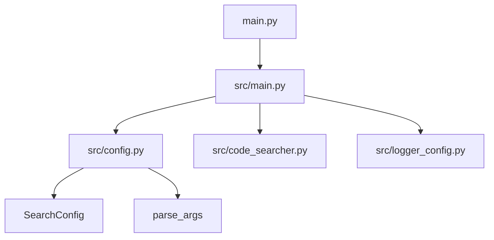
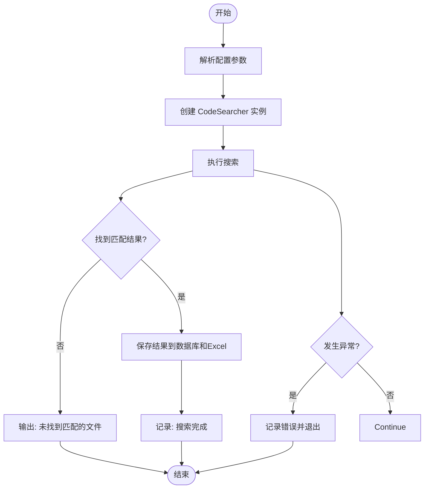

# 快速入门指南

<cite>
**本文档引用的文件**
- [src/main.py](file://src/main.py)
- [src/config.py](file://src/config.py)
- [main.py](file://main.py)
- [README.md](file://README.md)
- [src/logger_config.py](file://src/logger_config.py)
</cite>

## 目录
1. [简介](#简介)
2. [项目结构](#项目结构)
3. [配置参数详解](#配置参数详解)
4. [执行搜索任务](#执行搜索任务)
5. [日志输出解读](#日志输出解读)
6. [结果验证方法](#结果验证方法)
7. [端到端示例](#端到端示例)
8. [配置优先级与默认值](#配置优先级与默认值)

## 简介

本快速入门指南旨在帮助新用户完成首次搜索任务。通过本教程，您将学习如何修改核心配置参数、运行搜索程序、解读控制台日志，并验证输出结果。该工具专为大型代码仓库设计，结合了 `grep` 的速度和 Python 的灵活性，能够高效定位包含特定字符串或正则表达式的文件。

**Section sources**
- [README.md](file://README.md#L1-L20)

## 项目结构

项目采用模块化设计，主要组件位于 `src/` 目录下。根目录的 `main.py` 作为入口点，将 `src/` 添加到 Python 路径后调用 `src/main.py` 中的主函数。这种结构确保了代码的可维护性和清晰的依赖关系。



**Diagram sources**
- [main.py](file://main.py#L1-L15)
- [src/main.py](file://src/main.py#L1-L53)

**Section sources**
- [main.py](file://main.py#L1-L15)
- [src/main.py](file://src/main.py#L1-L53)

## 配置参数详解

所有搜索配置由 `SearchConfig` 数据类定义，用户可通过直接修改 `src/main.py` 中的 `config` 对象实例来调整参数。

### 核心配置项

| 参数 | 说明 | 默认值 |
|------|------|--------|
| `repo_path` | 指定要搜索的代码仓库路径 | `/root/CodeRootPath` |
| `search_term` | 定义搜索关键字，支持多关键字逗号分隔 | `test,def,void` |
| `ignore_dirs` | 设置忽略的目录列表，避免搜索无关文件 | `[".git", "__pycache__", "node_modules"]` |
| `file_extensions` | 过滤文件类型，`None` 表示不限制 | `None` |

### 输出与日志配置

| 参数 | 说明 | 默认值 |
|------|------|--------|
| `db_path` | SQLite 数据库结果输出路径 | `db/results.db` |
| `excel_path` | Excel 报告结果输出路径 | `report/results.xlsx` |
| `log_level` | 日志记录级别 | `INFO` |

这些配置在 `src/config.py` 中定义，并通过 `parse_args()` 函数初始化。该函数还会自动创建必要的输出目录（如 `db/` 和 `report/`）以确保程序正常运行。

**Section sources**
- [src/config.py](file://src/config.py#L6-L36)
- [README.md](file://README.md#L70-L90)

## 执行搜索任务

要启动搜索，请按照以下步骤操作：

1. **编辑配置**：打开 `src/main.py` 文件，在 `main()` 函数中找到 `config = parse_args()` 后的注释区域。
2. **修改参数**：根据需要取消注释并设置相应的配置属性。
3. **运行程序**：在项目根目录执行 `python main.py` 命令。

程序会依次执行解析配置、创建搜索器、执行搜索和保存结果等步骤。若未找到匹配项，将输出提示信息；若发生错误，则记录异常并退出。



**Diagram sources**
- [src/main.py](file://src/main.py#L15-L53)

**Section sources**
- [src/main.py](file://src/main.py#L15-L53)

## 日志输出解读

日志系统由 `src/logger_config.py` 配置，提供控制台和文件双重输出。控制台日志格式简洁，便于实时监控；文件日志包含更详细的信息，用于后续分析。

日志条目包含时间戳、日志级别、消息内容。常见日志级别包括：
- **INFO**: 常规运行信息，如“搜索完成”
- **ERROR**: 错误信息，如搜索过程中的异常

例如，成功完成搜索后会输出 `"搜索完成"` 的 INFO 级别日志；若出现异常，则会记录 `"搜索过程中发生错误: {具体错误}"` 的 ERROR 级别日志。

**Section sources**
- [src/logger_config.py](file://src/logger_config.py#L1-L25)

## 结果验证方法

搜索结果会同时输出到两个位置：

1. **数据库文件**: 位于 `db/results.db`，使用 SQLite 格式存储所有匹配结果，适合程序化查询和长期保存。
2. **Excel 报告**: 位于 `report/results.xlsx`，提供结构化的表格视图，便于人工审查和分享。

尽管项目结构中未直接显示 `db` 和 `report` 目录，但 `parse_args()` 函数会在运行时自动创建这些目录及其父路径，确保结果文件可以被正确写入。

**Section sources**
- [src/config.py](file://src/config.py#L25-L36)
- [README.md](file://README.md#L60-L65)

## 端到端示例

以下是一个完整的端到端示例，演示如何搜索指定路径下所有 `.py` 文件中包含 `'test'` 或 `'def'` 关键字的代码行：

```python
# 在 src/main.py 中修改配置如下
config.repo_path = "/path/to/your/repository"      # 替换为实际仓库路径
config.search_term = "test,def"                    # 搜索 test 或 def
config.ignore_dirs = [".git", "__pycache__"]       # 忽略版本控制和缓存目录
config.file_extensions = [".py"]                   # 仅搜索 Python 文件
```

然后运行 `python main.py`。程序将扫描指定目录下的所有 `.py` 文件，查找包含 `test` 或 `def` 的行，并将结果保存至 `db/results.db` 和 `report/results.xlsx`。

**Section sources**
- [src/main.py](file://src/main.py#L15-L30)
- [src/config.py](file://src/config.py#L6-L18)

## 配置优先级与默认值

本工具的配置遵循明确的优先级规则：**直接代码赋值 > 配置文件默认值**。

- **默认值来源**: 所有参数的默认值在 `src/config.py` 的 `SearchConfig` 类中定义。
- **优先级覆盖**: 用户在 `src/main.py` 中对 `config` 对象的任何直接修改都会覆盖默认值。
- **动态目录创建**: 输出路径（如 `db_path` 和 `excel_path`）对应的目录会在程序启动时自动创建，无需手动准备。

这种设计既保证了开箱即用的便利性，又提供了高度的可定制化能力，使用户能够灵活适应不同的使用场景。

**Section sources**
- [src/config.py](file://src/config.py#L20-L36)
- [src/main.py](file://src/main.py#L15-L30)