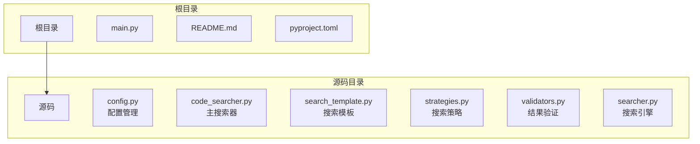
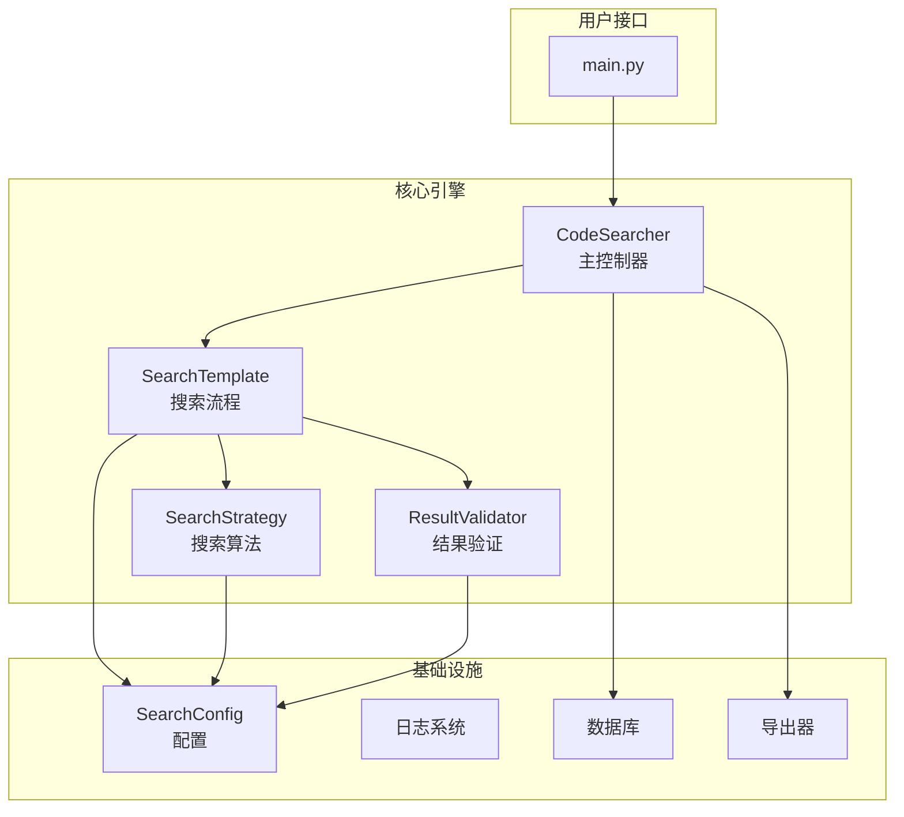
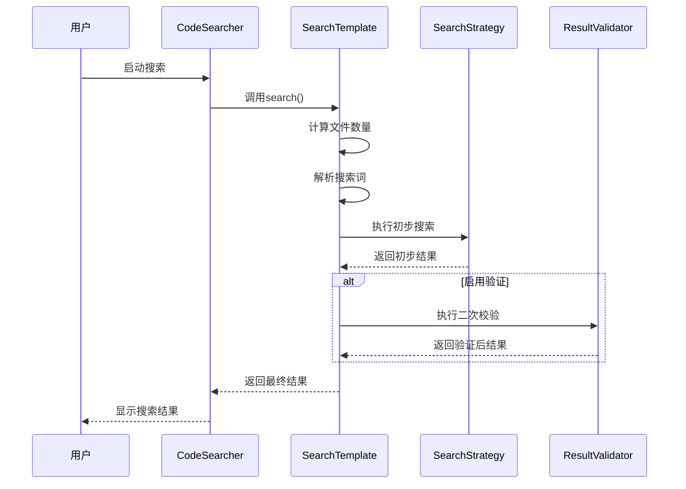
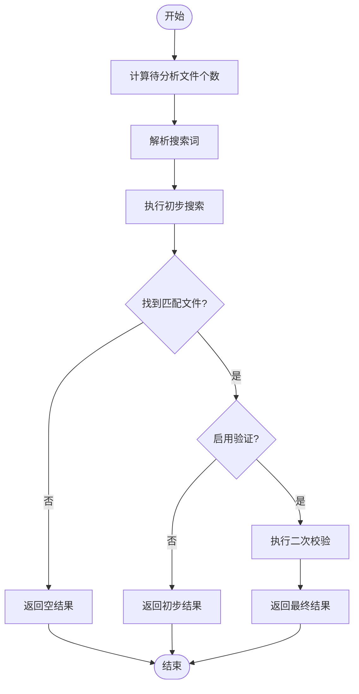
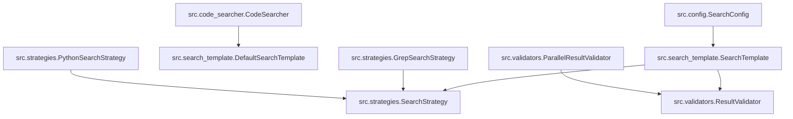

# 性能优化建议

<cite>
**Referenced Files in This Document**   
- [config.py](file://src/config.py)
- [code_searcher.py](file://src/code_searcher.py)
- [search_template.py](file://src/search_template.py)
- [strategies.py](file://src/strategies.py)
- [validators.py](file://src/validators.py)
- [searcher.py](file://src/searcher.py)
</cite>

## 目录
1. [简介](#简介)
2. [项目结构](#项目结构)
3. [核心组件](#核心组件)
4. [架构概述](#架构概述)
5. [详细组件分析](#详细组件分析)
6. [依赖分析](#依赖分析)
7. [性能考虑](#性能考虑)
8. [故障排除指南](#故障排除指南)
9. [结论](#结论)

## 简介
本文档提供专业的性能调优指南，针对代码搜索工具的性能优化提出具体建议。通过合理配置扫描范围、选择高效的搜索策略、调整验证参数和并行处理设置，可以显著提升搜索效率和准确性。

## 项目结构



**Diagram sources**
- [src/config.py](file://src/config.py#L1-L36)
- [src/code_searcher.py](file://src/code_searcher.py#L1-L61)

**Section sources**
- [src/config.py](file://src/config.py#L1-L36)
- [src/code_searcher.py](file://src/code_searcher.py#L1-L61)

## 核心组件

本系统采用设计模式构建，主要包含配置管理、搜索模板、搜索策略和结果验证等核心组件。通过合理的配置和策略选择，可以实现高效准确的代码搜索。

**Section sources**
- [src/config.py](file://src/config.py#L6-L18)
- [src/search_template.py](file://src/search_template.py#L17-L166)

## 架构概述



**Diagram sources**
- [src/code_searcher.py](file://src/code_searcher.py#L18-L61)
- [src/search_template.py](file://src/search_template.py#L17-L166)
- [src/strategies.py](file://src/strategies.py#L73-L232)

## 详细组件分析

### 配置管理分析

#### 类图
```mermaid
classDiagram
class SearchConfig {
+string repo_path
+string search_term
+bool is_regex
+bool validate
+int validate_workers
+string db_path
+string excel_path
+string log_level
+string[] ignore_dirs
+Optional~string[]~ file_extensions
}
SearchConfig : repo_path : str = "/root/CodeRootPath"
SearchConfig : search_term : str = "test,def,void"
SearchConfig : is_regex : bool = False
SearchConfig : validate : bool = False
SearchConfig : validate_workers : int = 4
SearchConfig : ignore_dirs : str[] = [".git", "__pycache__", ...]
SearchConfig : file_extensions : Optional~str[]~ = None
```

**Diagram sources**
- [src/config.py](file://src/config.py#L6-L18)

**Section sources**
- [src/config.py](file://src/config.py#L6-L18)

### 搜索策略分析

#### 序列图


**Diagram sources**
- [src/code_searcher.py](file://src/code_searcher.py#L18-L61)
- [src/search_template.py](file://src/search_template.py#L17-L166)
- [src/strategies.py](file://src/strategies.py#L73-L232)

### 搜索流程分析

#### 流程图


**Diagram sources**
- [src/search_template.py](file://src/search_template.py#L17-L166)

**Section sources**
- [src/search_template.py](file://src/search_template.py#L17-L166)

## 依赖分析



**Diagram sources**
- [src/config.py](file://src/config.py#L6-L18)
- [src/search_template.py](file://src/search_template.py#L17-L166)
- [src/strategies.py](file://src/strategies.py#L73-L232)
- [src/validators.py](file://src/validators.py#L32-L50)

**Section sources**
- [src/config.py](file://src/config.py#L6-L18)
- [src/search_template.py](file://src/search_template.py#L17-L166)

## 性能考虑

### 扫描范围优化

建议合理设置`ignore_dirs`和`file_extensions`以减少扫描范围：

- **ignore_dirs**: 默认忽略`.git`、`__pycache__`、`node_modules`等目录，可根据项目实际情况添加更多需要忽略的目录
- **file_extensions**: 设置为特定文件扩展名列表（如`[".py", ".js", ".java"]`），避免扫描无关文件类型

```python
# 示例：限制扫描范围
config.ignore_dirs.extend(["dist", "build", "coverage"])
config.file_extensions = [".py", ".js", ".ts", ".java", ".cpp"]
```

**Section sources**
- [src/config.py](file://src/config.py#L6-L18)
- [src/strategies.py](file://src/strategies.py#L73-L232)

### 搜索策略选择

在支持环境中优先使用grep而非Python原生搜索：

- **GrepSearchStrategy**: 利用系统grep命令，性能远优于纯Python实现
- **PythonSearchStrategy**: 当系统无grep命令时作为备选方案

```python
# grep策略会自动添加--exclude-dir和--include参数
cmd.extend(["--exclude-dir", ignore_dir])
cmd.extend(["--include", pattern])
```

**Section sources**
- [src/strategies.py](file://src/strategies.py#L73-L171)

### 验证选项权衡

解释validate选项带来的精度-性能权衡：

- **validate=False**: 快速但可能有误报，适合初步探索性搜索
- **validate=True**: 二次校验确保结果准确性，但增加执行时间

```python
# 配置验证选项
config.validate = True  # 启用精确验证
config.validate_workers = 4  # 设置工作进程数
```

**Section sources**
- [src/config.py](file://src/config.py#L6-L18)
- [src/validators.py](file://src/validators.py#L32-L50)

### 并行处理优化

建议调整parallel_validate的线程数以匹配CPU核心数：

```python
import multiprocessing

# 根据CPU核心数自动设置
cpu_count = multiprocessing.cpu_count()
config.validate_workers = cpu_count
```

**Section sources**
- [src/validators.py](file://src/validators.py#L32-L50)
- [src/searcher.py](file://src/searcher.py#L275-L291)

### 关键字组合优化

提醒避免单次搜索过多关键字以防组合爆炸：

