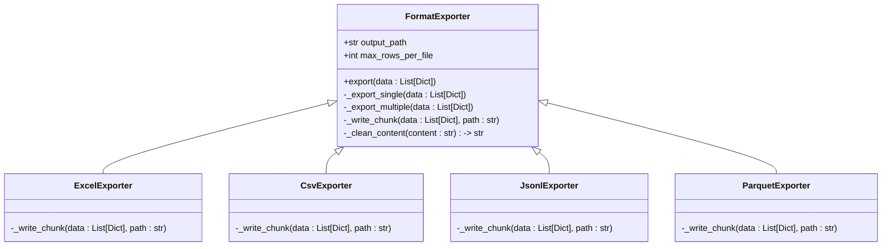

# 扩展导出格式

<cite>
**Referenced Files in This Document**   
- [exporter.py](file://src/exporter.py)
- [logger_config.py](file://src/logger_config.py)
- [config.py](file://src/config.py)
- [main.py](file://src/main.py)
</cite>

## 目录
1. [引言](#引言)
2. [ExcelExporter类结构分析](#excelexporter类结构分析)
3. [分片逻辑与大文件拆分机制](#分片逻辑与大文件拆分机制)
4. [扩展支持CSV、JSONL、Parquet等格式](#扩展支持csvjsonlparquet等格式)
5. [特殊字符转义与编码处理策略](#特殊字符转义与编码处理策略)
6. [性能优化建议](#性能优化建议)
7. [日志系统与错误处理集成](#日志系统与错误处理集成)
8. [配置切换与格式动态选择](#配置切换与格式动态选择)
9. [总结与最佳实践](#总结与最佳实践)

## 引言

本文档旨在指导开发者如何基于现有的`ExcelExporter`类进行扩展，以支持CSV、JSONL（JSON Lines）和Parquet等多种数据格式的导出功能。我们将深入分析现有导出机制中的分片逻辑复用方式，确保在不同格式下保持一致的大文件拆分行为。同时，文档将演示如何添加新的导出方法，并解决各格式特有的特殊字符转义、编码问题及性能优化策略。此外，还将强调与项目现有日志系统和错误处理机制的无缝集成，并提供灵活的格式切换配置建议。

**Section sources**
- [exporter.py](file://src/exporter.py#L15-L149)

## ExcelExporter类结构分析

`ExcelExporter`类是当前系统中负责结果导出的核心组件，封装了从数据准备到文件写入的完整流程。该类通过构造函数接收输出路径和单个文件最大行数限制，利用pandas库实现高效的数据帧操作与文件导出。

其主要方法包括：
- `export_to_excel`: 入口方法，协调整个导出流程
- `_export_to_single_excel`: 处理小规模数据的单一文件导出
- `_export_to_multiple_excel`: 实现大规模数据的分片导出
- `_create_and_export_dataframe`: 创建DataFrame并执行实际写入
- `_clean_excel_content`: 清理可能导致目标格式异常的特殊字符

此类的设计体现了良好的职责分离原则，为后续扩展提供了清晰的继承或组合接口。


**Diagram sources**
- [exporter.py](file://src/exporter.py#L15-L149)

**Section sources**
- [exporter.py](file://src/exporter.py#L15-L149)

## 分片逻辑与大文件拆分机制

`ExcelExporter`类通过`_export_to_single_excel`和`_export_to_multiple_excel`两个私有方法实现了智能的分片导出逻辑。当待导出数据量不超过预设阈值（默认100,000行）时，系统调用`_export_to_single_excel`直接生成单个文件；否则，触发`_export_to_multiple_excel`进行分片处理。

分片算法采用简单的数学计算确定所需文件数量：`(总行数 + 每文件最大行数 - 1) // 每文件最大行数`。随后按索引范围均匀切分数据集，并为每个片段生成独立文件名（如`results_part_1.xlsx`）。此逻辑完全解耦于具体文件格式，仅依赖通用的`_create_and_export_dataframe`接口，因此可被其他格式导出器轻松复用。

关键优势在于：无论目标格式如何变化，只要遵循相同的分片策略和命名规范，即可保证用户面对大文件时获得一致的行为体验。


**Diagram sources**
- [exporter.py](file://src/exporter.py#L59-L120)

**Section sources**
- [exporter.py](file://src/exporter.py#L59-L120)

## 扩展支持CSV、JSONL、Parquet等格式

为了支持更多导出格式，推荐采用继承`ExcelExporter`的方式创建新的导出器类。以下为各格式的扩展方案：

### CSV导出器

可通过重写`_create_and_export_dataframe`方法，使用`df.to_csv()`替代`to_excel()`。CSV格式无需特殊字符清理，但需注意字段分隔符冲突（如内容含逗号），建议启用引号包围策略。

### JSONL导出器

JSONL（每行一个JSON对象）适合流式处理。应避免使用pandas，直接逐条序列化写入，以降低内存占用。每行对应一条匹配记录，保留原始结构。

### Parquet导出器

Parquet作为列式存储格式，特别适合大数据场景。需引入`pyarrow`或`fastparquet`依赖，使用`df.to_parquet()`方法。其内置压缩机制能显著减小文件体积，提升I/O效率。

所有新导出器均应继承分片逻辑，仅替换底层写入实现，从而最大化代码复用性。



**Diagram sources**
- [exporter.py](file://src/exporter.py#L15-L149)

**Section sources**
- [exporter.py](file://src/exporter.py#L15-L149)

## 特殊字符转义与编码处理策略

不同格式对特殊字符的容忍度各异，需针对性处理：

- **CSV**: 关注分隔符（通常为逗号）、换行符和引号。建议使用双引号包围字段，并将内部引号转义为两个连续引号。
- **JSONL**: 遵循标准JSON转义规则，处理反斜杠、引号、控制字符等。Python的`json.dumps()`可自动处理。
- **Parquet**: 底层由Apache Arrow管理，通常能正确处理UTF-8编码和特殊字符，但仍建议预清理不可见控制字符。

统一的`_clean_content`方法可作为基类模板，各子类根据格式特性覆盖实现。例如，CSV导出器可移除换行符以防破坏行列结构，而JSONL导出器则应保留以便还原原始上下文。

所有导出操作应明确指定UTF-8编码，确保跨平台兼容性和中文字符正确显示。

**Section sources**
- [exporter.py](file://src/exporter.py#L130-L149)

## 性能优化建议

针对不同格式提出以下性能优化策略：

- **内存管理**: 对超大数据集，避免一次性加载全部数据。JSONL导出器可改用生成器模式，边搜索边写入，实现流式处理。
- **I/O优化**: Parquet格式启用Snappy或GZIP压缩，大幅减少磁盘占用和传输时间。
- **并发写入**: 当分片数量较多时，可考虑异步或线程池方式并行写入多个文件，充分利用多核CPU和SSD带宽。
- **缓存复用**: 若多次导出相同搜索结果，可缓存DataFrame对象，跳过重复的数据转换过程。

对于`max_rows_per_file`参数，建议根据目标格式特性调整默认值：CSV/JSONL可设更高（如50万行），而Parquet因压缩效率高，可设为百万行级别。

**Section sources**
- [exporter.py](file://src/exporter.py#L15-L149)

## 日志系统与错误处理集成

本项目已集成`loguru`日志框架，所有导出操作必须沿用统一的日志规范。`ExcelExporter`中使用的`logger.info()`和`logger.error()`应被新导出器继承。

关键日志点包括：
- 导出开始与完成
- 分片文件生成通知
- 警告（如pandas缺失）
- 异常捕获与堆栈输出

错误处理应保持一致性：非致命问题（如依赖缺失）记录警告后降级处理；致命错误（如磁盘满、权限不足）则抛出异常终止流程，确保调用链能正确响应。

```mermaid
sequenceDiagram
    participant Main as main.py
    participant Searcher as CodeSearcher
    participant Exporter as ExcelExporter
    participant Logger as logger_config
    
    Main->>Searcher: search()
    Searcher->>Exporter: save_results()
    Exporter->>Logger: logger.info("开始导出")
    alt