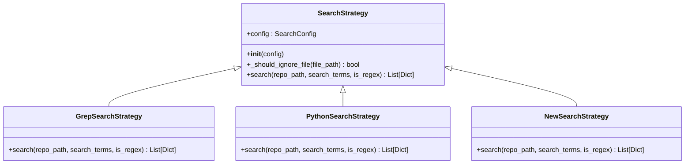
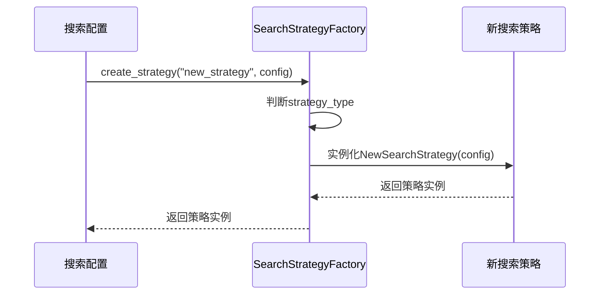
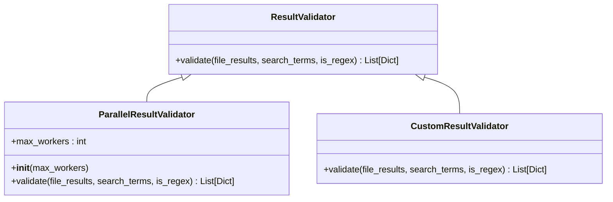
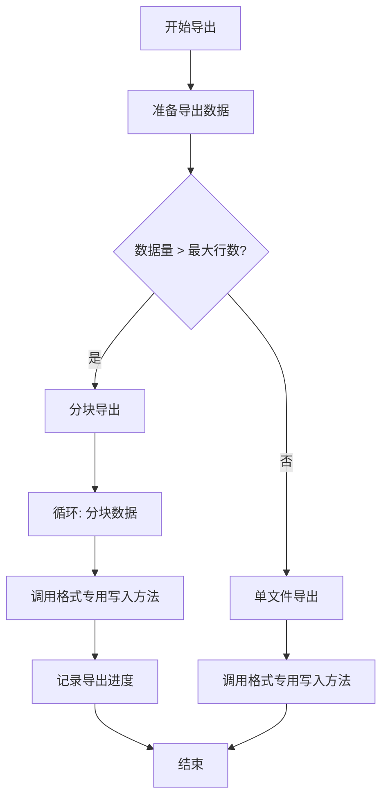

# 扩展开发指南

<cite>
**本文档中引用的文件**
- [strategies.py](file://src/strategies.py)
- [search_factory.py](file://src/search_factory.py)
- [validators.py](file://src/validators.py)
- [exporter.py](file://src/exporter.py)
</cite>

## 目录
1. [简介](#简介)
2. [扩展搜索策略](#扩展搜索策略)
3. [实现结果验证器](#实现结果验证器)
4. [扩展导出功能](#扩展导出功能)
5. [测试与验证](#测试与验证)

## 简介
本指南旨在为高级用户提供系统功能扩展的详细说明。通过继承核心抽象类和实现关键接口，开发者可以无缝集成新的搜索算法、增强结果可信度，并支持多种数据导出格式。文档涵盖从类继承到工厂注册的完整流程，并提供可复用的代码模板。

## 扩展搜索策略

### 继承SearchStrategy抽象基类
要添加新的搜索算法（如ripgrep或全文搜索引擎），需创建一个继承自`SearchStrategy`的新类。该基类定义了统一的搜索接口和通用的文件过滤逻辑。

新策略必须实现`search`方法，该方法接收仓库路径、搜索词和正则表达式标志作为参数，并返回结构化的搜索结果列表。同时，可通过调用父类的`_should_ignore_file`方法来遵循系统的忽略规则（基于目录和文件扩展名）。

**图示来源**
- [strategies.py](file://src/strategies.py#L18-L70)
- [strategies.py](file://src/strategies.py#L73-L171)
- [strategies.py](file://src/strategies.py#L174-L232)

### 注册到SearchStrategyFactory
新创建的搜索策略需要在`SearchStrategyFactory`中注册，以便通过配置动态实例化。工厂类使用静态方法`create_strategy`根据策略类型字符串创建对应的策略实例。

为了支持新策略，应在`create_strategy`方法中添加对新策略类型的判断分支。例如，若新增Ripgrep策略，可添加类似`elif strategy_type.lower() == 'ripgrep': return RipgrepSearchStrategy(config)`的条件语句。

**图示来源**
- [search_factory.py](file://src/search_factory.py#L14-L51)

**节来源**
- [strategies.py](file://src/strategies.py#L18-L70)
- [search_factory.py](file://src/search_factory.py#L14-L51)

## 实现结果验证器

### 实现ResultValidator接口
为增强搜索结果的可信度，可通过实现`ResultValidator`接口来添加二次校验逻辑。该抽象基类要求实现`validate`方法，该方法接收初步搜索结果、搜索词和正则标志，并返回经过验证的结果。

开发者可根据具体需求实现不同类型的验证器，例如语法树分析、上下文匹配或外部服务验证。验证器可在搜索模板的二次校验阶段被调用，确保返回结果的准确性。

**图示来源**
- [validators.py](file://src/validators.py#L13-L29)
- [validators.py](file://src/validators.py#L32-L50)

**节来源**
- [validators.py](file://src/validators.py#L13-L50)

## 扩展导出功能

### 修改ExcelExporter以支持新格式
`ExcelExporter`类负责将搜索结果导出为Excel文件。为支持CSV或JSONL等其他格式，可通过继承该类并重写导出方法来实现。

建议创建新的导出器类（如`CsvExporter`或`JsonlExporter`），继承自通用的导出基类（若存在）或直接实现导出逻辑。新导出器应保留原有的数据准备流程（`export_data`构建），但替换底层的文件写入逻辑。

例如，CSV导出可使用Python内置的`csv`模块，而JSONL导出则逐行写入JSON对象。同时，应保持对大数据量的分块处理能力，避免内存溢出。

**图示来源**
- [exporter.py](file://src/exporter.py#L20-L57)
- [exporter.py](file://src/exporter.py#L59-L77)
- [exporter.py](file://src/exporter.py#L79-L120)

**节来源**
- [exporter.py](file://src/exporter.py#L15-L149)

## 测试与验证
新增功能应通过单元测试和集成测试进行验证。测试应覆盖正常流程、边界条件和异常处理。对于新搜索策略，需验证其与现有配置的兼容性；对于新导出格式，需确保输出文件可被标准工具正确读取。所有测试应模拟真实使用场景，确保新增功能能够无缝集成到现有系统中。