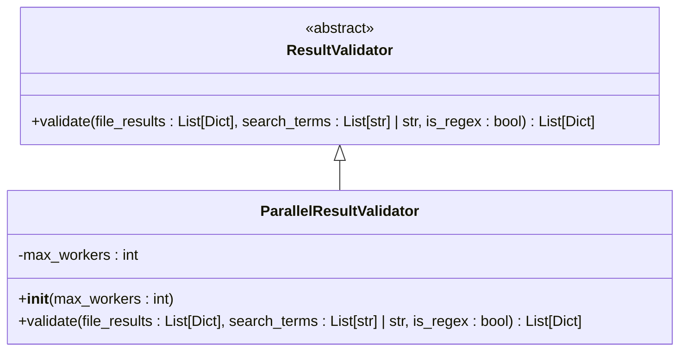
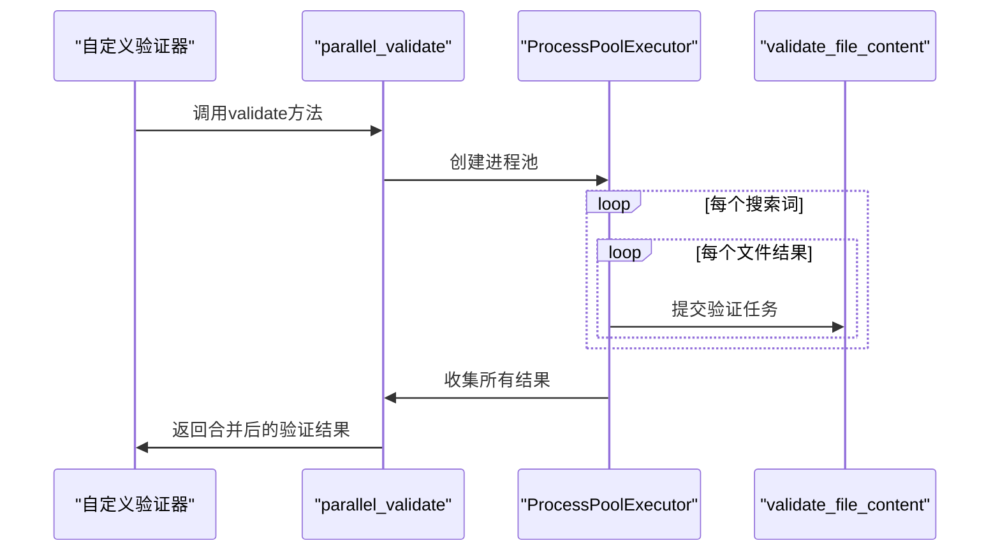
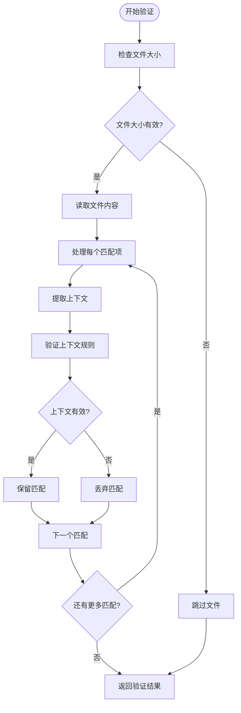
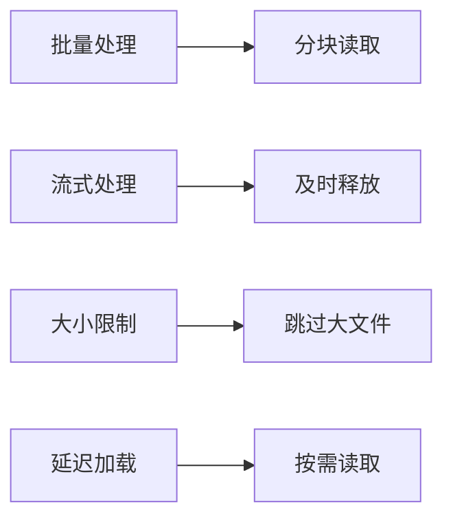

# 添加结果验证器

<cite>
**本文档中引用的文件**
- [validators.py](file://src/validators.py)
- [searcher.py](file://src/searcher.py)
- [config.py](file://src/config.py)
- [search_template.py](file://src/search_template.py)
</cite>

## 目录
1. [简介](#简介)
2. [ResultValidator接口详解](#resultvalidator接口详解)
3. [并行验证框架分析](#并行验证框架分析)
4. [自定义验证器实现指南](#自定义验证器实现指南)
5. [输入输出格式要求](#输入输出格式要求)
6. [大规模文件处理策略](#大规模文件处理策略)
7. [精确匹配确认技术](#精确匹配确认技术)
8. [单元测试方案](#单元测试方案)
9. [配置与启用方式](#配置与启用方式)
10. [总结](#总结)

## 简介
本文档详细介绍如何通过实现`ResultValidator`接口来构建自定义的结果校验逻辑。文档将展示如何创建新的验证器类（如上下文感知验证、语法结构验证）并复用底层并发框架进行高效验证。同时说明`validate`方法的输入输出格式要求，如何安全地处理大规模文件列表，以及在验证过程中进行精确匹配确认的技术细节。最后提供完整的单元测试验证方案，确保新增验证器不会误删有效结果或引入性能瓶颈。

## ResultValidator接口详解

`ResultValidator`是一个抽象基类，定义了结果验证器的标准接口。所有自定义验证器都必须继承此类并实现其抽象方法。



**Diagram sources**
- [validators.py](file://src/validators.py#L13-L29)

**Section sources**
- [validators.py](file://src/validators.py#L13-L29)

### 核心方法签名
```python
def validate(self, file_results: List[Dict[str, Any]], search_terms: List[str] | str, is_regex: bool) -> List[Dict[str, Any]]:
```

该方法接收三个参数：
- `file_results`: 初步搜索得到的文件结果列表
- `search_terms`: 搜索词列表或单个搜索词
- `is_regex`: 是否使用正则表达式模式

返回经过验证后的结果列表，只包含确认有效的匹配项。

## 并行验证框架分析

系统提供了`parallel_validate`函数作为底层并发验证框架，支持多进程并行处理，可显著提升大规模代码库的验证效率。



**Diagram sources**
- [searcher.py](file://src/searcher.py#L233-L275)
- [searcher.py](file://src/searcher.py#L104-L144)

**Section sources**
- [searcher.py](file://src/searcher.py#L233-L275)
- [searcher.py](file://src/searcher.py#L104-L144)

### 并发执行机制
- 使用`ProcessPoolExecutor`实现多进程并行
- 默认最大工作进程数为4，可通过参数调整
- 对每个搜索词和文件组合提交独立任务
- 结果按文件路径聚合，避免重复

### 错误处理策略
- 捕获并记录每个文件验证过程中的异常
- Unicode解码错误自动尝试多种编码格式
- 单个文件验证失败不影响整体流程
- 详细的日志记录便于问题排查

## 自定义验证器实现指南

要创建自定义结果验证器，需遵循以下步骤：

### 基本实现模板
```python
from src.validators import ResultValidator
from typing import List, Dict, Any

class CustomContextValidator(ResultValidator):
    """上下文感知验证器"""
    
    def __init__(self, context_lines: int = 2, max_file_size: int = 1024*1024):
        """
        初始化验证器
        
        Args:
            context_lines: 需要检查的上下文行数
            max_file_size: 最大文件大小限制（字节）
        """
        self.context_lines = context_lines
        self.max_file_size = max_file_size
    
    def validate(self, file_results: List[Dict[str, Any]], search_terms: List[str] | str, is_regex: bool) -> List[Dict[str, Any]]:
        # 实现具体的验证逻辑
        pass
```

### 上下文感知验证器示例
此类验证器不仅验证匹配行本身，还检查其周围的上下文环境。



**Diagram sources**
- [validators.py](file://src/validators.py#L13-L29)
- [searcher.py](file://src/searcher.py#L104-L144)

### 语法结构验证器示例
此类验证器结合语言特定的语法分析器，确保匹配项符合语法规则。

```python
class SyntaxStructureValidator(ResultValidator):
    """语法结构验证器"""
    
    def __init__(self, language: str = "python"):
        self.language = language
        self.parser = self._create_parser()
    
    def _create_parser(self):
        # 根据语言类型创建相应的解析器
        pass
    
    def validate(self, file_results: List[Dict[str, Any]], search_terms: List[str] | str, is_regex: bool) -> List[Dict[str, Any]]:
        validated_results = []
        
        for file_info in file_results:
            file_path = file_info['file_path']
            
            # 只处理特定语言文件
            if not self._is_target_language(file_path):
                continue
                
            try:
                # 使用语法分析器解析文件
                tree = self.parser.parse_file(file_path)
                
                # 验证每个匹配项的语法结构
                valid_matches = []
                for match in file_info['matches']:
                    line_number = int(match['line_number'])
                    if self._is_valid_syntax_structure(tree, line_number, match['search_term']):
                        valid_matches.append(match)
                
                if valid_matches:
                    validated_results.append({
                        'file_path': file_path,
                        'matches': valid_matches
                    })
                        
            except Exception as e:
                logger.warning(f"语法分析 {file_path} 时出错: {e}")
                # 保留原始结果作为后备
                validated_results.append(file_info)
        
        return validated_results
```

**Section sources**
- [validators.py](file://src/validators.py#L13-L29)
- [searcher.py](file://src/searcher.py#L104-L144)

## 输入输出格式要求

### 输入数据结构
验证器接收的`file_results`参数具有以下结构：

```json
[
  {
    "file_path": "path/to/file.py",
    "matches": [
      {
        "line_number": "42",
        "content": "def hello_world():",
        "search_term": "hello"
      }
    ]
  }
]
```

### 输出数据规范
验证后的结果必须保持相同的结构，仅过滤掉无效的匹配项：

- 必须保留`file_path`字段
- `matches`列表只能包含确认有效的匹配
- 每个匹配项必须包含`line_number`、`content`和`search_term`
- 文件条目只有在至少有一个有效匹配时才应保留

### 数据完整性保证
- 不得修改原始匹配内容
- 不得更改行号信息
- 不得添加未验证的匹配项
- 保持搜索词的原始引用关系

**Section sources**
- [validators.py](file://src/validators.py#L17-L29)
- [searcher.py](file://src/searcher.py#L104-L144)

## 大规模文件处理策略

### 内存优化技术
为避免在处理大型代码库时出现内存溢出，建议采用以下策略：



#### 具体实现建议：
- 设置单个文件大小上限（默认1MB）
- 对超大文件采用采样验证策略
- 使用生成器模式逐个处理结果
- 及时清理已处理的中间数据

### 性能调优参数
通过配置文件可调整以下性能相关参数：

| 参数名 | 默认值 | 说明 |
|--------|--------|------|
| validate_workers | 4 | 验证工作进程数 |
| max_file_size | 1048576 | 单文件最大字节数 |
| chunk_size | 100 | 批量处理块大小 |
| timeout_seconds | 30 | 单文件处理超时 |

这些参数可在`SearchConfig`中进行全局配置。

**Section sources**
- [config.py](file://src/config.py#L6-L18)
- [searcher.py](file://src/searcher.py#L233-L275)

## 精确匹配确认技术