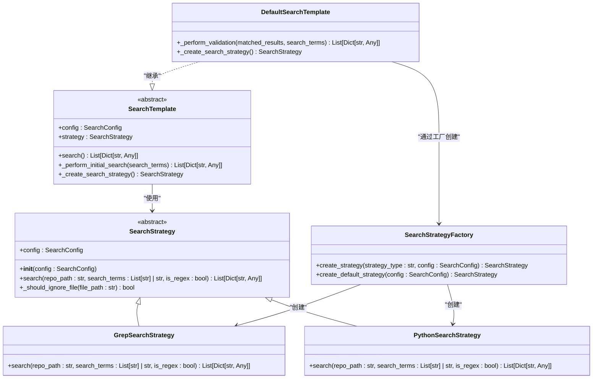
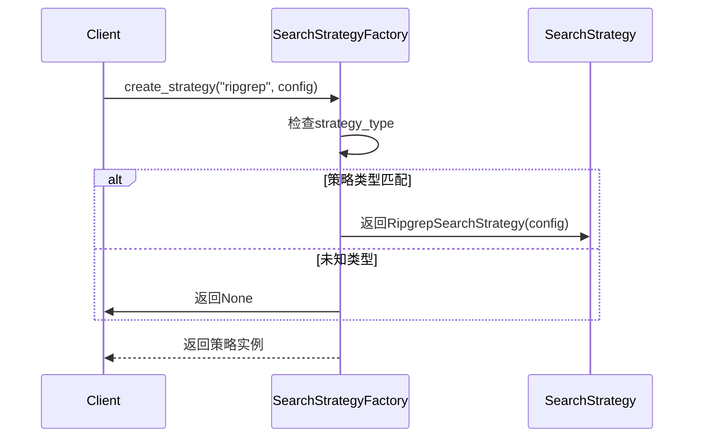
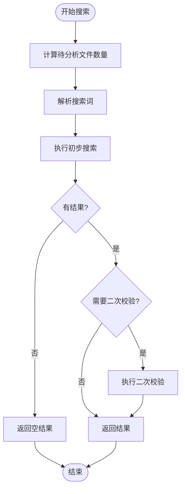
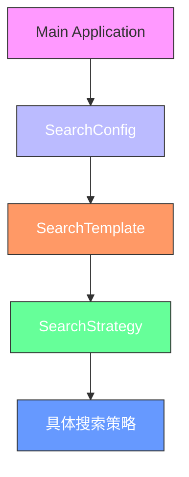

# 自定义搜索策略

<cite>
**Referenced Files in This Document **  
- [strategies.py](file://src/strategies.py)
- [search_factory.py](file://src/search_factory.py)
- [search_template.py](file://src/search_template.py)
- [config.py](file://src/config.py)
</cite>

## 目录
1. [引言](#引言)
2. [核心组件与架构](#核心组件与架构)
3. [自定义搜索策略实现](#自定义搜索策略实现)
4. [策略注册与工厂模式](#策略注册与工厂模式)
5. [与默认搜索模板的集成](#与默认搜索模板的集成)
6. [配置参数传递机制](#配置参数传递机制)
7. [最佳实践与建议](#最佳实践与建议)
8. [常见陷阱与解决方案](#常见陷阱与解决方案)
9. [结论](#结论)

## 引言

本指南旨在为开发者提供详细的说明，指导如何通过继承 `SearchStrategy` 抽象基类来实现新的搜索算法。文档将涵盖从基础方法重写、策略注册到与现有系统集成的完整流程，并提供异常处理、日志记录和性能监控的最佳实践。

## 核心组件与架构

系统采用策略模式（Strategy Pattern）和工厂模式（Factory Pattern）相结合的设计方式，实现了灵活可扩展的搜索功能。主要组件包括：



**Diagram sources **  
- [strategies.py](file://src/strategies.py#L18-L232)
- [search_factory.py](file://src/search_factory.py#L14-L51)
- [search_template.py](file://src/search_template.py#L169-L189)

**Section sources**  
- [strategies.py](file://src/strategies.py#L1-L232)
- [search_factory.py](file://src/search_factory.py#L1-L51)
- [search_template.py](file://src/search_template.py#L1-L189)

## 自定义搜索策略实现

### 必须重写的方法

当继承 `SearchStrategy` 抽象基类时，必须实现以下两个关键方法：

#### 1. `search` 方法

这是执行实际搜索逻辑的核心方法。所有自定义搜索算法都应在此方法中实现具体的搜索行为。

```python
def search(self, repo_path: str, search_terms: List[str] | str, is_regex: bool = False) -> List[Dict[str, Any]]:
    """
    执行搜索的抽象方法
    
    Args:
        repo_path: 仓库路径
        search_terms: 搜索词列表或单个搜索词
        is_regex: 是否使用正则表达式
        
    Returns:
        搜索结果列表，格式为：
        [
            {
                'file_path': '/path/to/file.py',
                'matches': [
                    {
                        'line_number': '42',
                        'content': 'def hello_world():',
                        'search_term': 'hello'
                    }
                ]
            }
        ]
    """
    pass
```

**Section sources**  
- [strategies.py](file://src/strategies.py#L30-L38)

#### 2. `_should_ignore_file` 方法

该方法用于判断特定文件是否应该被忽略，通常基于配置中的忽略目录和文件扩展名规则。

```python
def _should_ignore_file(self, file_path: str) -> bool:
    """
    判断是否应该忽略该文件
    
    Args:
        file_path: 文件路径
        
    Returns:
        是否应该忽略该文件
    """
    # 检查是否在忽略目录中
    if self.config.ignore_dirs:
        for ignore_dir in self.config.ignore_dirs:
            if ignore_dir in file_path:
                return True
    
    # 检查文件后缀
    if self.config.file_extensions is not None:
        _, ext = os.path.splitext(file_path)
        if ext and ext not in self.config.file_extensions:
            if self.config.file_extensions:
                return True
    
    return False
```

**Section sources**  
- [strategies.py](file://src/strategies.py#L40-L58)

### 示例：Ripgrep 策略实现

以下是一个使用 ripgrep 工具的自定义搜索策略示例框架：

```python
import subprocess
from typing import List, Dict, Any
from .strategies import SearchStrategy
from .config import SearchConfig

class RipgrepSearchStrategy(SearchStrategy):
    """基于ripgrep的搜索策略实现"""
    
    def search(self, repo_path: str, search_terms: List[str] | str, is_regex: bool = False) -> List[Dict[str, Any]]:
        if isinstance(search_terms, str):
            search_terms = [search_terms]
        
        all_results = []
        
        for search_term in search_terms:
            try:
                cmd = ["rg", "--json"]
                if is_regex:
                    cmd.append("--regex")
                else:
                    cmd.append("--fixed-strings")
                
                # 添加排除目录
                if self.config.ignore_dirs:
                    for ignore_dir in self.config.ignore_dirs:
                        cmd.extend(["--glob", f"!{ignore_dir}"])
                
                # 添加文件类型过滤
                if self.config.file_extensions:
                    for ext in self.config.file_extensions:
                        cmd.extend(["--type-add", f"custom:{ext}"])
                        cmd.extend(["--type", "custom"])
                
                cmd.extend([search_term, repo_path])
                
                logger.info(f"执行ripgrep命令: {' '.join(cmd)}")
                result = subprocess.run(
                    cmd, 
                    capture_output=True, 
                    text=True, 
                    timeout=300,
                    encoding='utf-8'
                )
                
                if result.returncode == 0:
                    # 解析JSON输出并构建结果
                    pass
                elif result.returncode == 1:
                    logger.info(f"未找到匹配项: {search_term}")
                else:
                    logger.warning(f"ripgrep执行失败: {result.stderr}")
                    
            except subprocess.TimeoutExpired:
                logger.warning(f"ripgrep命令超时: {search_term}")
            except FileNotFoundError:
                logger.error("未找到ripgrep命令，请确保已安装")
                raise
            except Exception as e:
                logger.error(f"执行ripgrep搜索时出错: {e}")
        
        return all_results
```

**Section sources**  
- [strategies.py](file://src/strategies.py#L18-L232)

## 策略注册与工厂模式

### SearchStrategyFactory 机制

`SearchStrategyFactory` 类负责根据指定的策略类型动态创建相应的搜索策略实例。要支持新的搜索策略，需要修改工厂类的 `create_strategy` 方法。



**Diagram sources **  
- [search_factory.py](file://src/search_factory.py#L14-L51)

### 注册新策略

要在运行时动态创建新策略，需要在 `SearchStrategyFactory.create_strategy` 方法中添加对新策略类型的支持：

```python
@staticmethod
def create_strategy(strategy_type: str, config: Optional[SearchConfig] = None) -> Optional[SearchStrategy]:
    """
    根据策略类型创建搜索策略
    
    Args:
        strategy_type: 策略类型 ('grep', 'python', 'ripgrep')
        config: 搜索配置对象
        
    Returns:
        搜索策略实例或None
    """
    strategy_type = strategy_type.lower()
    
    if strategy_type == 'grep':
        logger.info("创建Grep搜索策略")
        return GrepSearchStrategy(config)
    elif strategy_type == 'python':
        logger.info("创建Python搜索策略")
        return PythonSearchStrategy(config)
    elif strategy_type == 'ripgrep':
        logger.info("创建Ripgrep搜索策略")
        return RipgrepSearchStrategy(config)
    else:
        logger.warning(f"未知的搜索策略类型: {strategy_type}")
        return None
```

**Section sources**  
- [search_factory.py](file://src/search_factory.py#L14-L51)

## 与默认搜索模板的集成

### DefaultSearchTemplate 的作用

`DefaultSearchTemplate` 类实现了模板方法模式，定义了搜索流程的通用结构。它通过 `_create_search_strategy` 方法获取具体的搜索策略。



**Diagram sources **  
- [search_template.py](file://src/search_template.py#L169-L189)

### 集成方式

新实现的搜索策略会自动与 `DefaultSearchTemplate` 集成，因为模板通过工厂模式获取策略实例：

```python
def _create_search_strategy(self) -> SearchStrategy:
    """
    创建默认搜索策略
    """
    return SearchStrategyFactory.create_default_strategy(self.config)
```

只要在工厂中正确注册了新策略类型，模板就能无缝使用该策略。

**Section sources**  
- [search_template.py](file://src/search_template.py#L180-L189)

## 配置参数传递机制

### SearchConfig 数据类

系统使用 `dataclass` 实现的 `SearchConfig` 类来管理所有配置参数，这些参数会被传递给各个组件。

```python
@dataclass
class SearchConfig:
    repo_path: str = "/root/CodeRootPath"
    search_term: str = "test,def,void"
    is_regex: bool = False
    validate: bool = False
    validate_workers: int = 4
    db_path: str = "db/results.db"
    excel_path: str = "report/results.xlsx"
    log_level: str = "INFO"
    ignore_dirs: List[str] = field(default_factory=lambda: [".git", "__pycache__", ...])
    file_extensions: Optional[List[str]] = None
```

**Section sources**  
- [config.py](file://src/config.py#L6-L36)

### 参数传递流程

配置参数从顶层向下逐级传递：



每个策略实例在初始化时都会接收 `SearchConfig` 对象，从而可以访问所有配置参数。

**Diagram sources **  
- [config.py](file://src/config.py#L6-L36)
- [strategies.py](file://src/strategies.py#L20-L25)

## 最佳实践与建议

### 异常处理

在实现搜索策略时，应妥善处理各种可能的异常情况：

- **子进程异常**：捕获 `subprocess.TimeoutExpired` 和 `FileNotFoundError`
- **文件读取异常**：处理 `UnicodeDecodeError` 和 `PermissionError`
- **通用异常**：使用通用异常处理器记录错误但不中断程序

```python
try:
    result = subprocess.run(cmd, timeout=300)
except subprocess.TimeoutExpired:
    logger.warning("命令执行超时")
except FileNotFoundError:
    logger.error("工具未安装")
except Exception as e:
    logger.error(f"未知错误: {e}")
```

**Section sources**  
- [strategies.py](file://src/strategies.py#L100-L110)

### 日志记录

遵循统一的日志记录规范：

- 使用模块级别的 `logger` 实例
- 记录关键操作的开始和结束
- 记录搜索结果统计信息
- 对警告和错误进行详细记录

```python
logger.info(f"执行grep命令: {'