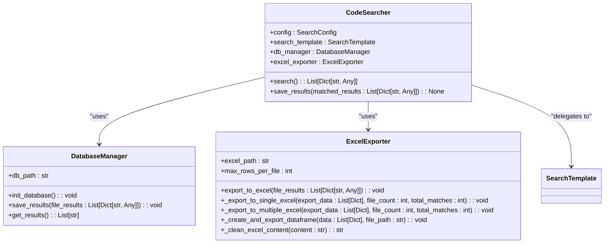
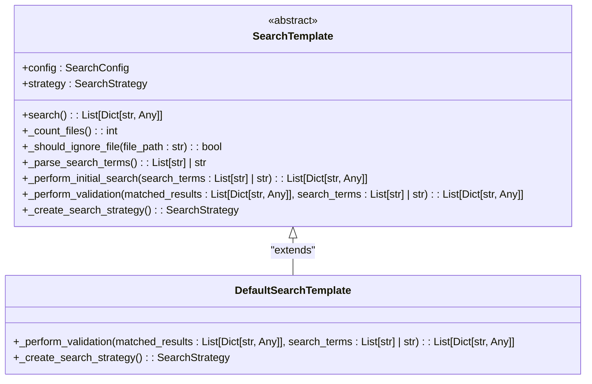
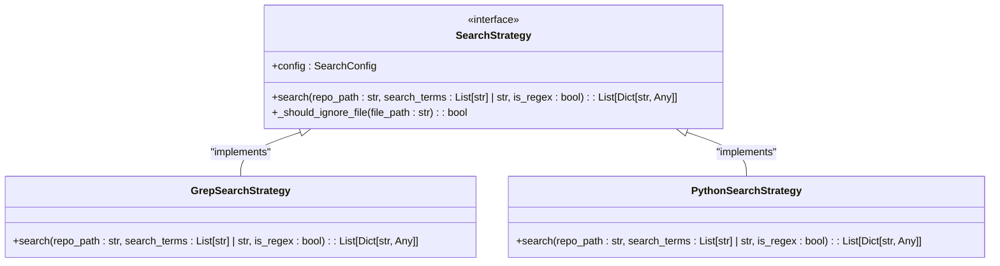
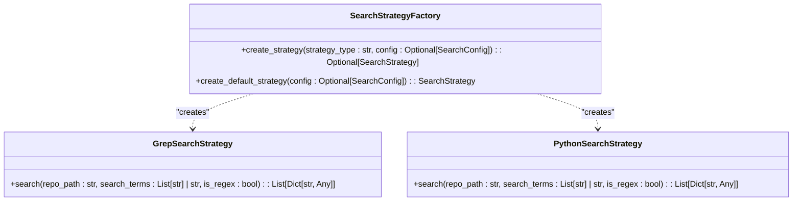
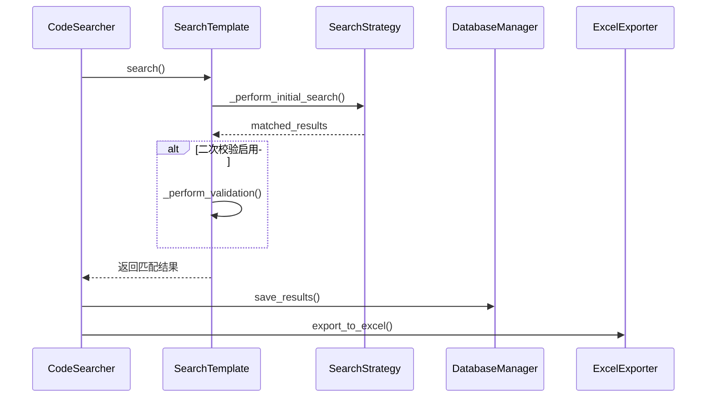

# 技术架构解析

<cite>
**Referenced Files in This Document**   
- [code_searcher.py](file://src/code_searcher.py)
- [search_template.py](file://src/search_template.py)
- [database.py](file://src/database.py)
- [exporter.py](file://src/exporter.py)
- [strategies.py](file://src/strategies.py)
- [search_factory.py](file://src/search_factory.py)
- [config.py](file://src/config.py)
</cite>

## 目录
1. [模块职责与交互关系](#模块职责与交互关系)
2. [主控制器协调机制](#主控制器协调机制)
3. [模板方法模式应用](#模板方法模式应用)
4. [策略模式优势分析](#策略模式优势分析)
5. [工厂模式封装创建过程](#工厂模式封装创建过程)
6. [组件协作图](#组件协作图)

## 模块职责与交互关系

本系统采用面向对象设计模式构建代码搜索工具，各模块职责明确且相互协作。`CodeSearcher`作为主控制器协调整个搜索流程；`SearchTemplate`定义搜索骨架并实现模板方法模式；`DatabaseManager`负责持久化存储搜索结果；`ExcelExporter`处理结果导出功能；`SearchStrategy`接口及其实现类体现策略模式；`SearchStrategyFactory`封装对象创建逻辑。

**Section sources**
- [code_searcher.py](file://src/code_searcher.py#L18-L61)
- [search_template.py](file://src/search_template.py#L17-L166)
- [database.py](file://src/database.py#L7-L98)
- [exporter.py](file://src/exporter.py#L15-L149)
- [strategies.py](file://src/strategies.py#L18-L232)
- [search_factory.py](file://src/search_factory.py#L14-L51)

## 主控制器协调机制

`CodeSearcher`类作为系统的主控制器，整合所有搜索功能组件。在初始化时，它创建`DefaultSearchTemplate`实例作为搜索模板，同时实例化`DatabaseManager`用于数据库操作和`ExcelExporter`用于结果导出。其`search()`方法委托给搜索模板执行实际搜索，并通过`save_results()`方法将匹配结果分别保存到数据库和Excel文件中，实现了对多个组件的统一协调管理。

**Diagram sources**
- [code_searcher.py](file://src/code_searcher.py#L18-L61)
- [database.py](file://src/database.py#L7-L98)
- [exporter.py](file://src/exporter.py#L15-L149)

**Section sources**
- [code_searcher.py](file://src/code_searcher.py#L18-L61)

## 模板方法模式应用

`SearchTemplate`抽象基类运用模板方法模式定义了完整的搜索流程骨架。该类的`search()`模板方法按固定顺序调用一系列步骤：记录日志、统计文件数量、解析搜索词、执行初步搜索以及条件性地进行二次校验。其中`_perform_initial_search()`使用组合的搜索策略执行核心搜索，而`_perform_validation()`和`_create_search_strategy()`被声明为抽象方法，强制子类提供具体实现，确保算法框架的完整性同时允许行为扩展。

**Diagram sources**
- [search_template.py](file://src/search_template.py#L17-L166)

**Section sources**
- [search_template.py](file://src/search_template.py#L17-L166)

## 策略模式优势分析

系统通过`SearchStrategy`接口及其具体实现类`GrepSearchStrategy`和`PythonSearchStrategy`体现了策略模式的优势。`SearchStrategy`定义了统一的`search()`方法契约，而两个具体策略分别提供了基于外部grep命令和纯Python实现的搜索算法。这种设计使得不同搜索算法可以相互替换而不影响客户端代码，提高了系统的灵活性和可维护性。当需要添加新的搜索方式时，只需新增一个策略类即可，符合开闭原则。

**Diagram sources**
- [strategies.py](file://src/strategies.py#L18-L232)

**Section sources**
- [strategies.py](file://src/strategies.py#L18-L232)

## 工厂模式封装创建过程

`SearchStrategyFactory`类通过工厂模式封装了搜索策略对象的创建过程。该工厂提供了静态方法`create_strategy()`根据指定类型字符串（'grep'或'python'）动态创建相应的搜索策略实例，同时`create_default_strategy()`方法返回默认的Grep搜索策略。这种设计将对象创建逻辑集中管理，使客户端无需了解具体实现类的细节，降低了耦合度，并便于未来扩展更多类型的搜索策略。

**Diagram sources**
- [search_factory.py](file://src/search_factory.py#L14-L51)

**Section sources**
- [search_factory.py](file://src/search_factory.py#L14-L51)

## 组件协作图

以下序列图展示了系统主要组件之间的协作关系和数据流控制流。从`CodeSearcher`发起搜索请求开始，经过`SearchTemplate`调用具体的`SearchStrategy`执行搜索，最终将结果传递回`CodeSearcher`进行持久化存储和导出，完整呈现了系统的运行时交互过程。

**Diagram sources**
- [code_searcher.py](file://src/code_searcher.py#L18-L61)
- [search_template.py](file://src/search_template.py#L17-L166)
- [strategies.py](file://src/strategies.py#L18-L232)
- [database.py](file://src/database.py#L7-L98)
- [exporter.py](file://src/exporter.py#L15-L149)