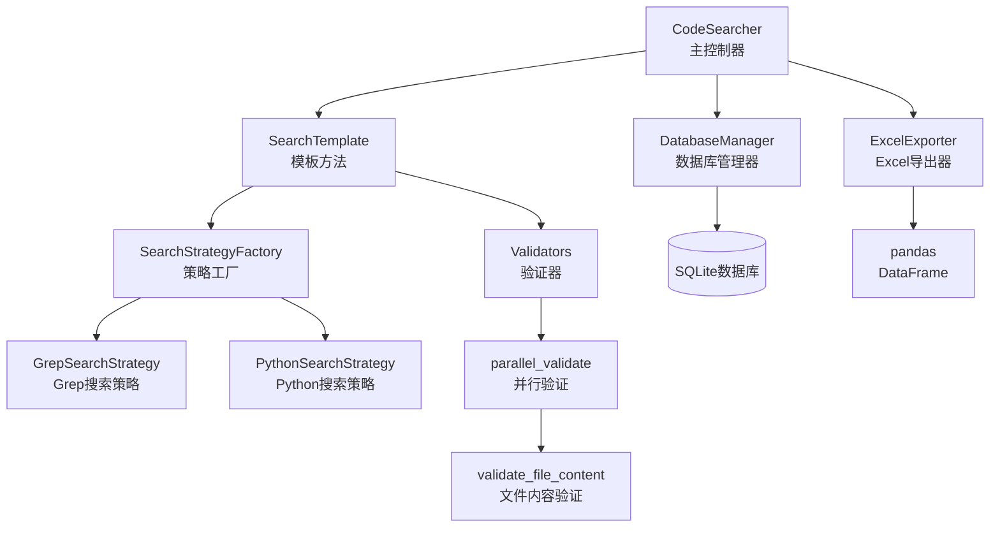
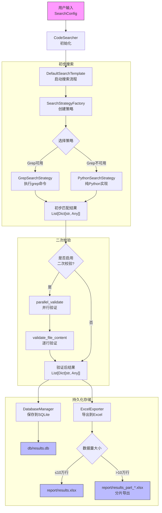
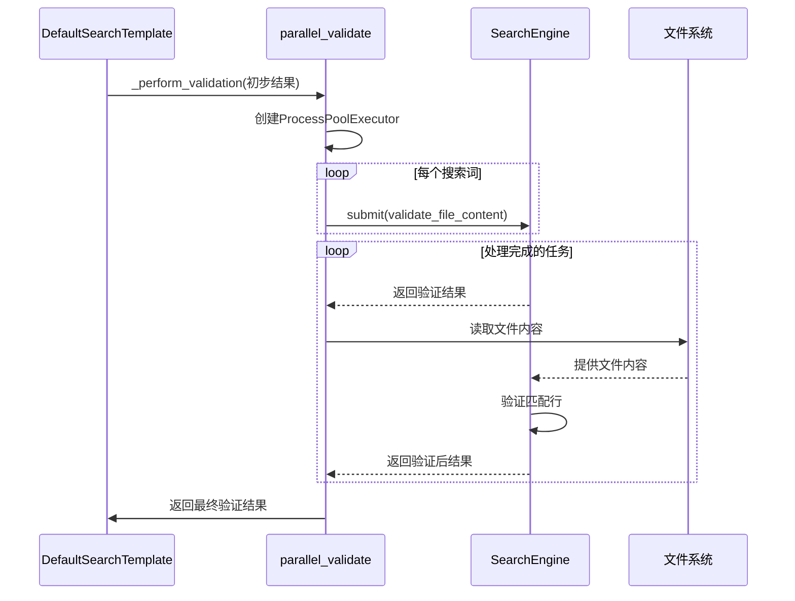
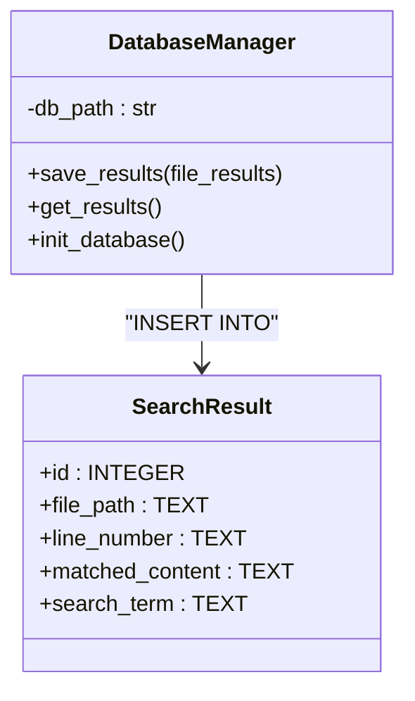
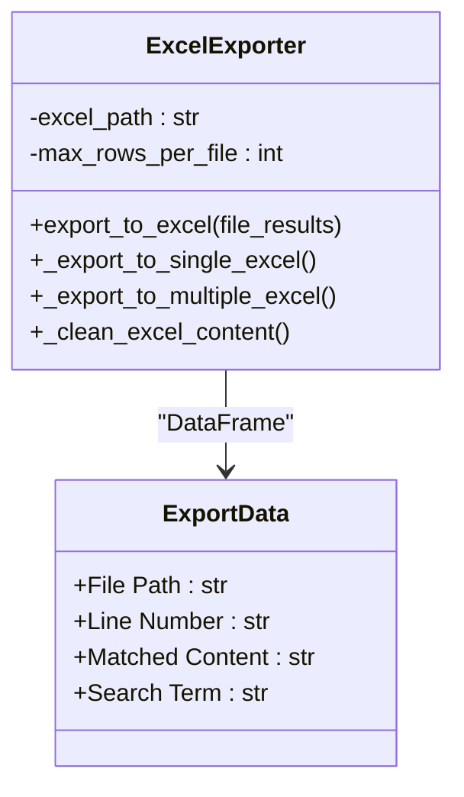

# 数据流分析

<cite>
**Referenced Files in This Document**   
- [code_searcher.py](file://src/code_searcher.py)
- [config.py](file://src/config.py)
- [search_template.py](file://src/search_template.py)
- [strategies.py](file://src/strategies.py)
- [search_factory.py](file://src/search_factory.py)
- [searcher.py](file://src/searcher.py)
- [validators.py](file://src/validators.py)
- [database.py](file://src/database.py)
- [exporter.py](file://src/exporter.py)
</cite>

## 目录
1. [数据流动路径概述](#数据流动路径概述)
2. [核心组件与数据结构](#核心组件与数据结构)
3. [详细数据流图解](#详细数据流图解)
4. [关键转换节点分析](#关键转换节点分析)
5. [异常处理机制](#异常处理机制)

## 数据流动路径概述

本系统实现了从用户输入到结果输出的完整数据流动路径，采用设计模式构建了可扩展的搜索架构。数据流始于`CodeSearcher`接收`SearchConfig`配置对象，经由`DefaultSearchTemplate`启动搜索流程，调用`GrepSearchStrategy`或`PythonSearchStrategy`执行初步搜索，生成初步匹配结果列表；若启用二次校验，则通过`parallel_validate`函数对结果进行精确验证；最终将清洗后的结果传递给`DatabaseManager`和`ExcelExporter`完成持久化存储。

整个数据流遵循模板方法模式（Template Method Pattern），确保了搜索流程的一致性和可扩展性。系统通过策略模式（Strategy Pattern）支持多种搜索算法，并通过工厂模式（Factory Pattern）实现策略的动态创建。

**Section sources**
- [code_searcher.py](file://src/code_searcher.py#L18-L61)
- [search_template.py](file://src/search_template.py#L169-L189)
- [strategies.py](file://src/strategies.py#L73-L232)

## 核心组件与数据结构

### 主要组件关系



**Diagram sources**
- [code_searcher.py](file://src/code_searcher.py#L18-L61)
- [search_template.py](file://src/search_template.py#L169-L189)
- [strategies.py](file://src/strategies.py#L73-L232)
- [search_factory.py](file://src/search_factory.py#L40-L51)
- [validators.py](file://src/validators.py#L15-L50)
- [database.py](file://src/database.py#L7-L98)
- [exporter.py](file://src/exporter.py#L15-L149)

### 核心数据结构演变

在数据流动过程中，主要的数据结构经历了以下演变：

1. **初始状态**: `SearchConfig` 配置对象
2. **初步搜索后**: `List[Dict[str, Any]]` 包含文件路径和匹配行信息
3. **二次校验后**: 清洗和验证后的 `List[Dict[str, Any]]`
4. **持久化阶段**: 转换为数据库记录和Excel表格格式

**Section sources**
- [config.py](file://src/config.py#L6-L18)
- [strategies.py](file://src/strategies.py#L73-L232)
- [searcher.py](file://src/searcher.py#L233-L275)
- [database.py](file://src/database.py#L7-L98)
- [exporter.py](file://src/exporter.py#L15-L149)

## 详细数据流图解



**Diagram sources**
- [code_searcher.py](file://src/code_searcher.py#L18-L61)
- [search_template.py](file://src/search_template.py#L30-L70)
- [strategies.py](file://src/strategies.py#L73-L232)
- [searcher.py](file://src/searcher.py#L233-L275)
- [database.py](file://src/database.py#L7-L98)
- [exporter.py](file://src/exporter.py#L15-L149)

## 关键转换节点分析

### 初步搜索结果转换

初步搜索阶段，无论是使用`GrepSearchStrategy`还是`PythonSearchStrategy`，都会将原始的文本匹配结果转换为统一的数据结构：

```python
[
    {
        'file_path': '/path/to/file.py',
        'matches': [
            {
                'line_number': '42',
                'content': 'def search_function():',
                'search_term': 'def'
            }
        ]
    }
]
```

这种结构化的表示方式便于后续的处理和验证。

**Section sources**
- [strategies.py](file://src/strategies.py#L73-L232)

### 二次校验逻辑

当配置中启用`validate=True`时，系统会执行精确的二次校验。`parallel_validate`函数使用多进程并行处理，对每个匹配文件重新读取并验证其内容，确保初步搜索的结果准确无误。

校验过程包括：
1. 尝试多种编码格式（utf-8, latin-1, gbk, gb2312）读取文件
2. 定位到具体的行号进行内容比对
3. 支持正则表达式和普通字符串匹配两种模式



**Diagram sources**
- [search_template.py](file://src/search_template.py#L169-L189)
- [searcher.py](file://src/searcher.py#L233-L275)

### 持久化数据转换

#### 数据库存储转换



`DatabaseManager.save_results()`方法将`List[Dict[str, Any]]`结构转换为SQL批量插入语句，每条匹配记录对应数据库中的一行。

**Diagram sources**
- [database.py](file://src/database.py#L7-L98)

#### Excel导出转换



`ExcelExporter.export_to_excel()`方法将内部数据结构映射为更适合Excel展示的字段名称，并包含特殊字符清理和大文件拆分功能。

**Diagram sources**
- [exporter.py](file://src/exporter.py#L15-L149)

## 异常处理机制

系统在各个