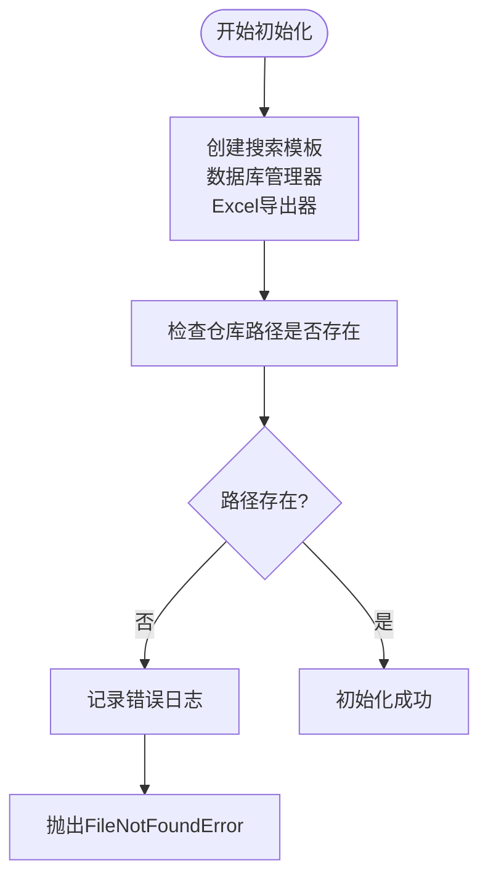
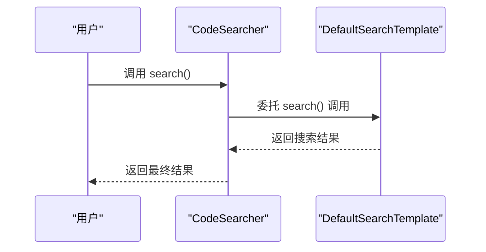
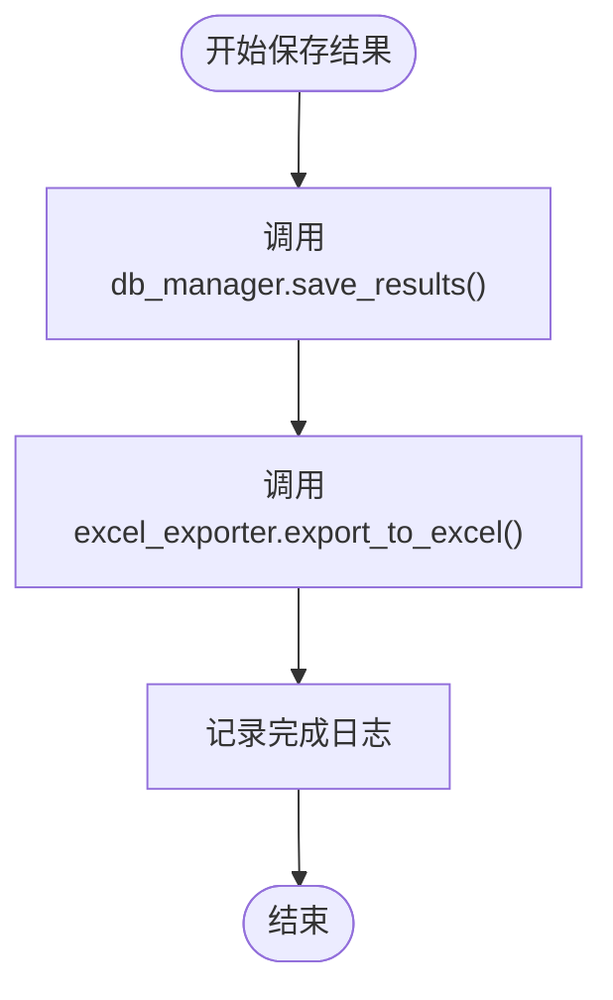
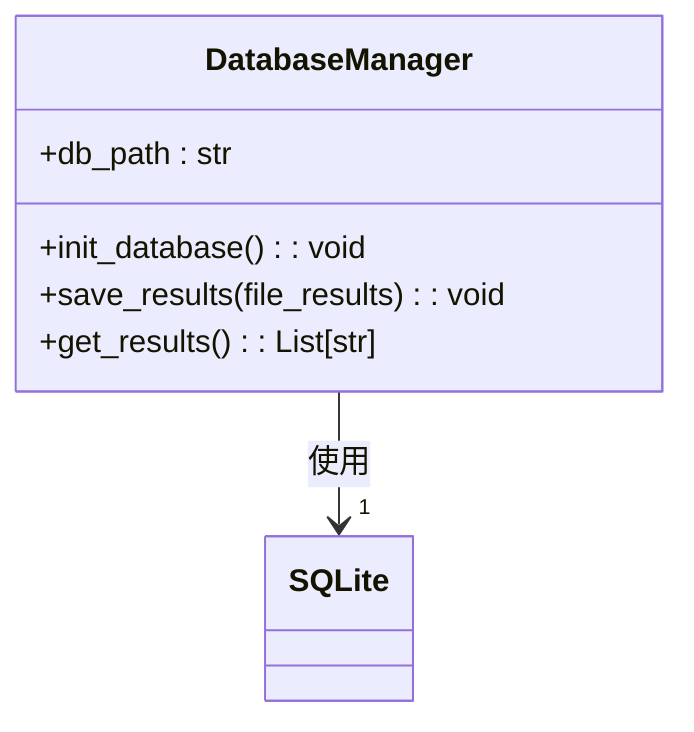
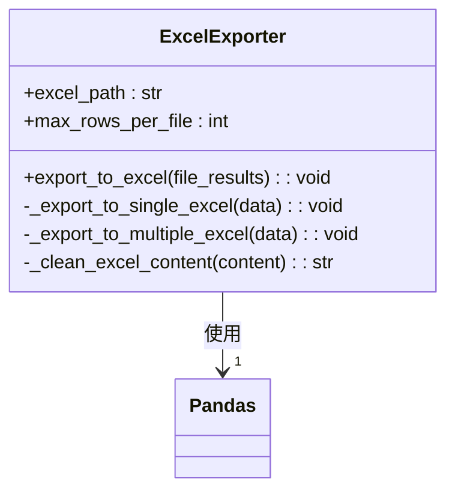
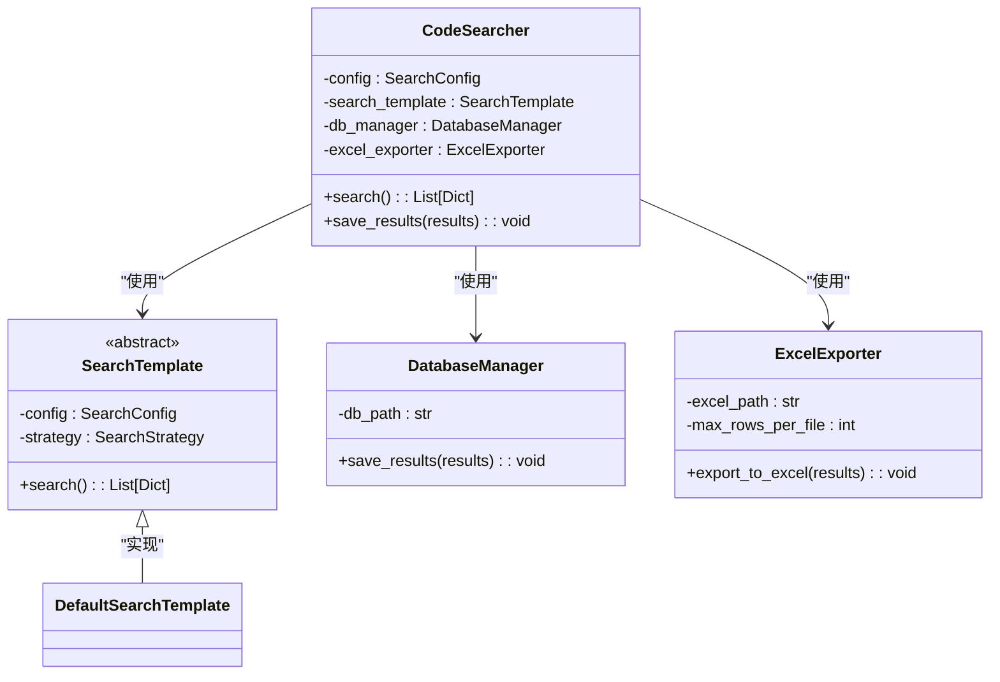
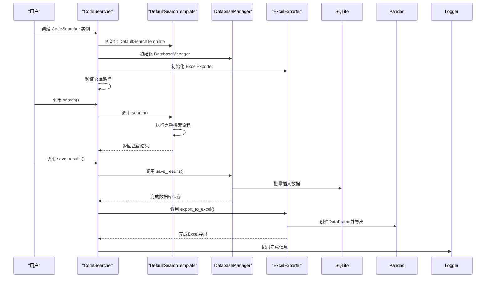

# CodeSearcher 主控制器职责

<cite>
**Referenced Files in This Document **  
- [code_searcher.py](file://src/code_searcher.py)
- [search_template.py](file://src/search_template.py)
- [database.py](file://src/database.py)
- [exporter.py](file://src/exporter.py)
</cite>

## 目录
1. [引言](#引言)
2. [核心职责概述](#核心职责概述)
3. [初始化流程分析](#初始化流程分析)
4. [搜索执行机制](#搜索执行机制)
5. [结果持久化策略](#结果持久化策略)
6. [组件依赖关系](#组件依赖关系)
7. [调用时序分析](#调用时序分析)
8. [错误处理与日志设计](#错误处理与日志设计)
9. [结论](#结论)

## 引言
`CodeSearcher` 类作为 Hello-Scan-Code 工具的核心主控制器，承担着协调和整合各个功能模块的关键角色。该类通过封装复杂的搜索逻辑、数据持久化和文件导出操作，为用户提供了一个简洁而强大的接口来执行代码搜索任务。

## 核心职责概述
`CodeSearcher` 类的主要职责包括：
- 初始化所有必要的组件（搜索模板、数据库管理器、Excel导出器）
- 验证输入参数的有效性
- 协调搜索流程的执行
- 管理搜索结果的双重持久化（数据库存储和Excel导出）
- 处理异常情况并记录运行日志

这种设计遵循了单一职责原则和控制反转模式，使得主控制器能够专注于流程编排，而将具体实现细节委托给专门的组件。

**Section sources**
- [code_searcher.py](file://src/code_searcher.py#L21-L61)

## 初始化流程分析
`CodeSearcher` 的 `__init__` 方法是整个系统启动的入口点，负责构建和配置所有必需的服务实例。

### 组件初始化
在初始化过程中，`CodeSearcher` 创建了三个核心组件：
1. **DefaultSearchTemplate**：基于模板方法模式的搜索引擎，定义了标准的搜索流程
2. **DatabaseManager**：SQLite数据库访问层，用于持久化搜索结果
3. **ExcelExporter**：Excel文件生成器，支持大文件拆分导出

这些组件通过依赖注入的方式传递配置对象，实现了松耦合的设计。

### 路径验证机制
初始化过程包含关键的路径验证步骤，确保指定的仓库路径存在且可访问：

**Diagram sources **
- [code_searcher.py](file://src/code_searcher.py#L21-L37)

**Section sources**
- [code_searcher.py](file://src/code_searcher.py#L21-L37)
- [config.py](file://src/config.py)

## 搜索执行机制
`search()` 方法体现了典型的委托模式，将实际的搜索工作完全交给 `DefaultSearchTemplate` 实例处理。

### 委托模式应用
这种方法的优势在于：
- **解耦**：`CodeSearcher` 不需要了解具体的搜索算法实现
- **可扩展性**：可以轻松替换不同的搜索模板实现
- **测试友好**：便于对搜索逻辑进行独立测试

**Diagram sources **
- [code_searcher.py](file://src/code_searcher.py#L39-L46)
- [search_template.py](file://src/search_template.py#L60-L189)

**Section sources**
- [code_searcher.py](file://src/code_searcher.py#L39-L46)

## 结果持久化策略
`save_results()` 方法实现了复合持久化策略，同时将结果保存到数据库和导出为Excel文件。

### 双重存储架构
这种设计提供了两种互补的数据访问方式：
- **数据库存储**：适合程序内部查询和后续分析
- **Excel导出**：便于人工审查和跨平台共享

**Diagram sources **
- [code_searcher.py](file://src/code_searcher.py#L48-L61)

### 数据库持久化
`DatabaseManager` 采用批量插入优化性能，并创建索引来加速后续查询：

**Diagram sources **
- [database.py](file://src/database.py#L1-L98)

### Excel导出特性
`ExcelExporter` 具备以下智能特性：
- 自动创建输出目录
- 支持大文件拆分（默认每文件10万行）
- 清理特殊字符防止Excel错误
- 动态选择单文件或多文件导出

**Diagram sources **
- [exporter.py](file://src/exporter.py#L1-L149)

**Section sources**
- [code_searcher.py](file://src/code_searcher.py#L48-L61)
- [database.py](file://src/database.py#L48-L81)
- [exporter.py](file://src/exporter.py#L20-L57)

## 组件依赖关系
`CodeSearcher` 与其他核心组件形成了清晰的依赖结构：

**Diagram sources **
- [code_searcher.py](file://src/code_searcher.py)
- [search_template.py](file://src/search_template.py)
- [database.py](file://src/database.py)
- [exporter.py](file://src/exporter.py)

## 调用时序分析
完整的搜索流程涉及多个组件的协同工作：

**Diagram sources **
- [code_searcher.py](file://src/code_searcher.py)
- [search_template.py](file://src/search_template.py#L60-L189)
- [database.py](file://src/database.py#L48-L81)
- [exporter.py](file://src/exporter.py#L20-L57)

## 错误处理与日志设计
`CodeSearcher` 采用了分层的错误处理和全面的日志记录策略。

### 异常处理机制
- **路径验证**：在初始化阶段立即检测无效路径并抛出 `FileNotFoundError`
- **数据库操作**：捕获所有数据库异常并重新抛出，确保调用者能感知错误
- **Excel导出**：对缺失依赖（pandas）进行优雅降级，仅记录警告日志

### 日志记录策略
系统使用统一的日志记录器，提供详细的执行跟踪：
- 关键操作的时间点记录
- 成功操作的结果统计
- 错误信息的完整上下文
- 性能相关的计数信息

这种设计既保证了系统的健壮性，又提供了充分的调试信息。

**Section sources**
- [code_searcher.py](file://src/code_searcher.py)
- [logger_config.py](file://src/logger_config.py)

## 结论
`CodeSearcher` 作为 Hello-Scan-Code 系统的核心主控制器，成功