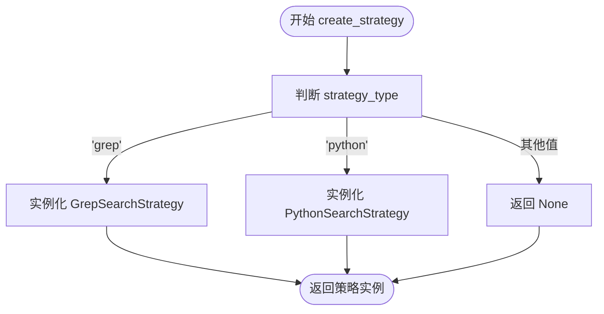
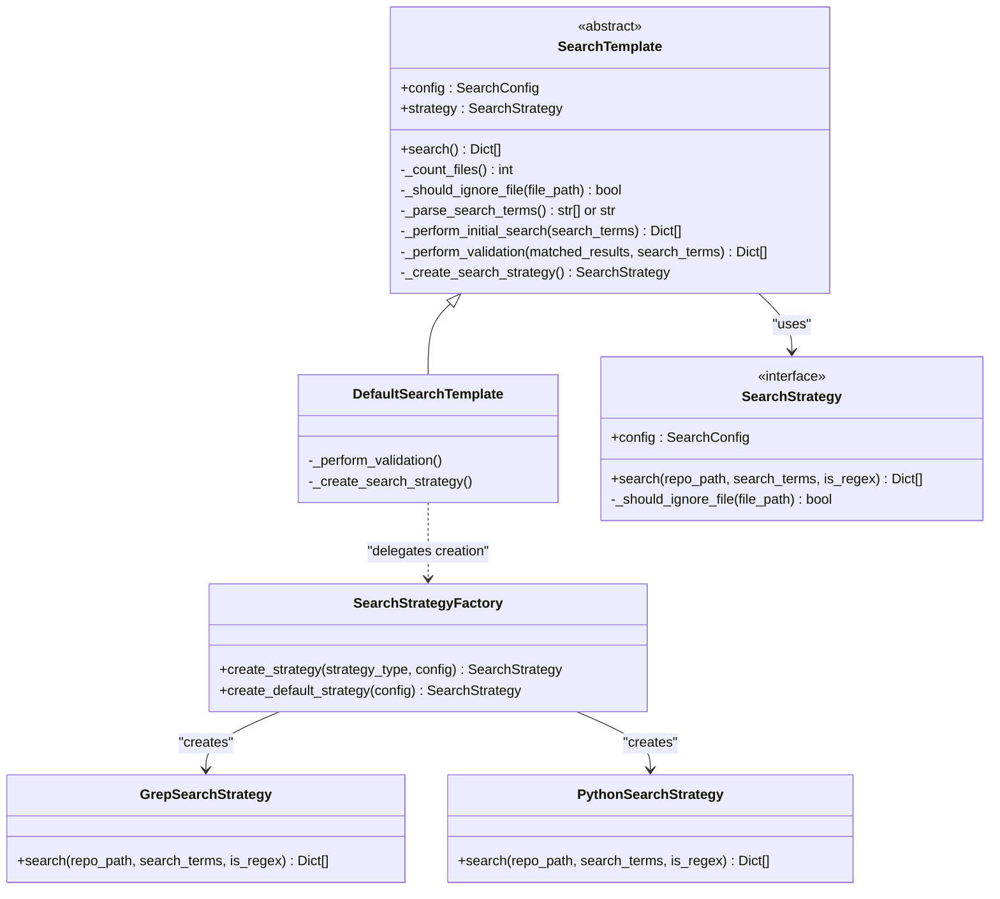

# SearchFactory 策略工厂职责

<cite>
**Referenced Files in This Document **  
- [search_factory.py](file://src/search_factory.py)
- [search_template.py](file://src/search_template.py)
- [strategies.py](file://src/strategies.py)
</cite>

## 目录
1. [SearchStrategyFactory 设计目的](#searchstrategyfactory-设计目的)
2. [动态策略创建机制](#动态策略创建机制)
3. [默认策略选择逻辑](#默认策略选择逻辑)
4. [工厂模式的系统集成与扩展性](#工厂模式的系统集成与扩展性)
5. [异常处理与健壮性设计](#异常处理与健壮性设计)

## SearchStrategyFactory 设计目的

`SearchStrategyFactory` 类作为搜索策略的创建中心，其核心设计目的是实现对象创建过程与使用过程的解耦。通过将策略对象的实例化逻辑集中管理，该工厂类遵循了“依赖倒置”和“单一职责”原则，使得上层调用者（如 `DefaultSearchTemplate`）无需关心具体策略的实现细节或构造方式。

这种设计显著提升了系统的模块化程度：策略的具体实现（`GrepSearchStrategy` 或 `PythonSearchStrategy`）可以独立演化，而不会影响到依赖于 `SearchStrategy` 抽象接口的客户端代码。同时，它为未来引入新的搜索算法（例如基于索引的搜索、模糊搜索等）提供了清晰的扩展点，只需新增策略类并修改工厂方法即可，完全符合开闭原则。

**Section sources**
- [search_factory.py](file://src/search_factory.py#L14-L51)

## 动态策略创建机制

`create_strategy` 静态方法是工厂的核心功能，它根据传入的 `strategy_type` 参数动态决定实例化哪个具体的搜索策略。该方法接收一个字符串类型的参数，并通过统一的小写转换（`.lower()`）进行类型比较，以支持大小写不敏感的输入。

当 `strategy_type` 为 `'grep'` 时，方法返回 `GrepSearchStrategy` 的实例；当为 `'python'` 时，则返回 `PythonSearchStrategy` 的实例。此过程实现了运行时的多态性，允许系统根据配置或用户输入灵活切换底层搜索引擎。整个创建流程被封装在工厂内部，客户端仅需提供策略标识符，从而隐藏了复杂的初始化逻辑，降低了组件间的耦合度。

**Diagram sources **
- [search_factory.py](file://src/search_factory.py#L18-L37)

**Section sources**
- [search_factory.py](file://src/search_factory.py#L18-L37)

## 默认策略选择逻辑

`create_default_strategy` 方法的设计体现了性能优先的工程考量。该方法无条件地返回一个 `GrepSearchStrategy` 实例，其根本原因在于 `GrepSearchStrategy` 利用了操作系统原生的 `grep` 命令行工具。

`grep` 是一个高度优化的文本搜索工具，通常由 C 语言编写，针对文件 I/O 和正则表达式匹配进行了深度优化，其执行效率远高于纯 Python 实现的逐行扫描。因此，在大多数支持 `grep` 的系统上，使用 `GrepSearchStrategy` 能够显著提升大规模代码库的搜索速度。将 `GrepSearchStrategy` 设为默认策略，确保了系统在标准环境下的最佳性能表现，是一种务实且高效的默认配置。

**Section sources**
- [search_factory.py](file://src/search_factory.py#L40-L51)

## 工厂模式的系统集成与扩展性

工厂模式通过 `DefaultSearchTemplate` 类得到了充分体现。在 `DefaultSearchTemplate` 的 `_create_search_strategy` 方法中，直接调用了 `SearchStrategyFactory.create_default_strategy(self.config)` 来获取策略实例。

这种集成方式极大地增强了系统的可扩展性与配置灵活性：
- **可扩展性**：若需添加新的搜索策略（如 `IndexSearchStrategy`），只需在 `SearchStrategyFactory` 中增加相应的创建逻辑，而所有继承自 `SearchTemplate` 的模板类无需任何修改即可通过配置使用新策略。
- **配置灵活性**：系统可以通过配置文件或命令行参数指定 `strategy_type`，然后由 `create_strategy` 方法解析并创建对应的策略，实现了行为的外部化配置。
- **测试友好**：在单元测试中，可以轻松地注入模拟（Mock）的策略对象，便于对 `SearchTemplate` 进行隔离测试。

**Diagram sources **
- [search_template.py](file://src/search_template.py#L185-L189)
- [search_factory.py](file://src/search_factory.py#L14-L51)

**Section sources**
- [search_template.py](file://src/search_template.py#L185-L189)

## 异常处理与健壮性设计

`SearchStrategyFactory` 在异常处理方面展现了良好的健壮性。对于 `create_strategy` 方法，当传入未知的 `strategy_type` 时，工厂并未抛出异常，而是选择记录一条警告日志（`logger.warning`）并安全地返回 `None`。

这种设计避免了因配置错误或无效输入而导致整个应用崩溃的风险，将错误处理的责任交给了调用方。调用者可以根据返回值是否为 `None` 来决定后续操作，例如回退到默认策略或向用户报告错误。此外，`GrepSearchStrategy` 内部也包含了对 `FileNotFoundError` 的捕获，当系统缺少 `grep` 命令时，会自动降级使用 `PythonSearchStrategy`，这进一步增强了系统的容错能力和跨平台适应性。

**Section sources**
- [search_factory.py](file://src/search_factory.py#L30-L36)
- [strategies.py](file://src/strategies.py#L138-L145)