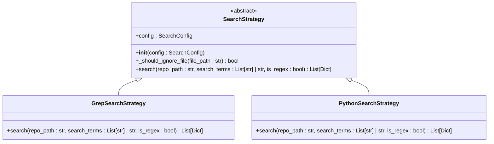
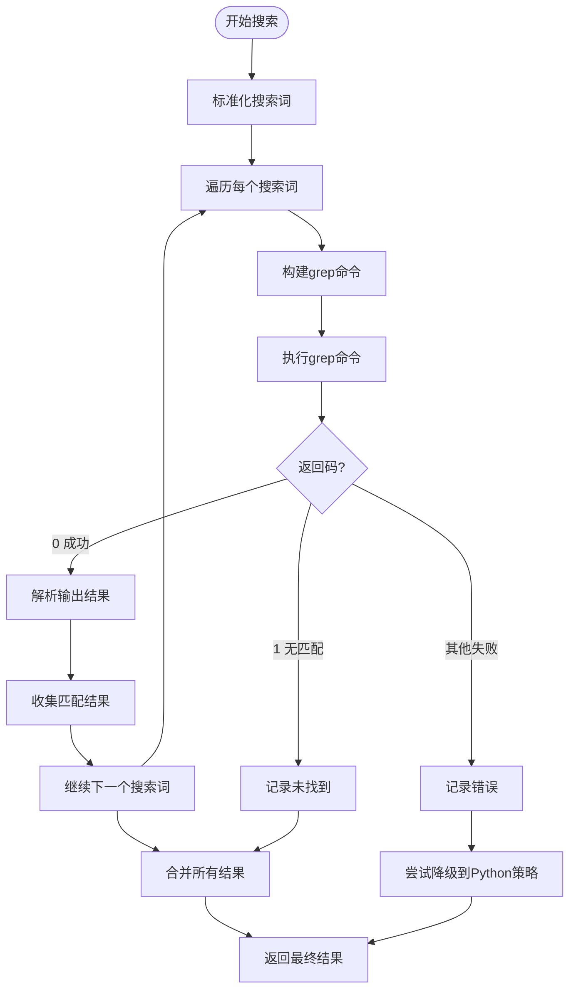
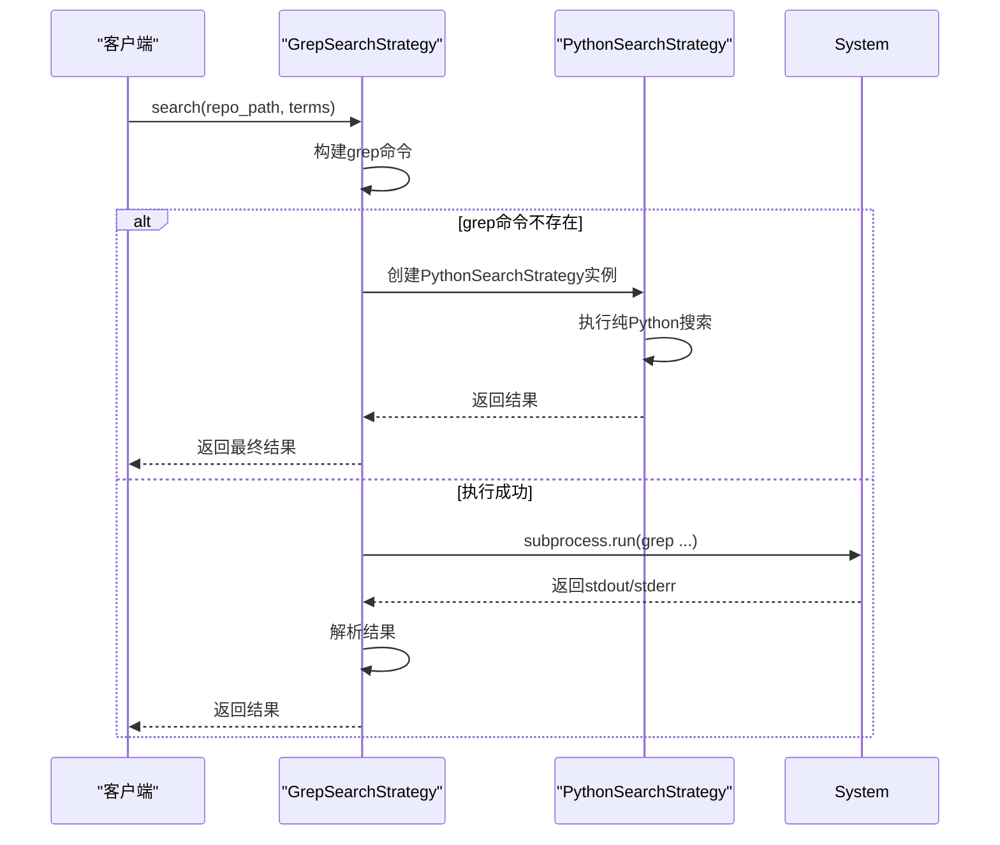

# Grep搜索策略实现

<cite>
**Referenced Files in This Document **  
- [strategies.py](file://src/strategies.py)
- [config.py](file://src/config.py)
- [search_factory.py](file://src/search_factory.py)
- [search_template.py](file://src/search_template.py)
- [logger_config.py](file://src/logger_config.py)
</cite>

## 目录
1. [GrepSearchStrategy类概述](#grepsearchstrategy类概述)
2. [初始化与配置管理](#初始化与配置管理)
3. [搜索方法执行流程](#搜索方法执行流程)
4. [命令行参数动态构建机制](#命令行参数动态构建机制)
5. [错误处理与容错降级机制](#错误处理与容错降级机制)
6. [性能优势与局限性分析](#性能优势与局限性分析)
7. [实际日志输出示例](#实际日志输出示例)
8. [与其他组件的协作关系](#与其他组件的协作关系)

## GrepSearchStrategy类概述

`GrepSearchStrategy` 是一个基于系统 `grep` 命令实现的高效代码搜索策略类，继承自抽象基类 `SearchStrategy`。该类通过调用外部 `grep` 工具执行递归文本搜索，适用于大规模代码库中的快速关键词匹配。

该策略的核心优势在于利用操作系统原生工具进行高性能文本检索，避免了在 Python 中逐行读取和解析文件所带来的性能开销。其设计遵循策略模式，允许在运行时根据环境条件自动切换至备用搜索策略。



**Diagram sources **  
- [strategies.py](file://src/strategies.py#L1-L232)

**Section sources**  
- [strategies.py](file://src/strategies.py#L73-L171)

## 初始化与配置管理

`GrepSearchStrategy` 在初始化时接收一个 `SearchConfig` 配置对象，该对象封装了所有搜索相关的参数设置。若未提供配置实例，则使用默认配置。

`SearchConfig` 类采用 `dataclass` 实现，包含以下关键属性：
- `repo_path`: 指定要搜索的代码仓库路径
- `ignore_dirs`: 定义应被忽略的目录列表（如 `.git`, `node_modules` 等）
- `file_extensions`: 可选的文件扩展名过滤列表，用于限制搜索范围
- `is_regex`: 控制是否启用正则表达式匹配模式

此类通过依赖注入方式获取配置，增强了可测试性和灵活性，使得不同环境下的行为可以通过配置轻松调整。

**Section sources**  
- [config.py](file://src/config.py#L6-L18)
- [strategies.py](file://src/strategies.py#L10-L25)

## 搜索方法执行流程

`search` 方法是 `GrepSearchStrategy` 的核心入口，负责协调整个搜索过程。其执行流程如下：

1. **输入标准化**：将输入的搜索词统一转换为列表格式，以支持多关键词搜索。
2. **逐项搜索**：对每个搜索词独立执行 `grep` 命令，确保结果完整性。
3. **命令构建**：基于当前配置动态生成 `grep` 命令行参数。
4. **进程调用**：使用 `subprocess.run` 执行外部命令并捕获输出。
5. **结果解析**：将 `grep` 输出按行分割，并提取文件路径、行号和匹配内容。
6. **结果合并**：整合多个搜索词的结果，去重并组织成统一的数据结构。

此流程体现了清晰的责任分离原则，各阶段逻辑独立且易于维护。



**Diagram sources **  
- [strategies.py](file://src/strategies.py#L73-L171)

**Section sources**  
- [strategies.py](file://src/strategies.py#L73-L171)

## 命令行参数动态构建机制

`GrepSearchStrategy` 能够根据配置动态构建 `grep` 命令行参数，具体包括：

- **基础参数**：始终包含 `-r`（递归）和 `-n`（显示行号）
- **正则支持**：当 `is_regex=True` 时添加 `-E` 参数启用扩展正则表达式
- **排除目录**：遍历 `ignore_dirs` 列表，为每个目录添加 `--exclude-dir` 参数
- **文件类型过滤**：若设置了 `file_extensions`，则为每个扩展名生成 `--include` 模式

例如，当搜索词为 `"test"`、忽略 `.git` 和 `__pycache__`、仅搜索 `.py` 文件时，生成的命令为：
```
grep -r -n --exclude-dir .git --exclude-dir __pycache__ --include "*.py" "test" /path/to/repo
```

这种灵活的参数拼接机制确保了搜索的高度可定制化。

**Section sources**  
- [strategies.py](file://src/strategies.py#L90-L115)

## 错误处理与容错降级机制

该策略实现了完善的异常处理和容错机制，主要包括：

- **超时处理**：设置 300 秒执行超时，防止长时间挂起
- **命令缺失处理**：捕获 `FileNotFoundError` 异常，当系统无 `grep` 命令时自动降级
- **降级策略**：自动切换至 `PythonSearchStrategy` 继续执行搜索
- **部分失败容忍**：单个搜索词失败不影响其他搜索词的执行

特别地，当检测到 `grep` 不可用时，会立即创建 `PythonSearchStrategy` 实例并委托其完成剩余搜索任务，体现了“优雅降级”的设计理念。



**Diagram sources **  
- [strategies.py](file://src/strategies.py#L73-L171)

**Section sources**  
- [strategies.py](file://src/strategies.py#L117-L150)

## 性能优势与局限性分析

### 性能优势
- **高效率**：利用 C 编写的 `grep` 工具，远快于纯 Python 实现
- **内存友好**：无需将整个文件加载到内存，适合大文件处理
- **并发潜力**：可在多个搜索词上并行执行独立的 `grep` 进程

### 局限性
- **依赖外部工具**：要求目标系统安装 `grep` 命令（Windows 需额外配置）
- **平台差异**：不同操作系统上的 `grep` 版本可能存在行为差异
- **编码问题**：可能无法正确处理非 UTF-8 编码文件

相比之下，`PythonSearchStrategy` 虽然速度较慢，但具有跨平台一致性好、编码处理能力强的优点，作为后备方案非常合适。

**Section sources**  
- [strategies.py](file://src/strategies.py#L73-L232)

## 实际日志输出示例

以下是典型的日志输出序列，展示了完整的执行流程：

```
2024-01-01 10:00:00 | INFO     | 执行grep命令: grep -r -n --exclude-dir .git --exclude-dir __pycache__ --include *.py test /root/CodeRootPath
2024-01-01 10:00:02 | INFO     | grep搜索 '