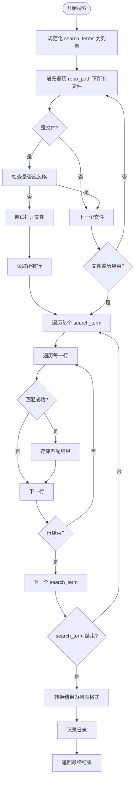

# Python搜索策略实现

<cite>
**Referenced Files in This Document **  
- [strategies.py](file://src/strategies.py)
- [search_factory.py](file://src/search_factory.py)
- [search_template.py](file://src/search_template.py)
- [logger_config.py](file://src/logger_config.py)
</cite>

## 目录
1. [简介](#简介)
2. [核心组件](#核心组件)
3. [PythonSearchStrategy 实现机制](#pythonsearchstrategy-实现机制)
4. [文件遍历与内容读取](#文件遍历与内容读取)
5. [多关键词匹配逻辑](#多关键词匹配逻辑)
6. [异常处理策略](#异常处理策略)
7. [结果结构构建](#结果结构构建)
8. [与 GrepSearchStrategy 的对比分析](#与-grepsearchstrategy-的对比分析)
9. [依赖关系与配置管理](#依赖关系与配置管理)

## 简介
本文档深入解析 `PythonSearchStrategy` 类如何使用纯 Python 实现跨平台兼容的代码搜索功能。该策略作为 `Hello-Scan-Code` 项目中的核心搜索算法之一，旨在提供一种不依赖外部工具（如 grep）的可靠文本搜索方案，特别适用于无 grep 环境或包含特殊编码文件的场景。

`PythonSearchStrategy` 继承自抽象基类 `SearchStrategy`，实现了基于 glob 模块递归遍历文件系统、通过内置 `open()` 函数读取文件内容并逐行匹配的完整流程。其设计充分考虑了多关键词循环检测、正则表达式与普通文本匹配的分支处理、以及对 Unicode 解码错误和权限不足等常见异常的安全捕获。

本策略不仅确保了在各种操作系统上的可移植性，还通过统一的接口与项目的工厂模式（`SearchStrategyFactory`）和模板方法模式（`SearchTemplate`）无缝集成，构成了一个灵活且可扩展的代码搜索框架。

## 核心组件

`PythonSearchStrategy` 是整个搜索系统的关键组成部分，与其他模块协同工作以完成复杂的代码扫描任务。它位于 `src/strategies.py` 文件中，是 `SearchStrategy` 抽象基类的具体实现之一。

该策略被 `SearchStrategyFactory` 工厂类用于根据用户配置创建实例，并由 `SearchTemplate` 模板类调用其 `search` 方法执行实际的搜索操作。这种分层架构使得不同的搜索算法可以轻松替换，同时保持上层逻辑的一致性和稳定性。

**Section sources**
- [strategies.py](file://src/strategies.py#L174-L232)
- [search_factory.py](file://src/search_factory.py#L15-L30)
- [search_template.py](file://src/search_template.py#L120-L125)

## PythonSearchStrategy 实现机制

`PythonSearchStrategy` 的核心在于其实现的 `search` 方法，该方法遵循 `SearchStrategy` 基类定义的统一接口，接收仓库路径、搜索词和是否启用正则表达式的参数，并返回标准化的搜索结果列表。

此方法首先确保输入的 `search_terms` 参数为列表格式，从而简化后续的循环处理逻辑。接着，利用 `glob.glob()` 函数配合 `**/*` 通配符和 `recursive=True` 参数，实现对指定仓库路径下所有文件的深度递归遍历。

在整个搜索过程中，`PythonSearchStrategy` 会调用父类提供的 `_should_ignore_file` 方法来判断当前文件是否应被忽略，这一机制支持通过配置文件排除特定目录或仅包含指定后缀名的文件，有效提升了搜索效率。



**Diagram sources **
- [strategies.py](file://src/strategies.py#L185-L232)

**Section sources**
- [strategies.py](file://src/strategies.py#L185-L232)

## 文件遍历与内容读取

`PythonSearchStrategy` 使用 Python 内置的 `glob` 模块进行文件系统的递归遍历。通过构造 `os.path.join(repo_path, '**/*')` 这样的路径模式，并设置 `recursive=True`，能够高效地发现目标目录下的每一个文件节点。

对于每一个识别出的文件，策略会先调用 `_should_ignore_file` 方法进行过滤。该方法依据 `SearchConfig` 配置对象中的 `ignore_dirs` 和 `file_extensions` 属性，决定是否跳过当前文件，避免对无关文件（如二进制文件、日志文件或版本控制元数据）进行不必要的处理。

一旦确定文件需要被分析，`PythonSearchStrategy` 将使用 `with open(file_path, 'r', encoding='utf-8')` 语句安全地打开文件。这里明确指定了 UTF-8 编码，这是现代文本文件最常用的编码方式。随后，`readlines()` 方法将文件的全部内容加载到内存中的字符串列表里，为接下来的逐行匹配做好准备。

**Section sources**
- [strategies.py](file://src/strategies.py#L195-L198)
- [strategies.py](file://src/strategies.py#L45-L65)

## 多关键词循环检测

`PythonSearchStrategy` 支持同时搜索多个关键词，这通过嵌套循环实现。外层循环遍历 `search_terms` 列表中的每一个搜索项，内层循环则针对文件的每一行内容进行检查。

这种设计允许用户一次性提交多个查询条件，例如查找代码中所有对特定函数的调用和相关的注释。无论搜索词是单个字符串还是列表形式，策略内部都会将其统一处理为列表，保证了接口的灵活性和一致性。

对于每个 `(search_term, line)` 组合，策略会根据 `is_regex` 标志位选择匹配模式：若为 `True`，则使用 `re.search(search_term, line)` 执行正则表达式匹配；否则，采用简单的子串包含判断 `search_term in line`。这种方式既满足了精确模式匹配的需求，也保留了快速文本查找的能力。

**Section sources**
- [strategies.py](file://src/strategies.py#L204-L217)

## 异常处理策略

考虑到代码库中可能包含非文本文件或具有不同字符编码的文件，`PythonSearchStrategy` 实施了稳健的异常处理机制。文件读取操作被包裹在 `try-except` 块中，专门捕获 `UnicodeDecodeError` 和 `PermissionError` 两种常见异常。

当遇到 `UnicodeDecodeError` 时，意味着文件无法用 UTF-8 编码正确解码，可能是由于文件使用了其他编码（如 GBK、Latin-1）或是二进制文件。此时，策略选择静默跳过该文件，避免程序崩溃。
同样，`PermissionError` 表明当前运行环境没有足够的权限读取该文件，这也是一个合理的跳过理由。

除此之外，一个更广泛的 `except Exception as e` 子句用于捕获任何其他未预期的异常，并通过 `logger.warning` 记录警告信息，确保即使出现意外情况，整个搜索过程也能继续进行，只影响单个文件而非全局流程。

**Section sources**
- [strategies.py](file://src/strategies.py#L219-L225)

## 结果结构构建

`PythonSearchStrategy` 构建的结果是一个精心组织的字典列表，每个字典代表一个包含匹配内容的文件。结果的构建分为两个阶段：首先使用字典 `file_matches` 按文件路径聚合所有匹配行，最后再转换为列表格式以便返回。

在 `file_matches` 字典中，键是文件的绝对路径，值是另一个包含匹配详情的字典列表。每条匹配详情记录了行号（`line_number`）、去除尾部空白的内容（`content`）以及触发匹配的搜索词（`search_term`），这些信息对于后续的结果展示和分析至关重要。

最终，通过遍历 `file_matches` 并构造符合规范的字典对象，形成最终的 `result_list`。该列表的结构与 `GrepSearchStrategy` 完全一致，保证了不同策略间结果的互操作性。最后，策略会记录一条包含匹配文件数和总匹配行数的日志信息，便于用户了解搜索规模。

**Section sources**
- [strategies.py](file://src/strategies.py#L227-L232)

## 与 GrepSearchStrategy 的对比分析

`PythonSearchStrategy` 与 `GrepSearchStrategy` 代表了两种截然不同的搜索哲学。前者是纯 Python 实现，后者则是对系统级 `grep` 命令的封装。

**性能方面**，`GrepSearchStrategy` 通常更快，因为 `grep` 是用 C 语言编写的高度优化工具，专为文本搜索而生。它能利用操作系统底层特性进行高效匹配。相比之下，`PythonSearchStrategy` 在 Python 解释器中逐行处理文本，速度较慢，尤其是在处理大型文件时。

**可靠性与兼容性方面**，`PythonSearchStrategy` 具有显著优势。它不依赖于外部命令，因此在 Windows、macOS 或缺少 `grep` 的 Linux 系统上都能正常工作。此外，其显式的异常处理使其更能容忍损坏或编码异常的文件。

`GrepSearchStrategy` 在失败时（如找不到 `grep` 命令）会优雅降级，自动调用 `PythonSearchStrategy` 作为后备方案，这体现了系统整体的健壮性。然而，`PythonSearchStrategy` 本身不具备这种回退能力，它是最终的保障。

综上所述，`PythonSearchStrategy` 牺牲了一定的性能，换取了无与伦比的跨平台可靠性和对复杂文件环境的适应能力，是 `Hello-Scan-Code` 项目能够在多样化环境中稳定运行的关键。

```mermaid
graph TD
    A[用户发起搜索] --> B{选择策略}
    B -->|grep| C[GrepSearchStrategy]
    B -->|python| D[PythonSearchStrategy]
    
    C --> E["调用系统 grep 命令<br/>速度快，依赖外部工具"]
    C --> F{"grep 可用?"}
    F -->|是| G[返回结果]
    F -->|否| H["自动降级到<br/>PythonSearchStrategy"]
    
    D --> I["纯Python实现<br/>跨平台兼容"]
    D --> J["glob 递归遍历"]
    D --> K["open() 读取文件"]
    D --> L["逐行匹配"]
    D