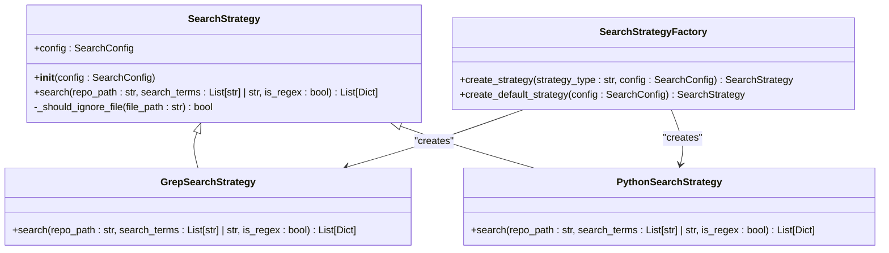

# SearchStrategy 搜索策略职责

<cite>
**Referenced Files in This Document **  
- [strategies.py](file://src/strategies.py)
- [config.py](file://src/config.py)
- [search_factory.py](file://src/search_factory.py)
</cite>

## 目录
1. [SearchStrategy 抽象基类设计](#searchstrategy-抽象基类设计)
2. [GrepSearchStrategy 实现与降级机制](#grepsearchstrategy-实现与降级机制)
3. [PythonSearchStrategy 纯Python实现](#pythonsearchstrategy-纯python实现)
4. [策略选择与工厂模式](#策略选择与工厂模式)
5. [配置管理与文件过滤](#配置管理与文件过滤)

## SearchStrategy 抽象基类设计

`SearchStrategy` 是一个抽象基类，定义了所有搜索策略的统一接口和共享功能。它采用策略模式（Strategy Pattern）来封装不同的搜索算法，使得客户端代码可以透明地切换不同的搜索实现。

该抽象类通过 `@abstractmethod` 装饰器强制要求子类实现 `search` 方法，确保所有具体策略都提供一致的调用接口。同时，它封装了一个通用的文件过滤逻辑 `_should_ignore_file`，用于判断特定文件是否应该被忽略。

这个方法根据配置中的 `ignore_dirs` 和 `file_extensions` 参数进行双重检查：首先判断文件路径是否包含任何应忽略的目录名，然后检查文件扩展名是否在允许列表中。这种设计实现了关注点分离，避免了在每个具体策略中重复相同的过滤逻辑。

**Section sources**
- [strategies.py](file://src/strategies.py#L18-L70)

## GrepSearchStrategy 实现与降级机制

`GrepSearchStrategy` 是基于外部 `grep` 命令的具体搜索策略实现，旨在利用系统工具的高性能特性。它通过 `subprocess.run` 调用 `grep -r -n` 命令执行递归文本搜索，并支持正则表达式匹配（通过 `-E` 选项）。

该策略在构建命令行时会动态添加 `--exclude-dir` 选项以排除配置中指定的目录，并使用 `--include` 选项限制搜索的文件类型。搜索结果通过解析 `grep` 输出的标准格式（`文件路径:行号:内容`）进行处理，并组织成结构化的字典列表。

最关键的特性是其自动降级机制：当捕获到 `FileNotFoundError` 异常（表示系统中未安装 `grep` 命令）时，它会无缝切换到 `PythonSearchStrategy` 实现。这种容错设计保证了工具在不同环境下的可用性，体现了"优雅降级"的设计原则。

**Section sources**
- [strategies.py](file://src/strategies.py#L73-L171)

## PythonSearchStrategy 纯Python实现

`PythonSearchStrategy` 提供了一种完全独立于外部依赖的纯Python搜索实现，具有最佳的兼容性和可移植性。它使用 `glob.glob` 函数配合 `**/*` 模式递归遍历指定目录下的所有文件。

对于每个可读的文件，它逐行读取内容并进行字符串或正则表达式匹配。为了提高鲁棒性，该策略能够处理 `UnicodeDecodeError` 和 `PermissionError` 等常见异常，自动跳过无法读取的二进制文件或权限受限的文件。

虽然其性能通常低于 `grep` 实现，但 `PythonSearchStrategy` 在Windows等缺乏原生 `grep` 工具的系统上提供了可靠的替代方案。此外，由于完全由Python控制，它更容易进行调试和定制。

**Section sources**
- [strategies.py](file://src/strategies.py#L174-L232)

## 策略选择与工厂模式

搜索策略的创建通过 `SearchStrategyFactory` 工厂类管理，实现了创建逻辑与使用逻辑的解耦。该工厂提供了两个静态方法：`create_strategy` 根据传入的类型字符串（'grep' 或 'python'）实例化相应的策略，而 `create_default_strategy` 则始终返回 `GrepSearchStrategy` 作为默认选择。

这种工厂模式的设计使得策略的选择可以在运行时动态决定，同时也简化了客户端代码。例如，主程序可以根据操作系统类型或用户偏好设置自动选择最优策略，而无需修改核心搜索逻辑。

**Diagram sources **
- [strategies.py](file://src/strategies.py#L18-L232)
- [search_factory.py](file://src/search_factory.py#L15-L51)

**Section sources**
- [search_factory.py](file://src/search_factory.py#L15-L51)

## 配置管理与文件过滤

搜索行为由 `SearchConfig` 数据类集中管理，其中包含了 `ignore_dirs` 和 `file_extensions` 等关键参数。这些配置被传递给所有策略实例，确保过滤规则的一致性应用。

`_should_ignore_file` 方法作为抽象基类的一部分，被所有子类继承使用。它首先检查文件路径是否包含任何忽略目录（如 `.git`, `node_modules`），然后验证文件扩展名是否在允许列表中。这种分层过滤机制有效减少了不必要的文件I/O操作，提升了整体搜索效率。

多关键词搜索的支持通过将输入的搜索词转换为列表并在内部循环处理来实现，确保每个关键词都能独立产生匹配结果，最后合并相同文件的匹配项。

**Section sources**
- [config.py](file://src/config.py#L1-L36)
- [strategies.py](file://src/strategies.py#L50-L70)