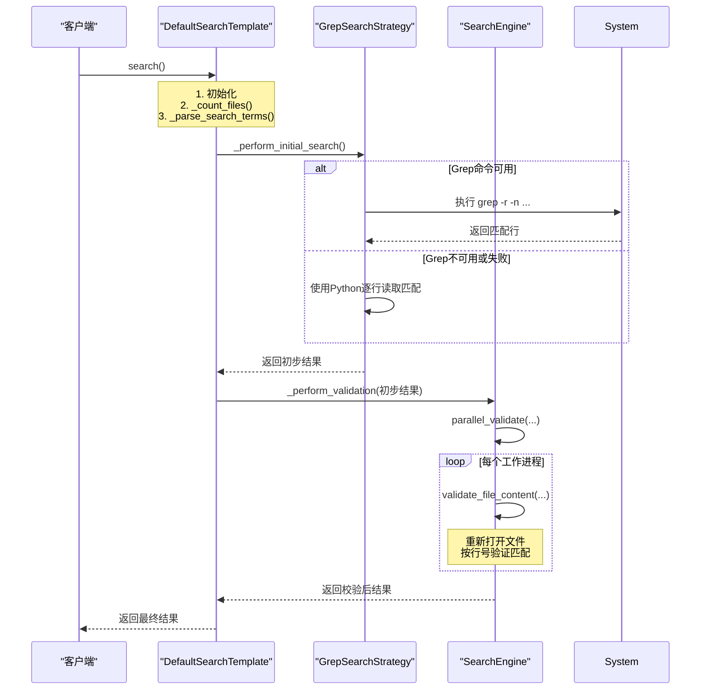

# SearchTemplate 搜索流程模板职责

<cite>
**Referenced Files in This Document **   
- [search_template.py](file://src/search_template.py)
- [strategies.py](file://src/strategies.py)
- [searcher.py](file://src/searcher.py)
- [search_factory.py](file://src/search_factory.py)
</cite>

## 目录
1. [SearchTemplate 抽象类与 DefaultSearchTemplate 实现](#searchtemplate-抽象类与-defaultsearchtemplate-实现)
2. [搜索流程骨架解析](#搜索流程骨架解析)
3. [_default_search 中的策略调用机制](#_default_search-中的策略调用机制)
4. _perform_validation 与 parallel_validate 集成分析
5. [组件交互序列图](#组件交互序列图)

## SearchTemplate 抽象类与 DefaultSearchTemplate 实现

`SearchTemplate` 是一个抽象基类，它定义了代码搜索流程的通用结构和算法骨架。该类采用模板方法模式（Template Method Pattern），将不变的搜索流程封装在 `search()` 方法中，同时将可变的具体实现步骤（如创建搜索策略、执行二次校验）延迟到子类中通过抽象方法来完成。

`DefaultSearchTemplate` 类继承自 `SearchTemplate`，提供了这些抽象方法的具体实现。它实现了 `_create_search_strategy()` 方法以返回默认的搜索策略，并实现了 `_perform_validation()` 方法以启用并行的二次校验功能。这种设计使得核心搜索逻辑保持稳定，而具体的搜索和验证行为可以灵活替换。

**Section sources**
- [search_template.py](file://src/search_template.py#L17-L189)

## 搜索流程骨架解析

`SearchTemplate` 的 `search()` 方法严格定义了搜索操作的执行顺序，构成了整个流程的骨架：

1.  **初始化与日志记录**: 记录搜索开始信息，包括搜索词和仓库路径。
2.  **文件计数**: 调用 `_count_files()` 方法，递归遍历指定仓库路径下的所有文件，并根据配置（忽略目录、文件后缀）过滤，计算出最终需要分析的文件总数。
3.  **搜索词解析**: 调用 `_parse_search_terms()` 方法，将用户输入的字符串（可能包含逗号分隔的多个关键词）解析为列表或单个字符串。
4.  **初步搜索**: 调用 `_perform_initial_search()` 方法，使用由 `_create_search_strategy()` 创建的策略对象对所有文件进行快速扫描，找出所有潜在匹配项。
5.  **二次校验决策**: 如果配置启用了 `validate` 标志，则进入下一步；否则直接返回初步搜索结果。
6.  **二次校验**: 调用抽象方法 `_perform_validation()`，对初步搜索的结果进行精确性校验。
7.  **结果返回**: 返回最终的搜索结果列表。

这个骨架确保了无论使用何种具体实现，搜索流程都遵循一致的步骤，保证了程序的健壮性和可预测性。

**Section sources**
- [search_template.py](file://src/search_template.py#L30-L100)

## _default_search 中的策略调用机制

`_perform_initial_search()` 方法是模板方法模式中“钩子”方法的关键体现。它本身不直接实现搜索逻辑，而是通过其内部持有的 `strategy` 对象来委托实际的搜索工作。

`strategy` 对象是在 `SearchTemplate` 的构造函数中，通过调用抽象方法 `_create_search_strategy()` 来创建的。这正是策略模式（Strategy Pattern）的应用点。`DefaultSearchTemplate` 重写了此方法，通过 `SearchStrategyFactory.create_default_strategy()` 工厂方法返回一个 `GrepSearchStrategy` 实例。

因此，当 `_perform_initial_search()` 执行时，它会调用 `self.strategy.search(...)`。如果 `strategy` 是 `GrepSearchStrategy`，则会尝试执行系统级的 `grep` 命令进行高效搜索；如果 `grep` 不可用或失败，则会回退到 `PythonSearchStrategy`，使用纯 Python 代码逐行读取和匹配文件内容。这种设计允许在运行时动态地选择和替换不同的搜索算法，而无需修改 `SearchTemplate` 的核心流程。

**Section sources**
- [search_template.py](file://src/search_template.py#L130-L138)
- [strategies.py](file://src/strategies.py#L73-L232)
- [search_factory.py](file://src/search_factory.py#L30-L51)

### _perform_validation 与 parallel_validate 集成分析

`_perform_validation()` 方法是 `SearchTemplate` 定义的另一个抽象方法，用于对初步搜索的结果进行精确性校验。`DefaultSearchTemplate` 提供了其具体实现。

该实现首先从 `searcher` 模块导入 `parallel_validate` 函数，然后将其作为主要的校验手段。`parallel_validate` 函数接收初步搜索得到的 `matched_results`、原始的 `search_terms` 和正则表达式标志等参数。

`parallel_validate` 的核心是一个 `ProcessPoolExecutor`，它利用多进程并行地对每个匹配文件的内容进行重新验证。对于每一个文件和每一个搜索词，它都会提交一个任务给线程池。`validate_file_content` 函数负责打开文件，根据行号定位到匹配行，并再次检查该行是否确实包含搜索词（或符合正则表达式）。这一步至关重要，因为它可以消除因编码问题、特殊字符或初步搜索工具（如 `grep`）的误报而导致的假阳性结果。

通过集成 `parallel_validate`，`DefaultSearchTemplate` 确保了最终输出的搜索结果具有极高的准确性，即使在处理大型代码库时也能保持良好的性能。

**Section sources**
- [search_template.py](file://src/search_template.py#L170-L178)
- [searcher.py](file://src/searcher.py#L233-L291)

## 组件交互序列图

**Diagram sources **
- [search_template.py](file://src/search_template.py#L30-L189)
- [strategies.py](file://src/strategies.py#L73-L232)
- [searcher.py](file://src/searcher.py#L233-L291)