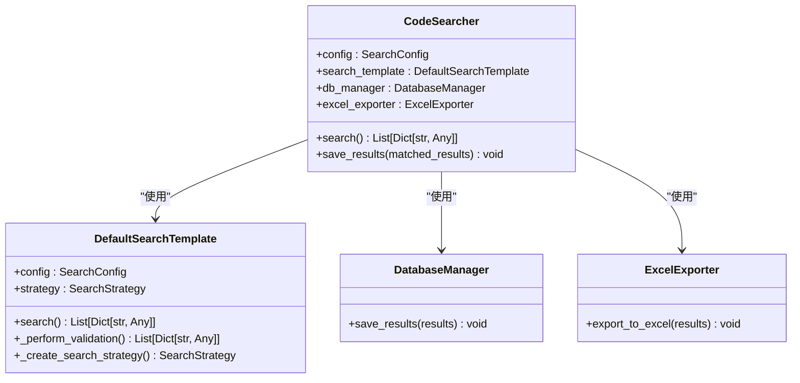
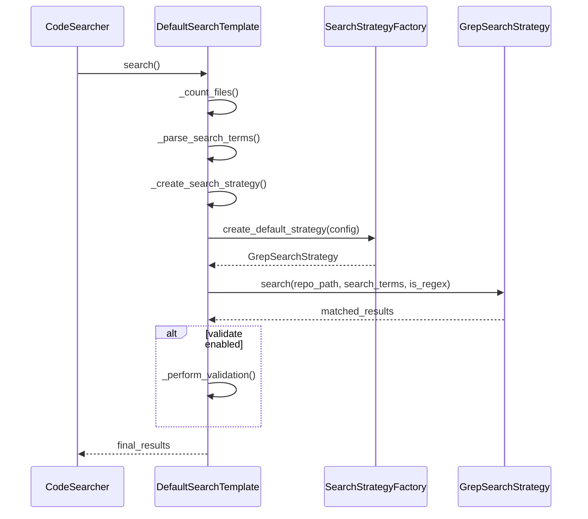
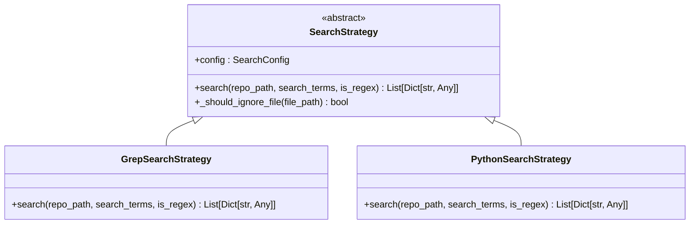
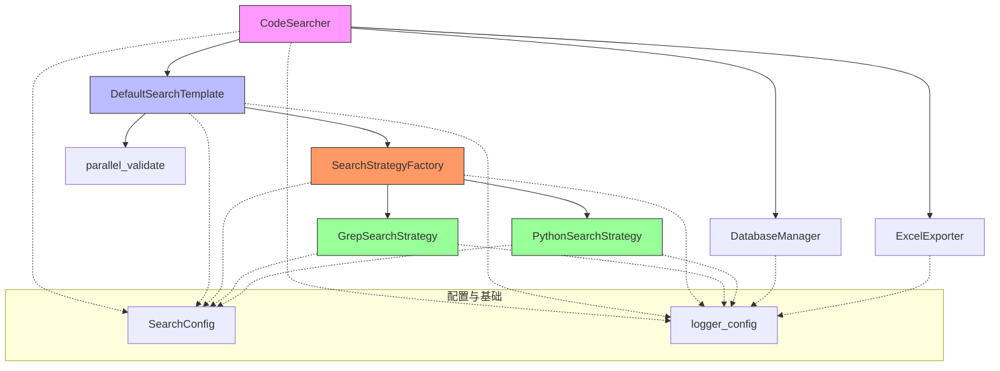

# 模块职责划分

<cite>
**Referenced Files in This Document**   
- [code_searcher.py](file://src/code_searcher.py)
- [search_template.py](file://src/search_template.py)
- [strategies.py](file://src/strategies.py)
- [search_factory.py](file://src/search_factory.py)
- [config.py](file://src/config.py)
</cite>

## 目录
1. [核心模块概述](#核心模块概述)
2. [CodeSearcher主控制器分析](#codesearcher主控制器分析)
3. [SearchTemplate模板方法解析](#searchtemplate模板方法解析)
4. [SearchStrategy策略模式实现](#searchstrategy策略模式实现)
5. [SearchStrategyFactory工厂模式分析](#searchstrategyfactory工厂模式分析)
6. [组件协作关系图](#组件协作关系图)

## 核心模块概述

Hello-Scan-Code项目采用面向对象设计模式构建了一个高效、可扩展的代码搜索系统。该系统由多个核心模块组成，各模块通过清晰的职责划分和松耦合的设计实现了灵活的代码搜索功能。

系统主要包含以下核心组件：
- **CodeSearcher**: 主控制器，负责协调整个搜索流程
- **SearchTemplate**: 抽象模板类，定义搜索流程的通用结构
- **SearchStrategy**: 策略接口，定义不同搜索算法的统一契约
- **SearchStrategyFactory**: 工厂类，负责解耦策略对象的创建过程

这些模块共同构成了一个分层架构，每一层都有明确的职责边界，确保了系统的可维护性和可扩展性。

**Section sources**
- [code_searcher.py](file://src/code_searcher.py#L18-L61)
- [search_template.py](file://src/search_template.py#L17-L166)
- [strategies.py](file://src/strategies.py#L18-L70)
- [search_factory.py](file://src/search_factory.py#L14-L51)

## CodeSearcher主控制器分析

`CodeSearcher`类作为系统的主控制器，承担着整合和协调各个功能模块的核心职责。它通过依赖注入的方式接收配置对象，并初始化所需的组件实例。

该类的主要职责包括：
1. **组件初始化**: 在构造函数中初始化搜索模板、数据库管理器和Excel导出器等关键组件
2. **流程协调**: 通过`search()`方法启动搜索流程，调用模板方法执行实际搜索
3. **结果持久化**: 通过`save_results()`方法将搜索结果同时保存到数据库和Excel文件中

`CodeSearcher`类通过组合模式将复杂的搜索逻辑委托给`DefaultSearchTemplate`实例处理，自身仅关注高层级的流程控制和结果管理，体现了单一职责原则。

**Diagram sources**
- [code_searcher.py](file://src/code_searcher.py#L18-L61)
- [search_template.py](file://src/search_template.py#L169-L189)

**Section sources**
- [code_searcher.py](file://src/code_searcher.py#L18-L61)

## SearchTemplate模板方法解析

`SearchTemplate`抽象类采用了模板方法设计模式，定义了代码搜索的完整流程框架，同时允许子类在特定步骤上进行定制化实现。

搜索流程的模板方法包含以下几个关键步骤：

### 搜索流程步骤
1. **文件计数**: `_count_files()`方法递归遍历指定目录，统计需要分析的文件数量
2. **初步搜索**: `_perform_initial_search()`方法调用具体的搜索策略执行首次匹配
3. **二次校验**: `_perform_validation()`抽象方法由子类实现，用于对初步结果进行验证
4. **结果返回**: 整合所有步骤的结果并返回最终的匹配列表

`DefaultSearchTemplate`作为默认实现，提供了完整的流程支持：
- 使用`SearchStrategyFactory`创建默认的Grep搜索策略
- 实现了基于多进程的并行验证机制来提高校验效率
- 继承了父类的模板方法，确保流程的一致性

这种设计模式的优势在于将不变的流程框架与可变的具体实现分离，使得新增搜索流程变体变得简单而安全。

**Diagram sources**
- [search_template.py](file://src/search_template.py#L17-L189)

**Section sources**
- [search_template.py](file://src/search_template.py#L17-L189)

## SearchStrategy策略模式实现

`SearchStrategy`接口及其实现类展示了策略设计模式的应用，为系统提供了多种搜索算法的选择能力。

### 策略接口定义
`SearchStrategy`抽象基类定义了所有搜索策略必须实现的统一接口：
- `search()`方法：执行实际的搜索操作，返回匹配结果列表
- `_should_ignore_file()`方法：判断是否应该忽略特定文件（如版本控制目录或缓存文件）

### 具体策略实现
系统提供了两种具体的搜索策略实现：

#### GrepSearchStrategy
- **算法特点**: 利用系统自带的`grep`命令进行高效文本搜索
- **优势**: 性能优异，特别适合大型代码库的快速搜索
- **容错机制**: 当系统缺少`grep`命令时，自动降级到Python实现
- **参数优化**: 支持正则表达式、文件类型过滤和目录排除等高级选项

#### PythonSearchStrategy
- **算法特点**: 纯Python实现的递归文件遍历和字符串匹配
- **优势**: 跨平台兼容性好，不依赖外部工具
- **实现方式**: 使用`glob`模块遍历文件系统，逐行读取并匹配内容
- **异常处理**: 妥善处理编码错误和权限问题，确保搜索过程的稳定性

两种策略共享相同的接口，可以在运行时根据配置灵活切换，体现了开闭原则。

**Diagram sources**
- [strategies.py](file://src/strategies.py#L18-L232)

**Section sources**
- [strategies.py](file://src/strategies.py#L18-L232)

## SearchStrategyFactory工厂模式分析

`SearchStrategyFactory`类应用了工厂设计模式，有效地解耦了搜索策略对象的创建过程与使用过程。

### 工厂方法
该工厂提供了两个静态方法：
- `create_strategy(strategy_type, config)`: 根据指定的策略类型字符串创建相应的策略实例
- `create_default_strategy(config)`: 创建系统默认的Grep搜索策略实例

### 解耦优势
工厂模式带来了以下好处：
1. **创建逻辑集中化**: 所有策略对象的创建逻辑集中在工厂类中，便于维护和修改
2. **类型安全**: 通过枚举支持的策略类型，避免了直接实例化可能带来的错误
3. **扩展性**: 新增搜索策略时，只需在工厂中添加相应分支，不影响现有代码
4. **配置驱动**: 策略选择可以完全由配置文件决定，无需修改代码

工厂返回的策略实例会被注入到`DefaultSearchTemplate`中，供后续搜索流程使用，形成了完整的依赖链。

**Section sources**
- [search_factory.py](file://src/search_factory.py#L14-L51)

## 组件协作关系图

以下是Hello-Scan-Code系统各核心模块之间的协作关系全景图：

该图清晰地展示了系统的分层架构：
- **顶层**: `CodeSearcher`作为入口点，协调整体流程
- **中层**: `DefaultSearchTemplate`实现具体搜索逻辑，依赖工厂创建策略
- **底层**: 具体的搜索策略实现和辅助工具
- **基础设施**: 配置管理和日志服务贯穿各层

各模块之间通过明确定义的接口进行通信，确保了低耦合和高内