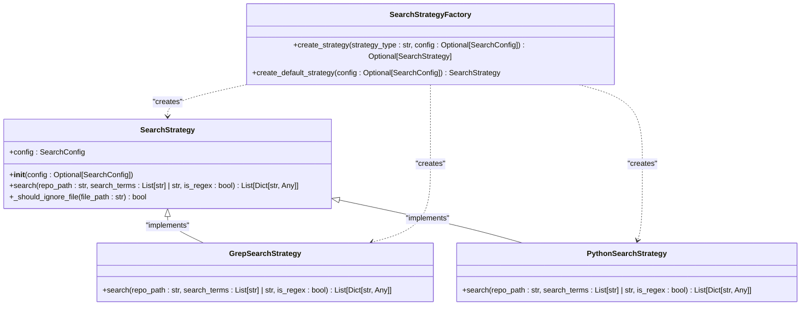
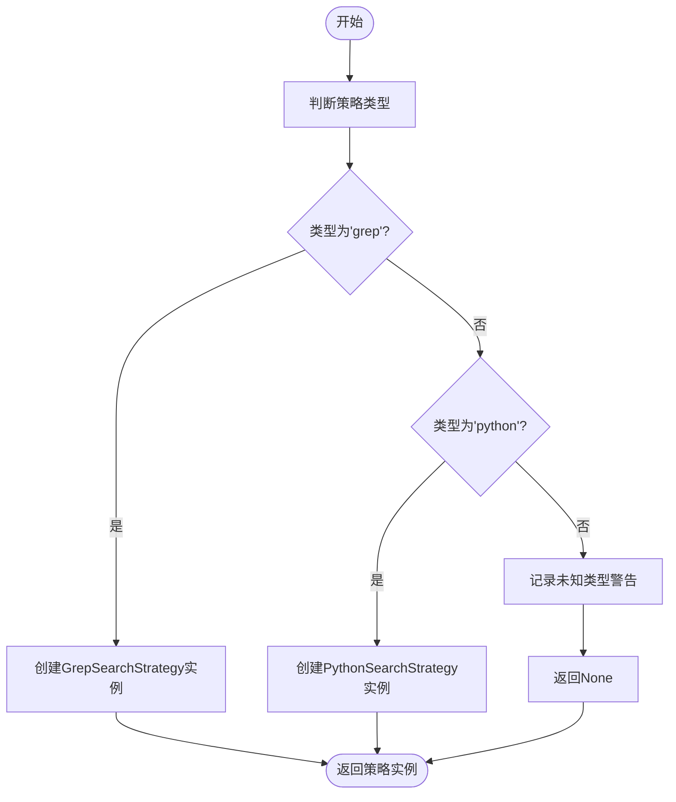
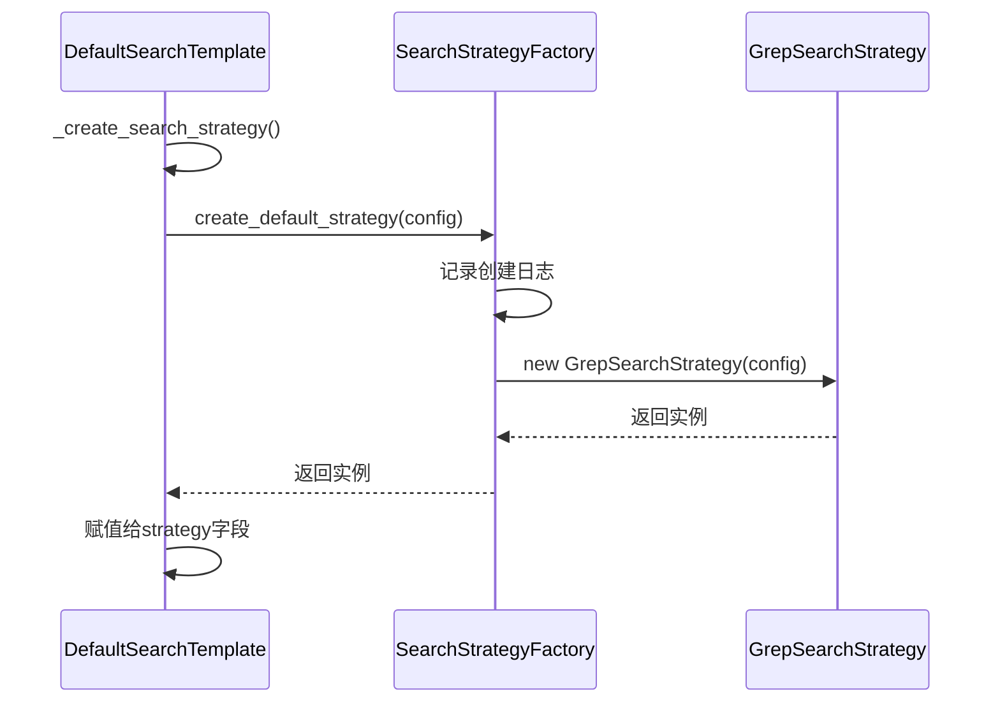
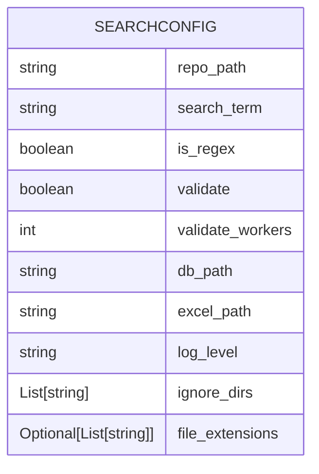
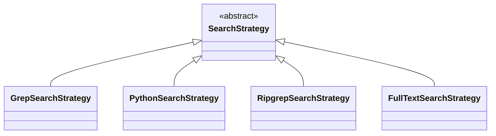
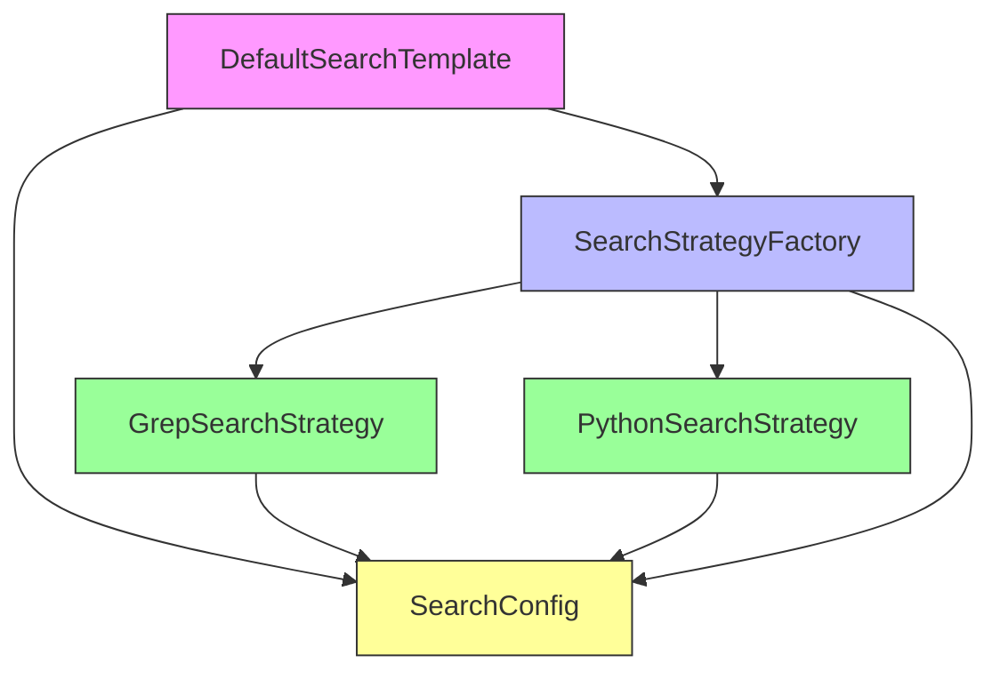

# 工厂模式

<cite>
**Referenced Files in This Document**   
- [search_factory.py](file://src/search_factory.py)
- [strategies.py](file://src/strategies.py)
- [search_template.py](file://src/search_template.py)
- [config.py](file://src/config.py)
</cite>

## 目录
1. [工厂模式概述](#工厂模式概述)
2. [核心组件分析](#核心组件分析)
3. [SearchStrategyFactory 类详解](#searchstrategyfactory-类详解)
4. [策略对象创建流程](#策略对象创建流程)
5. [配置驱动的对象创建](#配置驱动的对象创建)
6. [开闭原则的实际应用](#开闭原则的实际应用)
7. [依赖关系分析](#依赖关系分析)

## 工厂模式概述

工厂模式是一种创建型设计模式，用于封装对象的创建过程。在本系统中，`SearchStrategyFactory` 类作为搜索策略的创建中心，通过静态方法统一管理不同搜索算法实例的创建。该模式有效降低了客户端代码与具体策略实现之间的耦合度，使得系统能够灵活应对未来新增的搜索算法需求。

**Section sources**
- [search_factory.py](file://src/search_factory.py#L14-L51)

## 核心组件分析

系统中的核心组件包括搜索策略抽象基类、具体策略实现以及策略工厂。这些组件共同构成了基于工厂模式的搜索策略创建体系。

**Diagram sources**
- [strategies.py](file://src/strategies.py#L18-L232)
- [search_factory.py](file://src/search_factory.py#L14-L51)

**Section sources**
- [strategies.py](file://src/strategies.py#L18-L232)
- [search_factory.py](file://src/search_factory.py#L14-L51)

## SearchStrategyFactory 类详解

`SearchStrategyFactory` 是一个静态工厂类，负责创建不同类型的搜索策略对象。该类提供了两个主要的静态方法：`create_strategy` 和 `create_default_strategy`。

### create_strategy 方法

该方法根据传入的策略类型字符串和配置对象创建相应的搜索策略实例。支持 'grep' 和 'python' 两种策略类型，对于未知类型会返回 None 并记录警告日志。

### create_default_strategy 方法

该方法创建默认的搜索策略（Grep 策略），无需指定策略类型参数，简化了默认场景下的使用。

**Diagram sources**
- [search_factory.py](file://src/search_factory.py#L18-L37)
- [search_factory.py](file://src/search_factory.py#L40-L51)

**Section sources**
- [search_factory.py](file://src/search_factory.py#L14-L51)

## 策略对象创建流程

搜索策略对象的创建遵循特定的调用链路，从模板类到工厂类再到具体策略实现。

**Diagram sources**
- [search_template.py](file://src/search_template.py#L185-L189)
- [search_factory.py](file://src/search_factory.py#L40-L51)
- [strategies.py](file://src/strategies.py#L73-L171)

**Section sources**
- [search_template.py](file://src/search_template.py#L185-L189)
- [search_factory.py](file://src/search_factory.py#L40-L51)

## 配置驱动的对象创建

系统通过配置对象驱动搜索策略的创建过程，实现了灵活的运行时行为控制。

### 配置结构

**Diagram sources**
- [config.py](file://src/config.py#L6-L36)

**Section sources**
- [config.py](file://src/config.py#L6-L36)

### 创建流程集成

`DefaultSearchTemplate` 类在其 `_create_search_strategy` 方法中调用工厂的 `create_default_strategy` 方法，并将配置对象传递给工厂，从而实现配置驱动的策略创建。这种设计使得策略的行为完全由配置决定，而不需要修改创建逻辑本身。

## 开闭原则的实际应用

工厂模式在此系统中的应用完美体现了开闭原则（对扩展开放，对修改关闭）。

### 扩展性分析

当需要新增搜索算法（如 ripgrep、全文索引）时，只需：

1. 创建新的策略类继承 `SearchStrategy` 抽象基类
2. 在 `SearchStrategyFactory.create_strategy` 方法中添加新的类型判断分支

这种设计确保了现有代码无需修改即可支持新功能，同时保持了系统的稳定性和可维护性。

**Diagram sources**
- [strategies.py](file://src/strategies.py#L18-L232)

**Section sources**
- [strategies.py](file://src/strategies.py#L18-L232)

## 依赖关系分析

系统各组件之间存在清晰的依赖关系，工厂模式起到了解耦的关键作用。

**Diagram sources**
- [search_template.py](file://src/search_template.py#L169-L189)
- [search_factory.py](file://src/search_factory.py#L14-L51)
- [strategies.py](file://src/strategies.py#L18-L232)
- [config.py](file://src/config.py#L6-L36)

**Section sources**
- [search_template.py](file://src/search_template.py#L169-L189)
- [search_factory.py](file://src/search_factory.py#L14-L51)
- [strategies.py](file://src/strategies.py#L18-L232)
- [config.py](file://src/config.py#L6-L36)