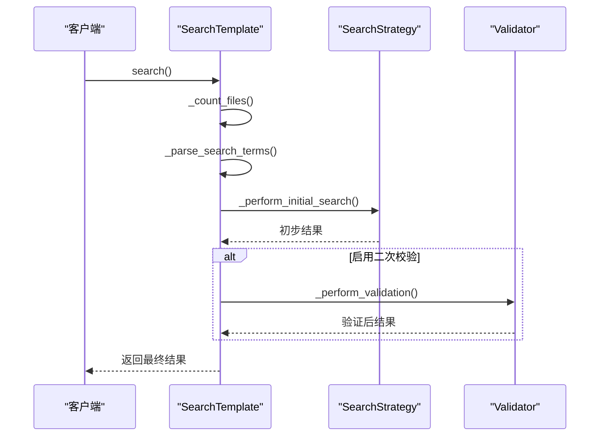
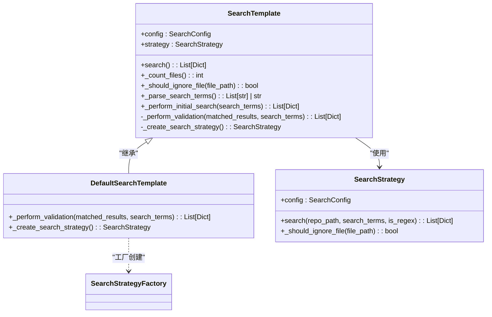

# 模板方法模式

<cite>
**Referenced Files in This Document**   
- [search_template.py](file://src/search_template.py)
- [strategies.py](file://src/strategies.py)
- [search_factory.py](file://src/search_factory.py)
- [searcher.py](file://src/searcher.py)
</cite>

## 目录
1. [模板方法模式概述](#模板方法模式概述)
2. [核心组件分析](#核心组件分析)
3. [调用流程解析](#调用流程解析)
4. [UML类图](#uml类图)
5. [设计优势与可维护性](#设计优势与可维护性)

## 模板方法模式概述

模板方法模式是一种行为设计模式，它在抽象基类中定义了一个算法的骨架，并将一些步骤延迟到子类中实现。这种模式允许子类在不改变算法结构的情况下重新定义算法的某些特定步骤。

在本项目中，`SearchTemplate` 抽象类定义了代码搜索的完整流程框架，包括文件计数、初步搜索和二次校验等关键步骤。该模式确保了所有搜索操作遵循统一的执行流程，同时通过抽象方法为具体实现提供了灵活性。

**Section sources**
- [search_template.py](file://src/search_template.py#L17-L166)

## 核心组件分析

### SearchTemplate 抽象类

`SearchTemplate` 类作为模板方法模式的核心，定义了搜索流程的通用骨架。其主要职责包括：

- **初始化配置**：接收 `SearchConfig` 对象并创建相应的搜索策略
- **定义算法流程**：通过 `search()` 方法组织整个搜索过程
- **提供默认实现**：如 `_count_files()` 和 `_perform_initial_search()` 等具体方法
- **声明抽象方法**：要求子类必须实现 `_create_search_strategy()` 和 `_perform_validation()`

该类通过将不变的流程控制逻辑封装在模板方法中，而将可变的行为交由子类扩展，实现了算法结构的稳定性和行为的可扩展性。

### DefaultSearchTemplate 具体实现

`DefaultSearchTemplate` 是 `SearchTemplate` 的具体实现类，展示了如何继承和扩展模板类的功能：

- 实现 `_create_search_strategy()` 方法，使用工厂模式创建默认的 Grep 搜索策略
- 重写 `_perform_validation()` 方法，调用并行验证功能进行二次校验
- 继承父类的所有公共流程控制逻辑，无需重复实现

这种设计使得新的搜索需求可以通过创建不同的子类来满足，而不需要修改现有的代码结构。

**Section sources**
- [search_template.py](file://src/search_template.py#L169-L189)
- [search_factory.py](file://src/search_factory.py#L40-L51)
- [searcher.py](file://src/searcher.py#L233-L275)

## 调用流程解析

**Diagram sources**
- [search_template.py](file://src/search_template.py#L30-L70)
- [search_template.py](file://src/search_template.py#L72-L90)
- [search_template.py](file://src/search_template.py#L132-L142)

当客户端调用 `search()` 方法时，首先执行文件计数和搜索词解析等预处理步骤，然后委托给具体的搜索策略执行初步搜索。如果启用了二次校验功能，则会进一步调用验证方法对初步结果进行精确匹配确认。

## UML类图

**Diagram sources**
- [search_template.py](file://src/search_template.py#L17-L189)
- [strategies.py](file://src/strategies.py#L17-L232)
- [search_factory.py](file://src/search_factory.py#L17-L51)

该类图清晰地展示了模板方法模式的结构关系。`SearchTemplate` 定义了算法骨架，其中包含具体方法（如 `_count_files`）和抽象方法（如 `_perform_validation`）。`DefaultSearchTemplate` 通过继承扩展了父类的功能，而搜索策略则通过组合方式被注入到模板类中，体现了策略模式与模板方法模式的结合使用。

## 设计优势与可维护性

模板方法模式在此项目中的应用带来了显著的设计优势：

1. **代码复用性提升**：通用的搜索流程被集中定义在基类中，避免了在多个具体实现中重复编写相同的控制逻辑。

2. **可维护性增强**：当需要修改搜索流程的整体结构时，只需调整 `SearchTemplate` 类即可影响所有子类，降低了维护成本。

3. **扩展性良好**：新增不同类型的搜索需求时，只需创建新的子类并实现必要的抽象方法，符合开闭原则。

4. **算法一致性保证**：所有搜索操作都遵循相同的执行流程，确保了行为的一致性和可预测性。

5. **关注点分离**：将流程控制与具体实现分离，使代码结构更加清晰，便于理解和测试。

通过这种设计，系统既保持了核心算法的稳定性，又具备了足够的灵活性来应对不同的搜索场景需求。

**Section sources**
- [search_template.py](file://src/search_template.py#L17-L189)
- [strategies.py](file://src/strategies.py#L17-L232)