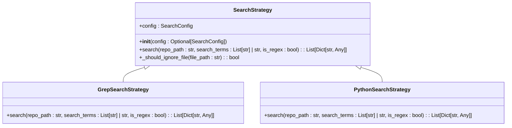
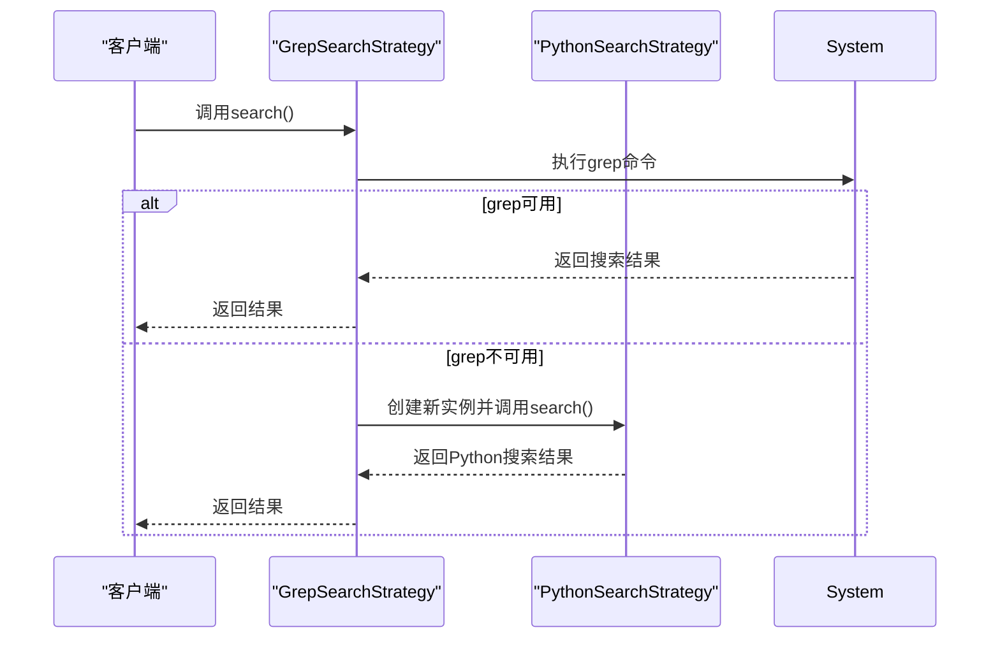

# 策略模式

<cite>
**Referenced Files in This Document **   
- [strategies.py](file://src/strategies.py)
- [search_factory.py](file://src/search_factory.py)
- [search_template.py](file://src/search_template.py)
- [searcher.py](file://src/searcher.py)
</cite>

## Table of Contents
1. [引言](#引言)
2. [核心组件分析](#核心组件分析)
3. [策略模式架构设计](#策略模式架构设计)
4. [搜索算法实现差异](#搜索算法实现差异)
5. [运行时策略切换机制](#运行时策略切换机制)
6. [多关键词与正则匹配处理](#多关键词与正则匹配处理)
7. [文件过滤逻辑](#文件过滤逻辑)
8. [系统灵活性与可扩展性](#系统灵活性与可扩展性)

## 引言
本文档详细阐述了策略模式在搜索算法切换中的工程实践。通过分析`SearchStrategy`抽象基类如何定义统一的搜索接口，以及`GrepSearchStrategy`和`PythonSearchStrategy`如何分别实现基于外部命令和纯Python的两种搜索算法，展示了该设计模式如何有效解耦算法使用与实现。文档还将说明运行时如何根据环境条件自动降级（如grep不可用时切换至Python实现），并解释这种架构如何提升系统的灵活性和可扩展性。

## 核心组件分析
本系统的核心是策略模式的实现，主要由`SearchStrategy`抽象基类及其两个具体实现类构成。这些组件共同协作，提供了灵活的搜索功能。

**Section sources**
- [strategies.py](file://src/strategies.py#L18-L232)
- [search_factory.py](file://src/search_factory.py#L14-L51)

## 策略模式架构设计
系统采用经典的策略模式设计，将搜索算法的定义与使用分离。`SearchStrategy`作为抽象基类，定义了所有搜索策略必须实现的统一接口。该类继承自`ABC`（Abstract Base Class），确保了子类必须实现关键方法。

**Diagram sources **
- [strategies.py](file://src/strategies.py#L18-L70)

**Section sources**
- [strategies.py](file://src/strategies.py#L18-L70)

## 搜索算法实现差异
两种搜索策略在实现方式上存在显著差异，体现了策略模式的优势：相同的接口下可以有完全不同的内部实现。

### Grep搜索策略
`GrepSearchStrategy`利用系统自带的`grep`命令进行高效搜索。它通过`subprocess.run`调用外部命令，构建包含递归搜索、行号显示、正则表达式支持等选项的完整命令行。这种方法充分利用了操作系统级别的优化，通常比纯Python实现更快。

### Python搜索策略
`PythonSearchStrategy`则采用纯Python实现，不依赖任何外部工具。它使用`glob`模块递归遍历文件系统，对每个文件逐行读取并检查是否包含搜索词。这种方式虽然可能较慢，但具有更好的跨平台兼容性和可控性。

**Diagram sources **
- [strategies.py](file://src/strategies.py#L73-L171)
- [strategies.py](file://src/strategies.py#L174-L232)

**Section sources**
- [strategies.py](file://src/strategies.py#L73-L232)

## 运行时策略切换机制
系统实现了智能的运行时策略切换机制，确保在不同环境下都能正常工作。当`GrepSearchStrategy`尝试执行`grep`命令时，如果捕获到`FileNotFoundError`异常（表示系统中未安装grep工具），会自动降级到`PythonSearchStrategy`。

这一过程发生在`GrepSearchStrategy.search`方法中，通过异常处理机制实现无缝切换。这种设计使得系统既能在支持`grep`的环境中获得高性能，又能在不支持的环境中保持功能完整性，体现了良好的容错性和适应性。

**Diagram sources **
- [strategies.py](file://src/strategies.py#L76-L171)

**Section sources**
- [strategies.py](file://src/strategies.py#L76-L171)

## 多关键词与正则匹配处理
两种策略都支持多关键词搜索和正则表达式匹配，但在实现细节上有所不同。

对于多关键词处理，两种策略都将输入的搜索词转换为列表格式，然后对每个关键词单独执行搜索操作。`GrepSearchStrategy`会对每个关键词发起一次独立的`grep`命令调用，而`PythonSearchStrategy`则在内存中对每个文件的每一行依次检查所有关键词。

在正则表达式支持方面，`GrepSearchStrategy`通过添加`-E`参数启用`grep`的扩展正则表达式功能，而`PythonSearchStrategy`则直接使用Python标准库中的`re`模块进行匹配。

**Section sources**
- [strategies.py](file://src/strategies.py#L76-L171)
- [strategies.py](file://src/strategies.py#L177-L232)

## 文件过滤逻辑
两种策略共享相同的文件过滤逻辑，通过`_should_ignore_file`方法实现。该方法检查文件路径是否包含在忽略目录列表中，以及文件扩展名是否符合配置要求。

`GrepSearchStrategy`在构建`grep`命令时，会将忽略目录和文件类型限制作为命令行参数传递给`grep`，让外部工具直接处理过滤。而`PythonSearchStrategy`则在遍历文件系统时，在代码层面进行过滤判断，跳过不符合条件的文件。

**Section sources**
- [strategies.py](file://src/strategies.py#L45-L70)

## 系统灵活性与可扩展性
策略模式的应用极大地提升了系统的灵活性和可扩展性。通过将算法实现与使用分离，系统可以在不修改客户端代码的情况下引入新的搜索算法。

工厂模式的结合进一步增强了这一优势，`SearchStrategyFactory`可以根据配置或运行时条件动态创建合适的策略实例。这种设计不仅支持当前的`grep`和`Python`两种实现，还为未来添加其他搜索算法（如使用`ripgrep`或其他专用搜索工具）提供了清晰的扩展路径。

此外，模板方法模式与策略模式的组合使用，通过`SearchTemplate`类定义了搜索流程的骨架，而将具体的搜索算法实现委托给策略对象，形成了高度模块化和可维护的架构。

**Section sources**
- [search_factory.py](file://src/search_factory.py#L14-L51)
- [search_template.py](file://src/search_template.py#L17-L189)