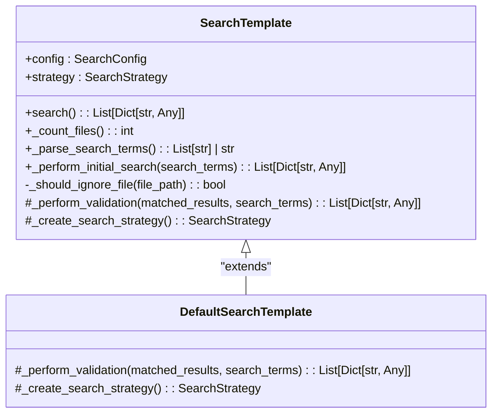
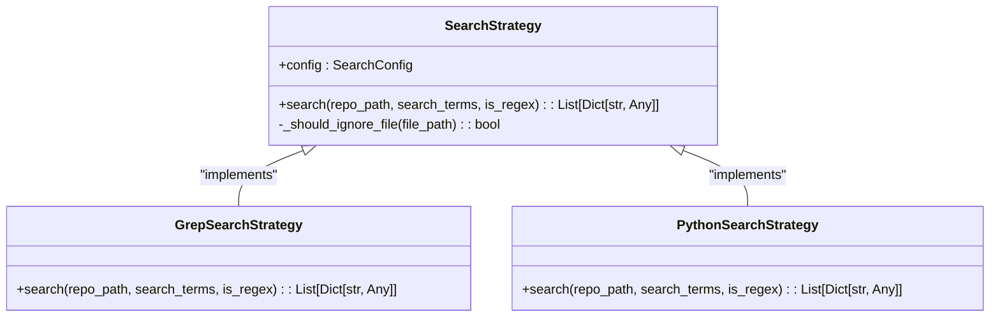
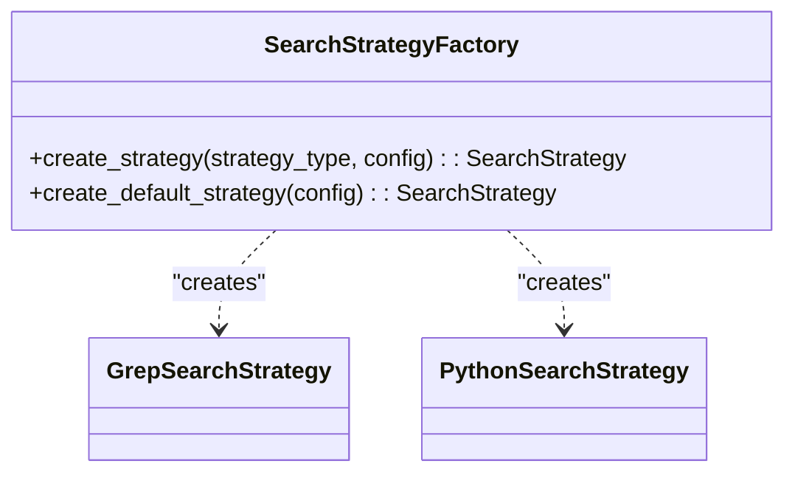
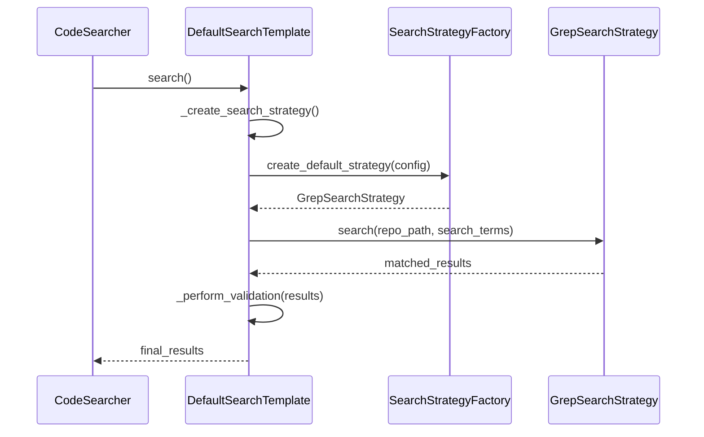

# 设计模式应用

<cite>
**Referenced Files in This Document**   
- [search_template.py](file://src/search_template.py)
- [strategies.py](file://src/strategies.py)
- [search_factory.py](file://src/search_factory.py)
- [config.py](file://src/config.py)
- [code_searcher.py](file://src/code_searcher.py)
</cite>

## 目录
1. [引言](#引言)
2. [模板方法模式](#模板方法模式)
3. [策略模式](#策略模式)
4. [工厂模式](#工厂模式)
5. [设计模式协同工作](#设计模式协同工作)
6. [工程价值与可维护性](#工程价值与可维护性)

## 引言

本项目通过三种关键设计模式——模板方法模式、策略模式和工厂模式，构建了一个灵活且可扩展的代码搜索系统。这些设计模式共同解决了搜索流程标准化、算法灵活性和对象创建复杂性等核心问题。系统以`SearchTemplate`定义搜索骨架，通过`SearchStrategy`支持多种搜索算法，并利用`SearchStrategyFactory`统一管理策略实例的创建。这种架构不仅提升了代码的可维护性和可测试性，还为未来扩展新的搜索功能提供了清晰的结构基础。

## 模板方法模式

模板方法模式在本项目中通过`SearchTemplate`抽象类实现，它定义了代码搜索的整体流程骨架，同时允许子类扩展特定步骤。该模式的核心在于将不变的搜索流程（如日志记录、文件计数、结果处理）与可变的验证逻辑分离，确保所有搜索实现遵循统一的执行顺序。

**Diagram sources**
- [search_template.py](file://src/search_template.py#L17-L189)

`SearchTemplate`的`search()`方法作为模板方法，按固定顺序调用一系列步骤：初始化日志、计算待分析文件数量、解析搜索词、执行初步搜索，最后根据配置决定是否进行二次校验。其中，`_perform_validation()`和`_create_search_strategy()`被声明为抽象方法，强制子类提供具体实现。`DefaultSearchTemplate`作为默认实现，重写了这两个方法，使用并行验证器`parallel_validate`进行二次校验，并通过工厂创建默认的Grep搜索策略。这种设计使得新增搜索类型时只需继承`SearchTemplate`并实现必要的钩子方法，而无需重复编写通用流程代码。

**Section sources**
- [search_template.py](file://src/search_template.py#L17-L189)

## 策略模式

策略模式通过`SearchStrategy`抽象基类和其具体实现类，实现了不同搜索算法的解耦，使系统能够在运行时动态切换搜索方式。该模式将具体的搜索算法封装在独立的类中，客户端代码仅依赖于抽象接口，从而提高了系统的灵活性和可扩展性。

**Diagram sources**
- [strategies.py](file://src/strategies.py#L18-L232)

`SearchStrategy`定义了`search()`方法的统一接口，接受仓库路径、搜索词和正则标志作为参数，返回标准化的匹配结果列表。`GrepSearchStrategy`利用系统`grep`命令执行高效搜索，通过构建命令行参数来支持递归搜索、行号显示、目录排除和文件类型过滤。当`grep`不可用或超时时，它会自动降级到`PythonSearchStrategy`。后者使用纯Python实现，通过`glob`模块遍历文件系统，并逐行读取文件内容进行字符串或正则匹配。两种策略共享`_should_ignore_file()`方法来过滤忽略目录和文件后缀，体现了代码复用。客户端代码（如`SearchTemplate`）通过`self.strategy.search()`调用，完全无需知晓底层是哪种算法在执行，这正是策略模式带来的解耦优势。

**Section sources**
- [strategies.py](file://src/strategies.py#L18-L232)

## 工厂模式

工厂模式由`SearchStrategyFactory`实现，它封装了搜索策略对象的创建逻辑，将客户端与具体类的实例化过程解耦。该模式通过静态方法提供一个统一的接口来创建不同类型的搜索策略，简化了对象创建过程，并集中了创建逻辑，便于管理和修改。

**Diagram sources**
- [search_factory.py](file://src/search_factory.py#L14-L51)

`SearchStrategyFactory`提供了两个静态方法：`create_strategy()`根据传入的字符串类型（'grep'或'python'）创建相应的策略实例；`create_default_strategy()`则专门用于创建默认的`GrepSearchStrategy`。工厂内部通过简单的条件判断完成实例化，并注入配置对象。这种方法的优势在于，如果未来需要添加新的搜索策略（如`RipgrepSearchStrategy`），只需在工厂中增加一个分支，而所有调用`create_strategy()`的地方都无需修改。此外，工厂可以集中处理创建过程中的共性逻辑，如日志记录（当前已实现）和错误处理，避免了在多个地方重复相同的代码。

**Section sources**
- [search_factory.py](file://src/search_factory.py#L14-L51)

## 设计模式协同工作

三种设计模式在系统中紧密协作，形成一个高效且灵活的搜索引擎。`CodeSearcher`作为高层组件，持有`SearchTemplate`的引用，启动搜索流程。`SearchTemplate`在其初始化过程中，通过`SearchStrategyFactory`获取`SearchStrategy`实例，然后在`search()`模板方法中协调整个流程。

**Diagram sources**
- [code_searcher.py](file://src/code_searcher.py#L21-L37)
- [search_template.py](file://src/search_template.py#L20-L28)
- [search_factory.py](file://src/search_factory.py#L40-L51)

序列图展示了这一协作过程：`CodeSearcher`调用`DefaultSearchTemplate`的`search()`方法。模板首先通过`_create_search_strategy()`调用工厂的`create_default_strategy()`来获取`GrepSearchStrategy`实例。随后，模板调用该策略的`search()`方法执行初步搜索。如果配置启用验证，则调用`_perform_validation()`进行二次校验。整个流程中，`CodeSearcher`对底层策略的具体实现完全透明，只与`SearchTemplate`交互，这得益于模板方法和策略模式提供的抽象层。工厂模式则确保了策略对象的创建是可控且一致的。

**Section sources**
- [code_searcher.py](file://src/code_searcher.py#L21-L37)
- [search_template.py](file://src/search_template.py#L20-L28)
- [search_factory.py](file://src/search_factory.py#L40-L51)

## 工程价值与可维护性

这三种设计模式的应用显著提升了项目的工程价值和可维护性。首先，**可维护性**得到增强：修改或添加新的搜索算法只需在`strategies.py`中实现`SearchStrategy`接口，无需改动`SearchTemplate`或`CodeSearcher`中的任何现有代码，符合开闭原则。其次，**可测试性**提高：由于各组件高度解耦，可以独立地对`GrepSearchStrategy`或`PythonSearchStrategy`进行单元测试，模拟输入并验证输出，而无需启动整个搜索流程。再者，**灵活性**体现在运行时可以根据环境（如是否有`grep`命令）或性能需求选择最优策略。最后，**可扩展性**允许轻松集成新功能，例如，可以创建一个新的`ValidationStrategy`来替代硬编码的`parallel_validate`，进一步提升系统的模块化程度。这种基于设计模式的架构为项目的长期演进奠定了坚实的基础。