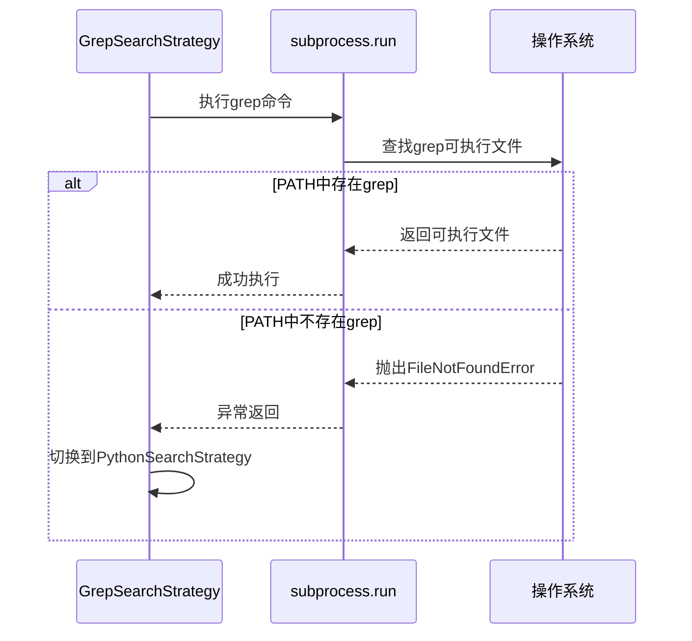
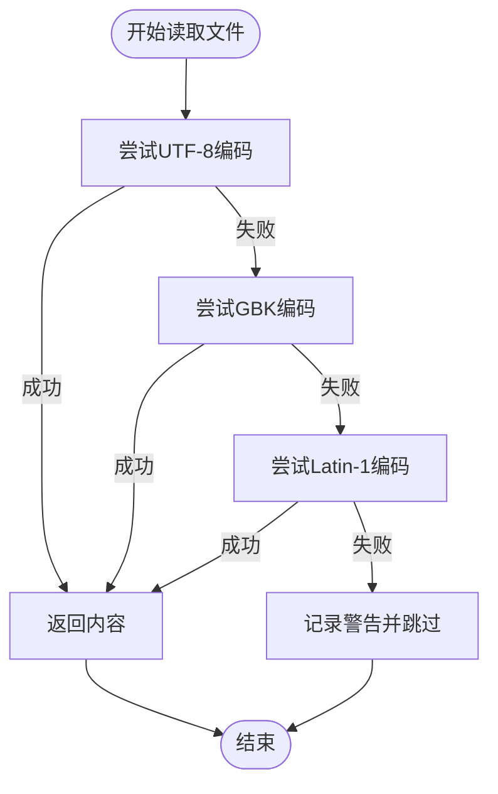
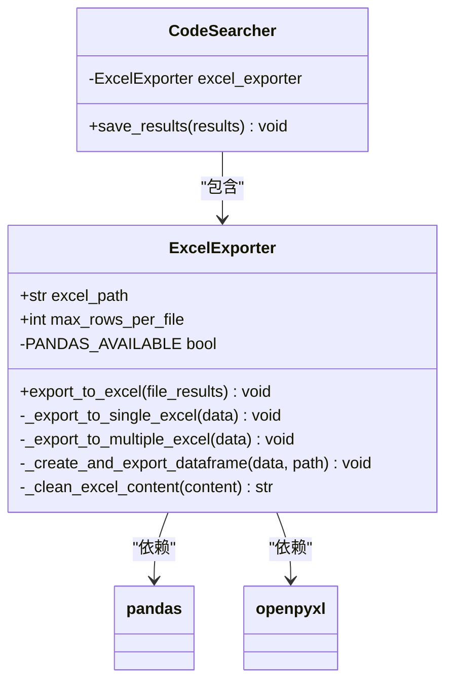
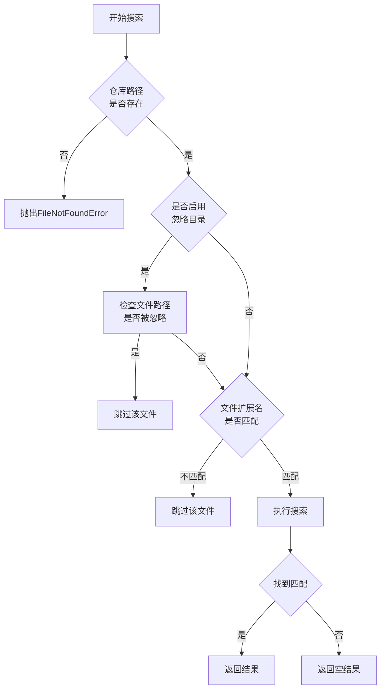

# 故障排查与常见问题

<cite>
**Referenced Files in This Document**   
- [code_searcher.py](file://src/code_searcher.py)
- [exporter.py](file://src/exporter.py)
- [logger_config.py](file://src/logger_config.py)
- [searcher.py](file://src/searcher.py)
- [strategies.py](file://src/strategies.py)
- [database.py](file://src/database.py)
- [search_template.py](file://src/search_template.py)
</cite>

## 目录
1. [引言](#引言)
2. [常见问题及解决方案](#常见问题及解决方案)
   - [grep命令未找到](#grep命令未找到)
   - [文件编码错误导致崩溃](#文件编码错误导致崩溃)
   - [大文件导出失败](#大文件导出失败)
   - [搜索结果为空](#搜索结果为空)
3. [日志诊断指南](#日志诊断指南)
4. [总结](#总结)

## 引言

本手册旨在为使用代码扫描工具的用户提供一份实用的故障排除指南。通过分析系统架构和核心组件，我们识别出常见的运行时问题，并提供根本原因分析和具体解决方案。本文档基于对`Hello-Scan-Code`项目的全面分析，涵盖从搜索执行到结果导出的完整流程。

**Section sources**
- [code_searcher.py](file://src/code_searcher.py#L18-L61)
- [search_template.py](file://src/search_template.py#L10-L189)

## 常见问题及解决方案

### grep命令未找到

#### 问题描述
在执行代码搜索时，系统无法找到`grep`命令，导致回退到纯Python实现，影响搜索性能。

#### 根本原因分析
该问题是由于系统环境变量`PATH`中未包含`grep`可执行文件路径所致。当`GrepSearchStrategy`尝试调用`subprocess.run()`执行`grep`命令时，会抛出`FileNotFoundError`异常。



**Diagram sources**
- [strategies.py](file://src/strategies.py#L76-L171)
- [searcher.py](file://src/searcher.py#L50-L85)

**Section sources**
- [strategies.py](file://src/strategies.py#L76-L171)
- [searcher.py](file://src/searcher.py#L50-L85)

#### 解决方案
1. **Windows系统**: 安装Git for Windows或Cygwin，它们都包含`grep`工具并会自动配置到系统`PATH`
2. **Linux/Mac系统**: 确保已安装`grep`包（通常默认已安装）
3. **通用方案**: 在系统环境变量`PATH`中添加`grep`可执行文件的目录路径

### 文件编码错误导致崩溃

#### 问题描述
在处理非UTF-8编码的源文件时，程序可能因`UnicodeDecodeError`而中断执行。

#### 根本原因分析
系统默认尝试以`utf-8`编码读取所有文件。当遇到GBK、Latin-1等其他编码格式的文件时，会触发解码异常。虽然系统有异常处理机制，但若未正确处理多种编码格式，可能导致部分文件被错误跳过或程序崩溃。



**Diagram sources**
- [searcher.py](file://src/searcher.py#L100-L141)
- [strategies.py](file://src/strategies.py#L177-L232)

**Section sources**
- [searcher.py](file://src/searcher.py#L100-L141)
- [strategies.py](file://src/strategies.py#L177-L232)

#### 解决方案
1. **增强编码检测**: 使用`chardet`库自动检测文件编码
2. **扩展编码支持**: 在`validate_file_content`方法中增加更多常见编码格式的尝试顺序
3. **配置化编码列表**: 将支持的编码列表作为配置项，允许用户根据项目特点自定义

### 大文件导出失败

#### 问题描述
当搜索结果数据量过大时，导出到Excel文件可能失败或生成无法打开的损坏文件。

#### 根本原因分析
Excel文件有单个工作表最多1,048,576行的限制。当匹配结果超过此限制或接近内存容量时，会导致导出失败。此外，pandas和openpyxl库需要正确安装才能支持Excel操作。



**Diagram sources**
- [exporter.py](file://src/exporter.py#L10-L149)
- [code_searcher.py](file://src/code_searcher.py#L18-L61)

**Section sources**
- [exporter.py](file://src/exporter.py#L10-L149)
- [code_searcher.py](file://src/code_searcher.py#L18-L61)

#### 解决方案
1. **分片导出**: 启用分片导出功能，将大数据集拆分为多个文件
2. **安装依赖**: 确保已安装`pandas`和`openpyxl`库：`pip install pandas openpyxl`
3. **调整配置**: 修改`max_rows_per_file`参数以适应实际需求
4. **清理特殊字符**: 自动清理可能导致Excel错误的特殊字符（如\\、/、?、*等）

### 搜索结果为空

#### 问题描述
执行搜索后返回空结果，即使目标内容确实存在于代码库中。

#### 根本原因分析
可能的原因包括：
- 搜索路径配置错误
- 忽略目录设置过于宽泛
- 文件扩展名过滤限制
- 正则表达式语法错误
- 二次校验过程中的误过滤



**Diagram sources**
- [code_searcher.py](file://src/code_searcher.py#L25-L37)
- [strategies.py](file://src/strategies.py#L50-L65)
- [search_template.py](file://src/search_template.py#L100-L120)

**Section sources**
- [code_searcher.py](file://src/code_searcher.py#L25-L37)
- [strategies.py](file://src/strategies.py#L50-L65)
- [search_template.py](file://src/search_template.py#L100-L120)

#### 解决方案
1. **验证配置**: 检查`repo_path`配置项是否指向正确的代码仓库路径
2. **调整忽略规则**: 审查`ignore_dirs`配置，确保没有误忽略目标目录
3. **放宽文件类型限制**: 检查`file_extensions`配置，必要时允许更多文件类型
4. **关闭二次校验**: 临时禁用`validate`选项以确定是否为校验过程导致的问题
5. **检查正则表达式**: 验证正则表达式语法是否正确，避免因语法错误导致无匹配

## 日志诊断指南

### 开启详细日志

建议在排查问题时开启详细日志记录，可通过修改`logger_config.py`中的日志级别为`DEBUG`来实现：

```python
logger.add(
    sys.stderr,
    level="DEBUG",  # 修改为DEBUG级别
    format="{time:YYYY-MM-DD HH:mm:ss} | {level: <8} | {message}"
)
```

**Section sources**
- [logger_config.py](file://src/logger_config.py#L1-L24)

### 典型错误日志解读

#### grep命令缺失日志
```
WARNING  未找到grep命令，将使用纯Python实现搜索
```
这表明系统未能找到`grep`命令，已自动切换到Python实现的搜索策略。虽然功能不受影响，但搜索速度会显著降低。

#### 编码错误日志
```
WARNING  读取文件 src/main.java 时出错 (编码: utf-8): UnicodeDecodeError
```
这表示系统在尝试以UTF-8编码读取指定文件时失败。应检查该文件的实际编码格式，并考虑添加相应的编码支持。

#### 导出失败日志
```
ERROR  导出到Excel时出错: Pandas is not installed
```
这说明缺少必要的依赖库。需要安装`pandas`和`openpyxl`来支持Excel导出功能。

#### 数据库错误日志
```
ERROR  保存结果到数据库时出错: database is locked
```
这通常是由于多个进程同时访问数据库导致的锁冲突。建议检查是否有其他实例正在运行，或实现适当的锁机制。

**Section sources**
- [searcher.py](file://src/searcher.py#L75-L85)
- [exporter.py](file://src/exporter.py#L25-L57)
- [database.py](file://src/database.py#L80-L81)

## 总结

本故障排查手册系统地分析了代码扫描工具的常见问题，并提供了针对性的解决方案。关键要点包括：
- 确保系统环境包含必要的外部工具（如`grep`）
- 正确处理多种文件编码格式以避免读取错误
- 合理配置大文件导出策略防止内存溢出
- 仔细检查搜索配置以避免结果遗漏
- 充分利用日志系统进行问题诊断

通过遵循这些指导原则，用户可以有效解决大多数运行时问题，确保代码扫描工具稳定高效地运行。

**Section sources**
- [code_searcher.py](file://src/code_searcher.py#L18-L61)
- [exporter.py](file://src/exporter.py#L10-L149)
- [logger_config.py](file://src/logger_config.py#L1-L24)