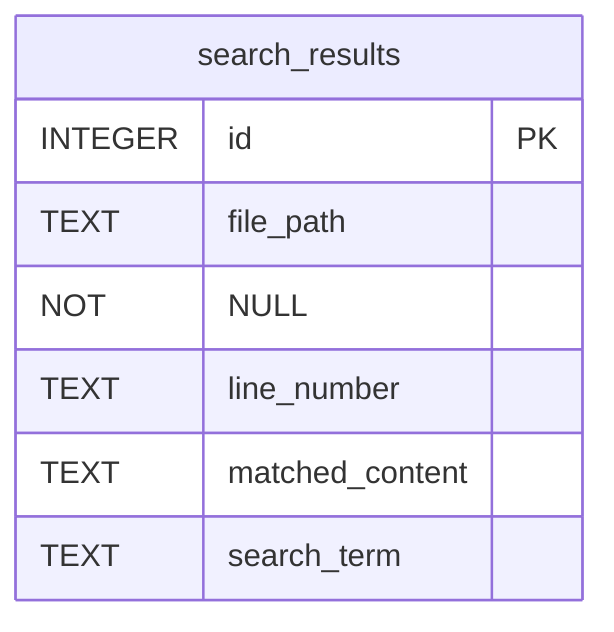

# 数据库 Schema 设计

<cite>
**Referenced Files in This Document**   
- [database.py](file://src/database.py)
</cite>

## 目录
1. [简介](#简介)
2. [核心数据模型](#核心数据模型)
3. [表结构定义](#表结构定义)
4. [索引优化策略](#索引优化策略)
5. [数据填充示例](#数据填充示例)
6. [未来扩展方向](#未来扩展方向)

## 简介
本项目通过 `DatabaseManager` 类实现对搜索结果的持久化存储，其核心是 `search_results` 表的设计与管理。该表用于记录代码扫描过程中发现的所有匹配项，为后续的结果分析、导出和查询提供基础支持。

**Section sources**
- [database.py](file://src/database.py#L1-L10)

## 核心数据模型

`search_results` 表是整个系统的核心数据存储单元，负责保存所有文件中与搜索条件匹配的内容。该表由 `DatabaseManager.init_database` 方法在程序启动时创建，并通过 `save_results` 方法进行数据写入。



**Diagram sources**
- [database.py](file://src/database.py#L20-L30)

**Section sources**
- [database.py](file://src/database.py#L12-L46)

## 表结构定义

`search_results` 表包含五个关键字段，每个字段都有明确的数据类型和约束条件：

### 字段详细说明

| 字段名 | 数据类型 | 约束条件 | 说明 |
|-------|--------|---------|------|
| **id** | INTEGER | PRIMARY KEY AUTOINCREMENT | 主键，自增唯一标识符 |
| **file_path** | TEXT | NOT NULL | 匹配内容所在的文件路径 |
| **line_number** | TEXT | (无) | 匹配内容所在的行号（文本类型以支持范围） |
| **matched_content** | TEXT | (无) | 实际匹配到的内容片段 |
| **search_term** | TEXT | (无) | 触发此次匹配的搜索关键词 |

#### CREATE TABLE 语句
```sql
CREATE TABLE IF NOT EXISTS search_results (
    id INTEGER PRIMARY KEY AUTOINCREMENT,
    file_path TEXT NOT NULL,
    line_number TEXT,
    matched_content TEXT,
    search_term TEXT
);
```

**Section sources**
- [database.py](file://src/database.py#L20-L30)

## 索引优化策略

为了提升基于文件路径的查询性能，系统创建了专门的索引：

```sql
CREATE INDEX IF NOT EXISTS idx_file_path ON search_results (file_path);
```

此索引 (`idx_file_path`) 针对 `file_path` 字段建立，主要作用包括：
- 显著加速按文件路径检索匹配结果的操作
- 支持高效的文件级结果聚合与统计
- 提升导出特定文件或目录下所有匹配项的速度
- 优化去重和结果分组操作的性能

**Section sources**
- [database.py](file://src/database.py#L33-L37)

## 数据填充示例

一条典型的 `search_results` 表记录可能如下所示：

| 字段 | 填充值 | 来源说明 |
|------|-------|----------|
| id | (自动生成) | 数据库自动分配的唯一ID |
| file_path | `/src/main.py` | 搜索到的文件完整路径 |
| line_number | `42` | 匹配内容位于第42行 |
| matched_content | `print("Hello World")` | 文件中实际匹配到的代码行 |
| search_term | `print` | 用户输入的搜索词 |

该记录由 `DatabaseManager.save_results` 方法根据搜索结果批量插入。

**Section sources**
- [database.py](file://src/database.py#L48-L81)

## 未来扩展方向

当前的 `search_results` 表设计简洁高效，但仍有以下潜在的扩展方向：

### 时间戳记录
可增加 `match_timestamp DATETIME` 字段，用于记录每次匹配发生的具体时间，便于进行趋势分析和审计追踪。

### 上下文信息增强
可增加 `context_lines_before` 和 `context_lines_after` 字段（TEXT类型），存储匹配行前后的若干行内容，提供更丰富的上下文信息。

### 结果分类
可增加 `category` 或 `tag` 字段，允许对搜索结果进行分类标记，支持更复杂的过滤和组织方式。

### 性能监控
可增加 `search_duration_ms` 字段，记录每次搜索耗时，用于性能监控和优化。

这些扩展可根据实际使用需求逐步引入，而不会破坏现有功能。

**Section sources**
- [database.py](file://src/database.py#L12-L81)