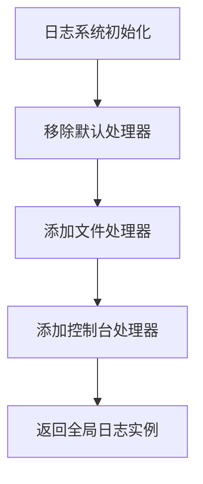
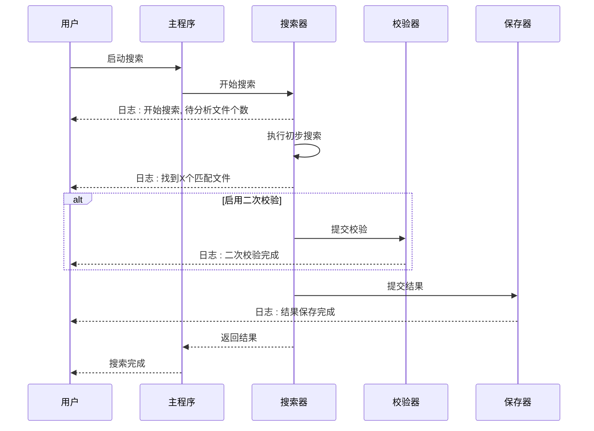

# 日志系统说明

<cite>
**Referenced Files in This Document**   
- [logger_config.py](file://src/logger_config.py)
- [main.py](file://src/main.py)
- [code_searcher.py](file://src/code_searcher.py)
- [search_template.py](file://src/search_template.py)
- [searcher.py](file://src/searcher.py)
- [database.py](file://src/database.py)
- [exporter.py](file://src/exporter.py)
</cite>

## 目录
1. [日志系统概述](#日志系统概述)
2. [日志配置方案](#日志配置方案)
3. [日志格式与级别设置](#日志格式与级别设置)
4. [控制台输出与文件存储](#控制台输出与文件存储)
5. [核心操作的日志记录点](#核心操作的日志记录点)
6. [日志分析与调试价值](#日志分析与调试价值)

## 日志系统概述

本项目采用 `loguru` 库构建日志系统，通过集中式配置实现统一的日志管理。日志系统贯穿整个代码搜索流程，从启动、搜索、校验到结果保存等关键环节均设有详细的日志记录点，为用户提供了完整的执行轨迹和调试信息。

日志系统的核心配置位于 `src/logger_config.py` 文件中，其他模块通过调用 `get_logger()` 函数获取全局日志实例，确保了日志行为的一致性。

**Section sources**
- [logger_config.py](file://src/logger_config.py#L0-L24)
- [main.py](file://src/main.py#L11-L11)

## 日志配置方案

日志系统的配置方案设计旨在满足开发调试和生产运行的双重需求。系统首先移除 `loguru` 的默认处理器，然后添加两个自定义处理器：一个用于文件存储，另一个用于控制台输出。

这种双通道设计使得用户既能实时查看关键信息（通过控制台），又能保留完整的执行历史（通过日志文件）以供后续分析。配置过程在应用启动时自动完成，无需在每个模块中重复设置。



**Diagram sources**
- [logger_config.py](file://src/logger_config.py#L0-L24)

**Section sources**
- [logger_config.py](file://src/logger_config.py#L0-L24)

## 日志格式与级别设置

### 日志格式

系统定义了两种不同的日志格式，分别用于文件存储和控制台输出：

- **文件日志格式**：包含时间戳、日志级别、源文件名、函数名、行号和消息内容，便于精确定位问题来源。
- **控制台日志格式**：简化显示，仅包含时间戳、日志级别和消息内容，保持输出清晰易读。

详细格式如下：
```
{time:YYYY-MM-DD HH:mm:ss} | {level: <8} | {name}:{function}:{line} - {message}
```

### 日志级别

系统统一使用 `INFO` 级别作为最低输出级别，这意味着所有 `INFO`、`WARNING`、`ERROR` 和 `CRITICAL` 级别的日志都会被记录。该级别设置平衡了信息量和噪音，既不会遗漏重要事件，也不会产生过多冗余信息。

**Section sources**
- [logger_config.py](file://src/logger_config.py#L0-L24)

## 控制台输出与文件滚动存储

### 控制台输出

系统通过 `sys.stderr` 添加了一个专门用于控制台输出的处理器。这种方式确保了日志信息能够实时显示在终端上，方便用户监控程序执行进度。

控制台输出采用简化的日志格式，突出显示关键信息，避免干扰用户的注意力。这对于长时间运行的搜索任务尤为重要，用户可以随时了解当前状态。

### 文件滚动存储

文件存储机制采用了先进的滚动策略，具体配置如下：

- **滚动大小**：当日志文件达到 500MB 时自动创建新文件
- **文件命名**：按日期命名（`code_search_YYYY-MM-DD.log`）
- **保留策略**：自动保留最近 10 天的日志文件
- **编码格式**：使用 UTF-8 编码，确保中文字符正确显示

这种配置有效防止了单个日志文件过大导致的性能问题，同时通过日期命名便于用户按时间查找特定日志。

```mermaid
classDiagram
class LoggerConfig {
+remove() void
+add(file_path) void
+add(sys.stderr) void
+get_logger() logger
}
class FileHandler {
+path : "logs/code_search_{time : YYYY-MM-DD}.log"
+rotation : "500 MB"
+retention : "10 days"
+encoding : "utf-8"
+format : "{time} | {level} | {name} : {function} : {line} - {message}"
}
class ConsoleHandler {
+stream : sys.stderr
+level : "INFO"
+format : "{time} | {level} | {message}"
}
LoggerConfig --> FileHandler : "添加"
LoggerConfig --> ConsoleHandler : "添加"
```

**Diagram sources**
- [logger_config.py](file://src/logger_config.py#L0-L24)

**Section sources**
- [logger_config.py](file://src/logger_config.py#L0-L24)

## 核心操作的日志记录点

### 开始搜索

当搜索任务启动时，系统会记录以下关键信息：
- 搜索开始时间
- 搜索关键词
- 仓库路径
- 待分析文件总数
- 是否启用正则表达式模式

这些信息帮助用户确认搜索参数是否正确，并对任务规模有直观认识。

**Section sources**
- [search_template.py](file://src/search_template.py#L30-L37)

### 初步结果统计

初步搜索完成后，系统会输出统计信息：
- 找到的匹配文件数量
- 总共的匹配行数
- 执行的 grep 命令（如果使用）

这些数据让用户快速评估搜索结果的规模，判断是否需要调整搜索条件。

**Section sources**
- [searcher.py](file://src/searcher.py#L45-L50)
- [strategies.py](file://src/strategies.py#L120-L125)

### 二次校验

如果启用了二次校验功能，系统会记录：
- 二次校验的启动
- 使用的工作进程数量
- 校验后的最终匹配文件数量

这有助于识别潜在的误报情况，并验证搜索结果的准确性。

**Section sources**
- [search_template.py](file://src/search_template.py#L70-L75)
- [searcher.py](file://src/searcher.py#L230-L235)

### 结果保存

结果保存阶段会产生以下日志：
- 数据库保存完成信息
- Excel 导出完成信息
- 保存的文件数量和记录条数

这些记录确认了结果持久化的成功，是搜索任务完成的重要标志。

**Section sources**
- [code_searcher.py](file://src/code_searcher.py#L60-L61)
- [database.py](file://src/database.py#L70-L75)
- [exporter.py](file://src/exporter.py#L55-L60)

## 日志分析与调试价值

### 判断搜索进度

通过观察日志的时间序列，用户可以清晰地跟踪搜索任务的执行进度：
1. **初始化阶段**：看到"开始搜索"日志
2. **执行阶段**：看到"执行grep命令"或"Python搜索找到"等日志
3. **校验阶段**：看到"二次校验完成"日志
4. **结束阶段**：看到"结果保存完成"日志

这种明确的状态转换让用户对长时间任务有良好的掌控感。

### 识别性能瓶颈

日志中的统计信息可以帮助识别性能问题：
- 如果"待分析文件个数"异常大，可能需要优化忽略目录设置
- 如果"Python搜索"耗时过长，建议安装 grep 工具提升性能
- 如果"二次校验"时间占比过高，可考虑减少工作进程数或关闭此功能



**Diagram sources**
- [main.py](file://src/main.py#L20-L50)
- [search_template.py](file://src/search_template.py#L30-L80)
- [code_searcher.py](file://src/code_searcher.py#L55-L61)

**Section sources**
- [main.py](file://src/main.py#L20-L50)
- [search_template.py](file://src/search_template.py#L30-L80)
- [code_searcher.py](file://src/code_searcher.py#L55-L61)

### 发现潜在错误

日志系统能够及时暴露各种异常情况：
- **路径不存在**：当指定的仓库路径不存在时，会立即记录错误并终止程序
- **编码异常**：读取文件时遇到编码问题会记录警告，但不会中断整体流程
- **工具缺失**：未找到 grep 命令时会降级到 Python 实现并给出提示
- **权限问题**：无法访问某些文件时会跳过并记录警告

这些详细的错误信息大大降低了排查问题的难度，使用户能够快速定位和解决配置或环境问题。

**Section sources**
- [code_searcher.py](file://src/code_searcher.py#L35-L38)
- [searcher.py](file://src/searcher.py#L150-L155)
- [strategies.py](file://src/strategies.py#L100-L105)