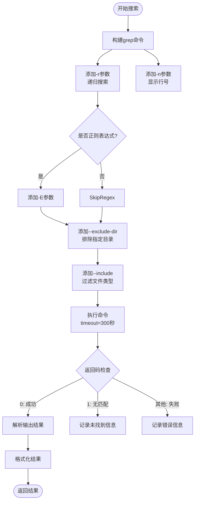
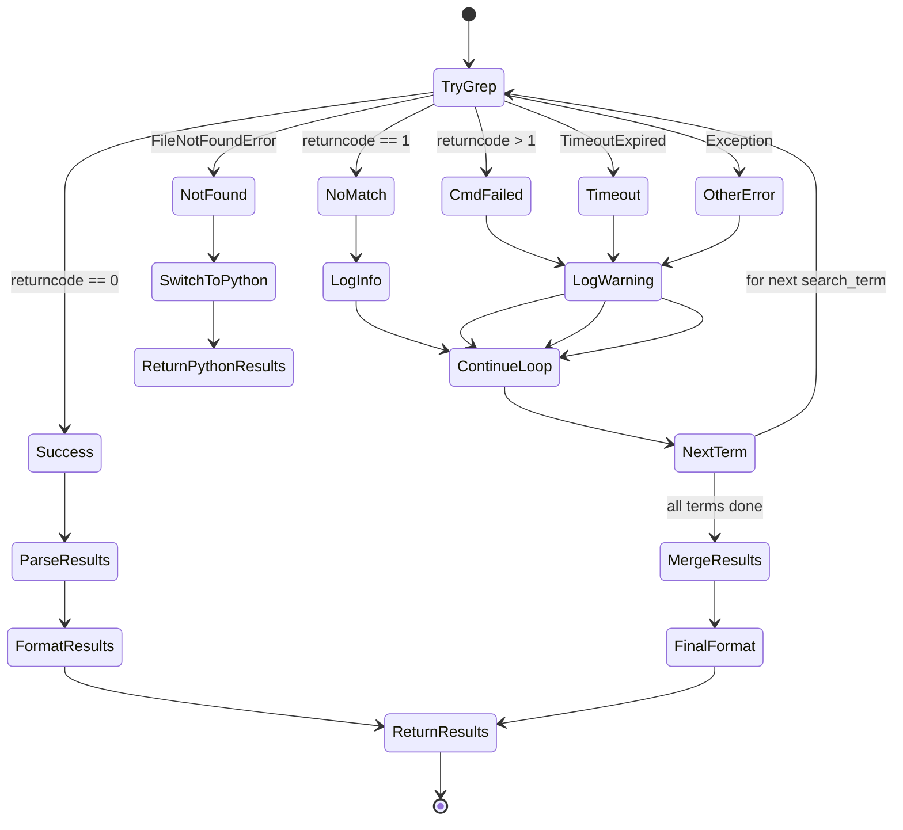
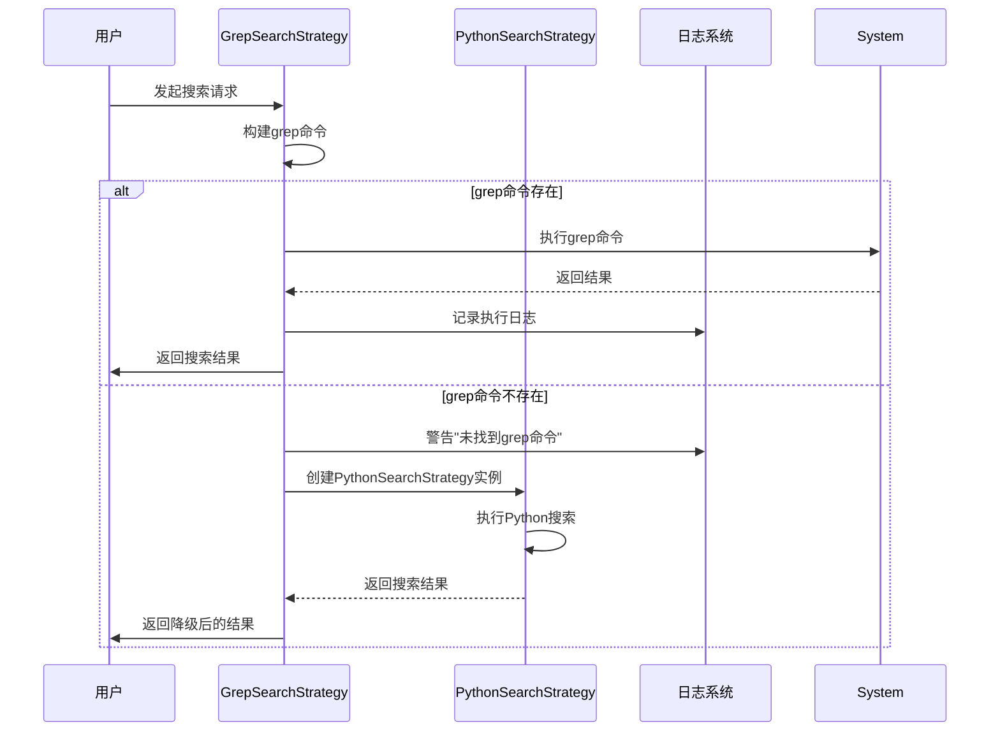

# grep加速与自动降级

<cite>
**Referenced Files in This Document**   
- [src/strategies.py](file://src/strategies.py)
- [src/searcher.py](file://src/searcher.py)
- [src/search_factory.py](file://src/search_factory.py)
- [src/logger_config.py](file://src/logger_config.py)
</cite>

## 目录
1. [Grep搜索策略实现](#grep搜索策略实现)
2. [命令构建与执行流程](#命令构建与执行流程)
3. [异常处理与容错机制](#异常处理与容错机制)
4. [自动降级到Python搜索](#自动降级到python搜索)
5. [性能对比分析](#性能对比分析)
6. [日志输出示例](#日志输出示例)

## Grep搜索策略实现

`GrepSearchStrategy` 类实现了基于系统 `grep` 命令的高效搜索功能，作为默认的搜索策略。该策略通过调用外部 `grep` 程序来利用其高度优化的文本搜索算法，从而显著提升大规模代码库的搜索速度。

该策略继承自抽象基类 `SearchStrategy`，遵循策略模式设计原则，允许在运行时动态切换不同的搜索算法。当配置为使用 'grep' 策略类型时，`SearchStrategyFactory` 工厂类会创建 `GrepSearchStrategy` 实例。

**Section sources**
- [src/strategies.py](file://src/strategies.py#L73-L88)
- [src/search_factory.py](file://src/search_factory.py#L20-L25)

## 命令构建与执行流程

`GrepSearchStrategy` 通过 `subprocess.run()` 方法构建并执行标准的 `grep` 命令行，充分利用了 `grep` 的递归搜索和行号显示功能。



**Diagram sources**
- [src/strategies.py](file://src/strategies.py#L90-L112)

### 命令参数说明

- **基础参数**: 使用 `-r`（递归）和 `-n`（显示行号）确保完整的结果信息
- **正则支持**: 当 `is_regex=True` 时，添加 `-E` 参数启用扩展正则表达式
- **目录排除**: 根据配置中的 `ignore_dirs` 列表，使用 `--exclude-dir` 排除特定目录（如 `.git`、`node_modules`）
- **文件过滤**: 根据配置中的 `file_extensions` 列表，使用 `--include` 限制搜索的文件类型

**Section sources**
- [src/strategies.py](file://src/strategies.py#L90-L112)

## 异常处理与容错机制

`GrepSearchStrategy` 实现了全面的异常处理机制，确保在各种异常情况下系统仍能稳定运行。



**Diagram sources**
- [src/strategies.py](file://src/strategies.py#L112-L153)

### 具体异常处理

1. **超时处理 (TimeoutExpired)**:
   - 设置了 300 秒的执行超时
   - 超时后记录警告日志，但不会中断整个搜索过程
   - 继续处理下一个搜索词或返回已有的部分结果

2. **命令未找到 (FileNotFoundError)**:
   - 当系统中没有安装 `grep` 命令时触发
   - 记录警告日志"未找到grep命令"
   - 立即降级到 `PythonSearchStrategy` 并返回其搜索结果

3. **命令执行失败**:
   - 检查 `returncode`：0 表示成功，1 表示无匹配，其他值表示错误
   - 对于非零且非一的返回码，记录 `stderr` 中的错误信息

4. **其他异常**:
   - 捕获所有其他可能的异常（如权限问题等）
   - 记录详细的错误信息以便调试

**Section sources**
- [src/strategies.py](file://src/strategies.py#L112-L153)

## 自动降级到Python搜索

当 `grep` 不可用或失败时，系统会无缝切换到纯 Python 实现的搜索策略，确保功能的连续性。



**Diagram sources**
- [src/strategies.py](file://src/strategies.py#L148-L152)
- [src/strategies.py](file://src/strategies.py#L174-L232)

### 降级机制特点

- **即时切换**: 一旦捕获到 `FileNotFoundError`，立即创建 `PythonSearchStrategy` 实例并调用其 `search` 方法
- **避免重复**: 在降级后直接返回 `PythonSearchStrategy` 的结果，跳出当前循环，防止对多个搜索词重复尝试 `grep`
- **配置继承**: 新创建的 `PythonSearchStrategy` 实例会继承原有的配置对象，确保搜索行为的一致性
- **透明性**: 对上层调用者而言，降级过程是完全透明的，始终返回统一格式的搜索结果

**Section sources**
- [src/strategies.py](file://src/strategies.py#L148-L152)

## 性能对比分析

两种搜索策略在性能上有显著差异，适用于不同场景。

| 特性 | Grep搜索策略 | Python搜索策略 |
|------|-------------|---------------|
| **执行速度** | 极快（C语言实现） | 较慢（解释型语言） |
| **资源消耗** | 低CPU，高I/O | 高CPU，中等I/O |
| **内存占用** | 低（流式处理） | 高（加载整文件） |
| **适用场景** | 大型代码库快速扫描 | 小型项目或grep不可用时 |
| **并发能力** | 单进程 | 可并行校验 |
| **编码处理** | 依赖系统locale | 支持多编码检测 |

**Table sources**
- [src/strategies.py](file://src/strategies.py#L73-L232)
- [src/searcher.py](file://src/searcher.py#L200-L291)

### 性能优势来源

1. **底层优化**: `grep` 是用 C 语言编写的，经过数十年的优化，具有极高的执行效率
2. **专用算法**: 使用了 Boyer-Moore 等高效的字符串搜索算法
3. **操作系统集成**: 直接与文件系统交互，减少了中间层开销
4. **流式处理**: 逐行处理文件内容，内存占用小

相比之下，`PythonSearchStrategy` 虽然较慢，但具有更好的可移植性和编码处理能力，特别是在处理中文等多字节字符时表现更稳定。

**Section sources**
- [src/strategies.py](file://src/strategies.py#L73-L232)

## 日志输出示例

以下是典型的日志输出，帮助用户理解底层执行过程：

```
2024-01-15 10:30:15 | INFO     | 执行grep命令: grep -r -n --exclude-dir .git --include *.py "hello" /path/to/repo
2024-01-15 10:30:16 | INFO     | grep搜索 'hello' 找到 3 个匹配文件，共 5 个匹配行
2024-01-15 10:30:16 | INFO     | grep总共找到 3 个匹配文件，共 5 个匹配行

2024-01-15 10:35:20 | WARNING