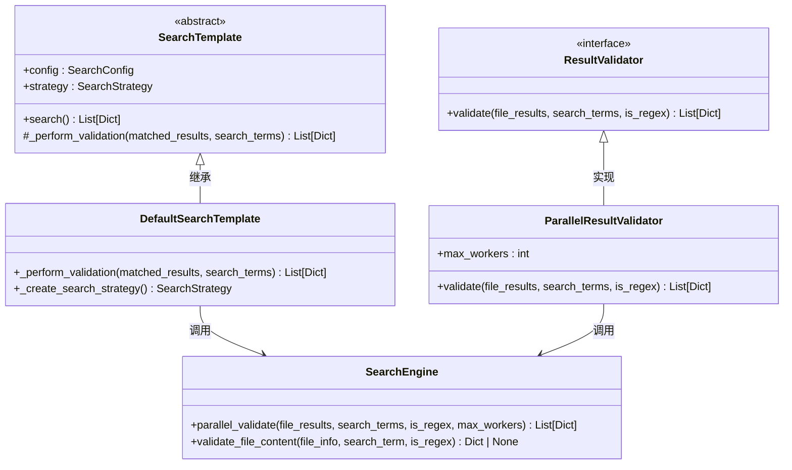
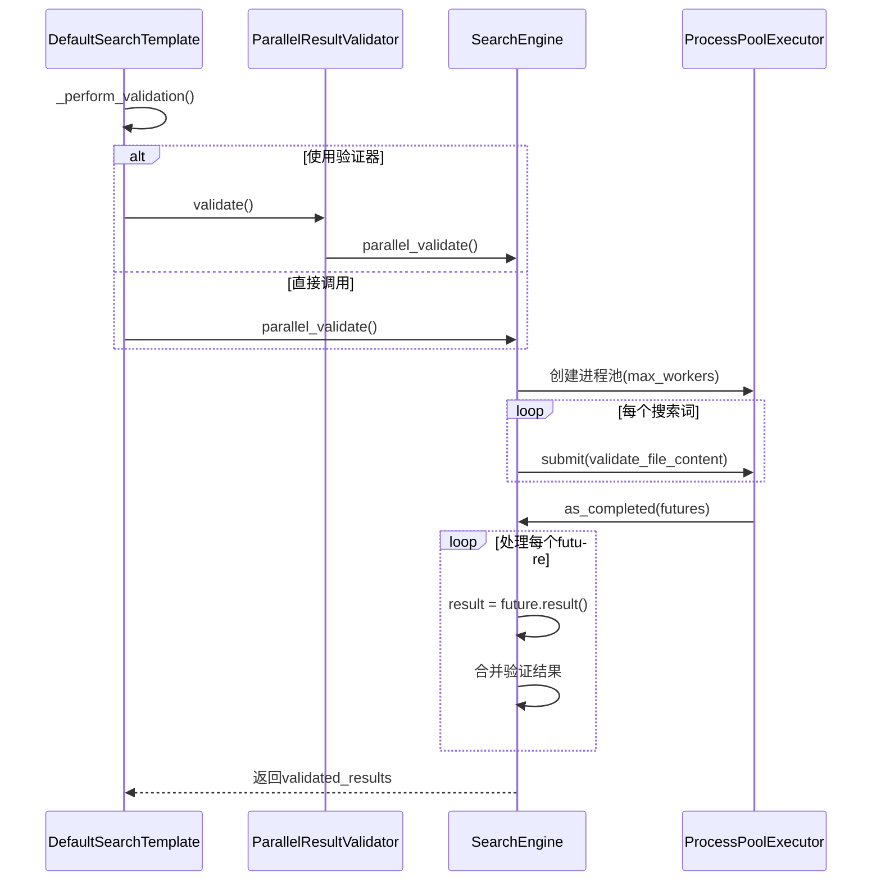
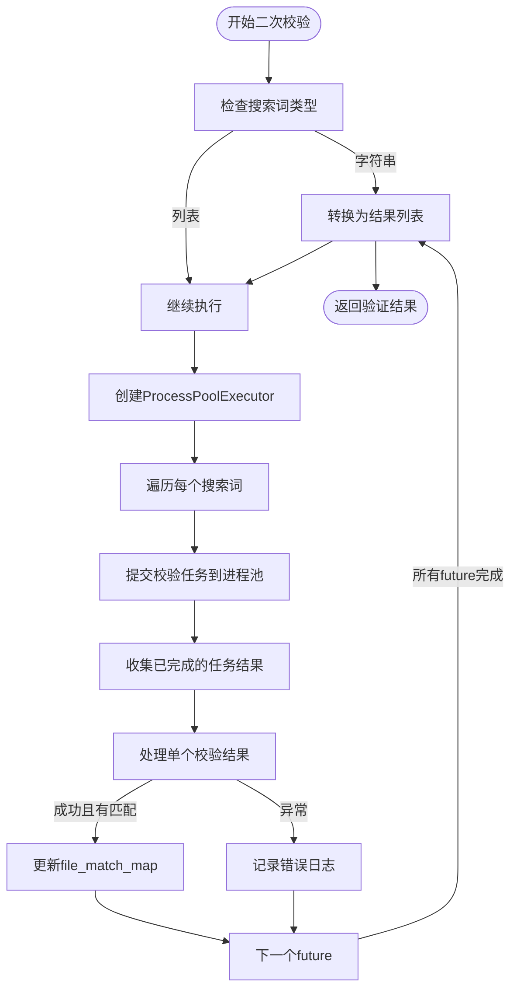
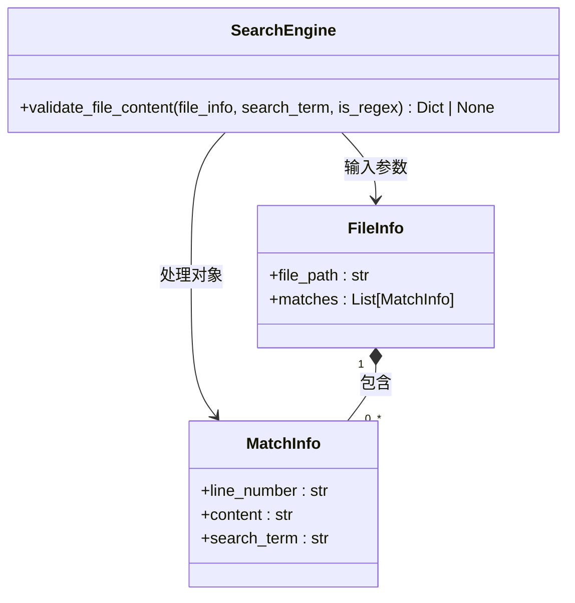
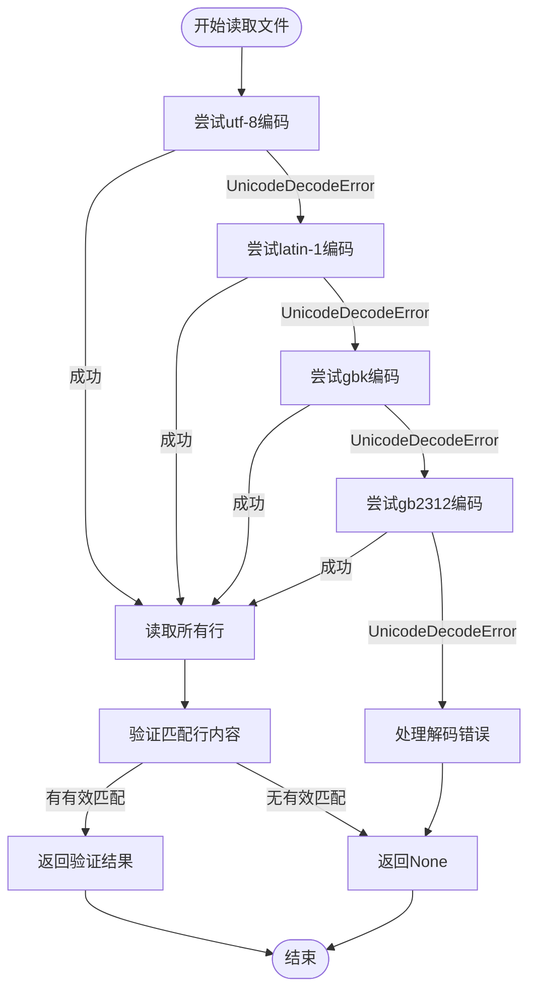
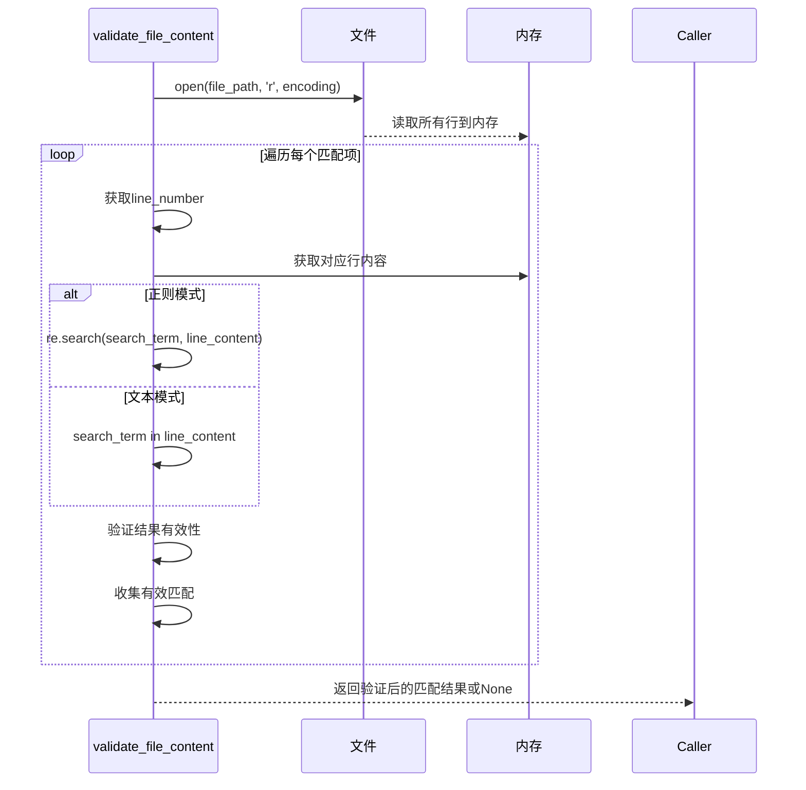

# 二次内容校验

<cite>
**Referenced Files in This Document**   
- [src/search_template.py](file://src/search_template.py)
- [src/searcher.py](file://src/searcher.py)
- [src/validators.py](file://src/validators.py)
- [src/config.py](file://src/config.py)
</cite>

## 目录
1. [引言](#引言)
2. [核心组件分析](#核心组件分析)
3. [验证流程架构](#验证流程架构)
4. [并行执行机制](#并行执行机制)
5. [文件内容校验实现](#文件内容校验实现)
6. [编码探测与容错读取](#编码探测与容错读取)
7. [结果确认逻辑](#结果确认逻辑)
8. [性能调优建议](#性能调优建议)

## 引言
本文档深入剖析代码扫描工具中的二次校验机制，重点解析从搜索模板触发到多进程并发验证的完整技术实现路径。通过分析`_default_search_template`如何启动`parallel_validate`函数，并结合`ProcessPoolExecutor`实现高效并行处理，全面揭示系统如何通过精确的匹配结果重新确认来消除初步搜索可能产生的误报。

## 核心组件分析

本节分析支撑二次校验功能的核心代码模块及其相互关系。

**Section sources**
- [src/search_template.py](file://src/search_template.py#L172-L183)
- [src/validators.py](file://src/validators.py#L30-L50)
- [src/searcher.py](file://src/searcher.py#L290-L291)

### 搜索模板与验证器协作

**Diagram sources**
- [src/search_template.py](file://src/search_template.py#L150-L190)
- [src/validators.py](file://src/validators.py#L20-L50)
- [src/searcher.py](file://src/searcher.py#L230-L290)

## 验证流程架构

详细说明二次校验的触发机制和整体执行流程。

**Diagram sources**
- [src/search_template.py](file://src/search_template.py#L172-L183)
- [src/searcher.py](file://src/searcher.py#L233-L275)

**Section sources**
- [src/search_template.py](file://src/search_template.py#L172-L183)
- [src/searcher.py](file://src/searcher.py#L233-L275)

## 并行执行机制

分析`ProcessPoolExecutor`如何实现多进程并发校验以提升效率。

### 并行验证工作流

**Diagram sources**
- [src/searcher.py](file://src/searcher.py#L233-L275)

**Section sources**
- [src/searcher.py](file://src/searcher.py#L233-L275)

## 文件内容校验实现

深入解析`validate_file_content`函数的技术细节和实现逻辑。

**Diagram sources**
- [src/searcher.py](file://src/searcher.py#L104-L144)

**Section sources**
- [src/searcher.py](file://src/searcher.py#L104-L144)

## 编码探测与容错读取

详细说明系统如何自动探测文件编码并实现容错读取。

### 编码探测流程

**Diagram sources**
- [src/searcher.py](file://src/searcher.py#L104-L144)

**Section sources**
- [src/searcher.py](file://src/searcher.py#L104-L144)

## 结果确认逻辑

描述系统如何重新确认匹配结果以消除grep可能产生的误报。

**Diagram sources**
- [src/searcher.py](file://src/searcher.py#L104-L144)

**Section sources**
- [src/searcher.py](file://src/searcher.py#L104-L144)

## 性能调优建议

分析`max_workers`参数对性能的影响并提供优化建议。

### 参数影响分析表
| max_workers值 | CPU利用率 | 内存占用 | I/O等待时间 | 适用场景 |
|---------------|----------|--------|------------|---------|
| 1 | 低 | 最低 | 高 | 单核系统或I/O密集型任务 |
| 2-4 | 中等 | 低 | 中等 | 一般开发环境 |
| 5-8 | 高 | 中等 | 低 | 多核服务器环境 |
| >8 | 极高 | 高 | 极低 | 高性能计算环境 |

**Section sources**
- [src/searcher.py](file://src/searcher.py#L233-L275)
- [src/config.py](file://src/config.py#L15-L16)