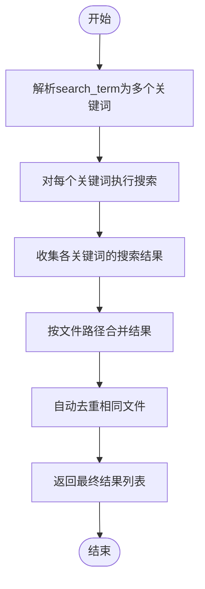
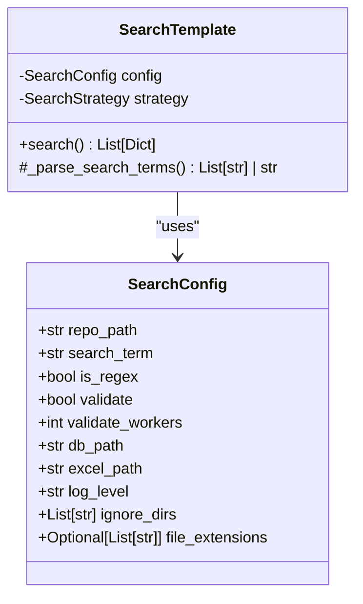

# 多关键词搜索

<cite>
**Referenced Files in This Document **   
- [strategies.py](file://src/strategies.py)
- [searcher.py](file://src/searcher.py)
- [config.py](file://src/config.py)
- [search_template.py](file://src/search_template.py)
- [search_factory.py](file://src/search_factory.py)
</cite>

## 目录
1. [多关键词解析机制](#多关键词解析机制)
2. [GrepSearchStrategy中的多关键词处理](#grepsearchstrategy中的多关键词处理)
3. [PythonSearchStrategy中的多关键词处理](#pythonsearchstrategy中的多关键词处理)
4. [结果合并与去重](#结果合并与去重)
5. [_should_ignore_file方法的过滤作用](#_should_ignore_file方法的过滤作用)
6. [多关键词配置示例](#多关键词配置示例)
7. [部分关键词无匹配时的系统行为](#部分关键词无匹配时的系统行为)

## 多关键词解析机制

系统通过逗号分隔符将`search_term`字符串解析为多个独立的搜索词。在`SearchTemplate`类的`_parse_search_terms`方法中，当配置项`search_term`包含逗号时，会调用`split(',')`将其分割成列表；若不包含逗号，则保持为单个字符串。这种设计允许用户在同一搜索操作中指定多个关键词，如默认配置中的"test,def,void"。

**Section sources**
- [search_template.py](file://src/search_template.py#L148-L155)

## GrepSearchStrategy中的多关键词处理

`GrepSearchStrategy`实现了基于外部`grep`命令的高效搜索策略。对于每个独立的搜索词，该策略会构建并执行相应的`grep`命令进行递归搜索。搜索过程中会应用配置的忽略目录（`ignore_dirs`）和文件后缀限制（`file_extensions`），通过`--exclude-dir`和`--include`参数传递给`grep`命令。每个搜索词的结果会被分别收集，并记录触发匹配的具体搜索词，便于后续追踪。

**Section sources**
- [strategies.py](file://src/strategies.py#L73-L171)

## PythonSearchStrategy中的多关键词处理

当系统环境缺少`grep`命令或需要纯Python实现时，`PythonSearchStrategy`提供替代方案。该策略遍历仓库内所有文件，对每个文件逐行检查是否包含任一搜索词。对于每个搜索词，都会独立进行匹配判断：普通搜索使用`in`操作符，正则搜索则调用`re.search`函数。一旦发现匹配，相关信息（包括行号、内容和对应的搜索词）将被添加到结果集中。

**Section sources**
- [strategies.py](file://src/strategies.py#L174-L232)

## 结果合并与去重

两种搜索策略均采用相似的结果合并机制。`GrepSearchStrategy`首先将各搜索词的独立结果累积到`all_results`列表中，然后通过字典结构按文件路径进行合并，确保同一文件的所有匹配项被整合到单一结果对象中。最终转换回列表格式返回。此过程自然实现了文件级别的去重，避免了重复报告同一文件。

**Diagram sources **
- [strategies.py](file://src/strategies.py#L90-L135)

**Section sources**
- [strategies.py](file://src/strategies.py#L120-L135)

## _should_ignore_file方法的过滤作用

`_should_ignore_file`方法在搜索过程中起关键的过滤作用。该方法根据配置的`ignore_dirs`列表检查文件路径是否包含应忽略的目录（如".git"、"node_modules"等），并依据`file_extensions`设置判断文件扩展名是否符合要求。只有同时通过这两个检查的文件才会被纳入搜索范围，有效减少了不必要的I/O操作和计算开销，提升了整体搜索效率。

**Section sources**
- [strategies.py](file://src/strategies.py#L60-L71)
- [search_template.py](file://src/search_template.py#L118-L138)

## 多关键词配置示例

多关键词可通过修改`SearchConfig`类中的`search_term`字段进行配置。例如，默认值"test,def,void"表示同时搜索这三个关键字。用户可以在代码中直接修改此属性，或通过其他配置机制设置。配置生效后，系统会自动将该字符串解析为关键词列表，并对每个词执行完整的搜索流程。

**Diagram sources **
- [config.py](file://src/config.py#L6-L18)
- [search_template.py](file://src/search_template.py#L25-L35)

**Section sources**
- [config.py](file://src/config.py#L6-L18)

## 部分关键词无匹配时的系统行为

当部分关键词无匹配时，系统仍会返回其他关键词的成功匹配结果。在`GrepSearchStrategy`中，如果某个搜索词未找到匹配项（`grep`返回码为1），仅会记录一条信息日志，而不会中断整个搜索流程。所有已找到的匹配结果都会被正常合并和返回。只有当所有关键词均无匹配时，最终结果集才为空。这种容错设计保证了即使某些搜索词无效，也不会影响其他有效关键词的搜索结果。