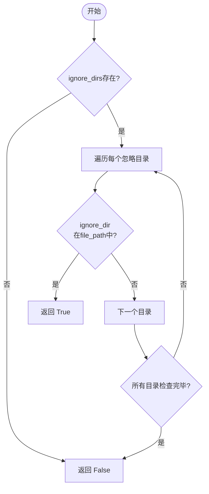
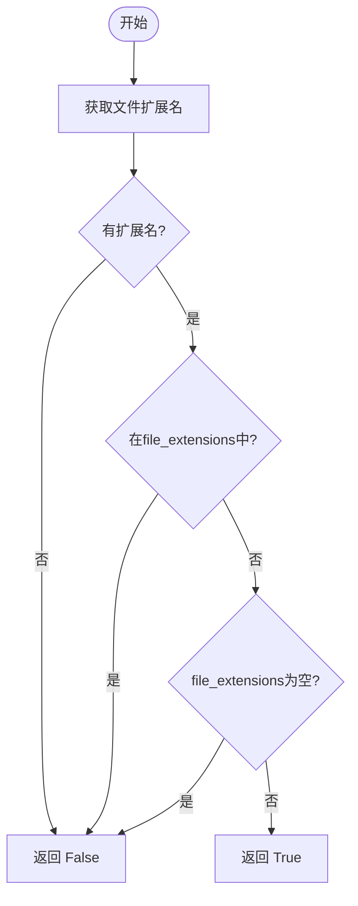
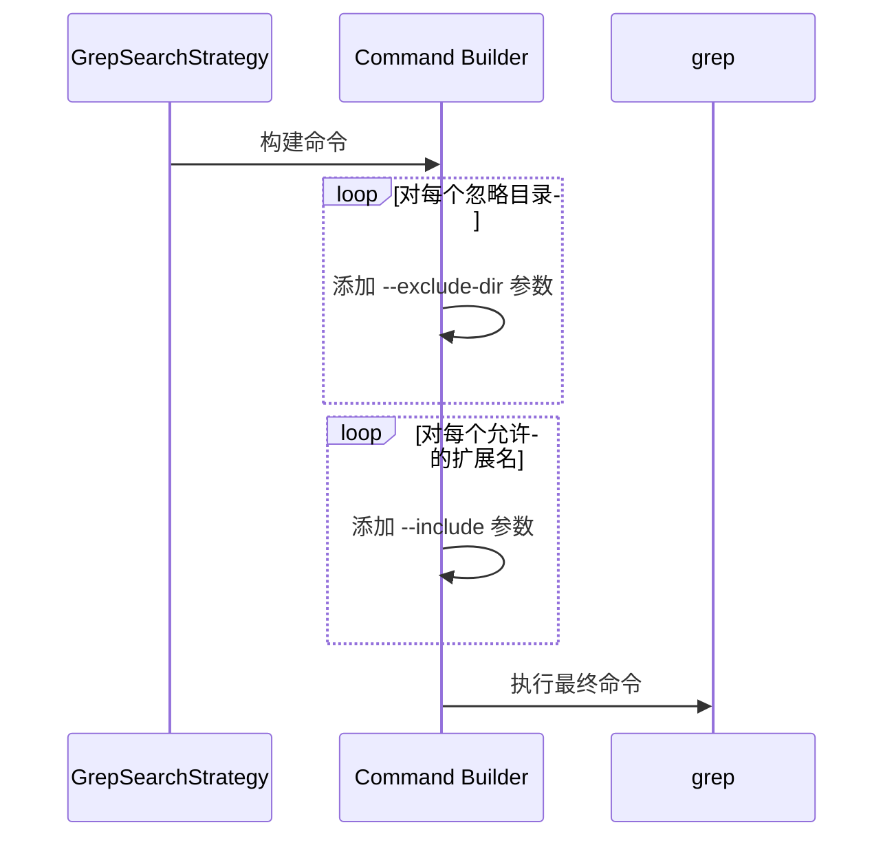

# 文件过滤策略

<cite>
**Referenced Files in This Document**   
- [src/strategies.py](file://src/strategies.py)
- [src/search_template.py](file://src/search_template.py)
- [src/searcher.py](file://src/searcher.py)
- [src/config.py](file://src/config.py)
</cite>

## 目录
1. [文件过滤机制概述](#文件过滤机制概述)
2. [_search_should_ignore_file方法分析](#_search_should_ignore_file方法分析)
3. 不同模块中的实现一致性对比
4. Grep命令参数传递机制
5. 配置管理与默认值

## 文件过滤机制概述

本系统通过路径和扩展名的双重过滤机制来控制搜索范围。核心逻辑由 `_should_ignore_file` 方法实现，该方法在多个组件中被调用以判断是否应忽略特定文件。过滤机制包含两个主要维度：目录路径匹配和文件扩展名匹配。

**Section sources**
- [src/strategies.py](file://src/strategies.py#L45-L70)
- [src/search_template.py](file://src/search_template.py#L92-L121)
- [src/searcher.py](file://src/searcher.py#L203-L231)

## _search_should_ignore_file方法分析

### 目录路径匹配策略

系统采用灵活的目录路径匹配策略来识别需要忽略的目录。不同组件实现了略有差异的匹配逻辑：

#### 基础策略实现 (SearchStrategy._should_ignore_file)


**Diagram sources**
- [src/strategies.py](file://src/strategies.py#L45-L70)

该实现使用简单的子字符串包含检查 (`in` 操作符) 来判断文件路径是否包含任何忽略目录名称。

#### 模板方法实现 (SearchTemplate._should_ignore_file)
此实现提供了更精确的路径匹配，考虑了路径分隔符：
- **前缀匹配**: `file_path.startswith(ignore_dir + os.path.sep)`
- **中缀匹配**: `os.path.sep + ignore_dir + os.path.sep in file_path`
- **后缀匹配**: `file_path.endswith(os.path.sep + ignore_dir)`

这种设计避免了部分目录名误匹配的问题，例如不会将 "node_modules_backup" 错误地识别为 "node_modules"。

**Section sources**
- [src/search_template.py](file://src/search_template.py#L92-L121)

#### 独立引擎实现 (SearchEngine._should_ignore_file)
此实现与基础策略类似，直接使用子字符串包含检查。但值得注意的是，它创建了一个新的 `SearchConfig` 实例而不是使用传入的配置，这可能导致配置不一致问题。

**Section sources**
- [src/searcher.py](file://src/searcher.py#L203-L231)

### 扩展名精确匹配规则

所有实现都遵循相同的扩展名匹配逻辑：
1. 使用 `os.path.splitext()` 提取文件扩展名
2. 检查提取的扩展名是否为空且不在允许列表中
3. 只有当 `file_extensions` 列表非空时才应用限制

这一逻辑确保了只有明确指定要搜索的文件类型才会被包含，其他所有文件都将被忽略。



**Diagram sources**
- [src/strategies.py](file://src/strategies.py#L60-L70)
- [src/search_template.py](file://src/search_template.py#L110-L121)
- [src/searcher.py](file://src/searcher.py#L220-L231)

## 不同模块中的实现一致性对比

尽管功能相似，但不同模块中的实现存在显著差异：

| 组件 | 路径匹配精度 | 配置来源 | 一致性 |
|------|-------------|---------|-------|
| SearchStrategy | 低 (简单包含) | 实例配置 | 基础实现 |
| SearchTemplate | 高 (路径分隔符感知) | 实例配置 | 最佳实践 |
| SearchEngine | 低 (简单包含) | 新建配置实例 | 存在潜在问题 |

理想情况下，这些实现应该统一，推荐采用 `SearchTemplate` 中的路径分隔符感知匹配策略，并确保使用一致的配置源。

**Section sources**
- [src/strategies.py](file://src/strategies.py#L45-L70)
- [src/search_template.py](file://src/search_template.py#L92-L121)
- [src/searcher.py](file://src/searcher.py#L203-L231)

## Grep命令参数传递机制

当使用 `GrepSearchStrategy` 时，系统会将过滤规则转换为相应的 grep 命令行参数：



**Diagram sources**
- [src/strategies.py](file://src/strategies.py#L85-L95)

具体转换规则如下：
- **--exclude-dir**: 对 `ignore_dirs` 列表中的每个目录添加一个 `--exclude-dir` 参数
- **--include**: 对 `file_extensions` 列表中的每个扩展名生成 `*<ext>` 模式并添加 `--include` 参数

这种方式确保了原生 grep 工具能够利用其高效的过滤能力，减少需要处理的文件数量。

**Section sources**
- [src/strategies.py](file://src/strategies.py#L76-L171)

## 配置管理与默认值

系统的过滤行为由 `SearchConfig` 类中的两个关键属性控制：

```python
@dataclass
class SearchConfig:
    # 默认忽略的目录
    ignore_dirs: List[str] = field(default_factory=lambda: [
        ".git", "__pycache__", ".svn", ".hg", ".idea", 
        ".vscode", "node_modules", ".tox"
    ])
    # 默认搜索的文件后缀（None表示不限制）
    file_extensions: Optional[List[str]] = None
```

**Section sources**
- [src/config.py](file://src/config.py#L15-L20)

这些默认值确保了常见的版本控制、IDE 和依赖管理目录被自动排除，同时默认不限制文件类型，提供最大的搜索灵活性。用户可以通过配置覆盖这些默认值以适应特定需求。