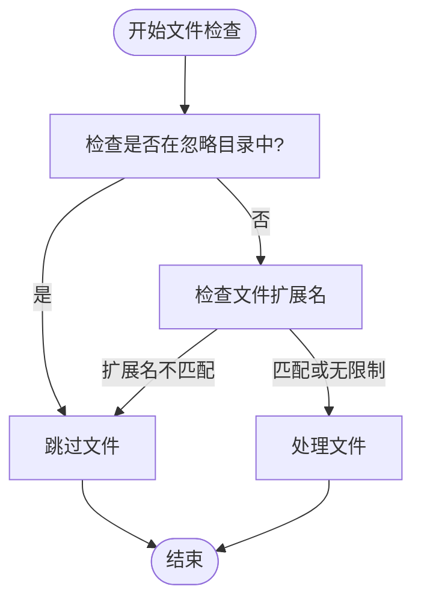
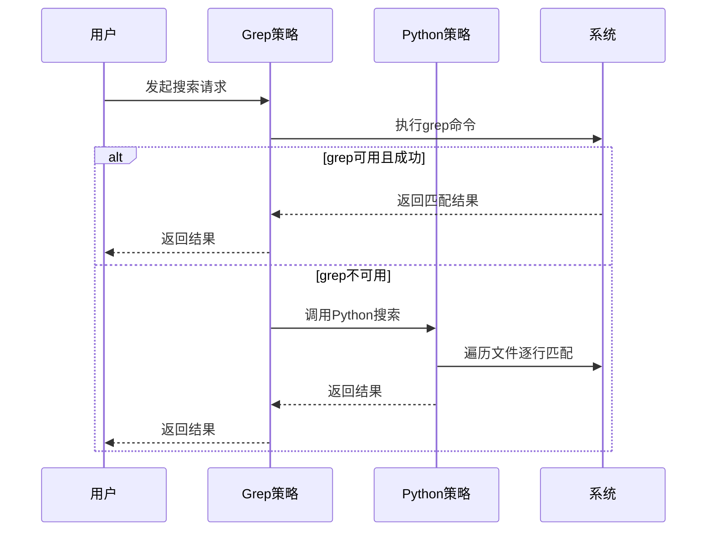
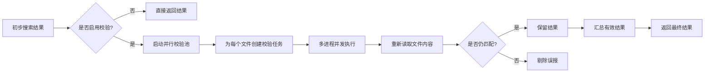
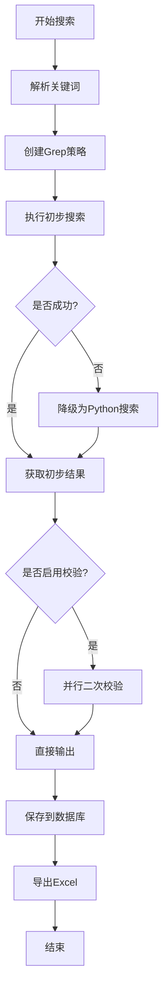

# 核心功能说明

<cite>
**本文档引用的文件**  
- [code_searcher.py](file://src/code_searcher.py)
- [search_template.py](file://src/search_template.py)
- [strategies.py](file://src/strategies.py)
- [validators.py](file://src/validators.py)
- [searcher.py](file://src/searcher.py)
- [config.py](file://src/config.py)
</cite>

## 目录
1. [简介](#简介)
2. [多关键词搜索解析机制](#多关键词搜索解析机制)
3. [正则表达式开关对匹配行为的影响](#正则表达式开关对匹配行为的影响)
4. [基于路径和扩展名的文件过滤策略](#基于路径和扩展名的文件过滤策略)
5. [Grep加速与自动降级容错机制](#grep加速与自动降级容错机制)
6. [并行二次内容校验以消除误报](#并行二次内容校验以消除误报)
7. [完整搜索流程协同工作机制](#完整搜索流程协同工作机制)

## 简介
本工具是一个高效代码搜索系统，采用多种设计模式（模板方法、策略模式、工厂模式）实现灵活可扩展的搜索功能。其核心目标是快速、准确地在大型代码库中定位包含特定关键字或正则表达式的文件，并通过多层验证机制确保结果的准确性。

整个搜索流程由 `DefaultSearchTemplate` 驱动，结合配置参数控制行为，使用不同的搜索策略执行初步扫描，并在必要时进行二次校验。该架构支持多关键词联合搜索、正则匹配、路径与扩展名过滤、以及高并发下的性能优化。

**Section sources**
- [code_searcher.py](file://src/code_searcher.py#L18-L61)
- [search_template.py](file://src/search_template.py#L30-L70)

## 多关键词搜索解析机制
系统支持通过逗号分隔输入多个关键词进行联合搜索。当用户输入如 `"test,def,void"` 的字符串时，系统会将其解析为一个关键词列表，在后续的搜索过程中逐一匹配。

这一解析逻辑由 `SearchTemplate._parse_search_terms()` 方法实现：若搜索词中包含逗号，则按逗号分割成列表；否则保留为单个字符串。无论原始输入形式如何，最终都会统一转换为列表格式供搜索策略处理。

这种设计使得系统既能支持简单的单一关键词搜索，也能高效处理复杂的多条件组合场景，提升搜索覆盖率和实用性。

**Section sources**
- [search_template.py](file://src/search_template.py#L139-L147)

## 正则表达式开关对匹配行为的影响
是否启用正则表达式由配置项 `is_regex` 控制，默认值为 `False`。该标志直接影响底层匹配引擎的行为：

- 当 `is_regex=False` 时，系统使用子串匹配（`in` 操作符），判断搜索词是否出现在某一行文本中。
- 当 `is_regex=True` 时，系统调用 `re.search()` 函数执行正则表达式匹配，支持更复杂的模式匹配能力。

此开关贯穿于所有搜索策略（Grep 和 Python 实现）及验证阶段，确保语义一致性。例如，在 Grep 策略中，若启用正则，则添加 `-E` 参数以激活扩展正则表达式支持。

**Section sources**
- [strategies.py](file://src/strategies.py#L76-L171)
- [strategies.py](file://src/strategies.py#L177-L232)

## 基于路径和扩展名的文件过滤策略
为了提高搜索效率并减少无关文件干扰，系统实现了两级文件过滤机制：

### 忽略目录过滤
通过 `ignore_dirs` 配置项指定一组应被忽略的目录名称（如 `.git`, `__pycache__`, `node_modules` 等）。在遍历文件时，若文件路径中包含这些目录名，则跳过该文件。

### 文件扩展名过滤
通过 `file_extensions` 配置项限定只搜索指定后缀的文件（如 `[".py", ".js"]`）。如果该列表非空，则仅当文件扩展名匹配其中之一时才纳入搜索范围。若设置为 `None`，则不限制文件类型。

该逻辑封装在 `_should_ignore_file()` 方法中，被 Grep 和 Python 搜索策略共同复用，保证行为一致。

**Diagram sources**
- [strategies.py](file://src/strategies.py#L55-L71)
- [search_template.py](file://src/search_template.py#L114-L137)

## Grep加速与自动降级容错机制
系统优先使用外部 `grep` 命令进行初步搜索，利用其原生高性能优势实现快速扫描。若 `grep` 不可用（命令未安装、超时、抛出异常），则自动降级到纯 Python 实现，保障功能可用性。

### Grep 搜索流程
- 构建带 `-r`（递归）、`-n`（显示行号）的 grep 命令
- 若启用正则，添加 `-E` 参数
- 添加 `--exclude-dir` 排除忽略目录
- 添加 `--include` 限制文件类型
- 执行命令并解析输出（格式：`文件:行号:内容`）

### 自动降级机制
当捕获到 `FileNotFoundError` 异常（即系统无 `grep` 命令）时，立即切换至 `PythonSearchStrategy` 并终止当前循环，避免重复尝试失败操作。

该机制体现了“最佳性能 + 最大兼容性”的设计理念，兼顾速度与鲁棒性。

**Diagram sources**
- [strategies.py](file://src/strategies.py#L76-L171)
- [strategies.py](file://src/strategies.py#L177-L232)

## 并行二次内容校验以消除误报
由于初步搜索可能存在编码问题、缓存偏差或工具差异导致的误报，系统提供可选的二次校验功能（由 `validate=True` 启用）。

### 校验原理
对初步搜索返回的每个匹配文件，重新打开文件并逐行读取，再次确认原始搜索词是否真实存在。此过程独立于初次搜索方式，确保结果可靠性。

### 并行加速
使用 `ProcessPoolExecutor` 实现多进程并行校验，最大工作进程数由 `validate_workers` 配置项控制（默认4个）。每个文件作为一个任务提交，显著提升大规模项目中的验证效率。

### 编码兼容处理
尝试多种常见编码（UTF-8、Latin-1、GBK、GB2312）读取文件，防止因编码错误导致误判为“无匹配”。

该机制有效提升了搜索结果的精确度，尤其适用于跨平台、多语言混合的复杂项目环境。

**Diagram sources**
- [validators.py](file://src/validators.py#L32-L50)
- [searcher.py](file://src/searcher.py#L234-L291)

## 完整搜索流程协同工作机制
各功能模块通过模板方法模式有机整合，形成完整的搜索流水线：

1. **初始化配置**：加载 `SearchConfig`，设定搜索路径、关键词、是否正则、是否校验等参数。
2. **解析关键词**：将输入字符串拆分为关键词列表。
3. **创建策略**：通过工厂模式生成默认的 `GrepSearchStrategy`。
4. **初步搜索**：执行 grep 搜索，失败时自动降级为 Python 实现。
5. **结果合并**：将多个关键词的搜索结果按文件路径去重合并。
6. **二次校验**：若启用 `validate`，调用 `parallel_validate` 进行并行再验证。
7. **输出结果**：保存至数据库并导出 Excel 报告。

整个流程高度模块化，各组件职责清晰，易于维护和扩展。

**Diagram sources**
- [search_template.py](file://src/search_template.py#L30-L70)
- [code_searcher.py](file://src/code_searcher.py#L39-L46)