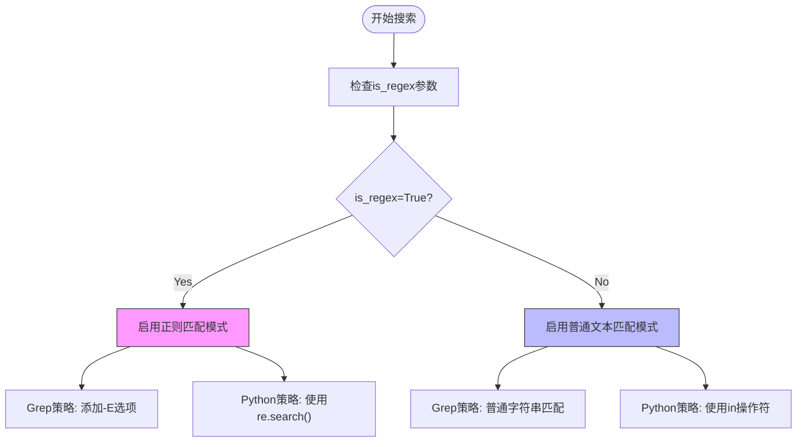
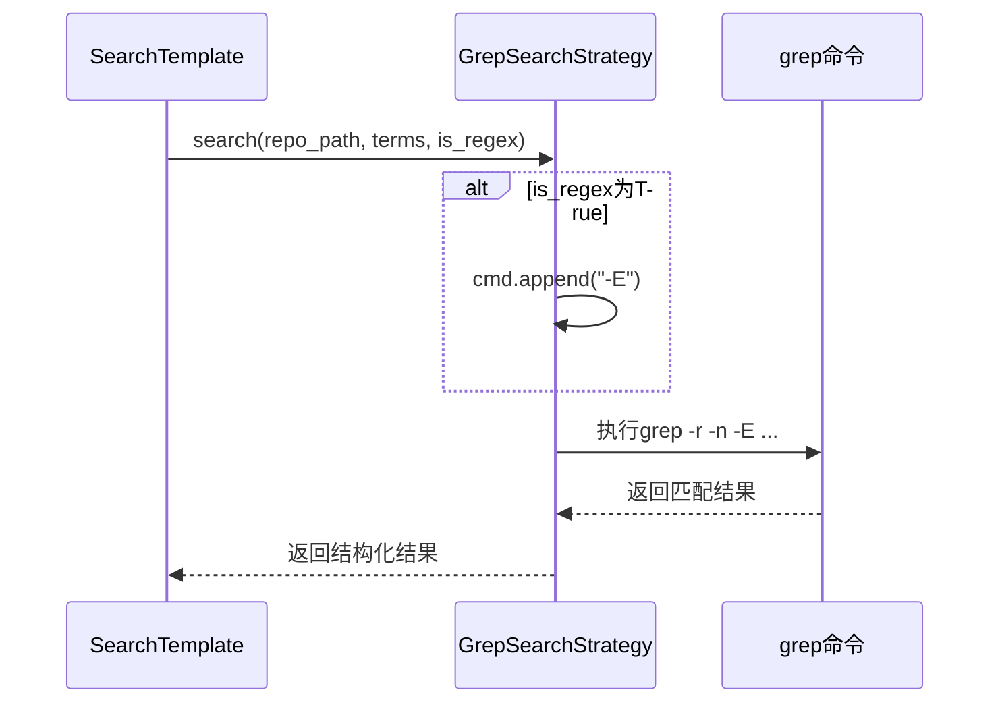
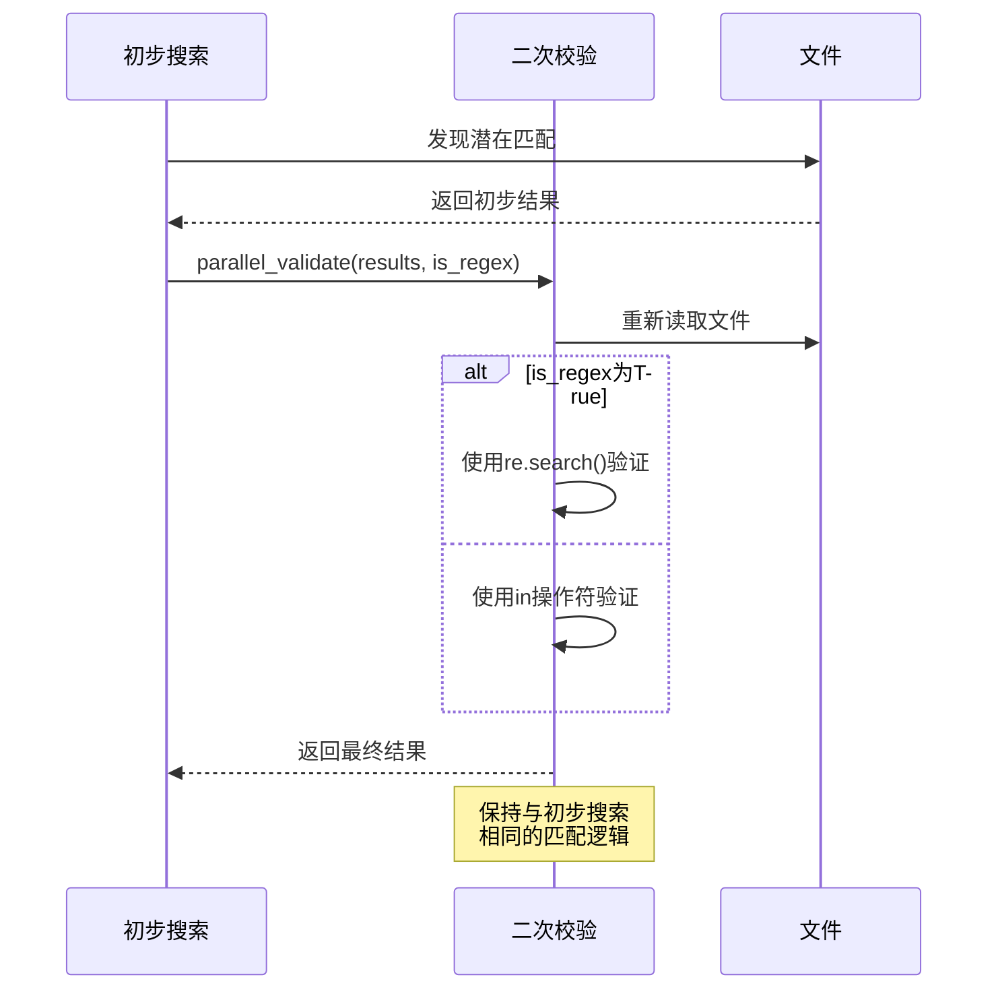

# 正则表达式支持

<cite>
**Referenced Files in This Document **   
- [strategies.py](file://src/strategies.py)
- [search_template.py](file://src/search_template.py)
- [searcher.py](file://src/searcher.py)
- [config.py](file://src/config.py)
</cite>

## 目录
1. [正则表达式功能概述](#正则表达式功能概述)
2. [is_regex参数控制机制](#is_regex参数控制机制)
3. [Grep搜索策略中的正则支持](#grep搜索策略中的正则支持)
4. [Python搜索策略中的正则实现](#python搜索策略中的正则实现)
5. [正则语法兼容性与边界处理](#正则语法兼容性与边界处理)
6. [正则搜索与普通文本搜索的差异](#正则搜索与普通文本搜索的差异)
7. [二次校验过程中的正则一致性保障](#二次校验过程中的正则一致性保障)

## 正则表达式功能概述

本系统实现了完整的正则表达式搜索功能，通过`is_regex`配置参数控制匹配模式的切换。系统支持两种搜索策略：基于外部工具的Grep搜索和纯Python实现的搜索。当启用正则表达式模式时，系统会根据当前使用的搜索策略采用相应的正则匹配机制。

正则表达式功能贯穿于整个搜索流程，从初步搜索到二次校验都保持一致的匹配逻辑。这种设计确保了搜索结果的准确性和可靠性，同时提供了灵活的配置选项来满足不同的搜索需求。

**Section sources**
- [strategies.py](file://src/strategies.py#L73-L232)
- [config.py](file://src/config.py#L9-L9)

## is_regex参数控制机制

`is_regex`参数是控制系统正则表达式行为的核心开关，定义在`SearchConfig`类中，其默认值为`False`。该参数作为布尔标志，在整个搜索过程中传递，决定是否启用正则表达式匹配模式。

当用户需要进行正则搜索时，可以通过配置将`is_regex`设置为`True`。这个参数会被传递给具体的搜索策略实现，在执行搜索时根据其值选择相应的匹配算法。无论是使用外部grep工具还是内部Python实现，都会检查这个参数来确定如何处理搜索词。

参数的传递路径从配置层到模板层，再到具体的策略实现，确保了在整个搜索流程中保持一致的行为。这种集中式的配置管理使得正则表达式功能的启用和禁用变得简单而可靠。



**Diagram sources **
- [config.py](file://src/config.py#L9-L9)
- [strategies.py](file://src/strategies.py#L76-L232)

**Section sources**
- [config.py](file://src/config.py#L9-L9)
- [strategies.py](file://src/strategies.py#L73-L232)

## Grep搜索策略中的正则支持

在`GrepSearchStrategy`中，正则表达式的支持通过条件性地添加`-E`命令行选项来实现。当`is_regex`参数为`True`时，系统会在构建grep命令时加入`-E`标志，启用扩展正则表达式模式。



**Diagram sources **
- [strategies.py](file://src/strategies.py#L76-L171)

**Section sources**
- [strategies.py](file://src/strategies.py#L76-L171)

## Python搜索策略中的正则实现

`PythonSearchStrategy`利用Python标准库中的`re`模块来实现正则表达式匹配。当`is_regex`参数为`True`时，系统调用`re.search()`函数进行模式匹配；否则使用简单的子字符串包含检查。

该策略在逐行读取文件内容后，根据`is_regex`的值选择匹配方法。对于正则匹配，它直接使用`re.search(search_term, line)`来检测模式是否存在，充分利用了Python强大的正则表达式引擎。

```mermaid
flowchart TD
A[开始Python搜索] --> B{is_regex?}
B --> |True| C[调用re.search()]
B --> |False| D[使用in操作符]
C --> E[记录匹配行]
D --> E
E --> F[继续下一行]
F --> G{文件结束?}
G --> |No| H[读取下一行]
H --> C
G --> |Yes| I[返回结果]
style C fill:#f96,stroke:#333
style D fill:#6f9,stroke:#333
```

**Diagram sources **
- [strategies.py](file://src/strategies.py#L177-L232)

**Section sources**
- [strategies.py](file://src/strategies.py#L177-L232)

## 正则语法兼容性与边界处理

系统在正则表达式处理方面考虑了多种边界情况和兼容性问题。由于同时支持grep和Python两种正则引擎，需要注意它们之间的语法差异。grep的扩展正则表达式（-E）与Python的re模块在某些特殊字符的处理上可能存在细微差别。

对于特殊字符的转义，系统依赖于底层引擎的默认行为。用户在编写正则表达式时需要根据所使用的搜索策略了解相应的语法规则。例如，某些元字符在不同引擎中可能需要不同的转义方式。

在错误处理方面，系统捕获并记录正则表达式相关的异常，但不会中断整个搜索过程。如果某个文件因编码问题无法读取，系统会跳过该文件并继续处理其他文件，确保搜索过程的鲁棒性。

**Section sources**
- [strategies.py](file://src/strategies.py#L76-L232)
- [searcher.py](file://src/searcher.py#L200-L220)

## 正则搜索与普通文本搜索的差异

正则搜索与普通文本搜索在匹配逻辑、性能特征和使用场景上有显著差异。普通文本搜索使用简单的子字符串匹配，速度快且易于理解；而正则搜索提供更强大的模式匹配能力，可以处理复杂的文本模式。

从实现角度看，普通搜索使用`in`操作符进行包含检查，时间复杂度相对较低；正则搜索则需要解析正则表达式模式并进行状态机匹配，通常会有更高的计算开销。然而，正则表达式能够表达更复杂的搜索需求，如模式匹配、分组提取等。

系统通过统一的接口抽象了这两种搜索模式的差异，使用户可以在不改变调用方式的情况下切换匹配模式，提高了API的灵活性和可用性。

**Section sources**
- [strategies.py](file://src/strategies.py#L76-L232)

## 二次校验过程中的正则一致性保障

在`parallel_validate`二次校验过程中，系统严格保持了与初步搜索相同的正则匹配逻辑。这是通过将`is_regex`参数传递给验证函数来实现的，确保在整个搜索流程中使用一致的匹配规则。



**Diagram sources **
- [searcher.py](file://src/searcher.py#L233-L275)
- [search_template.py](file://src/search_template.py#L145-L156)

**Section sources**
- [searcher.py](file://src/searcher.py#L233-L275)
- [search_template.py](file://src/search_template.py#L145-L156)