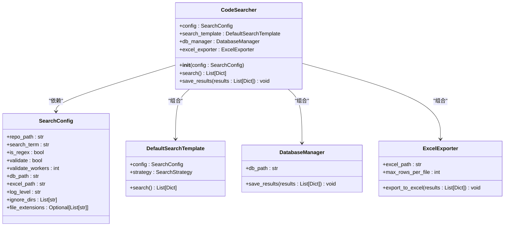
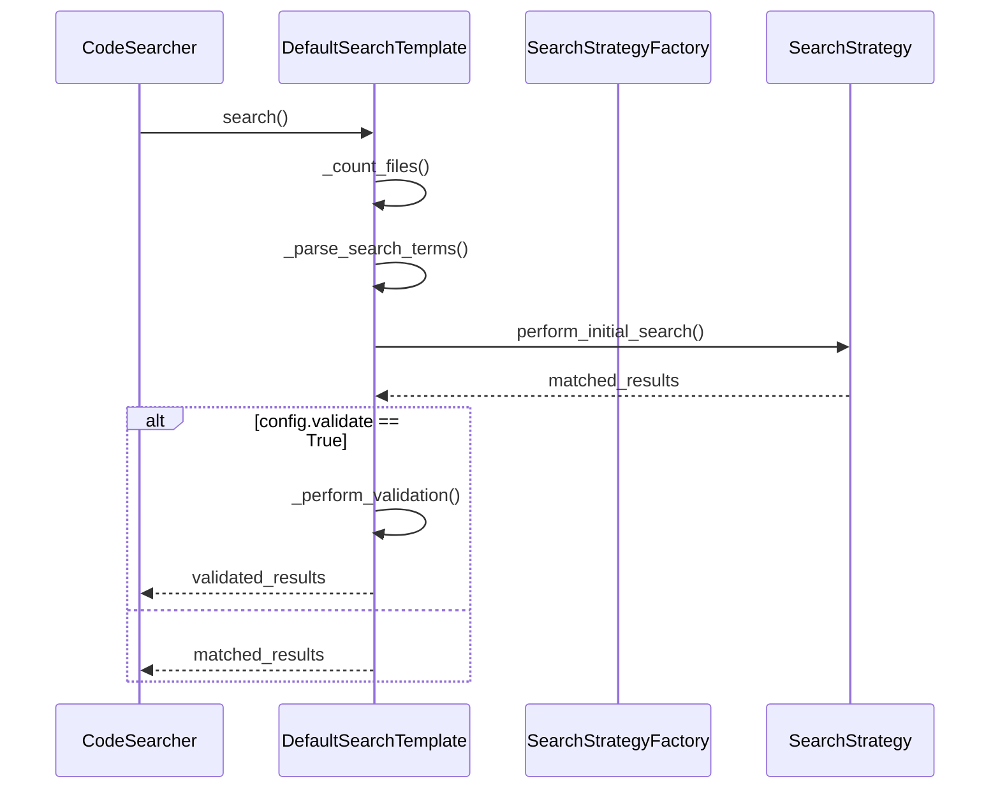
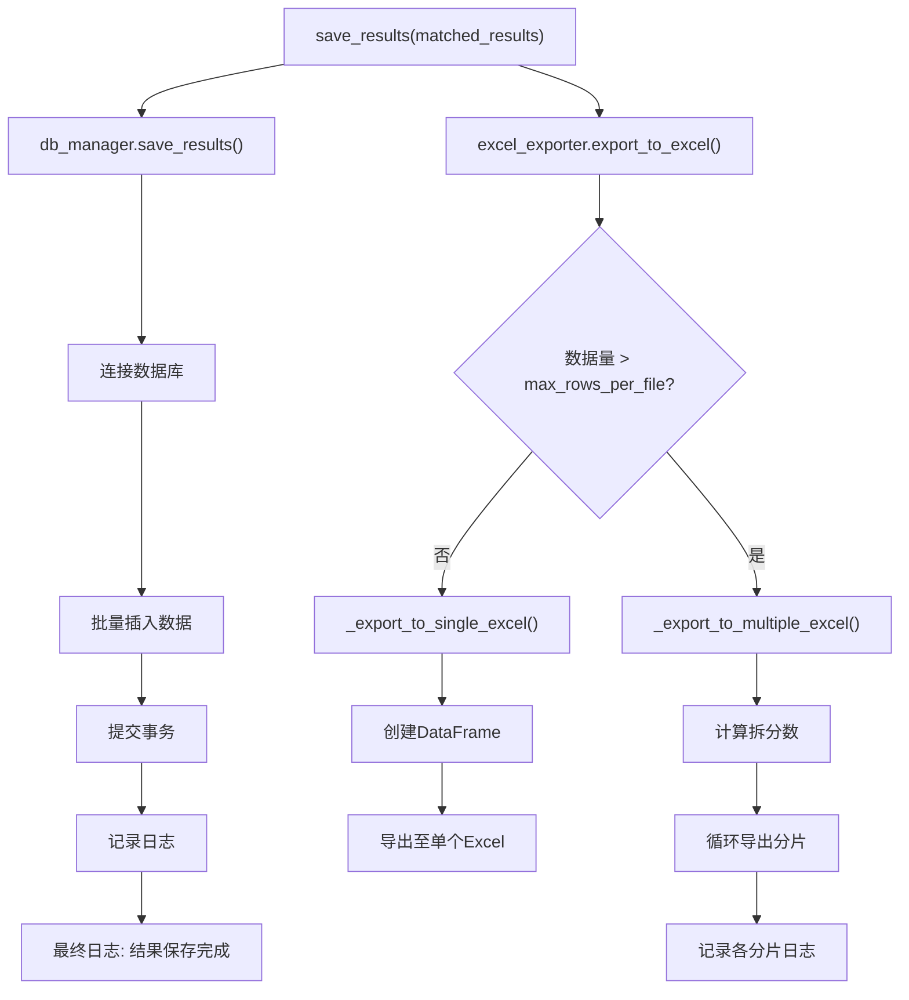
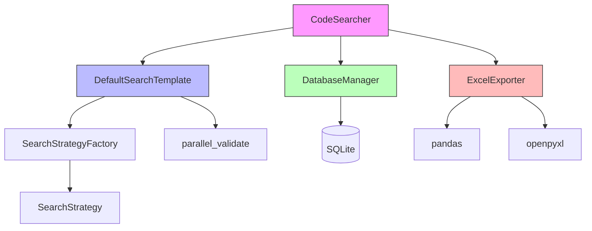

# CodeSearcher 主控制器设计

<cite>
**Referenced Files in This Document**  
- [code_searcher.py](file://src/code_searcher.py)
- [config.py](file://src/config.py)
- [search_template.py](file://src/search_template.py)
- [database.py](file://src/database.py)
- [exporter.py](file://src/exporter.py)
</cite>

## 目录
1. [简介](#简介)
2. [初始化流程分析](#初始化流程分析)
3. [核心方法调用链解析](#核心方法调用链解析)
4. [组件协作关系与组合模式优势](#组件协作关系与组合模式优势)
5. [异常处理与日志记录机制](#异常处理与日志记录机制)
6. [结论](#结论)

## 简介

`CodeSearcher` 类是代码搜索工具的核心主控制器，负责整合配置管理、搜索执行、结果持久化和导出功能。该类采用组合设计模式，通过依赖注入的方式协调多个独立组件（如 `DefaultSearchTemplate`、`DatabaseManager` 和 `ExcelExporter`），实现了高内聚、低耦合的架构设计。本文档将深入剖析其技术实现细节。

## 初始化流程分析

`CodeSearcher` 的初始化过程是一个典型的依赖注入实践，它接收一个 `SearchConfig` 配置对象，并基于该配置构建所有必要的子系统实例。

**Diagram sources**  
- [code_searcher.py](file://src/code_searcher.py#L21-L37)
- [config.py](file://src/config.py#L6-L18)

**Section sources**  
- [code_searcher.py](file://src/code_searcher.py#L18-L37)
- [config.py](file://src/config.py#L6-L18)

在 `__init__` 方法中，`CodeSearcher` 执行以下关键步骤：
1. 接收并保存 `SearchConfig` 实例，作为全局配置中心。
2. 使用配置中的参数创建 `DefaultSearchTemplate` 实例，用于执行搜索逻辑。
3. 根据 `db_path` 初始化 `DatabaseManager`，自动完成数据库文件及其目录的创建与表结构初始化。
4. 基于 `excel_path` 构造 `ExcelExporter`，并设置单个 Excel 文件的最大行数限制（默认 100,000 行）以防止文件过大。
5. 对 `config.repo_path` 进行存在性校验，若路径无效，则抛出 `FileNotFoundError` 并记录错误日志，确保程序在早期阶段就暴露配置问题。

此设计将复杂的初始化逻辑封装在构造函数中，保证了 `CodeSearcher` 实例一旦创建成功，其所有依赖项均已准备就绪。

## 核心方法调用链解析

### search() 方法调用链

`search()` 方法是整个搜索流程的入口，它本身不包含具体搜索逻辑，而是通过委托模式将任务交给 `DefaultSearchTemplate` 处理。

**Diagram sources**  
- [code_searcher.py](file://src/code_searcher.py#L39-L46)
- [search_template.py](file://src/search_template.py#L169-L189)

**Section sources**  
- [code_searcher.py](file://src/code_searcher.py#L39-L46)
- [search_template.py](file://src/search_template.py#L169-L189)

调用链详细说明：
1. **委托发起**：`CodeSearcher.search()` 调用 `self.search_template.search()`。
2. **模板方法执行**：`DefaultSearchTemplate.search()` 作为模板方法，定义了固定的搜索流程骨架，包括统计文件数量、解析搜索词、执行初步搜索等。
3. **策略模式应用**：初步搜索由 `SearchStrategy` 子类（如 `ParallelSearchStrategy`）通过多进程或异步方式实现，`DefaultSearchTemplate` 通过 `SearchStrategyFactory` 创建合适的策略实例。
4. **二次校验**：如果配置启用了 `validate`，则使用 `parallel_validate` 函数对初步结果进行精确匹配验证，确保结果准确性。

这种分层设计使得搜索算法可以灵活替换，而主控制器无需修改。

### save_results() 方法调用链

`save_results()` 方法负责将搜索结果持久化到多种存储介质，体现了关注点分离原则。

**Diagram sources**  
- [code_searcher.py](file://src/code_searcher.py#L48-L61)
- [database.py](file://src/database.py#L48-L81)
- [exporter.py](file://src/exporter.py#L20-L57)

**Section sources**  
- [code_searcher.py](file://src/code_searcher.py#L48-L61)
- [database.py](file://src/database.py#L48-L81)
- [exporter.py](file://src/exporter.py#L20-L57)

该方法的执行流程如下：
1. **数据库保存**：调用 `DatabaseManager.save_results()`，建立 SQLite 连接，将结果集转换为元组列表，并使用 `executemany` 进行高效批量插入，最后提交事务并关闭连接。
2. **Excel 导出**：调用 `ExcelExporter.export_to_excel()`，首先检查 `pandas` 库是否可用。若可用，则根据结果总数决定是否需要拆分文件。对于大结果集，会生成多个带编号的 Excel 文件（如 `results_part_1.xlsx`）。
3. **协同完成**：两个操作顺序执行，确保数据同时存在于数据库和 Excel 报告中，最后记录一条“结果保存完成”的信息日志。

## 组件协作关系与组合模式优势

`CodeSearcher` 采用组合模式而非继承来整合功能模块，这带来了显著的设计优势。

### 协作关系图

**Diagram sources**  
- [code_searcher.py](file://src/code_searcher.py)
- [search_template.py](file://src/search_template.py)
-