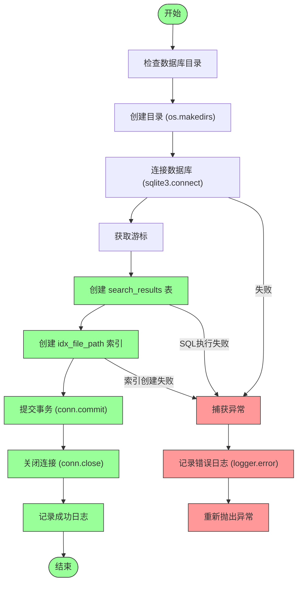
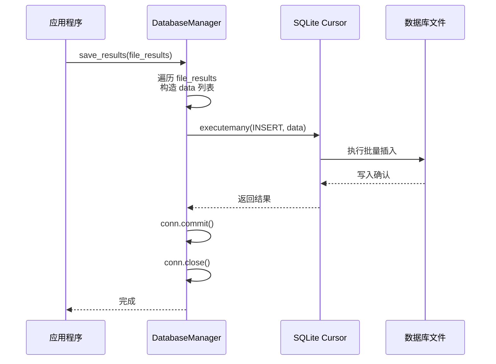

# DatabaseManager 数据持久化机制

<cite>
**Referenced Files in This Document**  
- [database.py](file://src/database.py)
- [logger_config.py](file://src/logger_config.py)
</cite>

## 目录
1. [引言](#引言)  
2. [数据库初始化与表结构设计](#数据库初始化与表结构设计)  
3. [批量写入性能优化机制](#批量写入性能优化机制)  
4. [数据提取与异常处理路径](#数据提取与异常处理路径)  
5. [连接管理与事务控制](#连接管理与事务控制)  
6. [索引策略与查询性能优化](#索引策略与查询性能优化)  
7. [配置建议与常见错误排查](#配置建议与常见错误排查)

## 引言

`DatabaseManager` 是 `Hello-Scan-Code` 项目中负责搜索结果持久化的核心组件，封装了 SQLite 数据库的初始化、结果存储与检索功能。该模块通过结构化 SQL 操作、批量插入机制和索引优化，确保搜索结果的高效存储与快速访问。本文档详细解析其 SQL 构造逻辑、异常处理机制及性能优化策略。

## 数据库初始化与表结构设计

`init_database()` 方法在 `DatabaseManager` 实例化时自动调用，完成数据库文件创建、目录准备、表定义及索引建立等初始化任务。

### 表结构与字段语义

`search_results` 表包含以下字段：

| 字段名 | 类型 | 是否非空 | 含义 |
|--------|------|----------|------|
| `id` | INTEGER | 是 | 自增主键，唯一标识每条匹配记录 |
| `file_path` | TEXT | 是 | 匹配项所在的文件路径（绝对或相对） |
| `line_number` | TEXT | 否 | 匹配内容所在行号（文本类型以支持范围表示） |
| `matched_content` | TEXT | 否 | 实际匹配到的代码行内容 |
| `search_term` | TEXT | 否 | 触发该匹配的搜索关键词 |

此设计支持对多文件、多关键词的复杂搜索场景进行结构化存储。

### 初始化流程与异常处理



**Diagram sources**  
- [database.py](file://src/database.py#L12-L46)

**Section sources**  
- [database.py](file://src/database.py#L12-L46)

## 批量写入性能优化机制

`save_results()` 方法采用批量插入（`executemany`）策略，显著提升大量搜索结果的写入效率。

### 批量插入实现逻辑

1. **数据预处理**：遍历传入的 `file_results` 列表，将每个匹配项（`match`）转换为元组 `(file_path, line_number, matched_content, search_term)`。
2. **批量构造**：将所有元组收集到 `data` 列表中，形成待插入的数据集。
3. **单次执行**：调用 `cursor.executemany(sql, data)` 将整个数据集一次性发送给 SQLite 引擎。

### 性能优势分析

相比逐条插入（`execute`），`executemany` 的优势在于：
- **减少 I/O 开销**：避免了多次磁盘同步操作。
- **降低函数调用开销**：一次方法调用处理 N 条记录。
- **事务效率**：所有插入操作在同一个事务内完成，提交一次即可。



**Diagram sources**  
- [database.py](file://src/database.py#L48-L81)

**Section sources**  
- [database.py](file://src/database.py#L48-L81)

## 数据提取与异常处理路径

`get_results()` 方法从数据库中提取已保存的搜索结果，其核心是简单的 `SELECT` 查询。

### 数据提取逻辑

- **查询语句**：`SELECT file_path FROM search_results`，仅返回文件路径列表。
- **结果处理**：使用 `fetchall()` 获取所有行，并通过列表推导式提取第一列（`row[0]`）。
- **返回值**：返回字符串列表 `List[str]`，包含所有匹配文件的路径。

### 异常传播路径

该方法遵循“记录并重新抛出”的异常处理模式：
1. 捕获任何 `Exception`。
2. 使用 `logger.error()` 记录详细的错误信息。
3. 使用 `raise` 将异常原样向上抛出，由调用者决定后续处理。

这种设计确保了错误不会被静默吞没，同时提供了调试所需的上下文信息。

**Section sources**  
- [database.py](file://src/database.py#L83-L98)

## 连接管理与事务控制

`DatabaseManager` 严格遵循数据库资源管理的最佳实践。

### 连接生命周期

- **及时创建**：在每次操作前通过 `sqlite3.connect(self.db_path)` 建立新连接。
- **及时关闭**：在 `try` 块末尾显式调用 `conn.close()`，释放文件句柄和内存。
- **避免长连接**：不维护持久连接，适合短时批处理任务，防止资源泄漏。

### 事务提交的重要性

- **`conn.commit()`**：在 `init_database` 和 `save_results` 中明确调用，确保 DDL（建表）和 DML（插入）操作永久生效。
- **原子性保证**：`save_results` 中的所有插入操作属于同一事务，要么全部成功，要么在异常时回滚（尽管代码未显式 `rollback`，但连接关闭会终止事务）。

## 索引策略与查询性能优化

### 索引定义与作用

`idx_file_path` 索引基于 `file_path` 字段创建：
```sql
CREATE INDEX IF NOT EXISTS idx_file_path ON search_results (file_path);
```
- **目的**：加速基于文件路径的查询，例如“查找某个文件中的所有匹配”。
- **效果**：将全表扫描（O(n)）优化为索引查找（接近 O(log n)），尤其在数据量大时效果显著。

### 查询性能考量

当前 `get_results()` 仅查询 `file_path`，恰好利用了该索引。若未来需支持更复杂的查询（如按 `search_term` 或 `line_number` 过滤），应考虑添加相应的复合索引。

## 配置建议与常见错误排查

### 数据库文件位置配置

- **默认路径**：建议将数据库文件置于项目根目录下的 `data/` 或 `db/` 子目录中，便于管理和版本控制（可 `.gitignore` 排除）。
- **配置方式**：可通过 `config.py` 文件或环境变量注入 `db_path` 参数，提高灵活性。

### 常见 SQLite 错误排查

| 错误现象 | 可能原因 | 解决方案 |
|---------|---------|---------|
| `数据库初始化失败: ...` | 目录无写权限、路径包含非法字符 | 检查 `db_path` 的父目录权限，确保路径有效 |
| `保存结果到数据库时出错: ...` | 数据库文件被占用、磁盘空间不足 | 关闭其他可能打开该文件的程序，检查磁盘空间 |
| `no such table: search_results` | `init_database()` 未执行或失败 | 确保 `DatabaseManager` 正确实例化，检查初始化日志 |
| `unable to open database file` | 路径不存在或权限不足 | 确认路径存在且进程有读写权限 |

**Section sources**  
- [database.py](file://src/database.py#L12-L98)
- [logger_config.py](file://src/logger_config.py#L1-L24)