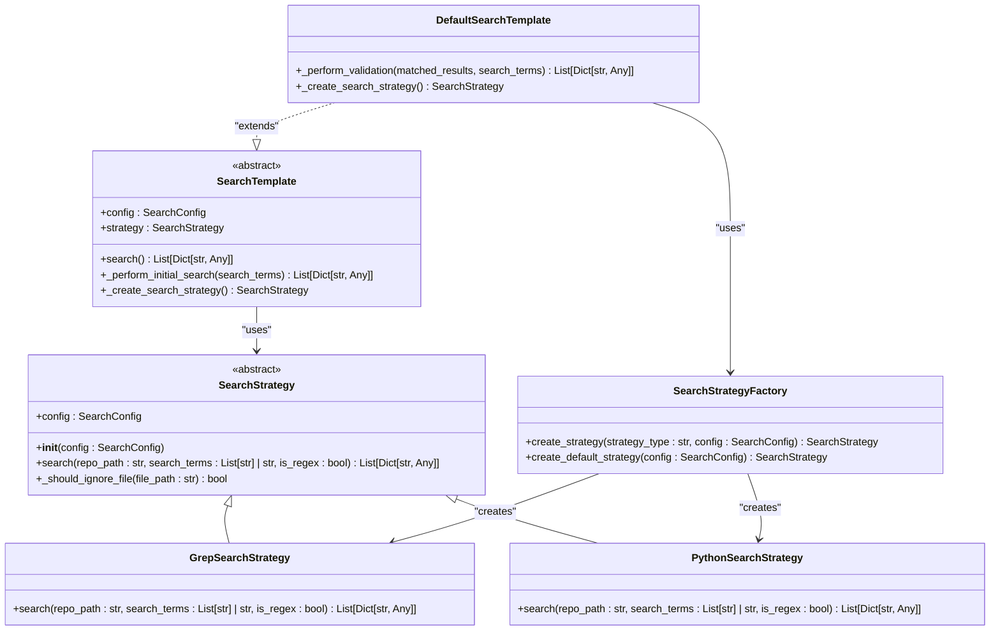
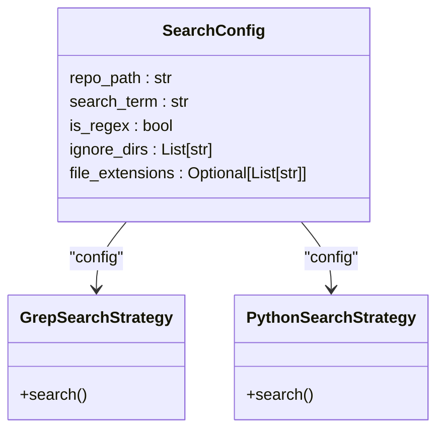

# SearchStrategy 搜索策略对比

<cite>
**Referenced Files in This Document**
- [src/strategies.py](file://src/strategies.py)
- [src/config.py](file://src/config.py)
- [src/search_factory.py](file://src/search_factory.py)
- [src/search_template.py](file://src/search_template.py)
- [src/logger_config.py](file://src/logger_config.py)
</cite>

## 目录
1. [引言](#引言)
2. [核心组件分析](#核心组件分析)
3. [GrepSearchStrategy 实现细节](#grepsearchstrategy-实现细节)
4. [PythonSearchStrategy 实现细节](#pythonsearchstrategy-实现细节)
5. [策略对比分析](#策略对比分析)
6. [配置与依赖关系](#配置与依赖关系)
7. [架构设计模式](#架构设计模式)
8. [结论与建议](#结论与建议)

## 引言

在代码搜索系统中，`GrepSearchStrategy` 与 `PythonSearchStrategy` 是两种核心的搜索策略实现。本文档旨在全面比较这两种策略的实现差异、性能特征和适用场景。`GrepSearchStrategy` 利用系统级工具 `grep` 实现高效搜索，而 `PythonSearchStrategy` 则采用纯 Python 实现提供跨平台兼容性。两者通过策略模式统一接口，并根据环境条件智能降级，构成了一个健壮且灵活的搜索框架。

## 核心组件分析

本节分析构成搜索策略体系的核心类及其交互关系。

**Diagram sources**
- [src/strategies.py](file://src/strategies.py#L1-L232)
- [src/search_factory.py](file://src/search_factory.py#L1-L52)
- [src/search_template.py](file://src/search_template.py#L1-L190)

**Section sources**
- [src/strategies.py](file://src/strategies.py#L1-L232)
- [src/search_factory.py](file://src/search_factory.py#L1-L52)
- [src/search_template.py](file://src/search_template.py#L1-L190)

## GrepSearchStrategy 实现细节

`GrepSearchStrategy` 类实现了基于系统 `grep` 命令的高性能搜索功能。其核心优势在于利用了经过高度优化的 C 语言工具进行文本匹配。

### 命令行参数构造

该策略动态构建 `grep` 命令行参数以支持多种搜索需求：
- **递归搜索**: 使用 `-r` 参数实现目录递归。
- **行号显示**: 使用 `-n` 参数输出匹配行的行号。
- **正则表达式**: 当 `is_regex` 为 `True` 时，添加 `-E` 参数启用扩展正则表达式。
- **目录过滤**: 遍历 `config.ignore_dirs` 配置项，为每个忽略目录添加 `--exclude-dir` 参数。
- **文件类型过滤**: 遍历 `config.file_extensions` 配置项，为每个文件后缀生成 `*.{ext}` 模式并添加 `--include` 参数。

这种构造方式确保了搜索命令能够精确地遵循用户配置，有效减少不必要的文件扫描。

### 超时处理与降级机制

`GrepSearchStrategy` 实现了完善的容错和降级机制：
- **超时处理**: 在执行 `subprocess.run` 时设置 `timeout=300`（5分钟），防止长时间挂起。若超时，捕获 `subprocess.TimeoutExpired` 异常并记录警告。
- **命令缺失降级**: 若系统未安装 `grep`，会抛出 `FileNotFoundError`。此时，策略会自动实例化 `PythonSearchStrategy` 并调用其 `search` 方法，实现无缝降级。
- **异常隔离**: 其他异常被单独捕获并记录为警告，避免因单个搜索词失败而中断整个流程。

此机制保证了即使在不支持 `grep` 的环境中，系统仍能通过纯 Python 实现继续工作，极大地提升了系统的鲁棒性和可用性。

**Section sources**
- [src/strategies.py](file://src/strategies.py#L73-L171)

## PythonSearchStrategy 实现细节

`PythonSearchStrategy` 提供了一种完全由 Python 实现的替代方案，牺牲部分性能以换取最大的跨平台兼容性。

### 纯 Python 文件遍历与匹配

该策略的实现逻辑如下：
- **文件遍历**: 使用 `glob.glob(os.path.join(repo_path, '**/*'), recursive=True)` 递归遍历指定路径下的所有文件。
- **文件过滤**: 对每个文件调用 `_should_ignore_file` 方法，检查其是否位于忽略目录或具有不允许的文件后缀。
- **逐行匹配**: 打开每个文件后，读取所有行 (`f.readlines()`)，然后对每一行进行循环检查。
- **匹配逻辑**: 支持两种模式：普通字符串包含 (`in` 操作符) 和正则表达式匹配 (`re.search`)。

### 异常容错处理

为了应对各种文件读取问题，该策略实现了细粒度的异常处理：
- **编码错误**: 显式捕获 `UnicodeDecodeError`，用于跳过非 UTF-8 编码的二进制文件或特殊编码文本。
- **权限错误**: 捕获 `PermissionError`，用于跳过当前用户无权访问的文件。
- **其他异常**: 捕获更广泛的 `Exception`，记录警告但不中断整体搜索流程。

这种“尽力而为”的策略确保了搜索过程不会因为个别文件的问题而崩溃，提高了在复杂项目环境中的稳定性。

**Section sources**
- [src/strategies.py](file://src/strategies.py#L174-L232)

## 策略对比分析

下表详细对比了两种搜索策略的关键特性：

| 特性 | GrepSearchStrategy | PythonSearchStrategy |
| :--- | :--- | :--- |
| **性能** | 极高。利用高度优化的 C 工具，搜索速度非常快。 | 较低。受 Python 解释器和 I/O 操作限制，速度较慢。 |
| **跨平台兼容性** | 有限。依赖系统 `grep` 命令，在 Windows 等非 Unix-like 系统上可能不可用。 | 极佳。纯 Python 实现，可在任何支持 Python 的平台上运行。 |
| **功能完整性** | 完整。支持 `grep` 的全部功能，如高效的正则表达式引擎。 | 基本完整。功能受限于 Python 的 `re` 模块和文件操作能力。 |
| **资源消耗** | 低。`grep` 进程通常内存占用小且效率高。 | 较高。需要将整个文件加载到内存中，对大文件不友好。 |
| **容错性** | 中等。主要依赖 `grep` 自身的错误处理。 | 高。实现了针对 `UnicodeDecodeError` 和 `PermissionError` 的专门处理。 |
| **可调试性** | 中等。可通过日志查看执行的命令行。 | 高。所有逻辑都在 Python 中，易于调试和修改。 |

### 性能与兼容性的权衡

选择哪种策略本质上是在**性能**和**兼容性**之间做权衡。
- **优先性能**: 在 Linux/macOS 服务器或开发机上，应首选 `GrepSearchStrategy`，它能显著缩短大型代码库的搜索时间。
- **优先兼容性**: 在 Windows 环境或无法保证 `grep` 可用的容器化部署中，`PythonSearchStrategy` 是更安全的选择，尽管速度较慢。

此外，`GrepSearchStrategy` 内置的降级机制巧妙地结合了两者的优点：在理想环境下使用高性能的 `grep`，在非理想环境下自动回退到可靠的 Python 实现，实现了最佳的用户体验。

## 配置与依赖关系

搜索策略的行为受到 `SearchConfig` 配置对象的控制，该对象定义了影响两种策略的共享参数。

**Diagram sources**
- [src/config.py](file://src/config.py#L1-L37)
- [src/strategies.py](file://src/strategies.py#L1-L232)

**Section sources**
- [src/config.py](file://src/config.py#L1-L37)

关键配置项包括：
- **ignore_dirs**: 一个字符串列表，定义了需要排除的目录（如 `.git`, `node_modules`）。两个策略都使用此列表来过滤文件