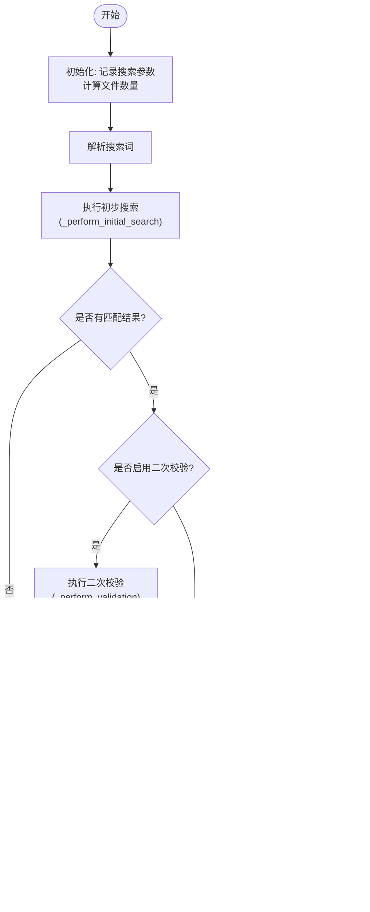

# SearchTemplate 搜索流程设计

<cite>
**Referenced Files in This Document**   
- [search_template.py](file://src/search_template.py)
- [validators.py](file://src/validators.py)
- [searcher.py](file://src/searcher.py)
- [strategies.py](file://src/strategies.py)
- [search_factory.py](file://src/search_factory.py)
</cite>

## 目录
1. [模板方法模式概述](#模板方法模式概述)
2. [核心类结构分析](#核心类结构分析)
3. [_search() 主流程解析](#_search-主流程解析)
4. [钩子方法设计意图](#钩子方法设计意图)
5. [二次校验机制详解](#二次校验机制详解)
6. [并发验证性能优势](#并发验证性能优势)
7. [搜索策略工厂化创建](#搜索策略工厂化创建)
8. [执行流程图示](#执行流程图示)

## 模板方法模式概述

`SearchTemplate` 类采用模板方法设计模式，定义了搜索算法的骨架，将具体实现延迟到子类。该模式通过抽象基类 `SearchTemplate` 定义了完整的搜索流程，同时允许子类如 `DefaultSearchTemplate` 重写特定步骤以定制行为。

这种设计实现了算法流程的标准化与具体实现的灵活性之间的平衡，使得核心搜索逻辑保持一致，而关键环节可根据需求进行扩展和优化。

**Section sources**
- [search_template.py](file://src/search_template.py#L17-L166)

## 核心类结构分析

`SearchTemplate` 是一个抽象基类，继承自 Python 的 `ABC`（Abstract Base Class），定义了搜索流程的核心框架。其子类 `DefaultSearchTemplate` 提供了默认的具体实现。


**Diagram sources**
- [search_template.py](file://src/search_template.py#L17-L189)

**Section sources**
- [search_template.py](file://src/search_template.py#L17-L189)

## _search() 主流程解析

`search()` 方法是模板方法的核心，定义了从开始到结束的完整搜索流程：

1. **初始化日志记录**：输出搜索参数、仓库路径等基本信息
2. **文件计数**：统计待分析的文件总数
3. **搜索词解析**：将输入的搜索词字符串按逗号分割为列表
4. **初步搜索**：调用 `_perform_initial_search()` 执行首次匹配
5. **二次校验**：若配置启用，则调用 `_perform_validation()` 进行结果验证
6. **结果返回**：返回最终的匹配结果列表

此流程确保了所有子类都遵循相同的执行顺序，保证了系统的一致性和可预测性。



**Diagram sources**
- [search_template.py](file://src/search_template.py#L30-L70)

**Section sources**
- [search_template.py](file://src/search_template.py#L30-L70)

## 钩子方法设计意图

### _perform_initial_search()

该方法负责执行初步匹配，使用由 `_create_search_strategy()` 创建的搜索策略来扫描文件内容。它作为模板方法中的一个可变步骤，但在此抽象类中已提供默认实现，直接委托给策略对象执行搜索。

### _perform_validation()

这是一个抽象方法，要求所有子类必须实现。在 `DefaultSearchTemplate` 中，它通过调用 `parallel_validate` 函数实现二次校验功能。二次校验的主要目的是提高结果准确性，特别是在使用外部工具（如 grep）时，可能存在误报或编码问题导致的错误匹配。

### _create_search_strategy()

这也是一个抽象方法，用于工厂化创建具体的搜索策略实例。在 `DefaultSearchTemplate` 中，它通过 `SearchStrategyFactory.create_default_strategy()` 创建默认的 Grep 搜索策略。这种设计支持未来轻松扩展其他类型的搜索策略。

**Section sources**
- [search_template.py](file://src/search_template.py#L159-L166)
- [search_template.py](file://src/search_template.py#L172-L183)
- [search_template.py](file://src/search_template.py#L185-L189)

## 二次校验机制详解

二次校验的启用条件由配置项 `self.config.validate` 控制。当该标志为 `True` 时，系统会在初步搜索后执行额外的验证步骤。

其主要作用包括：
- **结果准确性提升**：重新读取文件内容并逐行验证匹配，避免因外部工具行为差异导致的误报
- **编码兼容性处理**：尝试多种编码格式（UTF-8、GBK、Latin-1 等）读取文件，解决字符编码不一致问题
- **上下文完整性保障**：确保返回的行号和内容与实际文件完全对应

在 `DefaultSearchTemplate` 的实现中，二次校验通过调用 `parallel_validate` 函数完成，该函数利用多进程池对匹配结果进行并行验证。


**Diagram sources**
- [search_template.py](file://src/search_template.py#L172-L183)
- [searcher.py](file://src/searcher.py#L233-L275)

**Section sources**
- [search_template.py](file://src/search_template.py#L172-L183)
- [searcher.py](file://src/searcher.py#L233-L275)

## 并发验证性能优势

`parallel_validate` 函数采用 `ProcessPoolExecutor` 实现多进程并行处理，相比单线程验证具有显著性能优势：

- **CPU 利用率最大化**：充分利用多核 CPU 资源，避免 I/O 阻塞造成的资源浪费
- **时间复杂度优化**：将 O(n) 的串行验证优化为接近 O(n/p) 的并行处理（p 为工作进程数）
- **可配置性**：通过 `validate_workers` 配置项灵活调整并发级别，适应不同硬件环境

对于包含大量匹配文件的场景，并发验证能大幅缩短整体搜索耗时，尤其在高配服务器上效果更为明显。

**Section sources**
- [searcher.py](file://src/searcher.py#L233-L275)

## 搜索策略工厂化创建

`_create_search_strategy()` 方法体现了工厂模式的应用。通过 `SearchStrategyFactory.create_default_strategy()` 创建具体的搜索策略实例，目前默认返回 `GrepSearchStrategy`。

这种设计的优势在于：
- **解耦配置与实现**：搜索模板无需关心具体策略的创建细节
- **易于扩展**：未来可添加新的搜索策略（如全文索引、正则优化等）而不影响现有代码
- **统一管理**：所有策略创建逻辑集中在工厂类中，便于维护和测试


**Diagram sources**
- [strategies.py](file://src/strategies.py#L18-L70)
- [search_factory.py](file://src/search_factory.py#L40-L51)

**Section sources**
- [strategies.py](file://src/strategies.py#L18-L70)
- [search_factory.py](file://src/search_factory.py#L40-L51)

## 执行流程图示

以下是 `DefaultSearchTemplate` 完整执行流程的综合图示：

```mermaid
flowchart TD
    A([开始搜索]) --> B["记录搜索参数<br/>计算文件数量"]
    B --> C["解析搜索词"]
    C --> D["创建Grep搜索策略<br/>(SearchStrategyFactory)"]
    D --> E["执行初步搜索<br/>(GrepSearchStrategy.search)"]
    E --> F{"有匹配结果?"}
    F -->|否| Z([返回空结果])
    F -->|是| G["是否启用二次校验?"]
    G -->|否| Y([返回初步结果])
    G -->|是| H["启动并行验证<br/>(parallel_validate)"]
    H --> I["创建多进程池"]
    I --> J["为每个文件分配验证任务"]
    J --> K["并行读取文件内容<br/>验证匹配行"]
    K --> L["合并各进程