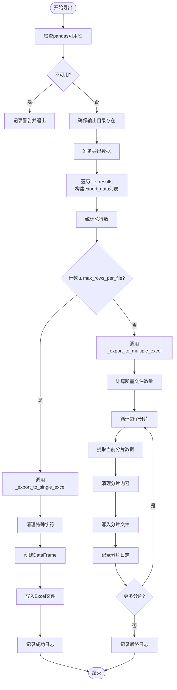

# Excel导出与分片机制

<cite>
**Referenced Files in This Document**  
- [exporter.py](file://src/exporter.py)
- [logger_config.py](file://src/logger_config.py)
</cite>

## 目录
1. [简介](#简介)
2. [核心组件](#核心组件)
3. [Excel导出流程](#excel导出流程)
4. [数据分片策略](#数据分片策略)
5. [DataFrame创建与写入](#dataframe创建与写入)
6. [内容清理逻辑](#内容清理逻辑)
7. [列映射关系](#列映射关系)
8. [配置参数说明](#配置参数说明)

## 简介
`ExcelExporter` 组件是代码搜索系统中负责将搜索结果持久化为Excel文件的核心模块。该组件通过智能判断数据量大小，自动选择单文件输出或分片导出策略，确保在满足Excel格式限制的同时提供高效的数据导出能力。

## 核心组件

`ExcelExporter` 类封装了完整的Excel导出功能，其主要职责包括：
- 数据结构转换：将原始搜索结果转换为适合表格展示的扁平化结构
- 文件拆分决策：根据 `_max_rows_per_file` 参数决定是否进行分片导出
- 内容预处理：清洗可能导致Excel解析错误的特殊字符和超长文本
- 异常安全写入：利用pandas和openpyxl实现稳定可靠的文件写入

**Section sources**
- [exporter.py](file://src/exporter.py#L15-L149)

## Excel导出流程



**Diagram sources**
- [exporter.py](file://src/exporter.py#L20-L57)

**Section sources**
- [exporter.py](file://src/exporter.py#L20-L57)

## 数据分片策略

当搜索结果超过单个Excel文件的行数限制时，系统会自动触发分片导出机制。这一过程由 `_export_to_multiple_excel` 方法实现：

1. **分片数量计算**：使用 `(总行数 + 每文件最大行数 - 1) // 每文件最大行数` 公式向上取整确定所需文件数量
2. **动态命名规则**：基础文件名后追加 `_part_N.xlsx` 后缀（N从1开始递增）
3. **边界处理**：最后一个分片可能包含少于最大行数的记录
4. **进度追踪**：每完成一个分片即记录日志，便于监控导出进度

例如，若 `max_rows_per_file=100000` 且总共有250,000条匹配记录，则会生成三个文件：
- `result_part_1.xlsx` （前10万行）
- `result_part_2.xlsx` （中间10万行）
- `result_part_3.xlsx` （剩余5万行）

```mermaid
graph TB
subgraph "输入"
A[总数据: 250,000行]
B[max_rows_per_file: 100,000]
end
subgraph "处理"
C[计算分片数: (250k+100k-1)//100k = 3]
D[分片1: 行0-99,999]
E[分片2: 行100,000-199,999]
F[分片3: 行200,000-249,999]
end
subgraph "输出"
G[result_part_1.xlsx]
H[result_part_2.xlsx]
I[result_part_3.xlsx]
end
A --> C
B --> C
C --> D
C --> E
C --> F
D --> G
E --> H
F --> I
```

**Diagram sources**
- [exporter.py](file://src/exporter.py#L79-L120)

**Section sources**
- [exporter.py](file://src/exporter.py#L79-L120)

## DataFrame创建与写入

`_create_and_export_dataframe` 方法负责将清洗后的数据转换为pandas DataFrame并写入磁盘：

1. 使用 `pd.DataFrame(data)` 构造函数将字典列表转换为结构化数据表
2. 调用 `df.to_excel()` 方法执行实际写入操作
3. 指定 `index=False` 避免额外索引列
4. 明确设置 `engine='openpyxl'` 确保兼容现代Excel格式

此方法作为底层写入接口，被单文件和多文件导出路径共同调用，体现了良好的代码复用设计。

**Section sources**
- [exporter.py](file://src/exporter.py#L122-L126)

## 内容清理逻辑

为了确保生成的Excel文件能够被正确读取，`_clean_excel_content` 方法实施了严格的输入净化策略：


具体清理规则如下：
- **非法字符过滤**：移除 `\`, `/`, `?`, `*`, `[`, `]`, `:` 等Excel禁止使用的路径相关字符
- **控制字符清除**：删除ASCII 0-31范围内的不可见控制符（保留制表符、换行符和回车符）
- **长度限制**：对超过32,767字符的单元格内容进行截断，并以省略号标记

**Diagram sources**
- [exporter.py](file://src/exporter.py#L128-L149)

**Section sources**
- [exporter.py](file://src/exporter.py#L128-L149)

## 列映射关系

搜索结果中的 `file_results` 结构会被映射为以下Excel列：

| 源字段 | Excel列名 | 数据类型 | 示例值 |
|--------|-----------|---------|-------|
| file_info['file_path'] | File Path | 字符串 | src/main.py |
| match['line_number'] | Line Number | 整数 | 42 |
| match['content'] | Matched Content | 字符串 | print("Hello World") |
| match['search_term'] | Search Term | 字符串 | Hello |

这种扁平化的二维表结构使得用户可以方便地进行排序、筛选和分析操作。

**Section sources**
- [exporter.py](file://src/exporter.py#L30-L38)

## 配置参数说明

### max_rows_per_file 参数
- **默认值**：100,000 行
- **作用**：控制单个Excel文件的最大行数，防止文件过大导致性能问题或超出软件限制
- **自定义方式**：实例化时传入特定值
```python
exporter = ExcelExporter("output.xlsx", max_rows_per_file=50000)
```
- **推荐值**：
  - 常规环境：50,000–100,000（平衡可读性与性能）
  - 大数据场景：200,000+（减少文件碎片）
  - 低内存设备：10,000–20,000（避免内存溢出）

### 依赖管理
组件采用优雅降级策略：当检测到缺少 `pandas` 或 `openpyxl` 依赖时，仅记录警告而不中断程序执行，保证系统的健壮性。

**Section sources**
- [exporter.py](file://src/exporter.py#L17)
- [logger_config.py](file://src/logger_config.py#L1-L24)