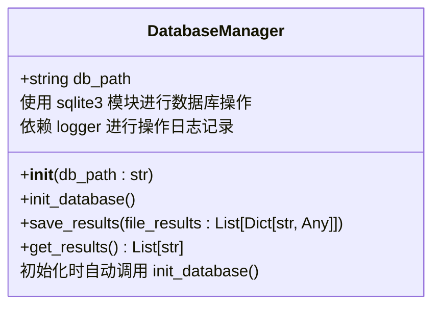
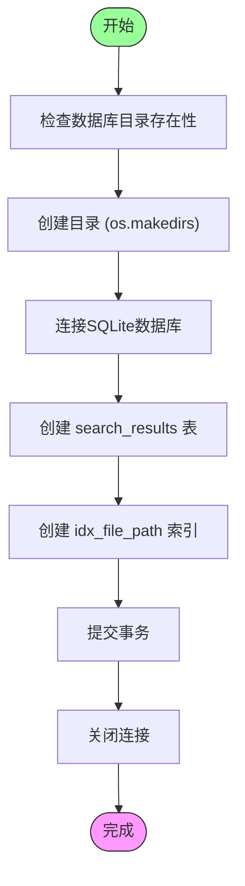
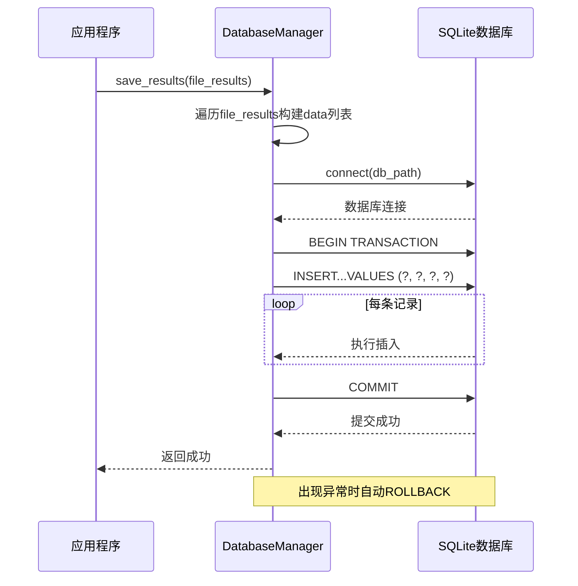
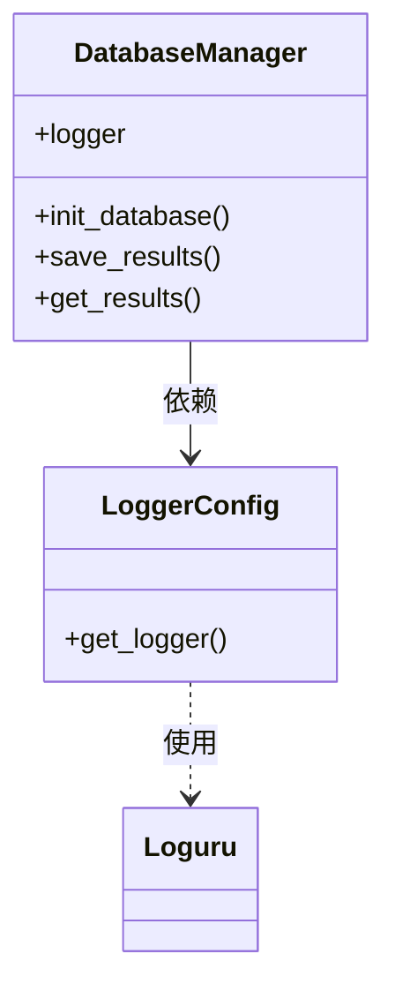

# SQLite数据库存储

<cite>
**本文档引用的文件**
- [database.py](file://src/database.py)
- [logger_config.py](file://src/logger_config.py)
</cite>

## 目录
1. [引言](#引言)
2. [DatabaseManager类概述](#databasemanager类概述)
3. [数据库初始化机制](#数据库初始化机制)
4. [搜索结果持久化](#搜索结果持久化)
5. [数据查询流程](#数据查询流程)
6. [配置与路径管理](#配置与路径管理)
7. [日志集成](#日志集成)
8. [最佳实践建议](#最佳实践建议)
9. [结论](#结论)

## 引言

在Hello-Scan-Code项目中，`DatabaseManager`类承担着核心的数据持久化职责。该组件通过SQLite这一轻量级嵌入式数据库系统，为代码搜索功能提供可靠的结果存储与检索能力。本技术文档将深入剖析`DatabaseManager`类的设计与实现，重点阐述其如何通过结构化的数据库操作保障搜索结果的完整性、一致性和可访问性。

## DatabaseManager类概述

`DatabaseManager`是一个封装了SQLite数据库操作的核心类，负责管理搜索结果的全生命周期。该类采用面向对象设计模式，将数据库连接、表结构定义、数据增删改查等操作封装在统一的接口之下，为上层应用提供了简洁而强大的数据访问抽象。



**Diagram sources**
- [database.py](file://src/database.py#L7-L98)

**Section sources**
- [database.py](file://src/database.py#L7-L98)

## 数据库初始化机制

### 初始化流程

`DatabaseManager`类在实例化时即自动触发数据库初始化过程。该过程由`init_database`方法实现，确保每次应用启动时数据库环境处于就绪状态。



**Diagram sources**
- [database.py](file://src/database.py#L12-L46)

#### 表结构设计

`search_results`表采用规范化设计，包含以下字段：

| 字段名 | 数据类型 | 约束 | 说明 |
|--------|---------|------|------|
| id | INTEGER | PRIMARY KEY AUTOINCREMENT | 自增主键 |
| file_path | TEXT | NOT NULL | 匹配文件的完整路径 |
| line_number | TEXT | - | 匹配内容所在的行号 |
| matched_content | TEXT | - | 实际匹配的代码内容 |
| search_term | TEXT | - | 原始搜索关键词 |

#### 索引优化

为提升基于文件路径的查询性能，系统创建了名为`idx_file_path`的B树索引。此索引显著加速了按文件路径进行结果过滤和聚合的操作。

**Section sources**
- [database.py](file://src/database.py#L12-L46)

## 搜索结果持久化

### 批量插入机制

`save_results`方法实现了高效的批量数据插入策略，通过`executemany`接口一次性提交多条记录，大幅减少了数据库交互开销。



**Diagram sources**
- [database.py](file://src/database.py#L48-L81)

### 数据映射逻辑

方法接收一个包含文件搜索结果的列表`file_results`，其典型结构如下：

```python
[
    {
        "file_path": "/path/to/file.py",
        "matches": [
            {
                "line_number": "42",
                "content": "def hello_scan_code():",
                "search_term": "hello"
            }
        ]
    }
]
```

内部通过双重循环将嵌套结构扁平化为适合批量插入的元组列表。

### 事务管理

该方法实现了完整的ACID事务语义：
- **原子性**：所有插入操作在单个事务中完成
- **一致性**：通过外键和约束保证数据完整性
- **隔离性**：SQLite默认的串行化隔离级别
- **持久性**：成功提交后数据永久保存

任何阶段发生异常都将触发回滚并向上抛出，确保不会产生部分写入的脏数据。

**Section sources**
- [database.py](file://src/database.py#L48-L81)

## 数据查询流程

`get_results`方法提供从数据库读取搜索结果的基础能力。当前实现返回所有匹配文件的路径列表，为后续结果展示和分析提供数据源。


尽管当前查询较为简单，但其设计预留了扩展空间，可轻松支持更复杂的条件查询、分页和排序功能。

**Section sources**
- [database.py](file://src/database.py#L83-L98)

## 配置与路径管理

`DatabaseManager`通过构造函数参数`db_path`接收数据库文件路径。在初始化过程中，会自动调用`os.makedirs(db_dir, exist_ok=True)`确保数据库所在目录存在，体现了良好的用户体验设计。

这种机制允许用户指定任意路径（如`./data/search.db`或`/var/lib/hello-scan-code/results.db`），系统将自动创建必要的目录结构，降低了使用门槛。

**Section sources**
- [database.py](file://src/database.py#L8-L10)

## 日志集成

`DatabaseManager`与项目的日志系统深度集成，所有关键操作均通过`logger`实例记录详细信息：

- 数据库初始化成功/失败
- 结果保存统计信息（文件数、匹配数）
- 各类异常情况

日志配置由`logger_config.py`模块提供，采用Loguru框架实现结构化日志输出，支持文件轮转和控制台同步显示。



**Diagram sources**
- [logger_config.py](file://src/logger_config.py#L23-L24)
- [database.py](file://src/database.py#L7-L98)

**Section sources**
- [logger_config.py](file://src/logger_config.py#L1-L24)

## 最佳实践建议

### SQLite优势与局限

**优势：**
- 零配置、无需独立服务器进程
- 单文件数据库便于备份和迁移
- 跨平台兼容性好
- ACID事务支持

**局限：**
- 并发写入性能有限（同一时间仅一个写操作）
- 不适合高并发场景
- 大数据量时性能下降明显

### 连接管理

建议保持短连接模式，即每次操作后立即关闭连接。这符合SQLite的设计哲学，避免长时间占用锁资源。

### 写入性能优化

- 继续使用`executemany`进行批量插入
- 考虑在大量数据导入时临时禁用索引，导入完成后再重建
- 合理设置事务大小，平衡内存使用和性能

### 并发访问注意事项

- 避免多个进程同时写入同一数据库文件
- 读写操作可能阻塞，需合理设计超时机制
- 考虑使用WAL（Write-Ahead Logging）模式提升并发性能

## 结论

`DatabaseManager`类为Hello-Scan-Code项目提供了稳健可靠的数据持久化解决方案。通过精心设计的表结构、高效的批量插入机制和完善的错误处理，该组件有效支撑了代码搜索功能的核心需求。其简洁的API设计和自动化的初始化流程，使得数据库管理对使用者近乎透明。未来可在此基础上扩展更多高级查询功能，进一步提升用户体验。