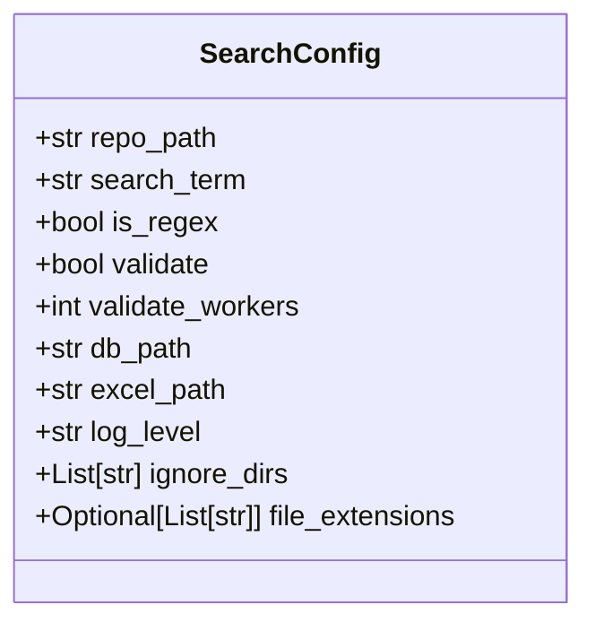
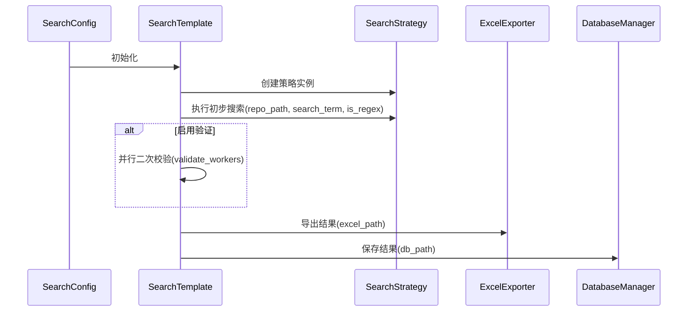

# 配置参数详解

<cite>
**Referenced Files in This Document**   
- [src/config.py](file://src/config.py)
- [src/search_template.py](file://src/search_template.py)
- [src/strategies.py](file://src/strategies.py)
- [src/database.py](file://src/database.py)
- [src/exporter.py](file://src/exporter.py)
</cite>

## 目录
1. [SearchConfig 数据类概述](#searchconfig-数据类概述)
2. [核心路径配置](#核心路径配置)
3. [搜索条件配置](#搜索条件配置)
4. [文件过滤配置](#文件过滤配置)
5. [输出与持久化配置](#输出与持久化配置)
6. [配置消费机制](#配置消费机制)
7. [输入验证与错误处理](#输入验证与错误处理)

## SearchConfig 数据类概述

`SearchConfig` 是整个代码搜索系统的核心配置数据类，采用 Python 的 `dataclass` 实现，定义了搜索操作的所有可配置参数。该类通过默认值提供了开箱即用的配置，同时允许用户根据具体需求进行定制。

**Diagram sources**
- [src/config.py](file://src/config.py#L6-L18)

**Section sources**
- [src/config.py](file://src/config.py#L6-L18)

## 核心路径配置

### repo_path（代码仓库路径）
- **类型**: `str`
- **默认值**: `/root/CodeRootPath`
- **作用机制**: 指定要搜索的代码仓库根目录路径。所有搜索操作都将在此目录及其子目录中递归执行。
- **行为说明**: 该参数被 `SearchTemplate` 和 `SearchStrategy` 类用于确定搜索范围。在 `_count_files` 和 `search` 方法中，会基于此路径使用 `glob.glob()` 进行文件遍历。

**Section sources**
- [src/config.py](file://src/config.py#L7-L7)
- [src/search_template.py](file://src/search_template.py#L50-L59)
- [src/strategies.py](file://src/strategies.py#L100-L103)

### db_path（数据库保存路径）
- **类型**: `str`
- **默认值**: `db/results.db`
- **作用机制**: 指定 SQLite 数据库文件的存储路径，用于持久化保存搜索结果。
- **行为说明**: `DatabaseManager` 类在初始化时会检查并创建该路径的目录结构，并将搜索结果批量插入到 `search_results` 表中。

**Section sources**
- [src/config.py](file://src/config.py#L12-L12)
- [src/database.py](file://src/database.py#L13-L28)

### excel_path（Excel导出路径）
- **类型**: `str`
- **默认值**: `report/results.xlsx`
- **作用机制**: 指定 Excel 报告文件的导出路径，用于生成可视化结果报告。
- **行为说明**: `ExcelExporter` 类会确保输出目录存在，并根据数据量决定是导出到单个文件还是拆分为多个文件以避免超出 Excel 行数限制。

**Section sources**
- [src/config.py](file://src/config.py#L13-L13)
- [src/exporter.py](file://src/exporter.py#L15-L16)

## 搜索条件配置

### search_term（逗号分隔的关键字）
- **类型**: `str`
- **默认值**: `test,def,void`
- **作用机制**: 定义要搜索的关键字或模式，支持逗号分隔的多个搜索词。
- **行为说明**: 在 `SearchTemplate._parse_search_terms()` 中被解析为列表，然后传递给具体的搜索策略（如 `GrepSearchStrategy` 或 `PythonSearchStrategy`）进行匹配。

**Section sources**
- [src/config.py](file://src/config.py#L8-L8)
- [src/search_template.py](file://src/search_template.py#L130-L135)

### is_regex（是否启用正则）
- **类型**: `bool`
- **默认值**: `False`
- **作用机制**: 控制搜索是否使用正则表达式模式匹配而非简单的字符串包含匹配。
- **行为说明**: 当设置为 `True` 时，`GrepSearchStrategy` 会添加 `-E` 参数，而 `PythonSearchStrategy` 会使用 `re.search()` 而非 `in` 操作符。

**Section sources**
- [src/config.py](file://src/config.py#L9-L9)
- [src/strategies.py](file://src/strategies.py#L100-L103)

## 文件过滤配置

### ignore_dirs（忽略目录列表）
- **类型**: `List[str]`
- **默认值**: `.git`, `__pycache__`, `.svn`, `.hg`, `.idea`, `.vscode`, `node_modules`, `.tox`
- **作用机制**: 定义应被排除在搜索之外的目录名称列表。
- **行为说明**: `SearchTemplate._should_ignore_file()` 和 `SearchStrategy._should_ignore_file()` 方法会检查文件路径是否包含这些目录名，从而决定是否跳过该文件。

**Section sources**
- [src/config.py](file://src/config.py#L16-L16)
- [src/search_template.py](file://src/search_template.py#L100-L115)

### file_extensions（文件后缀白名单）
- **类型**: `Optional[List[str]]`
- **默认值**: `None`
- **作用机制**: 定义允许搜索的文件扩展名列表，`None` 表示不限制文件类型。
- **行为说明**: 当该列表不为空时，系统会检查文件扩展名，仅搜索匹配指定后缀的文件，在 `GrepSearchStrategy` 中还会通过 `--include` 参数传递给 grep 命令。

**Section sources**
- [src/config.py](file://src/config.py#L18-L18)
- [src/search_template.py](file://src/search_template.py#L117-L127)
- [src/strategies.py](file://src/strategies.py#L130-L138)

## 输出与持久化配置

**Diagram sources**
- [src/config.py](file://src/config.py#L12-L13)
- [src/exporter.py](file://src/exporter.py#L45-L90)
- [src/database.py](file://src/database.py#L45-L65)

## 配置消费机制

### SearchStrategy 消费配置
搜索策略模块直接消费配置参数来决定搜索行为：
- `repo_path` 作为搜索根目录
- `search_term` 和 `is_regex` 决定匹配逻辑
- `ignore_dirs` 和 `file_extensions` 用于文件过滤

### SearchTemplate 消费配置
搜索模板模块利用配置实现高级功能：
- 使用 `validate` 和 `validate_workers` 控制是否进行二次校验及并发程度
- 通过 `log_level` 设置日志详细程度
- 利用路径参数确保输出目录存在

**Diagram sources**
- [src/config.py](file://src/config.py#L6-L18)
- [src/search_template.py](file://src/search_template.py#L30-L165)
- [src/strategies.py](file://src/strategies.py#L50-L230)
- [src/exporter.py](file://src/exporter.py#L15-L145)
- [src/database.py](file://src/database.py#L13-L95)

## 输入验证与错误处理

### 合法输入示例
- `repo_path`: `/home/user/project` (存在的目录路径)
- `search_term`: `function,class,interface` (有效的逗号分隔关键字)
- `file_extensions`: [".py", ".js"] (有效的文件扩展名列表)

### 非法输入示例及系统响应
- `repo_path`: `/nonexistent/path` → 系统记录警告但继续执行，最终返回空结果
- `db_path`: `/restricted/directory/db.db` → 抛出异常并记录错误日志
- `excel_path`: 包含非法字符的文件名 → `ExcelExporter._clean_excel_content()` 自动清理特殊字符

**Section sources**
- [src/config.py](file://src/config.py#L6-L18)
- [src/exporter.py](file://src/exporter.py#L130-L145)