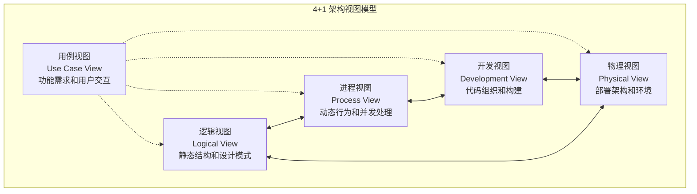
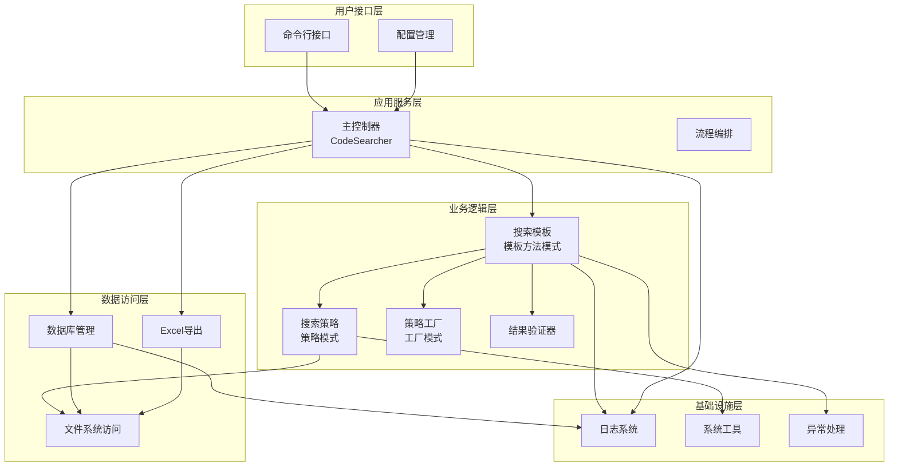
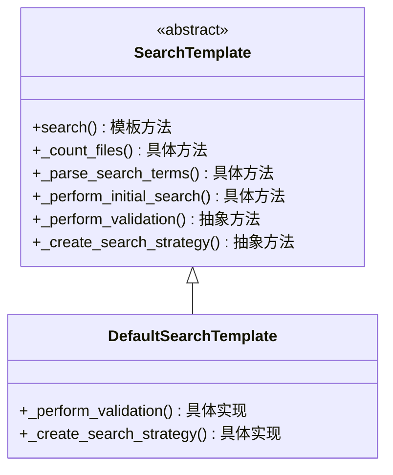
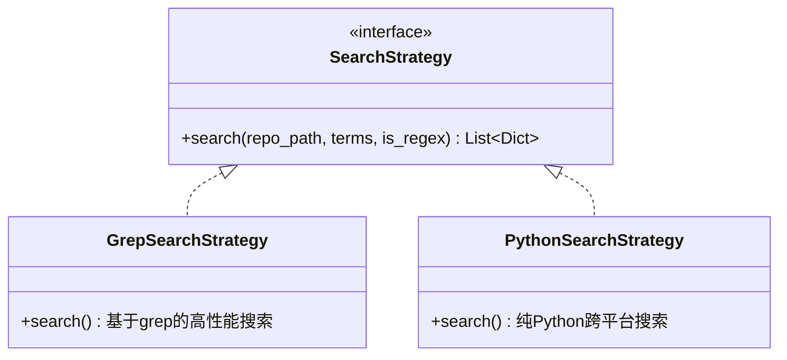
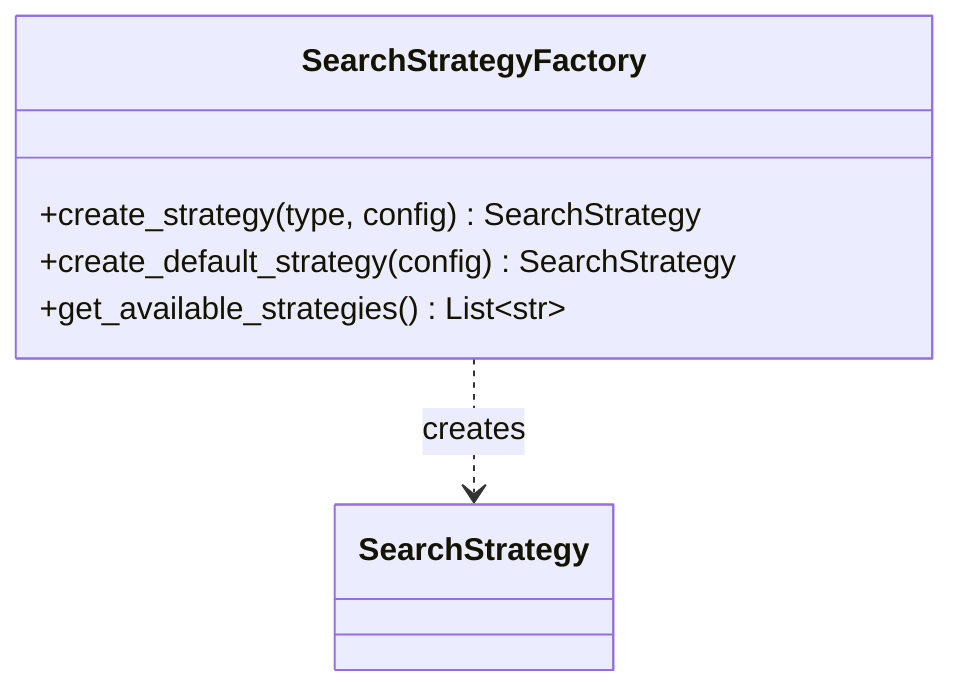
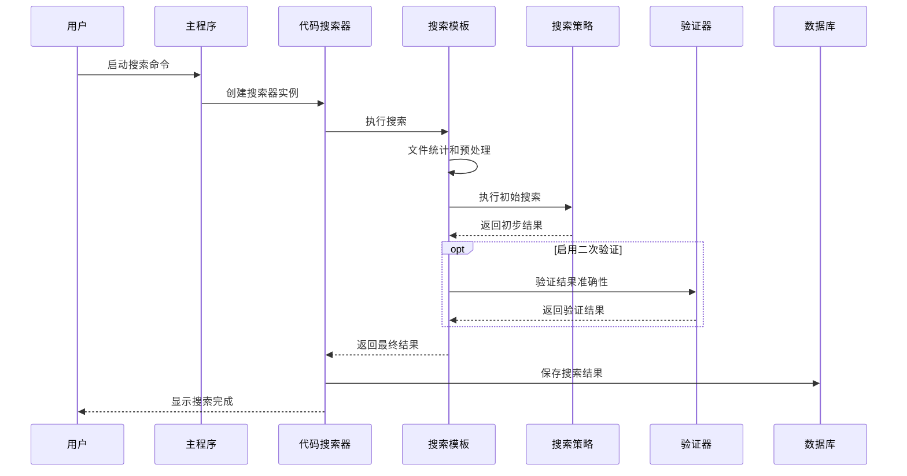
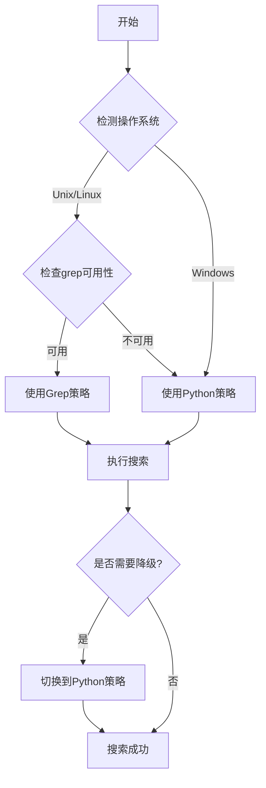
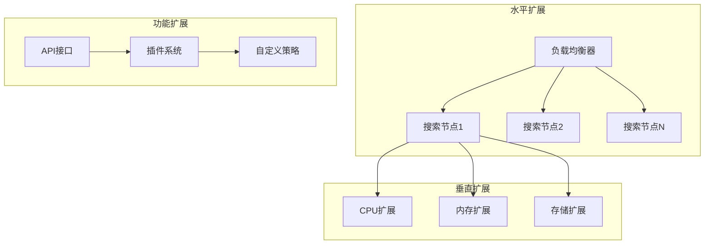
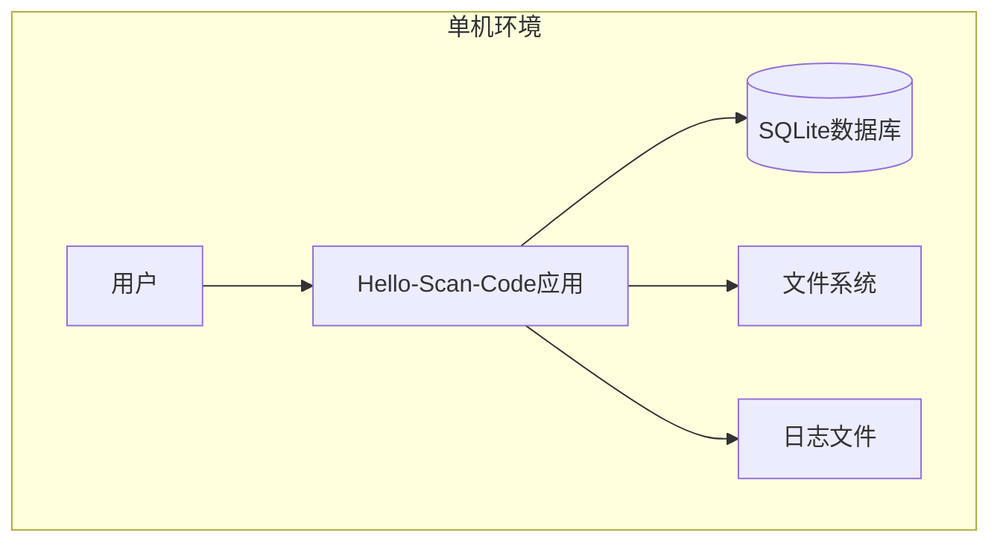
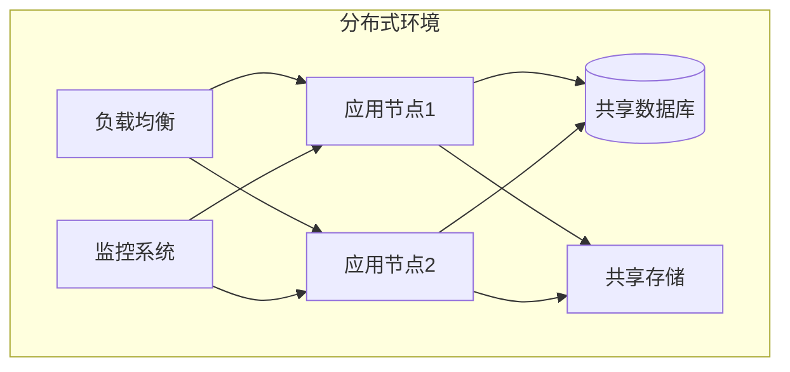

# Hello-Scan-Code 架构总览

## 概述

Hello-Scan-Code是一个高效的代码搜索工具，采用现代软件架构设计模式构建。本文档基于4+1视图模型提供系统架构的全面概览，涵盖了用例视图、逻辑视图、进程视图、开发视图和物理视图。

## 4+1视图模型架构

## 系统核心价值

### 1. 核心功能特性

- **多关键词搜索**: 支持单个或多个关键词的灵活搜索
- **正则表达式支持**: 强大的模式匹配能力
- **智能文件过滤**: 基于扩展名和路径的精确过滤
- **双重搜索策略**: Grep高性能搜索 + Python跨平台兼容
- **二次内容校验**: 确保搜索结果的准确性
- **多格式导出**: SQLite数据库存储 + Excel报表导出

### 2. 技术优势

- **高性能**: 基于系统级grep优化，支持大规模代码库搜索
- **跨平台**: Windows、Linux、macOS全平台支持
- **可扩展**: 基于设计模式的模块化架构
- **可靠性**: 完善的错误处理和容错机制
- **易用性**: 简洁的命令行接口和丰富的配置选项

## 架构分层设计

## 核心设计模式

### 1. 模板方法模式 (Template Method)

**应用场景**: 定义搜索流程骨架，统一搜索算法结构

### 2. 策略模式 (Strategy)

**应用场景**: 根据环境动态选择最优搜索算法

### 3. 工厂模式 (Factory)

**应用场景**: 解耦策略对象创建，支持环境自适应选择

## 关键技术流程

### 1. 搜索执行流程

### 2. 策略选择机制

## 性能和可扩展性

### 1. 性能优化策略

- **搜索性能**: 优先使用系统级grep，自动降级到Python搜索
- **并行处理**: 支持多线程并行验证，提升大数据集处理效率
- **内存管理**: 流式处理大文件，避免内存溢出
- **缓存机制**: 智能缓存搜索结果和文件元数据
- **IO优化**: 批量数据库操作，减少磁盘IO次数

### 2. 可扩展性设计

## 质量属性

### 1. 功能性 (Functionality)

- **准确性**: 二次验证机制确保结果准确
- **完整性**: 全面的文件扫描，不遗漏匹配内容
- **互操作性**: 跨平台兼容，支持多种文件编码

### 2. 可靠性 (Reliability)

- **容错性**: 优雅处理文件权限、编码等异常
- **恢复性**: 自动策略降级和错误恢复
- **稳定性**: 内存泄漏防护和资源清理

### 3. 可用性 (Usability)

- **易学性**: 直观的命令行接口
- **易用性**: 丰富的配置选项和默认值
- **错误预防**: 详细的错误信息和使用建议

### 4. 性能 (Performance)

- **响应时间**: 小型项目(<1000文件) < 10秒
- **吞吐量**: 支持大型代码库(>10万文件)
- **资源效率**: 合理的CPU和内存使用

### 5. 可维护性 (Maintainability)

- **模块化**: 清晰的模块边界和职责分离
- **可扩展性**: 基于接口的插件式架构
- **可测试性**: 完善的单元测试和集成测试

## 部署架构

### 1. 单机部署

适用场景：个人开发、小型项目、快速原型

### 2. 分布式部署

适用场景：企业级应用、大规模部署、高可用需求

## 技术栈

### 1. 核心技术

- **编程语言**: Python 3.8+
- **数据库**: SQLite3 (默认) / PostgreSQL (可选)
- **文档格式**: Excel (openpyxl) / CSV / JSON
- **系统工具**: grep, find (Unix/Linux)
- **并发处理**: concurrent.futures, threading

### 2. 开发工具

- **构建工具**: setuptools, wheel
- **测试框架**: pytest, coverage
- **代码质量**: black, flake8, mypy
- **文档生成**: Sphinx, MkDocs
- **版本控制**: Git, pre-commit

### 3. 运维工具

- **容器化**: Docker, docker-compose
- **编排**: Kubernetes
- **监控**: Prometheus, Grafana
- **日志**: ELK Stack
- **CI/CD**: GitHub Actions, Jenkins

## 安全考虑

### 1. 数据安全

- **访问控制**: 基于角色的权限管理
- **数据加密**: 静态数据和传输数据加密
- **审计日志**: 完整的操作审计记录
- **数据备份**: 定期备份和恢复验证

### 2. 系统安全

- **输入验证**: 严格的输入参数验证
- **异常处理**: 安全的错误信息披露
- **资源限制**: 防止资源耗尽攻击
- **网络安全**: 防火墙和网络隔离

## 监控和运维

### 1. 监控指标

- **系统指标**: CPU、内存、磁盘、网络
- **应用指标**: 搜索延迟、成功率、错误率
- **业务指标**: 日活搜索、平均搜索时间

### 2. 告警策略

- **性能告警**: 响应时间超阈值
- **错误告警**: 错误率超阈值
- **资源告警**: 系统资源使用率过高

### 3. 运维自动化

- **自动部署**: CI/CD流水线
- **自动扩容**: 基于负载的弹性扩容
- **自动恢复**: 故障自动检测和恢复

## 未来发展路线

### 1. 功能增强

- **语义搜索**: 基于NLP的智能代码搜索
- **可视化界面**: Web UI和桌面应用
- **插件生态**: 丰富的第三方插件支持
- **多语言SDK**: 支持多种编程语言集成

### 2. 性能优化

- **索引优化**: 建立代码索引加速搜索
- **分布式搜索**: 大规模并行搜索架构
- **机器学习**: 智能搜索结果排序
- **缓存策略**: 多级缓存提升性能

### 3. 生态建设

- **社区版本**: 开源社区版本发布
- **企业版本**: 商业版本功能增强
- **云服务**: SaaS化的代码搜索服务
- **生态集成**: 与主流开发工具集成

## 总结

Hello-Scan-Code采用现代软件架构设计，通过4+1视图模型全面展现了系统的各个方面。系统以高性能、跨平台、可扩展为核心设计目标，运用多种设计模式构建了灵活可维护的架构。从单机部署到分布式集群，从开发测试到生产运维，系统提供了完整的解决方案。

通过合理的分层架构、模块化设计和完善的质量保证体系，Hello-Scan-Code为用户提供了高效可靠的代码搜索服务，同时为开发团队提供了清晰的技术指导和扩展基础。