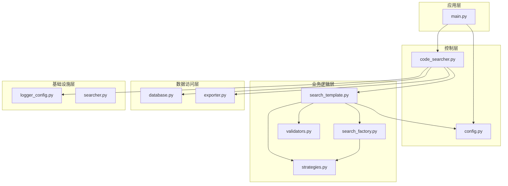
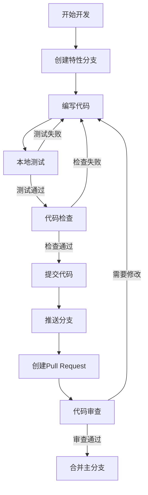

# 开发视图 (Development View)

## 概述

开发视图描述了Hello-Scan-Code系统的软件组织结构，展示了模块划分、依赖关系、包结构以及开发和构建过程。

## 项目结构

### 目录组织

```
Hello-Scan-Code/
├── src/                          # 源代码目录
│   ├── __init__.py              # 包初始化文件
│   ├── main.py                  # 应用入口点
│   ├── code_searcher.py         # 主控制器模块
│   ├── config.py                # 配置管理模块
│   ├── search_template.py       # 搜索模板模块
│   ├── strategies.py            # 搜索策略模块
│   ├── search_factory.py        # 策略工厂模块
│   ├── validators.py            # 结果验证模块
│   ├── database.py              # 数据库管理模块
│   ├── exporter.py              # Excel导出模块
│   ├── logger_config.py         # 日志配置模块
│   └── searcher.py              # 搜索器接口模块
├── docs/                        # 文档目录
├── tests/                       # 测试代码目录
├── scripts/                     # 构建和部署脚本
├── db/                         # 数据库文件目录
├── config/                     # 配置文件目录
├── main.py                     # 项目主入口
├── pyproject.toml             # 项目配置文件
└── README.md                  # 项目说明
```

### 模块依赖关系



## 核心模块设计

### 1. 主控制器模块 (code_searcher.py)

```python
"""
系统主控制器
职责:
- 组件协调和生命周期管理
- 搜索流程控制
- 结果处理和持久化
- 异常处理和日志记录
"""

class CodeSearcher:
    def __init__(self, config: SearchConfig)
    def search(self) -> List[Dict[str, Any]]
    def save_results(self, results: List[Dict[str, Any]]) -> None
```

### 2. 配置管理模块 (config.py)

```python
"""
配置管理模块
职责:
- 配置参数定义和验证
- 配置文件加载和解析
- 默认值管理
"""

@dataclass
class SearchConfig:
    repo_path: str
    search_terms: Union[List[str], str]
    file_extensions: List[str] = field(default_factory=list)
    
    def validate(self) -> bool
    def to_dict(self) -> Dict[str, Any]
```

### 3. 搜索模板模块 (search_template.py)

```python
"""
搜索模板模块 - 实现模板方法模式
职责:
- 定义搜索算法骨架
- 提供可扩展的抽象方法
- 统一搜索流程控制
"""

class SearchTemplate(ABC):
    @abstractmethod
    def _create_search_strategy(self) -> SearchStrategy
    @abstractmethod
    def _perform_validation(self, results, terms) -> List[Dict]

class DefaultSearchTemplate(SearchTemplate):
    def _create_search_strategy(self) -> SearchStrategy
    def _perform_validation(self, results, terms) -> List[Dict]
```

### 4. 搜索策略模块 (strategies.py)

```python
"""
搜索策略模块 - 实现策略模式
职责:
- 定义搜索策略接口
- 实现具体搜索算法
- 处理不同环境下的兼容性
"""

class SearchStrategy(ABC):
    @abstractmethod
    def search(self, repo_path: str, search_terms, is_regex: bool) -> List[Dict]

class GrepSearchStrategy(SearchStrategy):
    def search(self, repo_path: str, search_terms, is_regex: bool) -> List[Dict]

class PythonSearchStrategy(SearchStrategy):
    def search(self, repo_path: str, search_terms, is_regex: bool) -> List[Dict]
```

## 构建系统

### 项目配置 (pyproject.toml)

```toml
[build-system]
requires = ["setuptools>=45", "wheel"]
build-backend = "setuptools.build_meta"

[project]
name = "hello-scan-code"
version = "1.0.0"
description = "高效的代码搜索工具"
requires-python = ">=3.8"
dependencies = [
    "openpyxl>=3.0.9",
    "psutil>=5.8.0",
]

[project.optional-dependencies]
dev = [
    "pytest>=6.0",
    "black>=21.0",
    "flake8>=3.8",
    "mypy>=0.800",
]

[project.scripts]
hello-scan-code = "src.main:main"
```

## 开发工作流

### 1. 开发环境设置

```bash
# 1. 克隆项目
git clone https://github.com/your-org/hello-scan-code.git
cd hello-scan-code

# 2. 创建虚拟环境
python -m venv venv
source venv/bin/activate  # Linux/macOS
# venv\Scripts\activate   # Windows

# 3. 安装开发依赖
pip install -e .[dev]

# 4. 运行测试
pytest tests/
```

### 2. 代码提交流程



## 测试策略

### 1. 测试分层


### 2. 测试覆盖

- **单元测试**: 覆盖各个模块的核心功能
- **集成测试**: 测试模块间的协作
- **性能测试**: 验证搜索性能指标
- **兼容性测试**: 验证跨平台兼容性

## 质量保证

### 1. 代码质量工具

```bash
# 代码格式化
black src tests

# 代码检查
flake8 src tests

# 类型检查
mypy src

# 测试覆盖率
pytest --cov=src tests/
```

### 2. 持续集成

```yaml
# .github/workflows/ci.yml
name: CI
on: [push, pull_request]

jobs:
  test:
    runs-on: ubuntu-latest
    strategy:
      matrix:
        python-version: [3.8, 3.9, '3.10', 3.11]
    
    steps:
    - uses: actions/checkout@v3
    - name: Set up Python
      uses: actions/setup-python@v3
      with:
        python-version: ${{ matrix.python-version }}
    - name: Install dependencies
      run: pip install -e .[dev]
    - name: Run tests
      run: pytest tests/ -v --cov=src
```

## 版本管理

### 分支策略

- **main**: 生产环境分支
- **develop**: 开发分支
- **feature/***: 特性开发分支
- **hotfix/***: 紧急修复分支

### 版本号规则

采用语义化版本控制 (SemVer):
- **MAJOR**: 不兼容的API变更
- **MINOR**: 向后兼容的功能新增
- **PATCH**: 向后兼容的问题修正

## 部署策略

### 1. 包发布

```bash
# 构建包
python -m build

# 发布到PyPI
twine upload dist/*
```

### 2. 容器化部署

```dockerfile
FROM python:3.9-slim

WORKDIR /app
COPY . .
RUN pip install -e .

CMD ["hello-scan-code"]
```

## 文档维护

### 1. 文档类型

- **API文档**: 自动生成的代码文档
- **用户文档**: 使用指南和教程
- **架构文档**: 系统设计和架构说明
- **开发文档**: 开发指南和贡献指引

### 2. 文档工具

- **Sphinx**: 文档生成工具
- **MkDocs**: Markdown文档站点
- **docstring**: 代码内嵌文档

## 扩展开发指南

### 1. 添加新的搜索策略

1. 实现 `SearchStrategy` 接口
2. 在 `SearchStrategyFactory` 中注册
3. 添加相应的测试用例
4. 更新文档

### 2. 扩展导出格式

1. 创建新的导出器类
2. 实现统一的导出接口
3. 在 `CodeSearcher` 中集成
4. 添加配置选项

## 总结

开发视图为Hello-Scan-Code项目提供了清晰的开发指导，包括项目结构、模块设计、构建系统、测试策略和质量保证。通过规范的开发流程和工具链，确保项目的可维护性、可扩展性和代码质量。