# 逻辑视图 (Logical View)

## 概述

逻辑视图描述了Hello-Scan-Code系统的静态结构，展示了主要的类、接口以及它们之间的关系。该视图体现了系统的面向对象设计，并突出了所应用的设计模式。

## 整体架构

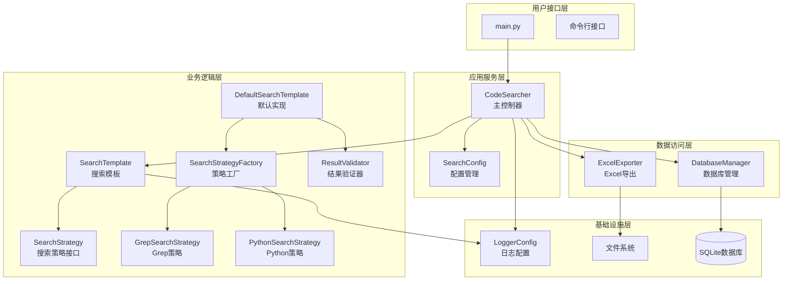

## 核心类设计

### 1. 主控制器类

#### CodeSearcher 类

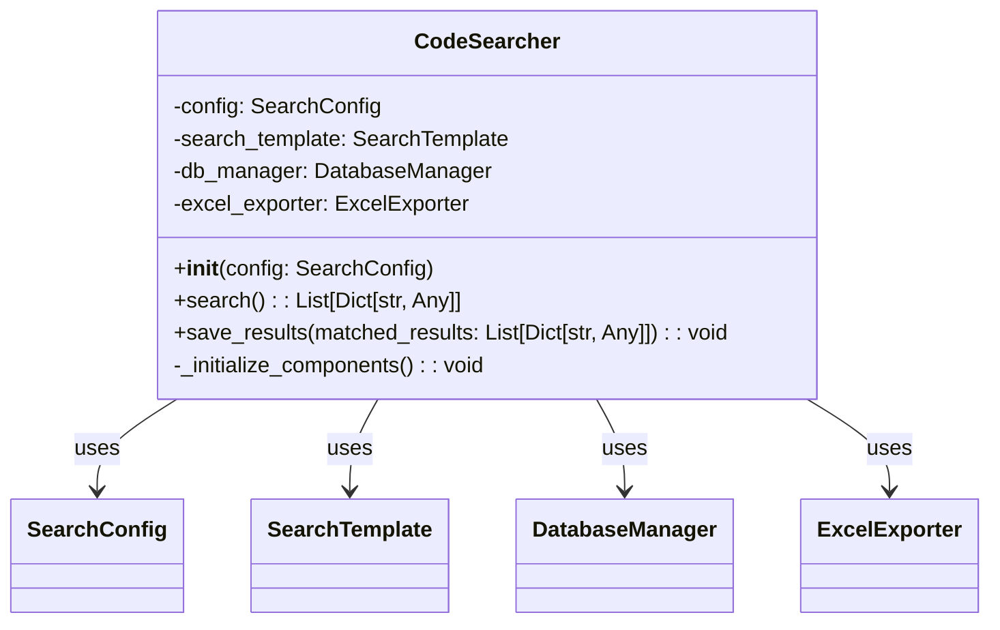

**职责**:
- 协调整个搜索流程
- 管理组件的生命周期
- 提供统一的外部接口
- 处理结果的持久化

**关键方法**:
- `search()`: 委托给搜索模板执行搜索
- `save_results()`: 协调数据库保存和Excel导出
- `_initialize_components()`: 初始化所有依赖组件

### 2. 配置管理类

#### SearchConfig 类

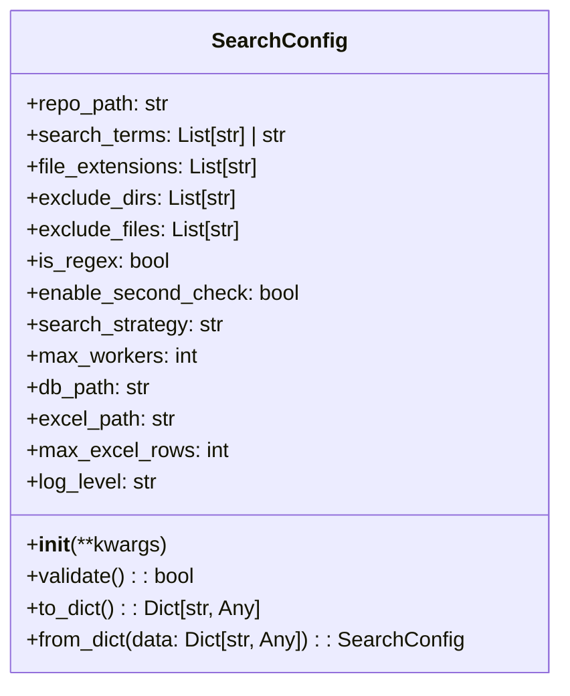

**职责**:
- 集中管理所有配置参数
- 提供配置验证功能
- 支持配置的序列化和反序列化
- 为其他组件提供配置访问接口

## 模板方法模式实现

### SearchTemplate 抽象类

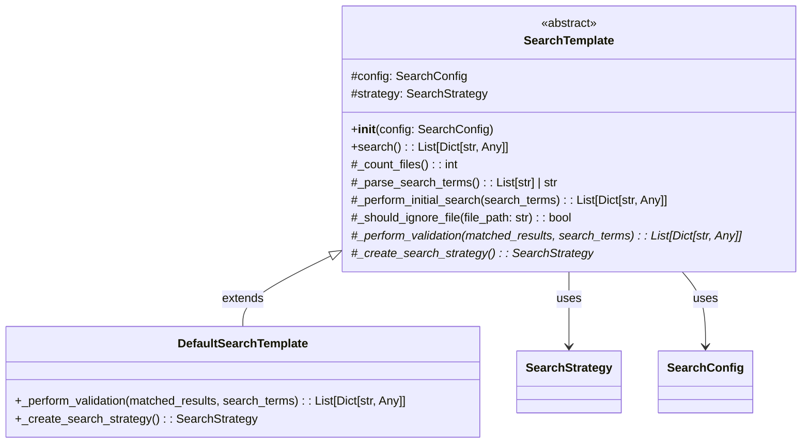

**模板方法流程**:
1. `_count_files()` - 统计待搜索文件数量
2. `_parse_search_terms()` - 解析搜索条件
3. `_create_search_strategy()` - 创建搜索策略（抽象方法）
4. `_perform_initial_search()` - 执行初始搜索
5. `_perform_validation()` - 执行结果验证（抽象方法）

**设计优势**:
- 定义稳定的算法骨架
- 允许子类扩展特定步骤
- 遵循开闭原则
- 提高代码复用性

## 策略模式实现

### SearchStrategy 策略接口

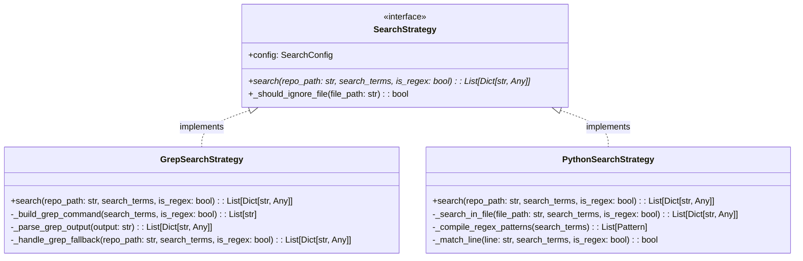

**策略对比**:

| 特性 | GrepSearchStrategy | PythonSearchStrategy |
|------|-------------------|---------------------|
| 性能 | 高（原生命令） | 中（Python解释） |
| 兼容性 | Unix/Linux优势 | 跨平台一致 |
| 功能性 | 依赖系统grep | 完全可控 |
| 容错性 | 系统依赖 | 完全可控 |
| 扩展性 | 有限 | 高度灵活 |

### SearchStrategyFactory 工厂类

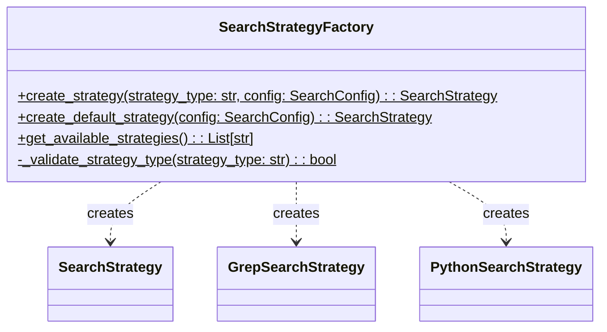

**工厂方法**:
- `create_strategy()`: 根据类型创建具体策略
- `create_default_strategy()`: 创建默认策略（优先Grep）
- `get_available_strategies()`: 获取可用策略列表

## 数据访问层设计

### DatabaseManager 类

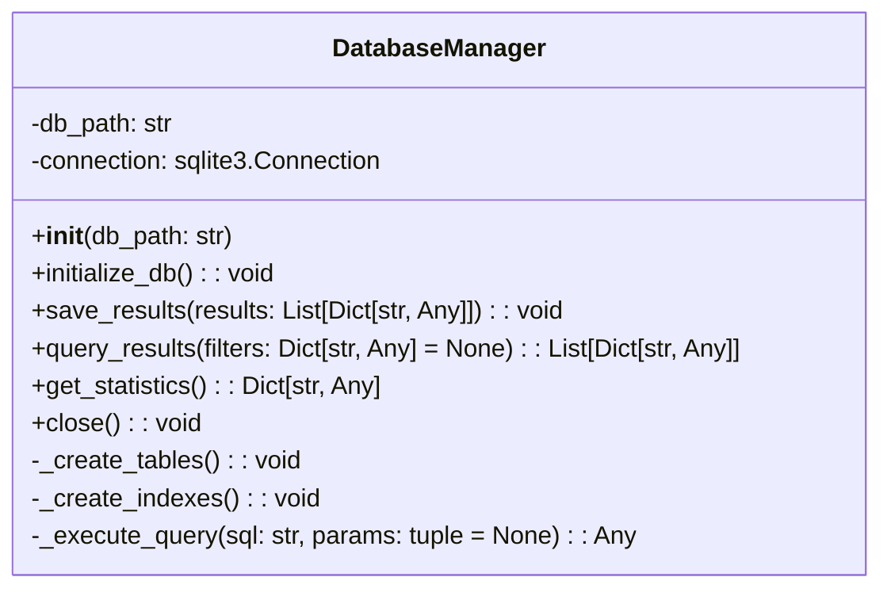

**数据库Schema**:
```sql
CREATE TABLE IF NOT EXISTS search_results (
    id INTEGER PRIMARY KEY AUTOINCREMENT,
    file_path TEXT NOT NULL,
    line_number INTEGER NOT NULL,
    matched_content TEXT NOT NULL,
    search_terms TEXT NOT NULL,
    created_at TIMESTAMP DEFAULT CURRENT_TIMESTAMP
);

CREATE INDEX IF NOT EXISTS idx_file_path ON search_results(file_path);
CREATE INDEX IF NOT EXISTS idx_search_terms ON search_results(search_terms);
CREATE INDEX IF NOT EXISTS idx_created_at ON search_results(created_at);
```

### ExcelExporter 类

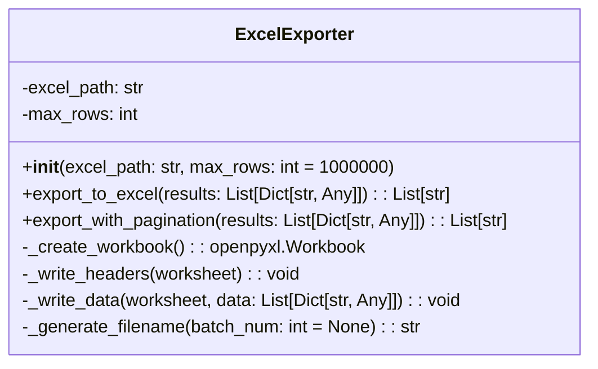

**分片策略**:
- 单文件行数限制（默认100万行）
- 自动分片命名（batch_1.xlsx, batch_2.xlsx）
- 内存优化处理大数据集
- 支持自定义分片大小

## 验证器设计

### ResultValidator 类

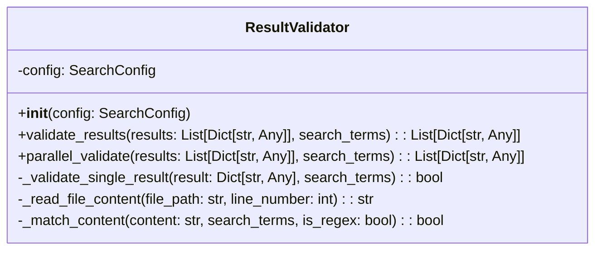

**验证流程**:
1. 读取原始文件内容
2. 重新执行匹配逻辑
3. 确认结果的准确性
4. 过滤误报结果
5. 支持并行验证以提升性能

## 日志系统设计

### LoggerConfig 类

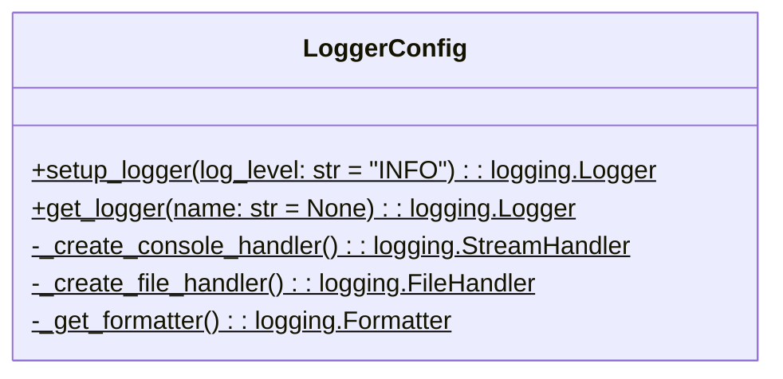

**日志级别配置**:
- DEBUG: 详细的调试信息
- INFO: 一般信息记录
- WARNING: 警告信息
- ERROR: 错误信息
- CRITICAL: 严重错误

## 类关系图

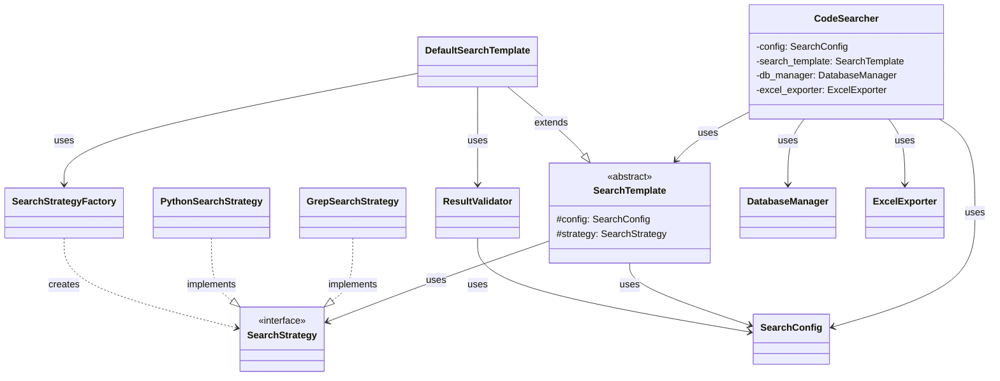

## 设计模式总结

### 1. 模板方法模式
- **应用场景**: SearchTemplate类族
- **解决问题**: 定义算法骨架，允许子类扩展特定步骤
- **好处**: 代码复用、结构稳定、易于扩展

### 2. 策略模式
- **应用场景**: SearchStrategy类族
- **解决问题**: 运行时选择不同的搜索算法
- **好处**: 算法独立、易于切换、符合开闭原则

### 3. 工厂模式
- **应用场景**: SearchStrategyFactory
- **解决问题**: 解耦对象创建与使用
- **好处**: 集中创建逻辑、易于管理、支持扩展

### 4. 外观模式
- **应用场景**: CodeSearcher主控制器
- **解决问题**: 简化复杂子系统的接口
- **好处**: 统一接口、降低耦合、易于使用

## 扩展点设计

### 1. 新增搜索策略
1. 实现SearchStrategy接口
2. 在SearchStrategyFactory中注册
3. 更新配置选项

### 2. 自定义验证器
1. 继承或组合ResultValidator
2. 实现特定验证逻辑
3. 在DefaultSearchTemplate中集成

### 3. 新增导出格式
1. 创建新的导出器类
2. 实现统一的导出接口
3. 在CodeSearcher中集成

### 4. 扩展配置管理
1. 扩展SearchConfig类
2. 添加新的配置项
3. 更新验证逻辑

## 质量属性

### 可维护性
- 清晰的职责分离
- 松耦合的模块设计
- 完善的抽象层次

### 可扩展性
- 基于接口的设计
- 灵活的工厂模式
- 可插拔的组件架构

### 可测试性
- 依赖注入设计
- 明确的接口定义
- 独立的功能模块

### 可重用性
- 抽象的模板定义
- 通用的策略接口
- 独立的工具类

## 总结

逻辑视图展现了Hello-Scan-Code系统清晰的分层架构和良好的面向对象设计。通过合理应用多种设计模式，系统实现了高内聚、低耦合的模块结构，为后续的开发、测试和维护奠定了坚实的基础。整体架构既保证了当前功能的完整性，又为未来的功能扩展预留了充分的灵活性。