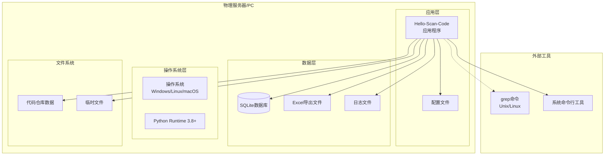
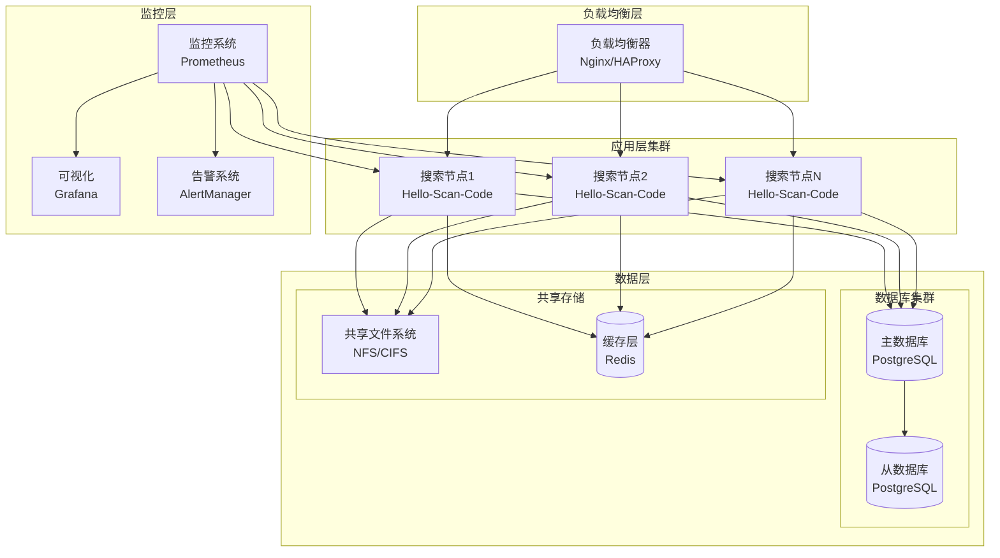
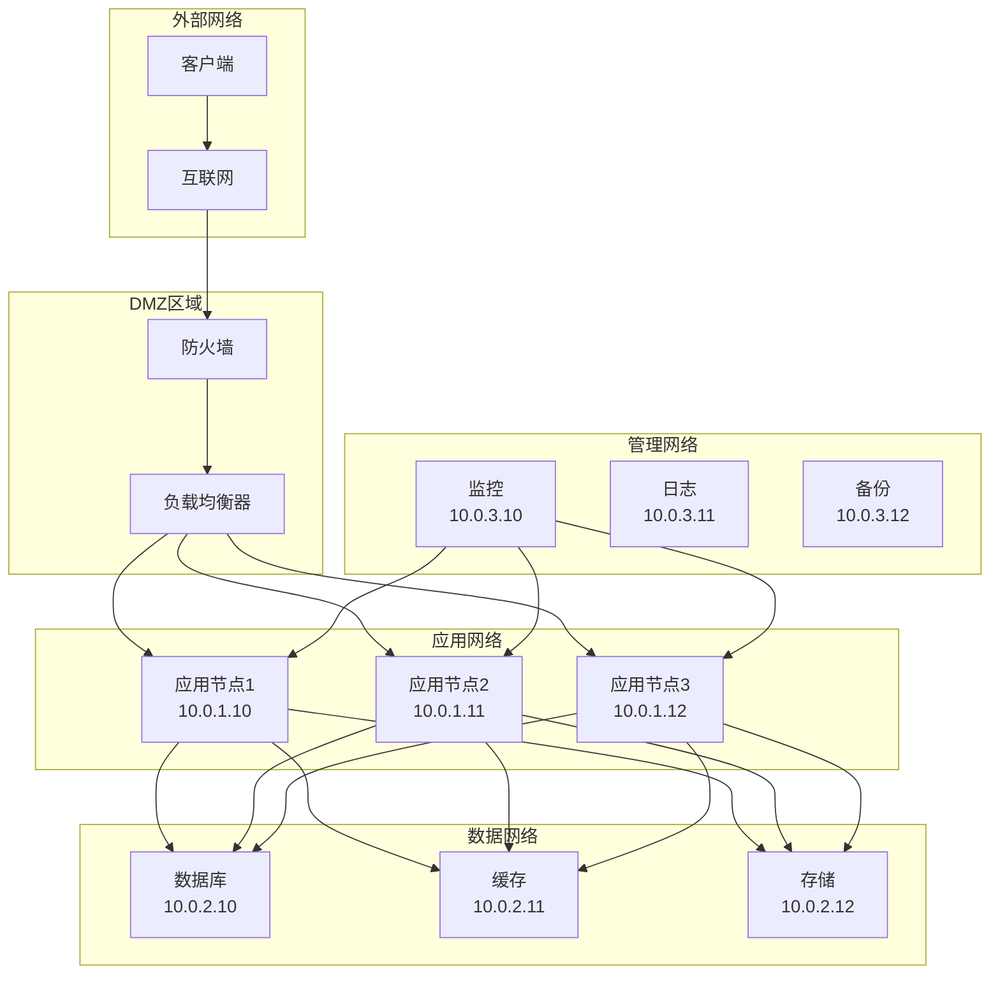
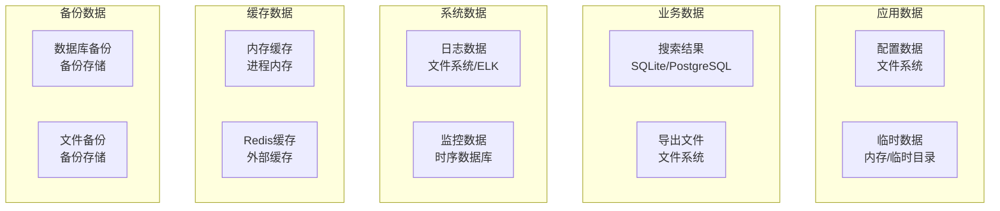

# 物理视图 (Physical View)

## 概述

物理视图描述了Hello-Scan-Code系统的部署架构，展示了软硬件环境配置、系统分布、网络拓扑以及可扩展性设计。该视图为系统管理员、运维工程师和架构师提供了系统部署和运维的指导。

## 部署架构

### 1. 单机部署架构



### 2. 分布式部署架构



## 环境配置

### 1. 系统要求

#### 最小配置
- **CPU**: 2核心
- **内存**: 4GB RAM
- **磁盘**: 10GB 可用空间
- **操作系统**: 
  - Windows 10/11
  - Linux (Ubuntu 18.04+, CentOS 7+)
  - macOS 10.15+

#### 推荐配置
- **CPU**: 4核心或更多
- **内存**: 8GB RAM或更多
- **磁盘**: SSD, 50GB+可用空间
- **网络**: 千兆网络接口

#### 大规模部署配置
- **CPU**: 8核心+
- **内存**: 16GB RAM+
- **磁盘**: NVMe SSD, 100GB+
- **网络**: 10Gb网络接口

### 2. 软件依赖

```yaml
# 基础运行环境
base_requirements:
  python: ">=3.8"
  sqlite3: ">=3.31"
  
# 系统工具 (可选，用于性能优化)
system_tools:
  grep: ">=3.0"  # Unix/Linux系统
  find: ">=4.0"
  
# Python包依赖
python_dependencies:
  openpyxl: ">=3.0.9"
  psutil: ">=5.8.0"
  
# 开发依赖 (可选)
dev_dependencies:
  pytest: ">=6.0"
  black: ">=21.0"
  flake8: ">=3.8"
  mypy: ">=0.800"
```

### 3. 环境变量配置

```bash
# 应用配置
export HELLO_SCAN_CONFIG_PATH="/path/to/config"
export HELLO_SCAN_LOG_LEVEL="INFO"
export HELLO_SCAN_DB_PATH="/path/to/database"

# 性能调优
export HELLO_SCAN_MAX_WORKERS="4"
export HELLO_SCAN_MEMORY_LIMIT="1024"  # MB
export HELLO_SCAN_TIMEOUT="300"        # 秒

# 缓存配置
export HELLO_SCAN_CACHE_SIZE="100"     # MB
export HELLO_SCAN_CACHE_TTL="3600"     # 秒
```

## 部署模式

### 1. 本地部署

```bash
# 基础安装
pip install hello-scan-code

# 配置文件初始化
hello-scan-code --init-config

# 运行搜索
hello-scan-code --repo-path /path/to/code --terms "search_term"
```

**适用场景**:
- 个人开发环境
- 小型项目
- 快速原型验证

### 2. 服务器部署

```bash
# 1. 系统准备
sudo apt-get update
sudo apt-get install python3.8 python3-pip sqlite3

# 2. 创建专用用户
sudo useradd -m -s /bin/bash scanner
sudo su - scanner

# 3. 安装应用
pip3 install hello-scan-code
mkdir -p ~/config ~/data ~/logs

# 4. 配置systemd服务
sudo tee /etc/systemd/system/hello-scan-code.service > /dev/null <<EOF
[Unit]
Description=Hello Scan Code Service
After=network.target

[Service]
Type=simple
User=scanner
WorkingDirectory=/home/scanner
Environment=HELLO_SCAN_CONFIG_PATH=/home/scanner/config
ExecStart=/home/scanner/.local/bin/hello-scan-code --daemon
Restart=always
RestartSec=10

[Install]
WantedBy=multi-user.target
EOF

# 5. 启动服务
sudo systemctl enable hello-scan-code
sudo systemctl start hello-scan-code
```

### 3. 容器化部署

```dockerfile
# Dockerfile
FROM python:3.9-slim

# 安装系统依赖
RUN apt-get update && \
    apt-get install -y grep findutils && \
    rm -rf /var/lib/apt/lists/*

# 创建应用用户
RUN useradd -m -u 1000 scanner
USER scanner
WORKDIR /home/scanner

# 安装Python依赖
COPY requirements.txt .
RUN pip install --user -r requirements.txt

# 复制应用代码
COPY --chown=scanner:scanner src/ ./src/
COPY --chown=scanner:scanner main.py ./

# 创建数据目录
RUN mkdir -p data logs config

# 暴露端口 (如果有Web服务)
EXPOSE 8080

# 健康检查
HEALTHCHECK --interval=30s --timeout=10s --start-period=5s --retries=3 \
    CMD python -c "import src.main; print('OK')" || exit 1

# 启动命令
CMD ["python", "main.py"]
```

```yaml
# docker-compose.yml
version: '3.8'

services:
  hello-scan-code:
    build: .
    container_name: hello-scan-code
    restart: unless-stopped
    volumes:
      - ./data:/home/scanner/data
      - ./logs:/home/scanner/logs
      - ./config:/home/scanner/config
      - /path/to/repositories:/repositories:ro
    environment:
      - HELLO_SCAN_LOG_LEVEL=INFO
      - HELLO_SCAN_DB_PATH=/home/scanner/data/search.db
    networks:
      - scan-network
    deploy:
      resources:
        limits:
          memory: 2G
          cpus: '2'

networks:
  scan-network:
    driver: bridge
```

### 4. Kubernetes部署

```yaml
# k8s-deployment.yaml
apiVersion: apps/v1
kind: Deployment
metadata:
  name: hello-scan-code
  labels:
    app: hello-scan-code
spec:
  replicas: 3
  selector:
    matchLabels:
      app: hello-scan-code
  template:
    metadata:
      labels:
        app: hello-scan-code
    spec:
      containers:
      - name: hello-scan-code
        image: hello-scan-code:latest
        ports:
        - containerPort: 8080
        env:
        - name: HELLO_SCAN_LOG_LEVEL
          value: "INFO"
        - name: HELLO_SCAN_DB_PATH
          value: "/data/search.db"
        resources:
          requests:
            memory: "512Mi"
            cpu: "500m"
          limits:
            memory: "2Gi"
            cpu: "2"
        volumeMounts:
        - name: data-volume
          mountPath: /data
        - name: config-volume
          mountPath: /config
        readinessProbe:
          httpGet:
            path: /health
            port: 8080
          initialDelaySeconds: 30
          periodSeconds: 10
        livenessProbe:
          httpGet:
            path: /health
            port: 8080
          initialDelaySeconds: 60
          periodSeconds: 30
      volumes:
      - name: data-volume
        persistentVolumeClaim:
          claimName: hello-scan-code-data
      - name: config-volume
        configMap:
          name: hello-scan-code-config

---
apiVersion: v1
kind: Service
metadata:
  name: hello-scan-code-service
spec:
  selector:
    app: hello-scan-code
  ports:
  - protocol: TCP
    port: 80
    targetPort: 8080
  type: LoadBalancer
```

## 网络架构

### 1. 网络拓扑



### 2. 端口配置

```yaml
# 端口配置表
ports:
  application:
    main_service: 8080
    health_check: 8081
    metrics: 9090
  
  database:
    postgresql: 5432
    redis: 6379
    sqlite: N/A  # 文件数据库
  
  monitoring:
    prometheus: 9090
    grafana: 3000
    alertmanager: 9093
  
  system:
    ssh: 22
    http: 80
    https: 443
```

### 3. 安全配置

```bash
# 防火墙规则示例 (iptables)
# 允许SSH连接
iptables -A INPUT -p tcp --dport 22 -j ACCEPT

# 允许应用端口
iptables -A INPUT -p tcp --dport 8080 -j ACCEPT

# 允许数据库端口 (仅内网)
iptables -A INPUT -p tcp -s 10.0.0.0/16 --dport 5432 -j ACCEPT

# 拒绝其他连接
iptables -A INPUT -j DROP
```

## 存储架构

### 1. 数据存储策略



### 2. 存储容量规划

```yaml
# 存储容量规划
storage_planning:
  small_deployment:  # <10万文件
    database: "100MB"
    logs: "1GB"
    exports: "500MB"
    cache: "256MB"
    total: "2GB"
  
  medium_deployment:  # 10-100万文件
    database: "1GB"
    logs: "10GB"
    exports: "5GB"
    cache: "1GB"
    total: "20GB"
  
  large_deployment:  # >100万文件
    database: "10GB"
    logs: "100GB"
    exports: "50GB"
    cache: "10GB"
    total: "200GB"
```

### 3. 备份策略

```bash
#!/bin/bash
# 备份脚本示例

BACKUP_DIR="/backup/hello-scan-code"
DATE=$(date +%Y%m%d_%H%M%S)

# 1. 数据库备份
sqlite3 /data/search.db ".backup $BACKUP_DIR/db_backup_$DATE.db"

# 2. 配置文件备份
tar -czf "$BACKUP_DIR/config_backup_$DATE.tar.gz" /config/

# 3. 日志归档
tar -czf "$BACKUP_DIR/logs_backup_$DATE.tar.gz" --exclude='*.log' /logs/

# 4. 清理旧备份 (保留30天)
find $BACKUP_DIR -name "*backup*" -mtime +30 -delete

echo "Backup completed: $DATE"
```

## 监控和运维

### 1. 监控指标

```yaml
# 监控指标配置
monitoring_metrics:
  system_metrics:
    - cpu_usage
    - memory_usage
    - disk_usage
    - network_io
  
  application_metrics:
    - search_requests_total
    - search_duration_seconds
    - search_results_count
    - error_rate
  
  business_metrics:
    - daily_active_searches
    - average_search_time
    - result_accuracy_rate
    - export_success_rate
```

### 2. 告警规则

```yaml
# Prometheus告警规则
groups:
- name: hello-scan-code.rules
  rules:
  - alert: HighCPUUsage
    expr: cpu_usage_percent > 80
    for: 5m
    annotations:
      summary: "CPU usage is high"
      description: "CPU usage has been above 80% for more than 5 minutes"
  
  - alert: HighMemoryUsage
    expr: memory_usage_percent > 90
    for: 2m
    annotations:
      summary: "Memory usage is high"
      description: "Memory usage has been above 90% for more than 2 minutes"
  
  - alert: SearchTimeoutRate
    expr: search_timeout_rate > 0.1
    for: 1m
    annotations:
      summary: "High search timeout rate"
      description: "Search timeout rate is above 10%"
```

### 3. 日志管理

```yaml
# 日志配置
logging:
  level: INFO
  format: "%(asctime)s - %(name)s - %(levelname)s - %(message)s"
  
  handlers:
    console:
      enabled: true
      level: INFO
    
    file:
      enabled: true
      level: DEBUG
      path: "/logs/hello-scan-code.log"
      max_size: "100MB"
      backup_count: 10
    
    syslog:
      enabled: false
      address: "localhost:514"
      facility: "user"
```

## 性能优化

### 1. 硬件优化

```yaml
# 硬件优化建议
hardware_optimization:
  cpu:
    - 选择多核处理器
    - 启用超线程技术
    - 考虑CPU缓存大小
  
  memory:
    - 足够的RAM避免交换
    - 快速内存 (DDR4 2400+)
    - 考虑NUMA架构
  
  storage:
    - 使用SSD存储
    - 考虑NVMe接口
    - RAID配置提高性能
  
  network:
    - 千兆网络最低要求
    - 10Gb网络大规模部署
    - 低延迟网络交换机
```

### 2. 系统调优

```bash
# Linux系统调优
# /etc/sysctl.conf

# 文件描述符限制
fs.file-max = 1000000

# 网络参数优化
net.core.somaxconn = 1024
net.core.netdev_max_backlog = 5000

# 内存管理
vm.swappiness = 10
vm.dirty_ratio = 15

# 应用后配置
sysctl -p
```

## 安全考虑

### 1. 访问控制

```yaml
# 访问控制配置
access_control:
  authentication:
    - api_key
    - jwt_token
    - basic_auth
  
  authorization:
    - role_based_access
    - resource_permissions
    - audit_logging
  
  network_security:
    - firewall_rules
    - vpn_access
    - ssl_encryption
```

### 2. 数据安全

```yaml
# 数据安全措施
data_security:
  encryption:
    data_at_rest: "AES-256"
    data_in_transit: "TLS 1.3"
    key_management: "Hardware Security Module"
  
  backup_security:
    encrypted_backups: true
    secure_offsite_storage: true
    access_logging: true
  
  compliance:
    gdpr_compliance: true
    data_retention_policy: "2 years"
    anonymization: true
```

## 灾难恢复

### 1. 恢复策略

```yaml
# 灾难恢复计划
disaster_recovery:
  rto: "4 hours"  # 恢复时间目标
  rpo: "1 hour"   # 恢复点目标
  
  backup_strategy:
    frequency: "daily"
    retention: "30 days"
    verification: "weekly"
  
  failover_plan:
    primary_site: "主数据中心"
    secondary_site: "备用数据中心"
    automatic_failover: true
```

### 2. 恢复流程

```bash
#!/bin/bash
# 灾难恢复脚本

echo "Starting disaster recovery process..."

# 1. 评估损害
check_system_status()

# 2. 恢复数据
restore_database_from_backup()
restore_configuration_files()

# 3. 重启服务
systemctl start hello-scan-code

# 4. 验证功能
run_smoke_tests()

echo "Disaster recovery completed."
```

## 总结

物理视图为Hello-Scan-Code系统提供了全面的部署和运维指导，涵盖了从单机部署到大规模分布式部署的各种场景。通过合理的架构设计、监控策略和安全措施，确保系统在各种环境下都能稳定高效地运行。该视图为系统管理员和运维团队提供了详细的技术实施方案。