# 进程视图 (Process View)

## 概述

进程视图描述了Hello-Scan-Code系统的动态行为，展示了系统在运行时的并发处理机制、性能特性和可靠性设计。该视图关注系统的运行时架构，包括进程间通信、同步机制和资源管理。

## 系统运行时架构

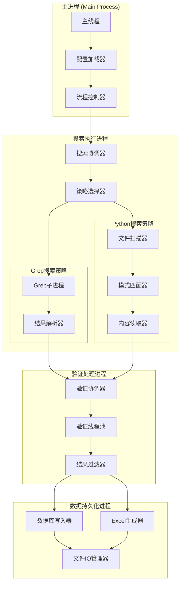

## 主要执行流程

### 1. 系统启动序列

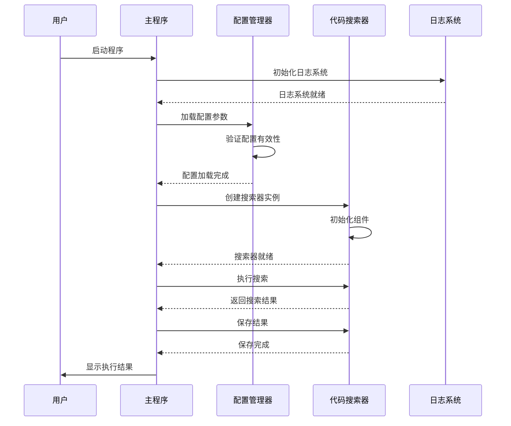

### 2. 搜索执行流程

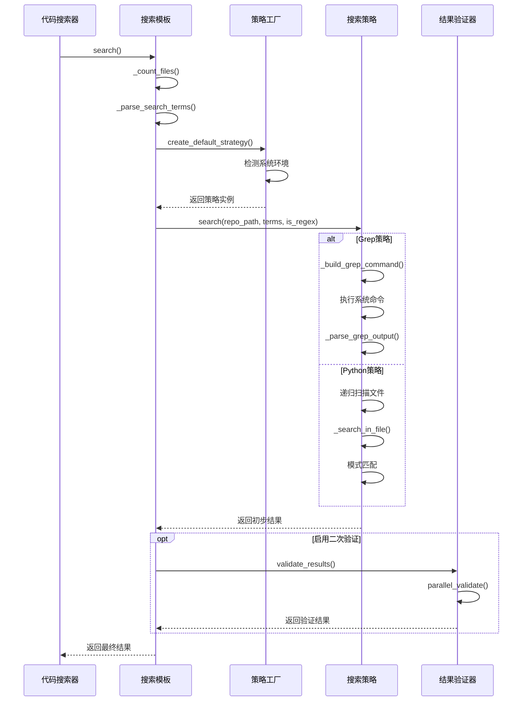

### 3. 并行验证流程

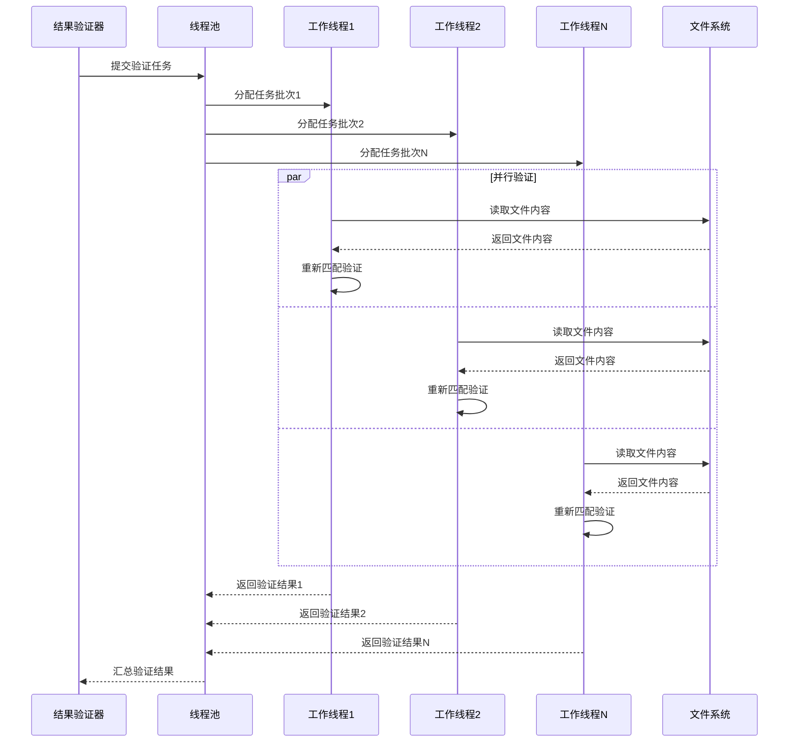

## 并发处理机制

### 1. 线程池配置

```python
# 线程池配置策略
class ThreadPoolConfig:
    def __init__(self, config: SearchConfig):
        self.max_workers = min(
            config.max_workers or 4,  # 用户配置
            os.cpu_count() or 1,      # CPU核心数
            32                        # 最大限制
        )
        self.timeout = 300            # 5分钟超时
        self.chunk_size = 100         # 任务批次大小
```

**线程池使用场景**:
- 并行验证搜索结果
- 大文件并行处理
- 批量数据库操作
- Excel文件并行生成

### 2. 资源同步机制

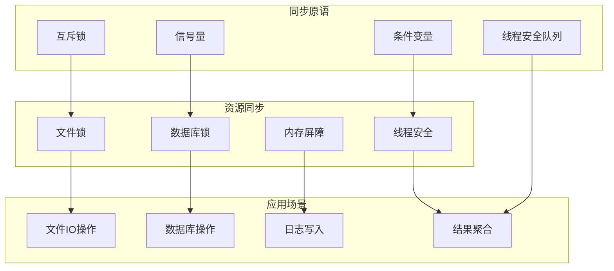

### 3. 错误处理和恢复

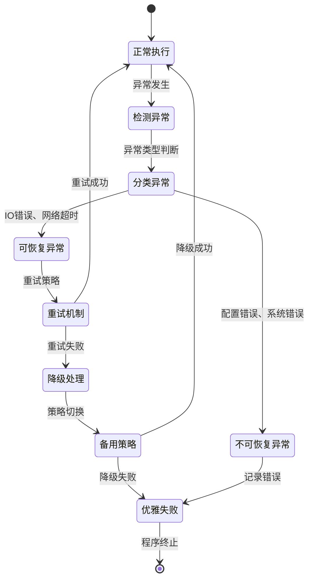

## 性能优化策略

### 1. 搜索性能优化

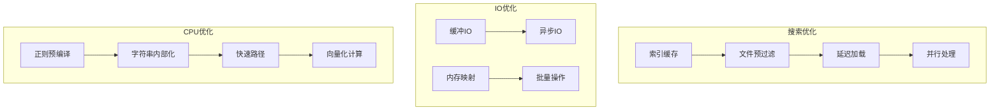

### 2. 内存管理策略

```python
# 内存使用监控和优化
class MemoryManager:
    def __init__(self, max_memory_mb: int = 1024):
        self.max_memory = max_memory_mb * 1024 * 1024
        self.current_usage = 0
        self.gc_threshold = 0.8  # 80%触发垃圾回收
    
    def check_memory_usage(self):
        """检查内存使用情况"""
        process = psutil.Process()
        self.current_usage = process.memory_info().rss
        
        if self.current_usage > self.max_memory * self.gc_threshold:
            self._trigger_gc()
    
    def _trigger_gc(self):
        """触发垃圾回收"""
        import gc
        gc.collect()
        logger.info(f"Memory cleanup triggered, usage: {self.current_usage / 1024 / 1024:.2f}MB")
```

### 3. 缓存机制

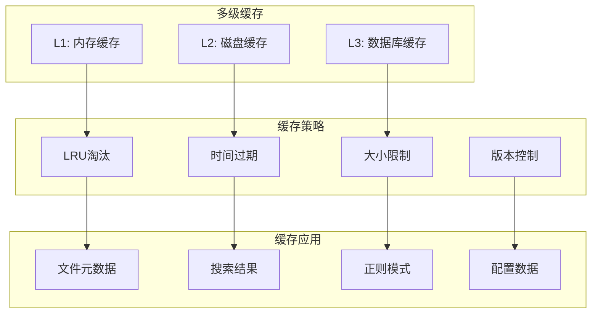

## 可靠性设计

### 1. 故障检测机制

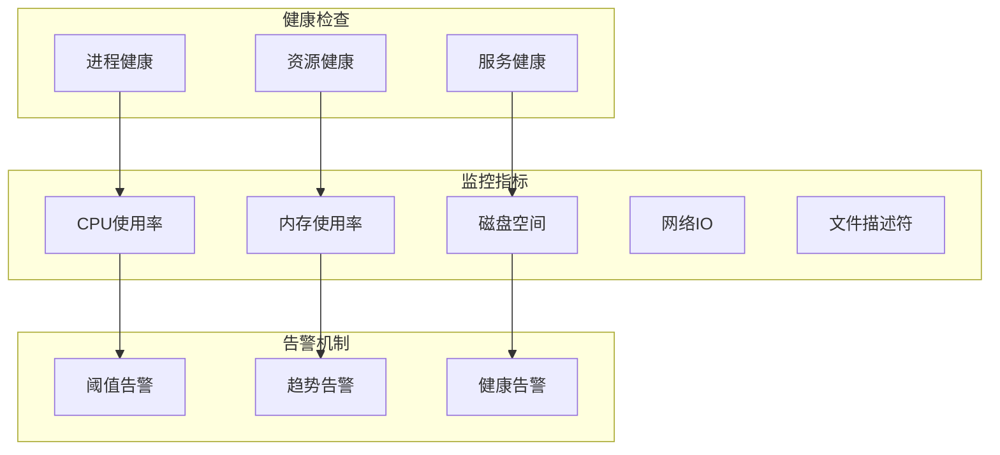

### 2. 容错处理

```python
# 容错装饰器
def with_retry(max_attempts=3, backoff_factor=1.0, exceptions=(Exception,)):
    def decorator(func):
        def wrapper(*args, **kwargs):
            last_exception = None
            for attempt in range(max_attempts):
                try:
                    return func(*args, **kwargs)
                except exceptions as e:
                    last_exception = e
                    if attempt < max_attempts - 1:
                        sleep_time = backoff_factor * (2 ** attempt)
                        time.sleep(sleep_time)
                        logger.warning(f"Attempt {attempt + 1} failed, retrying in {sleep_time}s: {e}")
                    else:
                        logger.error(f"All {max_attempts} attempts failed")
            raise last_exception
        return wrapper
    return decorator

# 应用示例
@with_retry(max_attempts=3, exceptions=(IOError, OSError))
def safe_file_operation(file_path: str):
    """安全的文件操作"""
    pass
```

### 3. 优雅降级

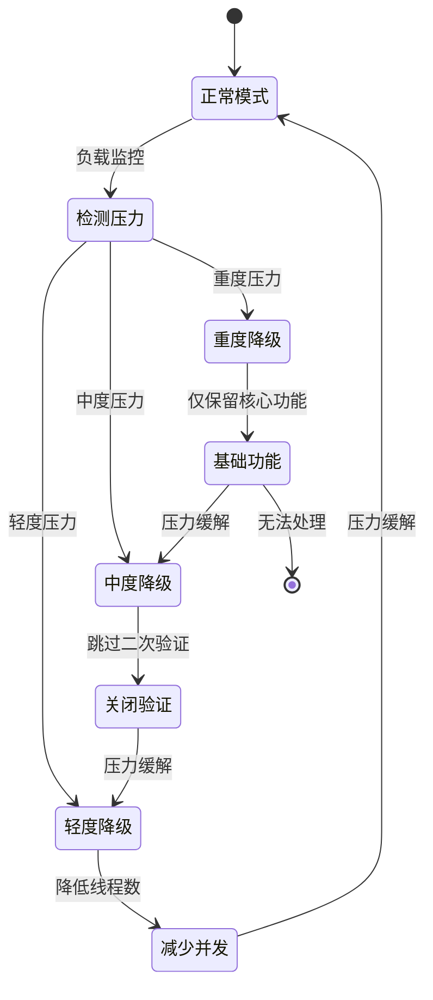

## 性能监控与分析

### 1. 性能指标收集

```python
# 性能监控器
class PerformanceMonitor:
    def __init__(self):
        self.metrics = {
            'search_time': [],
            'file_count': [],
            'result_count': [],
            'memory_usage': [],
            'cpu_usage': []
        }
        self.start_time = None
    
    def start_timing(self):
        self.start_time = time.time()
    
    def end_timing(self, operation: str):
        if self.start_time:
            duration = time.time() - self.start_time
            self.metrics[f'{operation}_time'].append(duration)
            return duration
    
    def collect_system_metrics(self):
        process = psutil.Process()
        self.metrics['memory_usage'].append(process.memory_info().rss)
        self.metrics['cpu_usage'].append(process.cpu_percent())
    
    def generate_report(self) -> Dict[str, Any]:
        """生成性能报告"""
        report = {}
        for metric, values in self.metrics.items():
            if values:
                report[metric] = {
                    'avg': statistics.mean(values),
                    'max': max(values),
                    'min': min(values),
                    'count': len(values)
                }
        return report
```

### 2. 性能基准测试

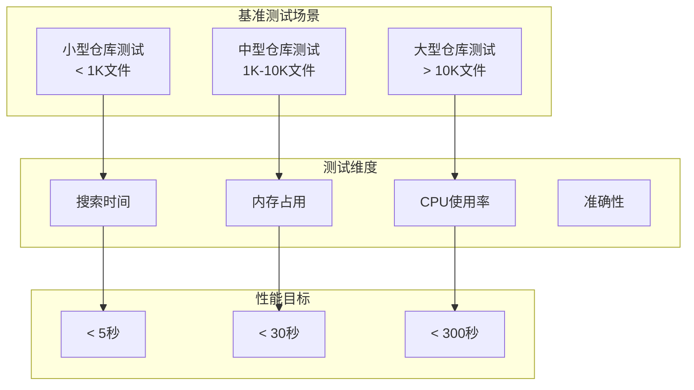

## 扩展性设计

### 1. 水平扩展

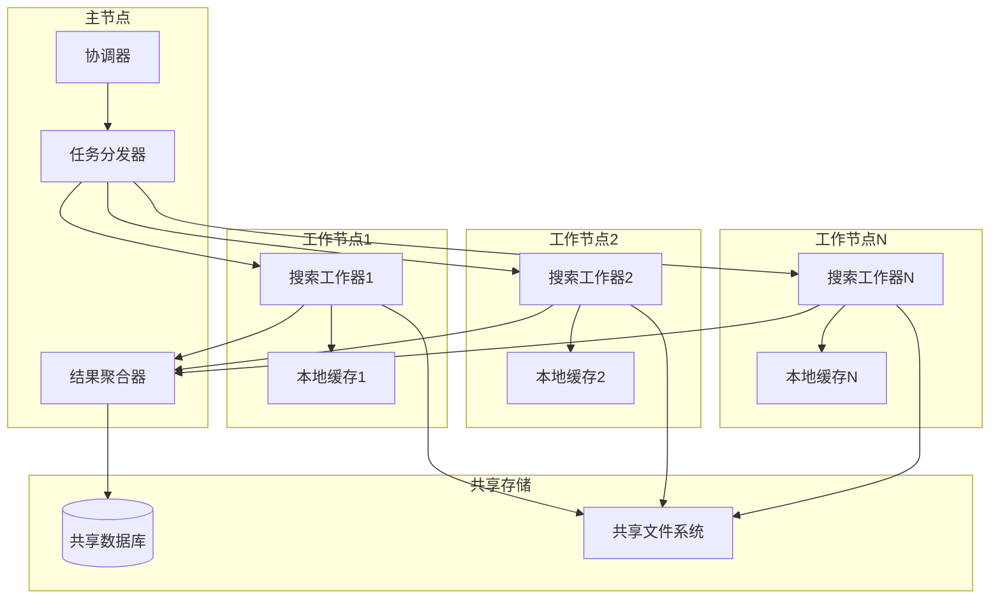

### 2. 插件化架构

```python
# 插件接口定义
class SearchPlugin:
    def __init__(self, config: Dict[str, Any]):
        self.config = config
    
    def initialize(self) -> bool:
        """插件初始化"""
        pass
    
    def search(self, repo_path: str, search_terms: Any) -> List[Dict[str, Any]]:
        """执行搜索"""
        pass
    
    def cleanup(self):
        """清理资源"""
        pass

# 插件加载器
class PluginLoader:
    def __init__(self):
        self.plugins = {}
    
    def load_plugin(self, plugin_name: str, plugin_class: type):
        """动态加载插件"""
        if issubclass(plugin_class, SearchPlugin):
            self.plugins[plugin_name] = plugin_class
    
    def create_plugin(self, plugin_name: str, config: Dict[str, Any]) -> SearchPlugin:
        """创建插件实例"""
        if plugin_name in self.plugins:
            return self.plugins[plugin_name](config)
        raise ValueError(f"Plugin {plugin_name} not found")
```

## 总结

进程视图展现了Hello-Scan-Code系统完整的运行时架构和动态行为。通过合理的并发设计、性能优化和可靠性保障，系统能够在各种负载条件下稳定高效地运行。并发处理机制提高了系统的吞吐量，容错设计保证了系统的健壮性，性能监控机制确保了系统的可观测性。整体设计为系统的横向扩展和功能演进提供了良好的基础。