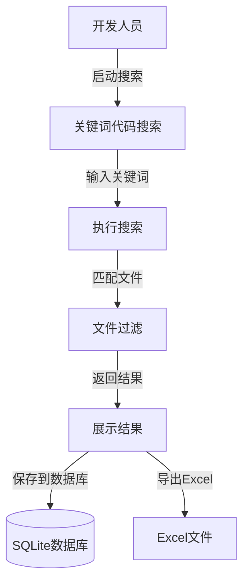
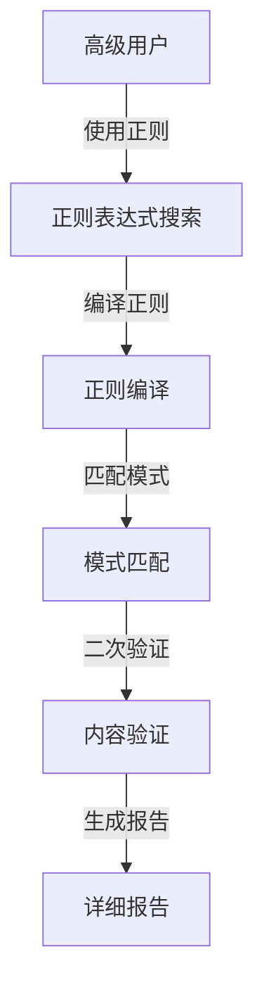
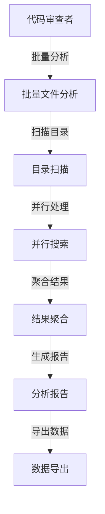
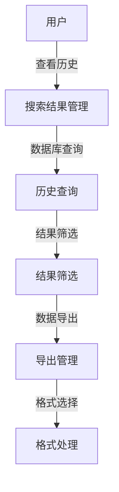

# 用例视图 (Use Case View)

## 概述

用例视图描述了Hello-Scan-Code系统的功能需求，展示了不同类型的用户如何与系统交互以及系统提供的主要功能。

## 参与者 (Actors)

### 主要参与者

#### 1. 开发人员 (Developer)
- **描述**: 需要在代码库中搜索特定代码片段的软件开发者
- **目标**: 快速定位代码、分析代码结构、查找特定实现
- **技能水平**: 熟悉命令行操作和代码搜索需求

#### 2. 代码审查者 (Code Reviewer)  
- **描述**: 负责代码审查和质量控制的团队成员
- **目标**: 查找潜在问题、验证代码规范、分析代码影响范围
- **技能水平**: 具有较强的代码分析能力

#### 3. 项目维护者 (Project Maintainer)
- **描述**: 负责项目整体维护和代码重构的负责人
- **目标**: 分析代码依赖、规划重构范围、维护代码质量
- **技能水平**: 对项目架构有深入理解

## 主要用例 (Primary Use Cases)

### UC-001: 关键词代码搜索



**基本流程**:
1. 用户启动Hello-Scan-Code工具
2. 配置搜索参数（目标目录、关键词、文件类型）
3. 系统执行代码搜索算法
4. 应用文件过滤规则
5. 返回匹配结果
6. 将结果保存到SQLite数据库
7. 可选择导出为Excel格式

**前置条件**:
- 目标代码库存在且可访问
- 搜索关键词已定义
- 工具配置正确

**后置条件**:
- 搜索结果已保存
- 相关统计信息已记录

### UC-002: 正则表达式高级搜索



**基本流程**:
1. 高级用户提供正则表达式模式
2. 系统编译并验证正则表达式
3. 执行基于正则的搜索
4. 进行二次内容验证（可选）
5. 生成详细的匹配报告
6. 提供统计分析数据

**扩展点**:
- 正则表达式语法错误处理
- 性能优化选择（Grep vs Python）
- 自定义验证规则

### UC-003: 批量文件分析



**基本流程**:
1. 配置批量分析参数
2. 系统扫描目标目录结构
3. 并行处理多个文件
4. 聚合所有搜索结果
5. 生成综合分析报告
6. 支持多种格式导出

### UC-004: 搜索结果管理



**基本流程**:
1. 用户访问历史搜索结果
2. 系统从SQLite数据库加载数据
3. 提供筛选和排序功能
4. 支持结果的重新导出
5. 管理导出文件的生成和分片

## 次要用例 (Secondary Use Cases)

### UC-005: 配置管理
- 搜索参数配置
- 文件过滤规则设置
- 性能优化选项调整
- 日志级别配置

### UC-006: 性能监控
- 搜索性能统计
- 资源使用监控
- 错误率追踪
- 系统健康检查

### UC-007: 扩展集成
- 自定义搜索策略集成
- 第三方工具接口
- API服务模式
- 插件机制支持

## 用例关系图

```mermaid
graph TB
    subgraph "核心功能"
        UC001[关键词搜索]
        UC002[正则搜索]
        UC003[批量分析]
    end
    
    subgraph "管理功能"
        UC004[结果管理]
        UC005[配置管理]
    end
    
    subgraph "监控扩展"
        UC006[性能监控]
        UC007[扩展集成]
    end
    
    UC001 -.-> UC004 : "生成数据"
    UC002 -.-> UC004 : "生成数据"
    UC003 -.-> UC004 : "生成数据"
    UC005 -.-> UC001 : "配置影响"
    UC005 -.-> UC002 : "配置影响"
    UC005 -.-> UC003 : "配置影响"
    UC006 -.-> UC001 : "监控"
    UC006 -.-> UC002 : "监控"
    UC006 -.-> UC003 : "监控"
```

## 质量属性需求

### 功能性 (Functionality)
- **准确性**: 搜索结果必须准确匹配指定条件
- **完整性**: 不遗漏符合条件的代码片段
- **一致性**: 相同条件下产生相同结果

### 可用性 (Usability)
- **易学性**: 新用户能快速掌握基本操作
- **易用性**: 常用功能操作简便
- **错误预防**: 提供清晰的错误信息和建议

### 性能 (Performance)
- **响应时间**: 小型项目(<1000文件)搜索时间<10秒
- **吞吐量**: 支持大型代码库(>10万文件)的高效搜索
- **资源利用**: 合理使用CPU和内存资源

### 可靠性 (Reliability)
- **容错性**: 优雅处理文件权限、编码等异常
- **恢复性**: 支持搜索过程的中断和恢复
- **稳定性**: 长时间运行保持稳定

## 约束条件

### 技术约束
- 依赖Python 3.8+运行环境
- 需要SQLite数据库支持
- 可选择性依赖grep工具（Unix/Linux环境下）

### 业务约束
- 主要针对文本类型的代码文件
- 搜索范围限制在本地文件系统
- 结果导出受系统内存限制

### 兼容性约束
- 跨平台支持（Windows、Linux、macOS）
- 多编码格式支持（UTF-8、GBK等）
- 多编程语言代码支持

## 用例优先级

| 优先级 | 用例编号 | 用例名称 | 业务价值 | 实现复杂度 |
|--------|----------|----------|----------|------------|
| 高 | UC-001 | 关键词搜索 | 高 | 中 |
| 高 | UC-002 | 正则搜索 | 高 | 高 |
| 中 | UC-003 | 批量分析 | 中 | 中 |
| 中 | UC-004 | 结果管理 | 中 | 低 |
| 低 | UC-005 | 配置管理 | 低 | 低 |
| 低 | UC-006 | 性能监控 | 低 | 中 |
| 低 | UC-007 | 扩展集成 | 低 | 高 |

## 总结

用例视图清晰地定义了Hello-Scan-Code系统的功能边界和用户交互模式。通过结构化的用例分析，为后续的架构设计和开发实现提供了明确的需求基础。系统以代码搜索为核心，围绕不同用户角色的需求提供了完整的功能套件。